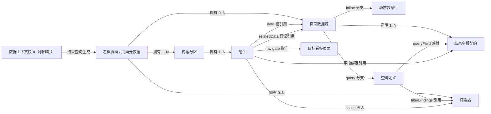

# MetricCanvas 页面元数据规范

页面元数据是统一运行时直接消费的声明式 JSON 文档，也是大模型生成页面的输出格式。当前协议版本为 `5.0`；未定义属性会被拒绝。

## 1. 概念与关联关系

| 概念 | 作用 |
|---|---|
| **Schema 元数据** | 在创作期提供执行环境、对象、字段、关系、权限、约束和已验证查询；规则见 [`docs/schema-metadata.md`](./docs/schema-metadata.md) |
| **页面元数据** | 声明页面数据源、结果字段契约、筛选状态、内容分区、组件和有限交互 |
| **数据快照** | 在运行期保存某个页面数据源当前的数据行、总条数和状态 |

统一运行时只消费页面元数据；Schema 元数据只用于创作，不进入页面文档。

### 1.1 声明关系



### 1.2 引用关系表

| 起点 | 声明位置 | 目标 | 基数 | 关键约束 |
|---|---|---|---:|---|
| 页面 | `dataSources` | 页面数据源 | `0..N` | 对象键就是页面数据源 id |
| 页面数据源 | `fields` | 结果字段契约 | `1..N` | 对象键就是稳定页面字段 id |
| 查询字段 | `queryField` | DQE 输出字段 | `1` | 每个输出必须且只能映射到一个页面字段 |
| 查询定义 | `filterBindings` 的键 | 页面筛选器 | `0..N` | 目标类型必须与筛选器类型一致 |
| 页面 | `sections` | 内容分区 | `1..N` | 分区 id 在页面内唯一 |
| 内容分区 | `components` | 组件 | `1..N` | 组件 id 在整个页面全局唯一 |
| 组件数据槽 | `data.<slot>` | 页面数据源 | 每槽 `1` | 被引用的数据源必须存在 |
| 组件字段绑定 | `field` | 数据槽对应的数据源字段 | 每绑定 `1` | 必须引用稳定页面字段 id，不得引用 DQE 原始字段名 |
| 组件 action | `writeFilter` | 页面筛选器 | `1` | 只能写入 `dimension` 筛选器 |
| 导航 action | `navigate.page` | 目标看板页面 | `1` | 全目录校验时目标页必须存在 |
| AI 总结 | `relatedData.*.source` | 页面数据源 | 每项 `1` | 只读白名单字段，不使用普通组件数据槽 |

### 1.3 三个字段空间

| 空间 | 示例 | 出现位置 | 使用者 |
|---|---|---|---|
| DQE 输出字段名 | `成交总额` | `output_dims` / `output_metrics`、`initial.rows`、`queryField` | 数据网关与查询映射 |
| 稳定页面字段 id | `gmv` | `fields` 的键、组件字段绑定、归一化后的数据快照 | 页面和组件 |
| 业务展示名称 | `成交额` | 字段 `label`、组件 `title` 或行 `label` | 最终用户 |

三者可以相同，但不存在隐式同名映射。大模型必须显式写出 `queryField`，组件必须引用稳定页面字段 id。

## 2. 生成规则

输出必须是完整 JSON，不得包含注释、伪代码或未定义属性。缺少字段口径、查询能力、权限或结果类型时，不得从样例值或字段拼写推断。

推荐按引用依赖顺序生成：

1. **确认需求**：明确业务目标、数据模式、时间语义和交互；
2. **设计取数单元**：按“指标 × 维度 × 时间 × 筛选”拆分命名结果集；
3. **形成并验真查询**：查询数据源先经过清单校验和真实执行；
4. **声明页面数据源**：先写 `dataSources`，再写完整 `fields`；
5. **声明筛选器**：只为需要共享状态的条件写 `filters`；
6. **绑定查询**：用 `filterBindings` 指出哪些查询受哪些筛选器影响；
7. **选择组件**：按分析意图和字段角色选择组件；
8. **声明数据槽与字段绑定**：组件先绑定数据源，再绑定字段；
9. **增加有限交互**：最后添加 action、表格选择、链接和分页；
10. **结构与语义校验**：修复全部错误后才保存或交付。

## 3. 顶层结构

```json
{
  "schemaVersion": "5.0",
  "id": "sales-overview",
  "meta": { "description": "销售概览" },
  "dataSources": {},
  "sections": [
    {
      "id": "content",
      "components": [
        {
          "id": "description",
          "type": "text",
          "layout": { "span": 12 },
          "props": { "body": "页面说明" }
        }
      ]
    }
  ]
}
```

| 字段 | 类型 | 必填 | 说明 |
|---|---|---:|---|
| `schemaVersion` | string | 是 | 固定为 `"5.0"` |
| `id` | string | 是 | 看板页面稳定标识；正式文件名为 `<id>.json` |
| `meta` | object | 否 | 页面资产信息；当前只允许 `description` |
| `dataSources` | object | 是 | 命名页面数据源；纯标题或说明页可以为空对象 |
| `filters` | array | 否 | 页面级筛选状态声明 |
| `sections` | array | 是 | 内容分区，至少一项 |

`id` 只承载看板页面的同一性，用于文件命名、页面仓储加载、路由和修订归属。统一运行时不得根据某个正式页面 `id` 切换样式、组件或开发工具。

### 3.1 标识符与唯一性

页面、页面数据源、筛选器、内容分区、组件、普通数据槽和表格列组 id 使用：

```text
^[a-z0-9][a-z0-9-]*$
```

稳定页面字段 id 使用：

```text
^[A-Za-z_][A-Za-z0-9_-]*$
```

| id | 唯一性作用域 |
|---|---|
| 页面 id | 页面仓储 |
| 页面数据源 id | 当前页面 `dataSources` |
| 页面字段 id | 当前页面数据源 `fields` |
| 筛选器 id | 当前页面 |
| 内容分区 id | 当前页面 |
| 组件 id | 当前页面全局，不能只在分区内唯一 |
| 表格列组 id | 当前表格列树中应该唯一 |

生成 id 时应该使用稳定业务语义，例如 `sales-by-region`、`region-filter`、`revenue-trend`；不得使用数组序号、随机描述或 DQE 中文输出名直接充当页面字段 id。

## 4. 页面数据源与结果字段契约

### 4.1 数据模式

页面数据模式由 `dataSources` 中实际存在的数据源类型推导，不写额外的 `mode` 字段：

| 模式 | 组成 | 行的来源 |
|---|---|---|
| `inline` | 全部数据源为 `inline`，或没有数据源 | 页面文档内的静态数据行 |
| `query` | 全部数据源为 `query` | 内嵌初始行或统一运行时调用数据网关 |
| `mixed` | 同时包含 `inline` 和 `query` | 各页面数据源独立形成数据快照 |

每个页面数据源统一具有 `fields` 和 `source`：

- `fields` 是完整结果字段契约，至少包含一个字段；
- `source.type` 是判别符，只能为 `inline` 或 `query`；
- 页面数据源之间没有隐式依赖；一个数据源的结果不得直接作为另一个数据源的输入。

### 4.2 标量字段

```json
{
  "region": {
    "type": "string",
    "role": "dimension",
    "label": "区域",
    "nullable": false
  },
  "revenue": {
    "type": "money",
    "role": "measure",
    "currency": "CNY",
    "label": "收入",
    "nullable": false,
    "defaultFormat": "cny-adaptive"
  }
}
```

| 属性 | 类型 | 必填 | 说明 |
|---|---|---:|---|
| `type` | enum | 是 | 值类型 |
| `role` | enum | 是 | `dimension`、`measure` 或受控明细的 `detail` |
| `label` | non-empty string | 否 | 默认展示名称；与字段 id 相同时应该省略 |
| `unit` | non-empty string | 否 | 业务单位 |
| `nullable` | boolean | 否 | 是否允许 `null`；省略表示允许 |
| `defaultFormat` | enum | 否 | 默认展示建议，可被组件字段绑定覆盖 |
| `currency` | `"CNY"` | 条件必填 | 仅 `type: "money"` 必须声明 |
| `queryField` | non-empty string | 查询字段必填 | DQE 输出字段名；`inline` 字段不得声明 |

上表的 `unit` 与 `defaultFormat` 只适用于标量字段。`recordList/detail` 只接受 `label`、`nullable`、`items`，查询分支再加外层与项级 `queryField`；`semanticHtml/detail` 只接受 `label`、`nullable`，查询分支再加 `queryField`。

| `type` | 允许的值 | 允许的 `role` | 说明 |
|---|---|---|---|
| `string` | string | `dimension` / `measure` | 预格式化百分比等只原样展示的度量也可使用 |
| `number` | 有限 JSON number | `dimension` / `measure` | 普通数值、计数、比例 |
| `boolean` | boolean | `dimension` / `measure` | 布尔结果 |
| `date` | `YYYY-MM-DD` | `dimension` / `measure` | 必须是有效公历日期 |
| `datetime` | 受支持的日期时间字符串 | `dimension` / `measure` | 可含分钟、秒、毫秒和时区 |
| `money` | 有限 JSON number | 仅 `measure` | 人民币金额，原始单位为元，`currency` 固定为 `CNY` |
| `recordList` | 一层对象数组 | 仅 `detail` | 结构化嵌套明细 |
| `semanticHtml` | 受控字符串 | 仅 `detail` | 受控语义 HTML 明细 |

`dimension` 用于类别、时间、分组、筛选、排序和名称；`measure` 用于数值、计数、比例、变化和进度；`detail` 只有显式支持相应明细类型的组件属性可以消费。不得在 `type` 和 `role` 之间做隐式推断。

### 4.3 展示格式

允许的 `defaultFormat` 和字段绑定 `format`：

```text
text
number
number-1
number-2
number-grouped
compact-wan-0
compact-wan-1
compact-yi-1
cny-adaptive
percent-0
percent-1
percent-2
percent-2-signed
date
date-month-day
```

展示格式优先级：组件字段绑定的 `format` → 结果字段契约的 `defaultFormat` → 字段类型的基础格式。

`money/CNY` 表达数据语义，`cny-adaptive` 表达展示策略，两者不能互相替代。

### 4.4 数据行契约

所有数据行在进入数据快照后都使用稳定页面字段 id 作为键，并满足：

- 每一行必须是对象，并包含 `fields` 中的全部字段；
- `inline` 行不得包含未声明字段；
- 字段值必须符合 `type`；
- `nullable: false` 的字段不得为 `null`；
- `date` 必须是有效公历日期；
- `money` 必须是有限数字；JSON 中不得出现 `NaN` 或 `Infinity`。

### 4.5 `inline` 页面数据源

```json
{
  "fields": {
    "region": { "type": "string", "role": "dimension", "nullable": false },
    "revenue": { "type": "number", "role": "measure", "unit": "元", "nullable": false }
  },
  "source": {
    "type": "inline",
    "rows": [{ "region": "华东", "revenue": 128600 }]
  }
}
```

`inline.rows` 直接使用稳定页面字段 id。仅含 `inline` 数据源的静态页面：

- 不得声明页面级 `filters`；
- 绑定 `inline` 数据源的组件不得声明 action；
- 表格仍可以使用本地排序、表头筛选和本地分页，因为这些只作用于已有数据快照。

### 4.6 `query` 页面数据源

```json
{
  "fields": {
    "region": {
      "queryField": "区域",
      "type": "string",
      "role": "dimension",
      "nullable": false
    },
    "gmv": {
      "queryField": "成交总额",
      "type": "money",
      "role": "measure",
      "currency": "CNY",
      "nullable": false,
      "defaultFormat": "cny-adaptive"
    }
  },
  "source": {
    "type": "query",
    "initial": {
      "capturedAt": "2026-08-17T10:00:00+08:00",
      "rows": [{ "区域": "华东", "成交总额": 128600 }]
    },
    "query": {
      "language": "dqe",
      "body": {
        "dsl_list": [
          {
            "output_dims": ["区域"],
            "output_metrics": ["成交总额"],
            "filter": { "dims": [], "metrics": [] },
            "order": { "offset": 0, "limit": 20 }
          }
        ]
      }
    }
  }
}
```

查询定义规则：

- `language` 当前固定为 `"dqe"`；
- `body.dsl_list` 必须恰好包含一个查询项；
- DQE 请求体保持外部协议原文，不在页面层改造成另一套查询 DSL；
- `output_dims` 中每个字段必须映射到 `role: "dimension"`；
- `output_metrics` 中的字符串或对象 `alias` 必须映射到 `role: "measure"`，受控明细可以显式映射为 `detail`；
- 自由 `formula` 输出必须声明稳定 `alias`，页面 `queryField` 映射该别名；
- 每个 DQE 输出字段必须且只能有一个 `queryField` 映射；
- 每个页面查询字段必须出现在 DQE 输出中；
- 不得依靠同名、数组位置或返回样例推断映射。

查询页面字段可以按角色分组，省略重复的 `role`：

```json
{
  "fields": {
    "dimensions": {
      "region": { "queryField": "区域", "type": "string", "nullable": false }
    },
    "measures": {
      "gmv": {
        "queryField": "成交总额",
        "type": "money",
        "currency": "CNY",
        "nullable": false,
        "defaultFormat": "cny-adaptive"
      }
    }
  }
}
```

- `dimensions` 自动补全 `role: "dimension"`，`measures` 自动补全 `role: "measure"`；
- 至少存在一个分组，且每个已声明分组至少有一个字段；
- 分组形式只适用于标量字段；`recordList/detail` 和 `semanticHtml/detail` 必须使用扁平 `fields`；
- 分组形式中 `label` 与字段 id 相同会被拒绝，应省略。

页面元数据不提供 `definitions`、`include`、`fieldDefaults`、`fieldSets`、`columnSets` 或继承机制。每个页面数据源必须就地自描述。

### 4.7 内嵌初始行

`query.source.initial` 表示默认查询状态的一份已验证 DQE 原始结果：

| 字段 | 必填 | 规则 |
|---|---:|---|
| `capturedAt` | 是 | RFC 3339 日期时间，必须包含秒和 `Z` 或时区偏移，可含 1–3 位毫秒 |
| `rows` | 是 | DQE 原始结果行；键使用 `queryField` 指向的 DQE 输出字段名 |
| `totalCount` | 否 | 非负整数；查询分页时必填 |

统一运行时加载页面文档时，通过 `queryField` 把 `initial.rows` 归一化为稳定页面字段。组件从不直接看到 DQE 原始字段名。

- `rows: []` 表示已确认的空结果；
- 默认筛选状态适用时，优先使用初始行且不后台刷新；
- 没有初始行或入口筛选状态不同于默认状态时，立即执行查询；
- 发生动态查询后不再回退到初始行；查询失败进入错误态；
- 每个已映射字段必须存在并符合结果字段契约；
- 为减少歧义，生成器应该只保留查询声明的输出字段。

### 4.8 `recordList/detail` 嵌套明细

```json
{
  "attribution-details": {
    "type": "recordList",
    "role": "detail",
    "label": "归因明细",
    "queryField": "归因明细",
    "items": {
      "fields": {
        "service": { "type": "string", "role": "dimension", "queryField": "云服务" },
        "delta": {
          "type": "money",
          "role": "measure",
          "currency": "CNY",
          "queryField": "波动金额"
        },
        "reason": { "type": "string", "role": "dimension", "queryField": "波动原因" }
      }
    }
  }
}
```

- 外层字段和每个项字段都必须显式声明 `queryField`；
- 数组项字段只允许标量，不允许继续嵌套；
- 每个结果行的单个 `recordList` 最多 100 项；
- `[]` 表示已确认没有明细；`null` 是否合法由外层 `nullable` 决定；
- DQE 项中的额外属性在归一化时不进入稳定页面字段；
- 普通字段绑定不能消费；当前由 `rankingDetailCard.props.details` 显式消费。

`inline` 数据源也可以声明 `recordList`，但项字段不含 `queryField`，数据行直接使用稳定项字段 id。

### 4.9 `semanticHtml/detail` 受控语义 HTML

```json
{
  "attribution-summary": {
    "type": "semanticHtml",
    "role": "detail",
    "label": "归因说明",
    "queryField": "归因说明"
  }
}
```

值示例：

```html
<span class="detail-title">ModelArts</span>：<span class="detail-description">到期未续订</span><span class="detail-value tone-negative">（<data>-120000</data>）</span>
```

白名单：

- 标签：`div`、`span`、`strong`、`p`、`br` 和无属性 `data`；
- 结构类：`detail-title`、`detail-value`、`detail-description`、`detail-meta`；
- 状态类：`tone-positive`、`tone-negative`、`tone-neutral`；
- 普通标签只允许 `class` 属性，禁止 `style`、事件、链接、脚本和未知属性；
- `<data>` 只能包含一个规范数字文本节点，可有正负号和小数部分；不得有属性、子标签、单位、千分位、科学计数或前后空白；
- 单个字段值最长 64000 字符；空字符串表示没有可展示内容；
- 任一未知标签、属性、类名或错误闭合都会使整段内容失败关闭；
- 原始字符串不得通过原始 HTML 注入渲染。

显式消费者：

| 消费位置 | 行为 |
|---|---|
| `rankingDetailCard.props.semanticDescriptionField` | 直接渲染普通说明位置 |
| `table.props.columns[].field` | 列字段绑定显式消费；对象绑定的 `format` 应用于全部 `<data>` |
| `text.props.body` + `bodyFormat: "semanticHtml"` | 文本正文使用同一安全解析与语义颜色映射 |

表格列声明 `visual: "signed"` 时，只给 `<data>` 内嵌值映射正、负、中性样式，不给整个单元格染色。字符串字段绑定不能为内嵌值声明 `format`，也不为语义内嵌值继承字段级默认格式。

## 5. 筛选器与查询绑定

筛选器在页面顶层声明，形成页面级共享筛选状态。组件 action 写入筛选状态；查询定义通过 `filterBindings` 订阅筛选状态。组件之间不直接连线。

### 5.1 维度筛选器

```json
{
  "id": "region-filter",
  "type": "dimension",
  "dimension": "region",
  "label": "区域",
  "display": "select",
  "visible": true,
  "default": ["华东"]
}
```

| 字段 | 必填 | 规则 |
|---|---:|---|
| `id` | 是 | 页面内唯一 |
| `type` | 是 | 固定为 `"dimension"` |
| `dimension` | 是 | 数据服务维度 code，不是页面字段引用 |
| `label` | 否 | 控件名称 |
| `display` | 否 | `select`、`tabs`、`tree`、`search`；省略默认为 `select` |
| `visible` | 否 | `false` 表示隐藏控件但保留可写状态 |
| `default` | 否 | 初始字符串值数组；省略表示不筛选 |

维度候选值由数据网关提供，不写入 Schema 元数据或页面元数据。`tree` 当前按候选值中的 `/` 分隔层级。

### 5.2 时间范围筛选器

```json
{
  "id": "time-filter",
  "type": "timeRange",
  "label": "时间",
  "precision": "date",
  "visible": true,
  "default": {
    "from": "2026-01-01",
    "to": "2026-08-17"
  }
}
```

| 字段 | 必填 | 规则 |
|---|---:|---|
| `id` | 是 | 页面内唯一 |
| `type` | 是 | 固定为 `"timeRange"` |
| `label` | 否 | 控件名称 |
| `precision` | 否 | `date` 或 `datetime`；省略默认为 `date` |
| `visible` | 否 | `false` 表示隐藏控件但保留状态 |
| `default` | 否 | 当前只允许预设字符串或绝对闭区间 |

当前预设闭集：

```text
today
last7d
last30d
last90d
```

绝对区间规则：

- `date` 使用 `YYYY-MM-DD`；
- `datetime` 使用 `YYYY-MM-DDTHH:mm`；
- `from` 与 `to` 精度必须一致；
- 两端构成闭区间，且 `from` 不得晚于 `to`；
- 日期必须是有效公历日期时间。

### 5.3 DQE 筛选绑定

`filterBindings` 位于每个查询数据源的 `source.query` 中：

```json
{
  "filterBindings": {
    "region-filter": {
      "target": "dimension",
      "queryField": "区域"
    },
    "time-filter": {
      "target": "time"
    }
  }
}
```

- 对象键引用页面筛选器 id；
- `target: "dimension"` 只能绑定维度筛选器，并必须声明 DQE 筛选目标 `queryField`；
- `target: "time"` 只能绑定时间范围筛选器；
- 未绑定到某个查询的筛选器变化，不触发该页面数据源重新查询；
- 页面字段 id、筛选器 `dimension` 和 DQE `queryField` 是不同空间，不存在隐式同名映射；
- 生成器必须在 DQE 查询体中保留可被数据网关覆盖的合法筛选位置。

## 6. 内容分区与布局

```json
{
  "id": "overview",
  "title": "经营概览",
  "container": "panel",
  "components": [
    {
      "id": "overview-note",
      "type": "text",
      "layout": { "span": 12 },
      "props": { "body": "经营概览说明" }
    }
  ]
}
```

| 字段 | 必填 | 规则 |
|---|---:|---|
| `id` | 是 | 页面内唯一 |
| `title` | 否 | 非空可见标题 |
| `container` | 否 | `plain`、`panel`、`card`；省略使用通用看板外观 |
| `components` | 是 | 至少一个组件 |

`container` 是内容分区外观的唯一真源：

| 值 | 语义 |
|---|---|
| `plain` | 无分区容器，组件完全拥有自身外观 |
| `panel` | 章节面板、居中标题和内层内容承载区 |
| `card` | 白色小节卡片和左对齐小标题 |
| 省略 | 通用看板分区与带边界组件单元格 |

不得使用已删除的 `section.variant`、`section.layout` 或根据组件组合推断分区外观。

组件布局：

```json
{
  "layout": {
    "span": 6,
    "connectPrevious": true
  }
}
```

- 内容分区固定使用 12 列网格，列数不进入页面元数据；
- `span` 是 1–12 的整数且必填；组件能力目录的建议跨度不会替模型自动写入；
- 组件数组顺序决定自动流布局顺序；
- `connectPrevious: true` 把当前组件与紧邻前一组件组成视觉组，不建立数据依赖；
- 第一个组件上的 `connectPrevious` 会被安全忽略，但生成器不应该写这种无效声明；
- 同一视觉行内、同类型、同 `props.variant` 且支持行对齐的组件由统一运行时自动对齐；页面不得声明高度同步字段。

## 7. 组件模型与选择目录

### 7.1 组件通用结构

```json
{
  "id": "region-chart",
  "type": "barChart",
  "layout": { "span": 6 },
  "data": { "main": "sales-by-region" },
  "props": {
    "categoryField": "region",
    "series": [{ "field": "gmv", "label": "成交额" }]
  }
}
```

每个组件必须声明 `id`、`type`、`layout` 和 `props`。数据组件还必须声明 `data`；`reportHeader`、`text`、`aiSummary` 不得声明 `data`。

组件自身的可见标题统一使用 `props.title`。不得生成 `heading`、组件根级 `title` 或其他同义字段。

### 7.2 选择目录

| `type` | 选择条件 | 数据入口 | 关键字段角色 | 建议 `span` |
|---|---|---|---|---:|
| `reportHeader` | 完整页面的标题、说明、时点和标签 | 无 | 无 | 12 |
| `metricCard` | 单值、KPI、变化、完成率 | `main`，可选 `compare`、`target` | value/change/progress = measure | 3 |
| `barChart` | 离散类别比较、分类分布 | `main` | category = dimension，series = measure | 6 |
| `lineChart` | 时间或有序维度趋势 | `main` | x = dimension，series = measure | 8 |
| `pieChart` | 少量类别的构成或占比 | `main` | category = dimension，value = measure | 4 |
| `table` | 明细、多字段核对、多级表头、分页 | `main` 必填，可增加命名槽 | 普通列可用 dimension/measure；主列可显式消费 semanticHtml/detail | 12 |
| `mapChart` | 中国或世界地域分布 | `main` | name = dimension，value = measure | 8 |
| `rankingCard` | Top N 或简单排名 | `main` | name = dimension，value/change = measure | 4 |
| `rankingDetailCard` | 带徽标、说明或展开明细的排名 | `main` | 名称/徽标/说明、度量及受控 detail | 6 |
| `text` | 说明、口径、已确认结论、默认摘要、页面链接 | 无 | 无 | 12 |
| `aiSummary` | 需求明确要求运行时通过 SSE 动态生成总结 | `relatedData` | 只读非 detail 页面字段 | 12 |

“标题中含 AI”“页面存在数据”或“文案曾由 AI 生成”都不构成选择 `aiSummary` 的理由。未明确要求运行时 SSE 时使用 `text`。

### 7.3 `reportHeader`

```json
{
  "id": "report-header",
  "type": "reportHeader",
  "layout": { "span": 12 },
  "props": {
    "title": "经营简报",
    "subtitle": "销售与客户概览",
    "generatedBy": "MetricCanvas",
    "badge": "月报",
    "asOf": { "label": "数据截至", "value": "2026-08-17" },
    "tags": ["销售", "经营"],
    "decoration": "shortBar"
  }
}
```

| 属性 | 必填 | 允许值 / 说明 |
|---|---:|---|
| `title` | 是 | 非空页面标题 |
| `subtitle` | 否 | 副标题 |
| `generatedBy` | 否 | 生成来源说明 |
| `badge` | 否 | 徽标文本 |
| `asOf` | 否 | `{ label, value }`，两者均为非空字符串 |
| `tags` | 否 | 非空字符串数组 |
| `decoration` | 否 | 当前只允许 `"shortBar"` |

### 7.4 `metricCard`

```json
{
  "id": "revenue-card",
  "type": "metricCard",
  "layout": { "span": 3 },
  "data": { "main": "summary", "compare": "comparison" },
  "props": {
    "title": "收入",
    "variant": "summary",
    "rows": [
      {
        "label": "本期",
        "valueField": { "data": "main", "field": "revenue", "format": "cny-adaptive" },
        "changes": [
          {
            "label": "同比",
            "field": { "data": "compare", "field": "yoy", "format": "percent-1" },
            "tone": "auto"
          }
        ]
      }
    ]
  }
}
```

| 属性 | 必填 | 允许值 / 说明 |
|---|---:|---|
| `title` | 否 | 组件标题 |
| `variant` | 否 | `summary`、`activityProgress`、`compactSummary`、`dualSummary` |
| `secondaryTitle` | 否 | 第二摘要面板标题 |
| `rows` | 是 | 至少一行 |
| `secondaryRows` | 否 | 至少一行，配合双摘要形态 |
| `panelLayout` | 否 | `stacked` 或 `twoColumn`；窄屏自动回落单列 |
| `showTrendArrows` | 否 | 是否显示趋势箭头 |
| `progress` | 否 | 进度环配置 |
| `actions` | 否 | 查询数据组件 action |

`rows[]` 的 `label` 与 `valueField` 必填，`valueField` 必须为 `measure`；`unit` 和 `changes` 可选。

`changes[]` 的 `label` 与 `field` 必填，`field` 必须为 `measure`；`unit` 可选；`tone` 可为 `auto`、`neutral`、`positive`、`danger`。

`progress` 的 `valueField` 必填且为 `measure`；`label` 可选；`ringPercent` 可选、范围 `0..100`，表示可见轨道占整圆比例，实际填充仍由 `valueField` 决定。

### 7.5 图表组件

#### 柱状图 `barChart`

必填属性：

- `categoryField`：`dimension` 字段绑定；
- `series`：至少一个 `{ field, label?, role?, stackOrder? }`，其中 `field` 为 `measure`；
- `data.main`：页面数据源 id。

可选属性：

| 属性 | 允许值 / 说明 |
|---|---|
| `title` | 组件标题 |
| `variant` | 当前只允许 `reportForecast` |
| `stacked` | 堆叠 |
| `rounded` | 圆角柱 |
| `showSegmentLabels` | 显示分段标签 |
| `showStackTotalLabels` | 显示堆叠合计 |
| `horizontal` | 横向条形 |
| `dualAxis` | 双轴 |
| `actions` | 查询数据组件 action |

系列 `role` 可为 `actual` 或 `forecast`，`stackOrder` 为整数。若初始行的类别值为 `N月` 且系列显式声明角色，`capturedAt` 所在月及以前不得提供非空预测值，之后不得提供非空实际值。

#### 折线图 `lineChart`

必填属性：`xField`（`dimension`）、至少一个 `series[].field`（`measure`）、`data.main`。可选属性：`title`、`smooth`、`areaGradient`、`stacked`、`dualAxis`、`showPointLabels`、`hideYAxis`、`actions`。

#### 饼图 `pieChart`

必填属性：`categoryField`（`dimension`）、`valueField`（`measure`）、`data.main`。可选属性：`title`、`labelLine`、`actions`；`ring` 为 1–2 位数字加 `%` 的字符串，例如 `"60%"`。

图表只绑定稳定页面字段，不在 `props` 中保存查询、数据行、颜色 CSS 或任意 ECharts option。

### 7.6 `table`

```json
{
  "id": "sales-table",
  "type": "table",
  "layout": { "span": 12 },
  "data": { "main": "sales" },
  "props": {
    "title": "销售明细",
    "fit": "container",
    "columns": [
      { "field": "region", "title": "区域", "filterable": { "mode": "select" } },
      { "field": "gmv", "title": "成交额", "align": "right", "emphasis": "strong" }
    ],
    "pagination": { "mode": "none" }
  }
}
```

| 属性 | 必填 | 允许值 / 说明 |
|---|---:|---|
| `title` | 否 | 标题 |
| `subtitle` | 否 | 副标题 |
| `variant` | 否 | 当前只允许 `reportCompact` |
| `compoundCellLayout` | 否 | 当前只允许 `inline` |
| `rowKey` | 条件必填 | 多数据槽表格用于行对齐的稳定页面字段 id |
| `fit` | 否 | `content` 保留像素宽并允许横向滚动；`container` 按比例压缩到容器 |
| `columns` | 是 | 至少一个字段列或列组 |
| `pagination` | 否 | `none`、`local` 或 `query` |
| `actions` | 否 | 查询数据组件 action |

字段列：

| 属性 | 必填 | 允许值 / 说明 |
|---|---:|---|
| `kind` | 否 | 可显式写 `field`，省略即字段列 |
| `field` | 是 | 字段绑定；是表格唯一可直接消费 `semanticHtml/detail` 的列绑定 |
| `secondaryField` | 否 | 次级字段绑定 |
| `badgeField` | 否 | 徽标字段绑定 |
| `dangerValues` | 否 | 唯一字符串数组 |
| `selection` | 否 | 单元格选择时原子写入筛选状态 |
| `title` | 否 | 列标题 |
| `width` | 否 | 正整数像素基准 |
| `fixed` | 否 | `left` 或 `right` |
| `sortable` | 否 | 本地排序 |
| `filterable` | 否 | `{ "mode": "select" }` 或 `{ "mode": "dateRange" }`；绑定字段必须为 `dimension` |
| `align` | 否 | `left` 或 `right` |
| `emphasis` | 否 | 当前只允许 `strong`，只强调数据单元格 |
| `visual` | 否 | `plain`、`rateBar`、`signed` |

同一表格中相同“数据槽 + 字段”的主列绑定不得重复，即使使用了不同 `format` 或 `match`。

递归列组：

```json
{
  "kind": "group",
  "id": "revenue-group",
  "title": "收入",
  "children": [
    { "field": "revenue", "title": "本期" }
  ]
}
```

`children` 至少一项，可以继续包含列组。

多数据槽表格：

```json
{
  "data": {
    "main": "inspection-progress",
    "top100": "inspection-progress-top100"
  },
  "props": {
    "rowKey": "representative-office",
    "columns": [
      { "field": "inspection-total" },
      { "field": { "data": "top100", "field": "inspection-top-total" } }
    ]
  }
}
```

- `main` 决定行集合、顺序和分页；
- 其他数据槽按 `rowKey` 查找对应行；
- 所有数据源都必须存在同名、同类型、`role: "dimension"` 的 `rowKey`；
- 其他数据槽缺少匹配行时展示空值，不伪造为 `0`。

分页：

| 模式 | 结构 | 约束 |
|---|---|---|
| 无分页 | `{ "mode": "none" }` | 不分页 |
| 本地分页 | `{ "mode": "local", "pageSize": 10, "numbered": true }` | `main` 只允许绑定 `inline`；`pageSize` 为正整数 |
| 查询分页 | `{ "mode": "query" }` | `main` 必须是独占的 `query` 数据源 |

查询分页额外要求：

- DQE 初始 `order.offset` 必须为 `0`；
- `order.limit` 必须为正整数，是唯一页大小真源；
- 有 `initial` 时必须有 `totalCount`，且初始行数等于 `min(limit, totalCount)`；
- 查询分页的数据源只能被该表格 `main` 引用一次，不能同时供其他组件、槽或 AI 总结使用；
- 暂不支持 `sortable` 或 `filterable`；
- 页码变化修改克隆查询的 `order.offset`，筛选变化先回到第一页。

单元格选择：

```json
{
  "selection": {
    "writes": {
      "region-filter": { "field": "region" },
      "level-filter": { "value": "重点" }
    }
  }
}
```

- `writes` 至少一项；对象键必须引用已声明的 `dimension` 筛选器；
- 值可以是 `{ "field": <字段引用> }` 或 `{ "value": "固定字符串" }`；
- 一次选择原子写入多个筛选器；用于筛选值的字段应该是具有稳定业务含义的维度字段。

### 7.7 `mapChart`

必填属性：`nameField`（地域名称 `dimension`）、`valueField`（`measure`）、`map`（`china` 或 `world`）、`data.main`。

可选属性：`title`、`scatter`（`point` 或 `effect`）、`nameMap`（外部地域名到地图名称的字符串映射）、`actions`。

选择地图前必须确认地域名称可以直接命中或通过 `nameMap` 显式映射；不得按样例猜测地理层级。

### 7.8 排名组件

#### `rankingCard`

必填属性：`nameField`（`dimension`）、`valueField`（`measure`）、`data.main`。

可选属性：`title`、`changeField`（`measure`）、`actions`。排序和 Top N 限制应该由查询定义提供，组件保留数据快照顺序。

#### `rankingDetailCard`

```json
{
  "id": "customer-ranking",
  "type": "rankingDetailCard",
  "layout": { "span": 6 },
  "data": { "main": "customer-risk" },
  "props": {
    "title": "客户风险排行",
    "variant": "report",
    "nameField": "customer-name",
    "valueField": "risk-value",
    "badgeFields": ["region"],
    "semanticDescriptionField": "risk-summary",
    "details": {
      "field": "risk-details",
      "titleField": "item-name",
      "valueField": { "field": "item-value", "format": "cny-adaptive" },
      "descriptionField": "reason",
      "defaultExpanded": false
    }
  }
}
```

| 属性 | 必填 | 约束 |
|---|---:|---|
| `title` | 否 | 标题 |
| `variant` | 否 | 当前只允许 `report` |
| `metricLabel` | 否 | 非空度量名称 |
| `tone` | 否 | `positive`、`negative`、`neutral` |
| `nameField` | 是 | `dimension` |
| `valueField` | 是 | `measure` |
| `changeField` | 否 | `measure` |
| `badgeFields` | 否 | 最多两个 `dimension` 字段 |
| `descriptionField` | 否 | 普通 `dimension` 说明 |
| `semanticDescriptionField` | 否 | 必须是 `semanticHtml/detail` |
| `details` | 否 | 必须绑定 `recordList/detail` |

`details.field` 绑定外层 `recordList/detail`；`titleField` 引用项内 `dimension`；`valueField.field` 引用项内 `measure`，可带 `format`；`descriptionField` 引用项内 `dimension`；`defaultExpanded` 控制初始展开状态。

该组件当前不支持 `props.actions`。

### 7.9 `text`

```json
{
  "id": "summary",
  "type": "text",
  "layout": { "span": 12 },
  "props": {
    "body": "经营整体平稳。",
    "variant": "reportInline"
  }
}
```

| 属性 | 必填 | 允许值 / 说明 |
|---|---:|---|
| `title` | 否 | 标题；`reportInline` 下可覆盖默认“AI 总结”文案 |
| `body` | 否 | 正文字符串 |
| `bodyFormat` | 否 | 当前只允许 `semanticHtml`；省略时正文始终按纯文本 |
| `variant` | 否 | `plain`、`heading`、`insight`、`reportInline`、`riskNotice` |
| `maxWidth` | 否 | 正整数最大宽度 |
| `links` | 否 | 固定页面链接数组 |

- 默认摘要、后端返回的总结或已确认结论使用 `text`；
- `variant: "heading"` 适合 `container: "plain"` 分区中的分隔标题；
- `variant: "reportInline"` 默认显示小图标与“AI 总结：”前缀，但不会发起 AI 请求；
- `bodyFormat: "semanticHtml"` 只改变受控正文的解析和渲染，不触发 SSE；
- 省略 `bodyFormat` 时，即使正文长得像 HTML 也只按文本显示。

固定页面链接：

```json
{
  "links": [
    {
      "label": "查看销售明细",
      "page": "sales-detail",
      "carryFilters": ["time-filter"]
    }
  ]
}
```

每个链接的 `label` 和目标 `page` 必填；`carryFilters` 可携带当前页筛选状态。

### 7.10 `aiSummary`

```json
{
  "id": "risk-summary",
  "type": "aiSummary",
  "layout": { "span": 12 },
  "props": {
    "title": "风险总结",
    "variant": "reportInline",
    "promptTemplate": "只使用输入数据，输出三个编号段落。",
    "relatedData": {
      "risk": {
        "source": "inspection-progress",
        "description": "各代表处公司考察风险数据",
        "fields": [
          { "field": "representative-office", "term": "代表处" },
          { "field": "missing-count", "term": "未考察客户数" }
        ]
      }
    }
  }
}
```

| 属性 | 必填 | 规则 |
|---|---:|---|
| `title` | 否 | 标题 |
| `variant` | 否 | 当前只允许 `reportInline` |
| `promptTemplate` | 是 | 非空纯文本；不支持插值或表达式 |
| `relatedData` | 是 | 至少一个命名关联数据定义 |

每个 `relatedData.<id>`：

- `<id>` 必须符合通用 id 规则；
- `source` 必须引用页面数据源；
- `description` 必须是非空业务说明；
- `fields` 至少一个 `{ field, term }`；
- `field` 必须存在于该数据源，且不能是 `detail`；
- 同一关联定义内字段不得重复；
- 同名页面字段跨关联定义使用时，`term` 必须一致；
- 运行时只发送白名单中明确列出的字段；
- 仅被 `relatedData` 引用的数据源也会执行并形成数据快照。

`aiSummary` 不声明 `data`、`scene`、`body`、端点、Header、模型名或 SSE 协议参数。生成结果按组件 id 隔离，不成为页面数据源。

## 8. 数据槽、字段绑定与有限交互

### 8.1 数据槽

`data` 把组件本地槽名映射到页面数据源：

```json
{
  "data": {
    "main": "sales-by-region"
  }
}
```

| 组件 | 合法数据槽 |
|---|---|
| `metricCard` | `main` 必填；`compare`、`target` 可选 |
| `table` | `main` 必填；可以增加符合 id 规则的命名槽 |
| `barChart`、`lineChart`、`pieChart`、`mapChart`、`rankingCard`、`rankingDetailCard` | 只允许 `main` |
| `reportHeader`、`text`、`aiSummary` | 不允许 `data` |

### 8.2 字段引用与字段绑定

字段引用只表示“数据槽 + 稳定页面字段”，用于 action 和表格选择：

```json
"region"
```

```json
{ "data": "compare", "field": "region" }
```

字段绑定用于组件展示，可以额外声明格式与行选择：

```json
{
  "data": "main",
  "field": "gmv",
  "format": "cny-adaptive",
  "match": {
    "field": "region",
    "equals": "华东"
  }
}
```

- 字符串简写始终引用 `main` 数据槽；
- 对象绑定的 `data` 必须是组件已经声明的槽；
- `field` 必须存在于该槽的数据源；
- `format` 只控制当前视图，不改变结果字段契约；
- `match.field` 从同一数据槽读取，必须为 `dimension`；
- `match.equals` 的类型必须符合匹配字段契约；
- 组件属性对字段角色有额外要求，见组件目录。

### 8.3 组件 action

action 位于数据组件的 `props.actions`，数组至少一项，当前事件固定为 `click`。只有实际绑定了 `query` 数据源的组件才能使用 action。

写入筛选器：

```json
{
  "on": "click",
  "writeFilter": "region-filter",
  "field": "region"
}
```

- `writeFilter` 必须引用当前页 `dimension` 筛选器；
- `field` 是字段引用，必须指向 `dimension` 字段。

跨页导航：

```json
{
  "on": "click",
  "navigate": {
    "page": "sales-detail",
    "carryFilters": ["time-filter"],
    "setFilters": {
      "region-filter": "region"
    }
  }
}
```

- `page` 是目标看板页面 id；
- `carryFilters` 中的筛选器必须存在于当前页，全目录校验时目标页也必须有同名筛选器；
- `setFilters` 的键是目标页 `dimension` 筛选器，值是当前点击上下文的 `dimension` 字段引用；
- 目标页存在性和目标筛选器类型需要全量 `pages/` 目录校验，单文档校验无法独立确认全部跨页关系。

### 8.4 文本链接与表格选择

`text.props.links` 提供固定目标页面链接；它没有点击行上下文，只能使用 `carryFilters`。结构见 7.9 节。

表格列 `selection.writes` 在一次单元格选择中原子写入一个或多个 `dimension` 筛选器。它与 `props.actions` 可以并存，但生成器应该避免让同一次交互产生冲突的筛选写入。

## 9. 从页面声明到运行时


统一运行时只执行被普通组件数据槽或 AI `relatedData` 引用的数据源。同一页面数据源不因消费者数量增加而重复执行。

数据快照状态：

| 状态 | 含义 |
|---|---|
| `loading` | 查询正在执行 |
| `ready` | 至少一行可渲染数据，可携带 `totalCount` |
| `empty` | 查询成功且没有数据行；查询分页携带 `totalCount: 0` |
| `error` | 查询、协议、映射或字段契约失败 |

`inline` 同步形成 `ready` 或 `empty`。查询数据源在默认状态下有适用初始行时同步形成结果态，否则从 `loading` 进入终态。数据源错误只影响引用它的组件。

## 10. 完整生成示例

### 10.1 静态页面

```json
{
  "schemaVersion": "5.0",
  "id": "revenue-overview",
  "meta": {
    "description": "收入概览"
  },
  "dataSources": {
    "summary": {
      "fields": {
        "revenue": {
          "type": "money",
          "role": "measure",
          "currency": "CNY",
          "label": "收入",
          "nullable": false,
          "defaultFormat": "cny-adaptive"
        }
      },
      "source": {
        "type": "inline",
        "rows": [
          { "revenue": 128600 }
        ]
      }
    }
  },
  "sections": [
    {
      "id": "overview",
      "container": "plain",
      "components": [
        {
          "id": "report-header",
          "type": "reportHeader",
          "layout": { "span": 12 },
          "props": {
            "title": "收入概览",
            "asOf": { "label": "数据截至", "value": "2026-08-17" }
          }
        },
        {
          "id": "revenue-card",
          "type": "metricCard",
          "layout": { "span": 4 },
          "data": { "main": "summary" },
          "props": {
            "rows": [
              { "label": "收入", "valueField": "revenue" }
            ]
          }
        }
      ]
    }
  ]
}
```

### 10.2 带初始行、筛选和 action 的 DQE 页面

```json
{
  "schemaVersion": "5.0",
  "id": "sales-by-region",
  "meta": {
    "description": "区域销售分析"
  },
  "dataSources": {
    "regional-sales": {
      "fields": {
        "dimensions": {
          "region": {
            "queryField": "区域",
            "type": "string",
            "label": "区域",
            "nullable": false
          }
        },
        "measures": {
          "gmv": {
            "queryField": "成交总额",
            "type": "money",
            "currency": "CNY",
            "label": "成交额",
            "nullable": false,
            "defaultFormat": "cny-adaptive"
          }
        }
      },
      "source": {
        "type": "query",
        "initial": {
          "capturedAt": "2026-08-17T10:00:00+08:00",
          "rows": [
            { "区域": "华东", "成交总额": 128600 },
            { "区域": "华南", "成交总额": 96800 }
          ]
        },
        "query": {
          "language": "dqe",
          "body": {
            "dsl_list": [
              {
                "output_dims": ["区域"],
                "output_metrics": ["成交总额"],
                "filter": { "dims": [], "metrics": [] },
                "order": { "offset": 0, "limit": 20 }
              }
            ]
          },
          "filterBindings": {
            "region-filter": {
              "target": "dimension",
              "queryField": "区域"
            }
          }
        }
      }
    }
  },
  "filters": [
    {
      "id": "region-filter",
      "type": "dimension",
      "dimension": "region",
      "label": "区域",
      "display": "select"
    }
  ],
  "sections": [
    {
      "id": "overview",
      "title": "区域销售",
      "container": "panel",
      "components": [
        {
          "id": "regional-sales-chart",
          "type": "barChart",
          "layout": { "span": 12 },
          "data": { "main": "regional-sales" },
          "props": {
            "categoryField": "region",
            "series": [
              { "field": "gmv", "label": "成交额" }
            ],
            "actions": [
              {
                "on": "click",
                "writeFilter": "region-filter",
                "field": "region"
              }
            ]
          }
        }
      ]
    }
  ]
}
```

更多已校验示例：

- 静态页面：[`pages/tokens-report.json`](./pages/tokens-report.json)
- DQE 页面：[`pages/demo.json`](./pages/demo.json)
- 混合页面：[`packages/page/fixtures/contract-valid/mixed-page.json`](./packages/page/fixtures/contract-valid/mixed-page.json)
- 嵌套明细与报告组件：[`pages/flow-analysis-report.json`](./pages/flow-analysis-report.json)

## 11. 生成后自检清单

大模型提交页面前必须逐项检查。

### 11.1 结构

- [ ] 顶层只有 `schemaVersion`、`id`、`meta`、`dataSources`、`filters`、`sections`；
- [ ] `schemaVersion` 精确为 `5.0`；
- [ ] 所有对象没有未定义属性；
- [ ] `sections`、每个 `components`、每个页面数据源 `fields` 均满足最小数量；
- [ ] 所有 id 符合各自正则，筛选器、分区和组件 id 无重复。

### 11.2 数据与查询

- [ ] 每一行与字段契约的字段集合、类型和可空性一致；
- [ ] `inline.rows` 使用稳定页面字段 id；
- [ ] `query.initial.rows` 使用 DQE 原始输出字段名；
- [ ] 每个 DQE 输出字段存在且只存在一个 `queryField` 映射；
- [ ] `output_dims` 对应 dimension，普通 `output_metrics` 对应 measure；
- [ ] 字段契约来自 Schema 元数据和真实执行，不从样例值猜测；
- [ ] 查询分页的 offset、limit、totalCount、完整第一页和独占引用约束全部满足。

### 11.3 引用与角色

- [ ] 每个组件数据槽引用存在的页面数据源；
- [ ] 每个字段绑定引用存在的槽和稳定页面字段；
- [ ] 类别、名称、横轴、地图名和 action 来源字段为 dimension；
- [ ] 数值、系列、变化和进度字段为 measure；
- [ ] detail 只出现在显式支持的消费者；
- [ ] 每个 `filterBindings`、`writeFilter`、表格选择和导航筛选引用合法。

### 11.4 产品语义

- [ ] 数据源按命名结果集拆分，没有组件内查询或数据源级联；
- [ ] 组件选择符合分析意图和数据形状；
- [ ] 摘要默认使用 `text`，只有明确 SSE 需求才使用 `aiSummary`；
- [ ] 展示格式属于字段绑定，字段 `defaultFormat` 只作建议；
- [ ] 没有端点、凭据、任意脚本、自定义 CSS、任意 HTML 或运行时状态；

## 12. 禁止的生成模式

| 禁止模式 | 原因 | 正确做法 |
|---|---|---|
| 在组件内写 `query`、`rows` 或 URL | 组件不是数据获取边界 | 在 `dataSources` 声明，组件用数据槽引用 |
| 组件直接引用 DQE 中文字段名 | 外部字段不稳定 | 用 `queryField` 映射到稳定页面字段 id |
| 根据同名省略 `queryField` | 协议没有隐式映射 | 每个查询字段显式声明 |
| 从样例值推断类型、角色或口径 | 样例不能证明契约 | 使用 Schema 元数据和真实执行确认 |
| 生成 `definitions`、字段集、列集或继承 | 页面要求局部顺序自描述 | 在每个数据源和组件就地声明完整信息 |
| 生成 `section.variant`、`section.layout` | 已从 Schema 5.0 删除 | 使用 `section.container` 和组件 `layout.span` |
| 生成根级 `widgets` 或组件 `heading` | 旧协议字段 | 使用 `sections[].components` 和 `props.title` |
| 给静态页面声明筛选器或 action | `inline` 不会响应查询状态 | 使用本地表格能力，或改为真实 `query` 数据源 |
| 把任意 JSON 当作 detail | 无法校验与安全渲染 | 使用一层 `recordList` 或受控 `semanticHtml` |
| 默认把摘要写成 `aiSummary` | 会引入不必要的运行时生成 | 后端或已确认摘要使用 `text` |
| 把 Schema 元数据或 `dataContextVersion` 放进页面 | 创作上下文与运行协议边界混淆 | 由页面修订记录保存上下文版本 |

## 13. 校验与错误

校验仓库内全部页面：

```bash
pnpm validate
```

校验单个页面：

```bash
pnpm validate pages/demo.json
```

页面搭建 Agent 使用 MCP `validate_page`。错误包含稳定类型、JSON Pointer 路径和脱值消息。

| 错误类型 | 边界 |
|---|---|
| `SCHEMA_ERROR` | JSON 结构、必填项、引用、字段角色、组件能力和页面约束 |
| `FIELD_CONTRACT_ERROR` | 动态结果数据不符合结果字段契约 |
| `QUERY_MAPPING_ERROR` | DQE 输出与页面字段映射缺失或冲突 |
| `FILTER_BINDING_ERROR` | 页面筛选器与 DQE 目标绑定不一致 |
| `DQE_PROTOCOL_ERROR` | DQE 请求或响应协议不合法 |
| `DQE_EXECUTION_ERROR` | DQE 查询执行失败 |
| `DATA_CONTEXT_ERROR` | 创作所需的数据上下文、权限或口径不足 |
