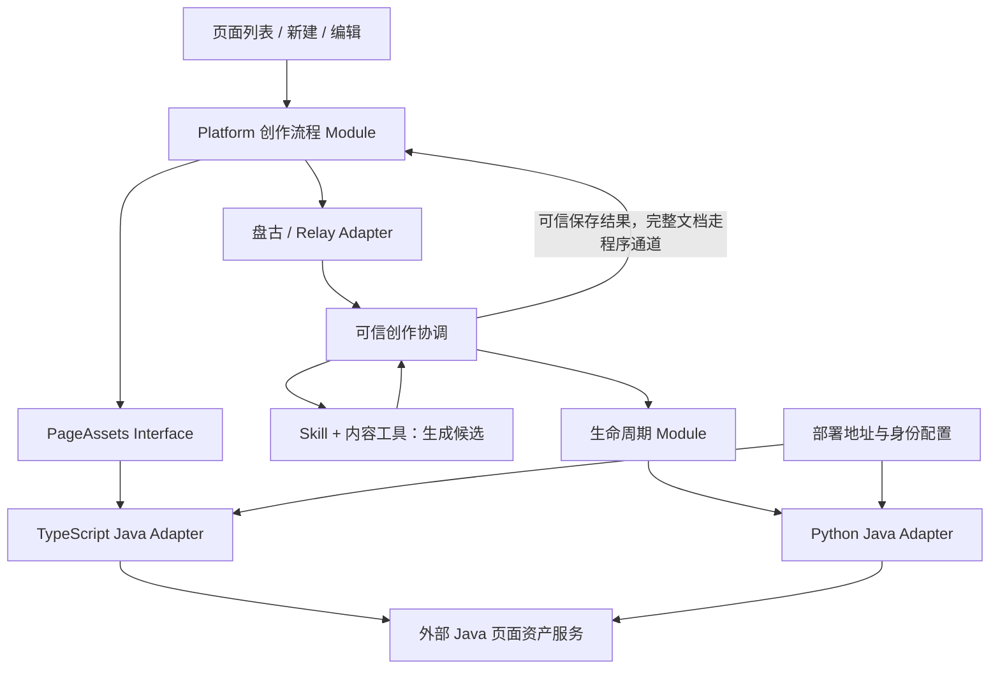
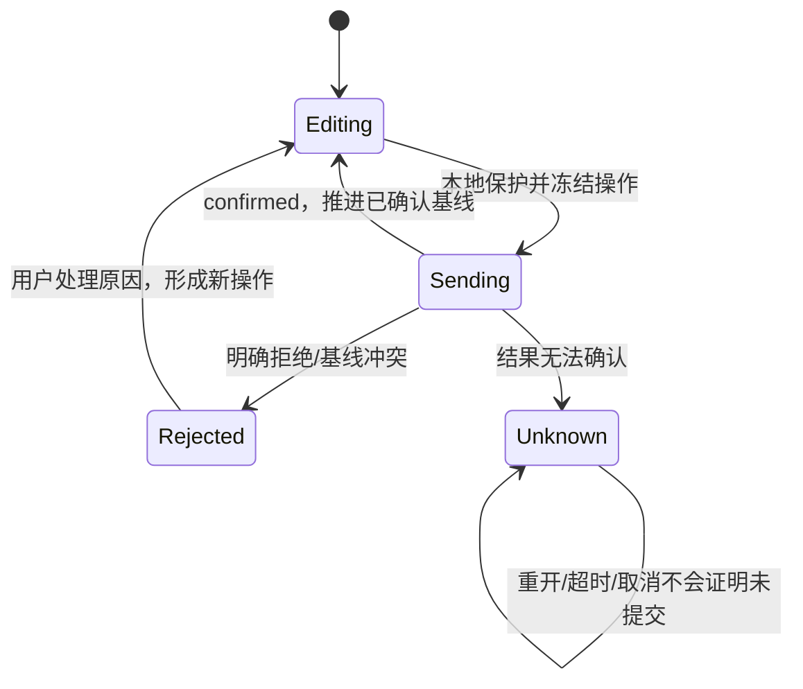

# Platform 与创作 Skill 的 Java 页面资产接入优化方案

日期：2026-09-16。状态：用户已批准，实施与验证记录见 `2026-09-16-java-page-assets-implementation.md`。

## 1. 决策前提与交付范围

用户已确认以 `service/platform-java.yaml` 为当前接入规则，优先快速交付；保存采用单次提交、成功回执确认，冲突或结果不明时保留工作并停止；发布按 `is_draft` 切换。本文按真实 Java 已接通的前提设计，不重新讨论服务连通性，也不据此改写既有真实联调证据。

本次主流程是：**已保存页面列表 → 创建新页面 → 编辑已有页面**。发布、草稿历史、回退和删除复用同一页面资产接缝。`execute`、筛选历史及运行态参数初始化不在本方案范围；页面协议、组件构造和 DQE 能力不因本次重构改变。

设计目标是接口变化的 Locality：Java 路径、字段和响应变化只修改 Adapter；保存语义变化修改创作流程；界面与 Skill 不识别 Java 传输字段。不承诺业务语义改变也能零影响上层。

## 2. 当前结构与具体问题

| 当前代码 | 已有价值 | 本次需要解决的问题 |
|---|---|---|
| `apps/platform/src/lib/page-assets-client.ts` | 集中 GET/POST/PUT、身份头、成功码及文档解析 | 同时定义业务类型；调用方反向依赖具体 HTTP 客户端；按 pageId 列表查找并排序选择资源 |
| `apps/platform/src/lib/page-assets.ts` | 页面资产组合入口 | 强能力开关与实际 CRUD 能力混在一起，尚未成为所有创作操作的统一组合点 |
| `workbench/authoring-coordinator.ts`、`authoring-sync.ts` | 工作副本、串行同步、身份隔离及迟到响应处理 | 强制要求 stableSave、lookup、exactRead，使当前 Java 规则无法直接消费 |
| `workbench/authoring-language*.ts`、`dialogue/port.ts` | 本轮关联、互斥和结果交接 | 依赖精确草稿回读；多个结果入口容易被错误地组装为竞争更新路径 |
| `workbench/authoring-publication.ts` | 候选评审和发布治理 | 对应此前模板发布方案，不能把 is_draft 更新硬塞进候选/租约接口 |
| Python `adapters/outbound/lifecycle_http.py` | 新 Java 当前修订读取 | 保存仍关闭；现有 Lifecycle 与提交协调器依赖服务端幂等查询和精确回读 |
| Python `adapters/outbound/java_page_assets.py` | 旧消费者兼容 | 调用旧 `/pages/{pageId}/revisions`，不能作为新流程的回退 |

现有真实 HTTP 与确定性测试 Adapter 已构成实际可替换 Seam，不需要再建设通用插件框架、通用仓储框架或 BFF。

## 3. 目标结构与所有权

图中 Module 是职责划分，不要求新建独立包或服务。

### 3.1 页面资产 Module

拥有内部页面资产 Interface、Java 响应验证、资源定位、状态映射和错误分类。调用方只需知道要读取或修改哪个资源，以及本次修改基于哪个修订。

其 Depth 来自集中隐藏以下复杂度：请求 object / 响应 JSON string、HTTP 与业务码双重判断、分页、身份头、字段验证、空响应和写入结果不确定性。不得只把 fetch 换个名字后把这些判断交回组件。

### 3.2 Platform 创作流程 Module

复用现有 coordinator，统一拥有工作副本、保存顺序、AI/人工互斥、本地保护、发布动作和结果接收。UI 通过这一个 Interface 发起意图、订阅状态，不自己协调“先 flush、再保存、再打开预览”。

自动保存、历史和发布可以保留内部实现文件，但不再各自导出一套需要页面组装的 Java 能力门禁。`PageAuthoringWorkbench.svelte` 负责展示和交互，不做提供方能力协商。

### 3.3 Skill、Relay 与生命周期 Module

Skill 保留新建、已有页修改、配置问答策略；内容工具保留本轮上下文、候选、局部修改与完整页面校验。模型不构造 HTTP 请求，不选择 `is_draft`，不拥有重试策略。

Relay 的可信程序选择最终候选，通过 Python 生命周期 Module 提交一次草稿。生命周期 Module 消费 Java Adapter 的已验证回执，不再要求当前 Java 没有的操作查询和历史精确回读。发布首期由平台明确操作发起；对话可表达发布意图并引导到同一确认动作，不能形成独立的隐式发布写入口。

**一次业务操作只有一个提交者：**人工保存/界面发布由 Platform 提交；AI 内容保存由可信程序提交。前端接到 AI 保存成功结果只更新画布，不再 POST/PUT。两条写链共用基线冲突规则，而不是前后端为同一结果各保存一次。

### 3.4 Java 与本地状态的权威

- Java 是当前持久化文档、资源 ID、修订和草稿/发布状态的权威。
- 浏览器保护尚未确认保存的人工工作及待处理状态；不保存身份凭据。
- 可信程序保护 AI 候选、提交记录和已收到的回执；该记录不是 Java 的事务日志。
- 本地 hash 只用于候选完整性/内容比较，不能包装为 Java 已提供持久化哈希证明。
- 当前 GET 是“本次读到的状态”，不再命名为强一致 latest；PUT 用该修订检查冲突。读取陈旧可能导致冲突，不能自动换新基线重发。

## 4. 内部 Interface：按能力表达，不复制 Swagger

以下类型和方法为目标设计，不是新的 Java HTTP 契约。TS/Python 使用同一语义及样例；语言内部拼写可以遵循各自习惯。

### 4.1 身份与结果

| 内部概念 | 语义与约束 |
|---|---|
| `AssetRef { resourceId, pageId }` | resourceId 定位 Java 记录，pageId 对应页面文档 id；二者均不透明，不能互相推导 |
| `RevisionRef { asset, revisionId }` | 保存并发基线和已收到回执的修订标识；不表示支持永久历史读取 |
| `AssetSummary` | ref、修订号、状态、说明、更新时间和可选发现信息；不要求含完整文档 |
| `AssetSnapshot` | ref、修订 ID/号、原始页面文档、状态；校验后交付调用方 |
| `DraftHistoryEntry` | historyId、draftVersion、创建人/时间、备注和说明；不是 PageRevision，不携带伪造的精确修订引用 |
| `AssetState` | draft / published / unknown；Java 的缺失或 null 映射 unknown，不能当作已发布 |
| `MutationOutcome<T>` | confirmed(T) / rejected(reason) / unknown(reason)；不向 UI 暴露 retCode 或 HTTP 分支 |

不继续给所有修订填空 contentHash、createdBy、baseRevisionId 来模拟强审计信息；未提供的审计字段保持可选或明确不可用。页面说明和修改备注分别表达：`meta.description` 是页面用途，comment 是此次修改说明。

### 4.2 页面资产 Interface

| 方法 | 作用 | Java Adapter 映射 |
|---|---|---|
| `list({state?, page, pageSize}, signal)` | 分页目录，保留每条资源 | 集合 GET，isDraft/pageNo/pageSize/needDefinition=false |
| `read(asset, signal)` | 读取该资源的当前页面 | 资源 GET；核对资源、pageId 和文档 id |
| `save({target, document, intent, comment?})` | 首建或更新；intent 为 saveDraft / publish | 新建 POST；已有页 PUT 带 base_revision_id；intent 在 Adapter 内映射 is_draft |
| `history(asset, signal)` | 草稿历史摘要 | GET /history；不发明分页或精确读取能力 |
| `restore({asset, draftVersion})` | 恢复指定草稿版本 | POST /rollback，始终显式 target_draft_version |
| `remove(asset)` | 删除 Java 记录 | DELETE，204 按无响应正文成功处理 |

`save.target` 使用“新建 pageId”与“已有 RevisionRef”的判别类型，禁止 resourceId 存在但缺基线的模糊更新。新建只允许 saveDraft；发布必须作用于已保存、已同步的页面。

`operationId` 是协调器的本地关联键，不伪装为服务端幂等键，不发送 YAML 未定义的头或字段。保存成功结果不要求 Java 回传 operationId；可信调用程序将响应与本次调用关联。

列表不再把同 pageId 的多个资源折叠为“最大 revision_number”；每条记录以 resourceId 为 key。打开、保存、历史和删除始终携带 resourceId。旧仅有 pageId 的链接只在唯一匹配时解析；多个匹配显示选择或明确歧义，不能排序猜选。

目录分页是产品行为；不为一次打开页面先拉取全部目录。历史接口没有分页则按提供方列表消费，不生成假的 cursor 或 snapshot。

### 4.3 响应验证和错误分类

Java Adapter 负责：配置/身份检查、请求编码、HTTP 与业务码、字段类型、文档解析、资源/页面关联、修订信息、草稿状态及错误映射。页面文档使用现有原始文档校验入口，运行时物化结果不回写为保存基线。

通用读取错误分类为 authentication、forbidden、notFound、invalidResponse、unavailable；更新增加 conflict、invalidInput。未知提供方错误不能猜成冲突或已拒绝。供排障的 provider code/request id 保留在脱敏诊断中，UI 只按内部分类行动。

写入失败分类以“能否确定未提交”为准：

- 本地验证失败、已定义的明确服务拒绝 → rejected。
- 请求已发后的超时、连接中断、5xx、成功响应无法解析或身份不匹配 → unknown。
- HTTP 成功且业务码成功、结果通过验证 → confirmed。
- save/restore 的确认回执必须有可用文档与身份，不能用当前本地文档拼造服务成功结果；delete 的 204 不要求 JSON。

save 的文档按 JSON 语义与所提交候选核对，不比较格式化字节；未经契约允许的内容改写视为结果不匹配。页面状态在读取时允许 unknown，但“已发布/已存为草稿”的确认必须有与意图相符的状态；缺少或错配时不能靠请求里的 is_draft 自行补成功事实。restore 则允许正文变化，校验返回资源身份、页面合法性与实际状态。

## 5. 三条主流程

### 5.1 已保存页面列表 → 打开

目录按需分页、按草稿/发布筛选，展示状态、说明和更新时间。点击携带 AssetRef，工作台直接 read；目录摘要不作为编辑基线。缺描述时用 pageId 兜底，不为标题批量读取全量 definition。

保存后的导航携带返回 resourceId。由于服务允许最终一致，成功后本地可显示“本次保存已确认”的回执投影；随后的陈旧 GET 不覆盖该工作台中已确认的修订。允许有界只读刷新，不能因为暂未出现在目录就再次 POST。

### 5.2 创建新页面

1. 打开新建工作台，只分配本轮 pageId/空基线，不创建 Java 空记录。
2. Skill 形成合法候选；缺信息则澄清，无产物时保持空态。
3. 可信程序校验最终候选，冻结本次操作并记录发送状态，单次 POST 草稿。
4. confirmed：保存程序回执，向前端交付原始文档、AssetRef、修订及状态；画布与目录使用同一资源。
5. rejected：候选保留，展示原因。unknown：候选和提交上下文保留，禁止自动再次首建。

### 5.3 编辑已有页面

1. read 当前资源，建立本地工作副本和修订基线。
2. 手工完整操作后先本地保护，再串行单次 PUT；输入/拖拽中间态及无变化不提交。
3. AI 开始前收敛手工输入并等待已发保存确认，固定本轮服务响应基线；本轮中人工写入口锁定。
4. AI 内容工具生成合法候选，可信程序仅提交最终候选一次；前端验证本轮身份、资源、基线和迟到状态后应用回执。
5. 旧保存回执只推进对应操作的已确认基线，不替换较新的本地修改。下一待发操作以该确认基线提交。
6. conflict/unknown 暂停该资源后续写入和新 AI 轮次，保留工作；不自动合并、换基线或重试。

只读配置问答仍使用本轮读取的固定文档，不产生修订。发布后的页面继续编辑时，普通保存提交草稿态；界面说明这是对当前资源状态的更新，不承诺后台保留独立发布副本。

## 6. 单次提交与结果交接

### 6.1 最小状态模型

保存前本地保护失败则不发送。重启后记录处于 sending 视为 unknown，不重新发出。普通连点、重复候选选择、重复事件由本地/可信程序操作记录抑制；这不等于 Java exactly-once。一个在网络发送前就持久化为 sending 的操作可能实际未发出，仍按 unknown 处理，接受这项保守代价。

unknown 的首期处理是保留/导出待保存内容、允许只读查看服务端当前状态、明确提示人工核对。没有 Java 操作查询，不能把“当前内容相同”当成原操作成功证明，也不能把“当前没有该内容”当成未提交证明。首期不实现一键解除未知状态并重试，尤其不能自动重复新建。是否增加更完整的人工恢复旅程可独立迭代，不阻塞正常主流程。

### 6.2 AI 回执与浏览器通知

可信程序交付的最小结果包含：run/turn/operation 关联、原基线、confirmed/rejected/unknown、确认时的 AssetSnapshot。完整文档留程序通道，模型只接收摘要。

前端验证身份/工作区、当前轮次、目标资源和当前编辑占用；通过后交给同一 coordinator 更新。结果晚到或用户已切页时，不覆盖新画布，但保留已保存事实供原任务查看。取消在请求发出之后不撤销写入。

当前 `draft-saved` 的精确读取和 `apply-page` 的按 pageId 重新加载是两种不同语义。迁移后统一创作只注册可信结果入口；旧 `apply-page` 仅保留为用户主动打开页面意图，经同一资源定位与未保存工作门禁处理，不证明 AI 保存成功。不能让两个监听器竞相替换工作副本。

若前端没有收到完整回执，只收到资源通知，可以打开当前页面，但文案为“已加载当前页面”，不能冒充展示了该 AI 轮次的精确保存内容。Relay 通知 payload 由其 Adapter 翻译，不散到 UI 或 Java Adapter。

## 7. 发布、历史、回退与删除

- **发布：**协调器先确认工作已同步，用户明确操作后以该基线和文档 save(publish)，Adapter 发送 is_draft=false。失败或 unknown 不展示已发布。移除目标流程对参数提取候选、租约、模板引用和 execute 的依赖。
- **历史：**展示 draftVersion、备注、创建人、时间等服务实际返回信息。不提供读取旧正文或差异比较按钮，不将 draftVersion 转成 revisionId。
- **回退：**用户选定版本后单次 restore；成功以服务返回的完整当前状态替换工作副本。只阻止当前工作台并行写入；YAML 没有基线参数，无法保证跨窗口并发回退安全，也不宣称恢复一定追加不可变修订。不得通过“回退再读再回退”模拟历史预览。
- **删除：**明确确认后单次 remove；204 后移除目录项。删除是真删除接口，不映射成目录隐藏。结果未知时不自动再删。

发布与回退可能影响当前资源状态，前端以服务回执为准；不能构造“草稿指针 + 发布指针”双资产模型来补服务未表达的语义。

## 8. 物理落点与迁移方式

不新增顶层包；不为美化目录搬动内容算法。

| 目标落点 | 调整 |
|---|---|
| 新 `apps/platform/src/lib/page-assets/contract.ts` | 内部 Interface、身份/状态/结果类型；不导入 fetch、HTTP 或 Java DTO |
| 新 `apps/platform/src/lib/page-assets/java-adapter.ts` | 从现有 client 迁入全部传输知识；提供方 DTO/codec 先放同 Module 内，复杂后再拆私有文件 |
| 现有 `apps/platform/src/lib/page-assets.ts` | 唯一生产装配点，注入配置与 transport，暴露内部 Interface |
| 现有 `page-assets-client.ts` | 消费者切换期间只做短期兼容导出；切换完成删除，不保留第二份映射 |
| 现有 `workbench/authoring-coordinator.ts` 及同步实现 | 深化为 UI 唯一创作流程 Interface，单次写入、工作副本保护、互斥和结果应用集中于此 |
| 现有 language/dialogue Adapter | 只映射 Relay/盘古协议；不自行保存或解释 Java 响应 |
| 现有 `authoring-publication.ts` | 简化目标工作流；候选发布旧实现退出生产装配，不增加兼容包装来冒充候选能力 |
| Python `application/lifecycle_ports.py` 与 `lifecycle.py` | 对齐内部资产语义，消费单次保存回执；不把强能力开关强设为 true |
| Python `adapters/outbound/lifecycle_http.py` | 收敛为新 Java 唯一 HTTP Adapter；补保存、资源读取及实际所需生命周期操作 |
| Python `authoring_submission.py`、`authoring_recovery.py` | 保留候选唯一选择、程序记录及身份门禁；去掉强制远端 lookup/精确回读，unknown 不再自动恢复发送 |
| `metriccanvas-authoring/contracts/authored/` | 沿现有导出链定义跨程序保存结果结构及共用测试向量；不新增另一套独立 Schema 生成系统 |

TS/Python 不共享 HTTP 实现文件：浏览器和服务端有不同配置/凭据获取方式。它们共享一份内部跨程序结果作者和一组 Java 契约向量。Java YAML 是传输契约真源；不将生成的 Swagger DTO 直接传给界面或 Skill。

旧 Python `JavaPageAssetPort` 仅在仍有真实旧消费者时保留于兼容装配，统一入口不得 import 或回退到它。退出范围按引用与分发检查确定；不为本次接入顺手改变普通问数的临时页面态/显式沉淀流程。

现有运行配置继续集中读取 `pageMetadataBaseUrl`、身份头及部署附加凭据。配置 Reader 提供页面资产所需视图，避免页面列表因缺少无关 DQE 配置而不可用；具体头部/Cookie 策略留在 Adapter 配置侧，不复制到组件。

## 9. 防止霰弹修改的约束与验收

| 变更演练 | 允许修改 | 不应修改 |
|---|---|---|
| Java 路径前缀、响应包裹、字段名或成功码变更 | TS/Python Java Adapter、契约向量 | 页面列表、工作台、内容工具、Skill |
| 服务部署地址/凭据变化 | 配置接入 | Adapter 业务映射、UI、内容算法 |
| 盘古结果事件变更 | Dialogue/Relay Adapter、相关向量 | Java Adapter、页面资产 Interface |
| 保存改为服务端幂等或发布改为独立资产 | 内部 Interface、协调逻辑、Adapter 和对应旅程验证 | 未涉及的组件构造和数据查询算法 |

实施时增加最小架构检查：

1. UI/流程只能导入页面资产 contract/组合入口，不导入 Java Adapter 或 Provider DTO。
2. Java 路径、wire 字段和 retCode 判断只允许在对应 Adapter、契约样例和测试中；不靠全仓裸词搜索误伤 Python 内部正常 snake_case 变量。
3. 新统一部署不包含旧 Java 保存 Adapter 和 fixture Adapter；开发探针不成为生产默认端口。
4. 契约测试覆盖新增/更新、身份头、CBC.0000、JSON string、null 状态、409、204、错资源回执和未知写结果；TS/Python 对同一向量得到同一业务结果。
5. 流程测试通过同一 Interface 覆盖新建后列表可见、打开编辑、AI/人工交替、迟到回执、超时不重发、重开不重发、发布状态及指定版本回退。
6. 人为修改一项 Java wire 字段，确认只改 Adapter/向量即可恢复三条主流程测试。这个演练直接验证 Locality。

已有有价值的身份/引用错配、迟到响应和内容保持测试继续复用。被新流程替代的强保存/候选发布测试退出目标入口测试集，不再为了让旧测试通过而恢复已撤销前提；旧入口仍有消费者时，其测试随兼容入口保留。

## 10. 分步实施与完成标准

| 批次 | 可交付结果 | 完成标准 |
|---|---|---|
| A：收口 Interface 与资源定位 | 目录/当前读取/显式保存迁入 Java Adapter | UI 不依赖 Provider 字段；resourceId 贯穿列表到编辑；已有 GET/POST/PUT 回归通过 |
| B：手工保存主流程 | 本地保护、单次串行保存与结果分类 | 编辑后重新打开正确；冲突/unknown 不覆盖、不重发；刷新仍能识别未决工作 |
| C：AI 新建与编辑 | Python 生命周期改造、程序回执与前端交接 | 新建只 POST 一次；已有页只 PUT 一次；前端不重复保存；手工设置保留 |
| D：管理动作 | 简单发布、历史摘要、指定回退、删除 | 全部使用同一资产 Interface；没有候选发布/历史正文能力的假声明 |
| E：单入口清理与架构验收 | 删除过渡导出、收口旧入口与文档 | 生产组合无双写/旧接口回退；完成 wire 字段变更演练 |

每批形成完整可验行为，不先把全仓目录搬完再接流程。切换以完整链路为单位，不能只替换 HTTP Adapter 却保留调用方强保存门禁，也不能只关闭门禁而让旧恢复器继续重试。

迁移前已处于 sending/unknown 的旧记录不得按新规则重放。用明确的记录格式版本区分新旧执行记录，保留旧工作供只读/人工处理；新入口不注册旧恢复写路径。同一用户/工作区/资源的未决记录继续阻止误建竞争写链。

## 11. 与既有 ADR 和文档的关系

本方案保留 ADR-0070 的外部 Java 所有权、ADR-0073 的静态平台、ADR-0064 的内容工具不持久化及完整文档程序通道；不新增自有 Java/Node 后端。

以下是用户已接受的简化方向，实施时须用新的 ADR 明确记录，不能静默修改旧决策历史：

- **部分替代 ADR-0008：**本期消费基线修订与单次回执，不承诺服务端幂等、完整不可变历史及发布租约。
- **部分替代 ADR-0078：**Platform 本期发布是页面资源状态更新，不包含参数提取候选和不可变模板发布；不承诺草稿修改与已发布内容隔离。
- **部分调整 ADR-0079：**每轮仍可信读取并固定基线、验证身份/轮次/候选；不再要求强一致 latest 和保存后历史精确回读。固定本轮快照不等于降低工具门禁。
- **替代相关保存/恢复方案：**本地操作记录仍保留，但不再视为远端原操作查询或幂等保证。

实施时同步 `CONTEXT.md` 对页面修订/创作草稿的保证范围，以及 `metriccanvas-authoring/ARCHITECTURE.md`、生命周期规格、统一创作规格与就绪清单。页面模板概念可以保留供其原有场景使用，但不能再把本期 is_draft=false 的结果称为已完成模板治理。

本文只新增设计方案；不改写上述现行文档，不提前标记实现或验收完成。
