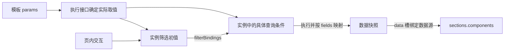

# 新版元数据结构与关系

状态：2026-09-14 最新确认设计；尚不是可直接校验的 JSON Schema。当前代码仍为页面协议 6.0。用户已确认复用 `params`，不新增 `dimensionValues` 或 `globalParams`。多值、维度目标绑定、筛选初始化绑定及新版本号仍由契约任务冻结。决策见 ADR-0078。

## 内容结构

命名已确认：页级 `filters` 继续位于根层，因其可同时作用于多个数据源和内容分区；根字段 `layoutForm` 简化为 `layout`，仍为 `report | dashboard`，不改变现有布局行为。下图展示新版设计，当前代码尚未改名。根级 `layout` 表达整页形态，组件 `layout` 表达组件占位，两者按作用域区分。删除旧字段并直接换名属于 ADR-0051 定义的破坏性变更，需在规格里明确主版本迁移，或以明确兼容策略过渡；不能按普通增量次版本默默替换。

```text
metadata
├─ schemaVersion                 协议版本，不是页面修订号
├─ id                            页面身份；外部修订引用单独管理
├─ meta
│  ├─ title                      页面名称
│  └─ description                作用、支持的指标与维度
├─ layout                        看板 / 报表（由 layoutForm 改名）
├─ params                        实例化或打开时确定的输入
│  ├─ 既有：id/type/required/label/default
│  └─ 新增能力：维度多值与目标绑定（子字段待冻结）
├─ dataSources
│  └─ <dataSourceId>
│     ├─ fields                  结果字段契约及 queryField 映射
│     ├─ compute                 可选的既有具名算子
│     └─ source
│        ├─ type                 inline / query
│        ├─ rows                 inline 静态数据行
│        ├─ query                查询定义，模板通过绑定关联参数
│        │  ├─ language/body     查询协议及请求体
│        │  └─ filterBindings    页内筛选到查询目标的绑定
│        └─ initial              可选初始行、数据时点、总条数
├─ filters                       页内可变筛选声明
│  └─ 初值可由 params 初始化，不重复维护同一默认值
└─ sections
   └─ id/title/container/columnTracks
      └─ components
         └─ id/type/layout/data/props
```

source 按类型选择内容，不同时携带 inline rows 与 query。容器子结构仍遵循各组件 Schema，不新增任意嵌套。参数绑定的具体语法待定，不向现有 DQE 请求体任意插入字符串占位符。

## 参数、筛选与数据的关系

`params` 确定本次初始化输入，`filters` 管理之后的可变筛选；同一条件只维护一份默认来源。模板中的筛选初值可引用参数，执行接口统一生成实际查询条件与筛选初值。后续筛选变化不反向修改模板或本次固定参数，也不能在每次查询时重新用原始参数覆盖用户的当前筛选。



参数还可以用于不可变页面上下文或文本取值；会随筛选变化的内容不能继续引用固定参数并声称代表当前筛选。没有筛选交互要求的参数直接落实到查询或文本，不自动增加控件。维度条件不必是查询输出字段，参数目标绑定、queryField 结果映射、组件字段绑定是不同关系，均不凭同名推断。

## 模板与页面实例

模板保留可替换维度的参数定义及绑定；页面实例具有本次确定的查询条件，仍允许通过既有 filters 和数据网关执行后续交互。参数实例化不改写已发布模板，也不把运行结果自动保存为资产。

首版提取仅覆盖 DQE 维度等值/多值，允许部分数据源共享；同维度不同取值不自动合并，时间与金额范围提取后置。URL 只在初次加载读取。初始化优先级为显式入口、有效历史、页面默认、授权范围回退；权限约束始终生效，越权时静默采用允许范围，实际数据与显示值保持一致。

数据源部分失败沿用现有错误隔离，成功部分保留。执行接口的失败项需接入现有 error 快照；现有 source.initial 仅有成功初始数据，不能把缺少行误认为失败结果已表达。具体响应契约待定。

## 生命周期信息在文档外层

外部 metadata 标识映射、修订引用/序号、草稿/发布状态、来源草稿修订、发布候选、操作者与时间、保存幂等标识属于管理记录或操作信封，不放进组件属性。具体 DTO 以提供方为准。

用户最后一次筛选独立存储；浏览器待同步队列是本地恢复记录，不能冒充服务端修订。首次合法创作 metadata 生成后保存首个草稿；运行实例不自动入库。

```text
语言生成 metadata → 保存草稿修订
       ↓ 手工/语言修改，保存合法结果
确定草稿修订 → Java 提取 params 与绑定 → 发布候选
       ↓ 用户纠正、预览并确认
冻结模板版本 → 执行、确定取值、查数 → 页面实例
       ↓                                ↓
后续修改回草稿                     前端筛选与查询
```

## 本版创作范围

语言创建覆盖现有 17 类组件；手工添加组件后置，现有组件手工编辑扩展白名单。每个完整合法手工操作自动保存，本地 IndexedDB 与待同步队列支持失败恢复和重试；撤销/历史恢复产生新修订。语言批次保存可用操作子集，单个有依赖的业务操作保持完整校验。

元数据编辑 MCP 与生命周期 MCP 独立。外部 Java/Relay 只交付修改方案，真实接通单独验收；本仓不得把提议接口和替身测试当成外部能力已兑现。

盘古助手侧边栏对话独立开发，通过稳定接口连接创作流程；盘古适配与部署配置同上游源码分离。本版必要的架构调整优先完成，再开展模块并行实现。具体独立开发和上游同步验收约束见 `2026-09-14-platform-authoring-lifecycle-grill.md`。
