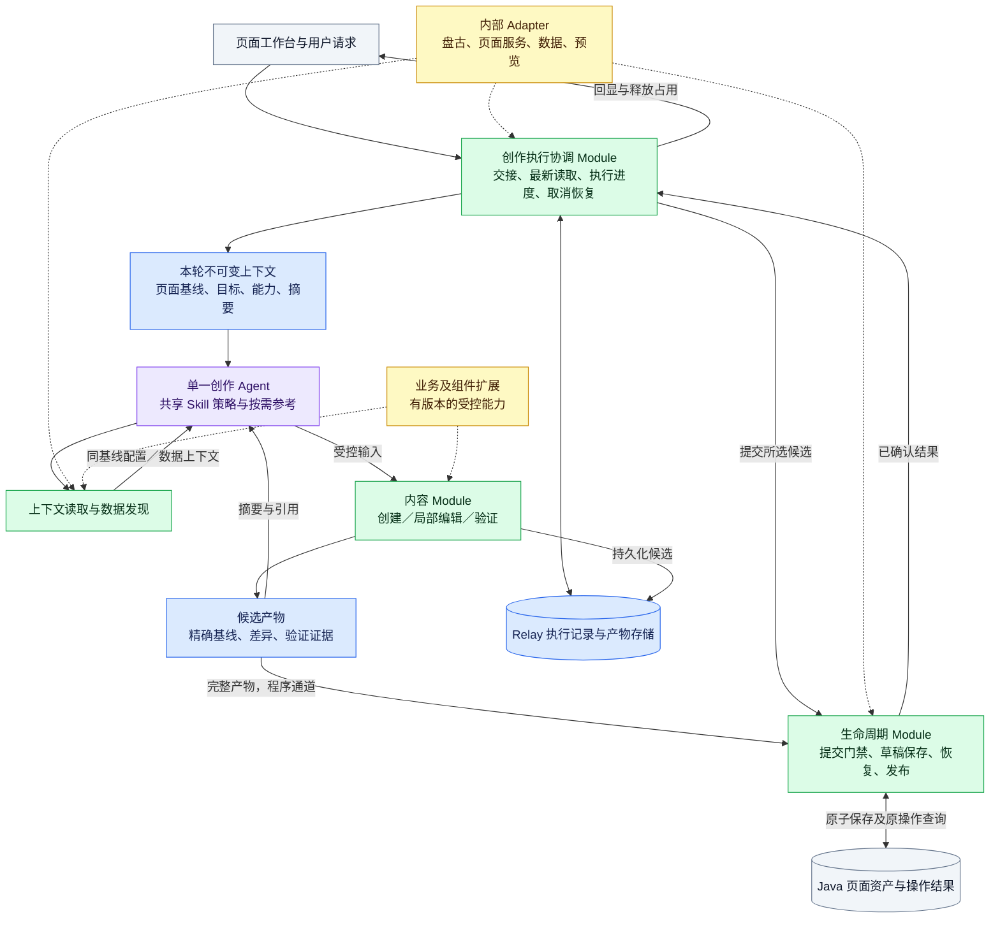

# 页面创作 Agent：统一目录、执行契约与功能迁移

状态：目标架构，2026-09-15。正式编码依据为[统一创作 Skill 规格](2026-09-15-unified-authoring-skill.md)及 [Issue #150](https://github.com/CCharlesMeng/MetricCanvas/issues/150)。替代此前《统一 Platform 创作 Skill：整体方案》的架构提案；旧文保留调查与讨论历史。本文描述目标，不代表产品、Skill 或外部接口已实施，也不把内部报告的静态代码描述当成端到端验证。

## Java 接入的后续裁决（2026-09-16）

本文保留 9 月 15 日目标设计与迁移调查。当前 Java 接入以 [ADR-0080](../../adr/0080-java-assets-single-attempt-save-and-status-publication.md) 和[资产架构方案](../java-page-assets/2026-09-16-java-page-assets-architecture.md)为准：按资源当前读取并固定创作基线；单次提交，验证成功回执；未知结果保留工作并停止；发布由工作台更新当前资源状态。下文 §4 的强最新读取、§6 的 Java 幂等/远端操作查询/精确回读/模板发布，以及 §9–§11 对这些能力的迁移和验收要求，不再是本期前置。身份、候选门禁、内容合法性和迟到结果隔离继续生效。

当前源码职责见 [创作架构与维护导航](../../../metriccanvas-authoring/ARCHITECTURE.md)，完成项与测试证据见[实施记录](../java-page-assets/2026-09-16-java-page-assets-implementation.md)。外部 Relay 注入与真实服务联调不因本仓实现完成而视为已验收。

## 实施对照（2026-09-16）

本轮实现及可信评测 runner 已合入 main `d5aa4be`。本文仍保留目标设计；当前代码维护入口是 [metriccanvas-authoring/ARCHITECTURE.md](../../../metriccanvas-authoring/ARCHITECTURE.md)，实际验收见[交付就绪清单](2026-09-15-unified-authoring-release-readiness.md)。S0–S7 的本仓实现与确定性验证已交付，S7 内部真实迁移和 S8 仍未完成；真实模型新请求为0。已推送代码不代表已接通或切换生产。

| 本文目标职责 | 已落地位置（相对 metriccanvas-authoring/） | 边界 |
|---|---|---|
| 统一 Skill | `skill/metriccanvas-platform-authoring/` | 一个作者、create/edit 流程、按需参考；普通问数保留 |
| runtime / 上下文与交接 | `tool/metriccanvas_authoring/application/authoring_turns.py`；仓库 `apps/platform/src/lib/workbench/` | 当前读取与固定创作基线；真实提供方接线另验 |
| prepare / inspect 内容工具 | `tool/metriccanvas_authoring/adapters/inbound/unified_content_mcp.py` | 实际五工具：read_page_context、discover_data_context、compose_page、create_content_page、edit_page |
| 候选与提交恢复 | `application/authoring_candidates.py`、`authoring_submission.py`、`authoring_recovery.py`（均在实际 Python 包内） | SQLite 提供本地持久实现，Java 单次保存以已验证回执确认 |
| metadata_mapping / 组合 | Python 包内 `domain/source_mapping.py`、`application/unified_edit_page.py`、`unified_composition.py` | 新建及已有页新增均贯通；未支持转换明确拒绝 |
| extensions / bootstrap | Python 包内 `application/authoring_deployment.py`、`business_interpretation.py`、`component_policy.py`、包顶层 `authoring_bootstrap.py` | data/business/component/system 均有受控消费者；内部实现未迁移 |
| tests / evals | `test-harness/tests/`、`test-harness/model-evals/` | 可信 runner 已适配；本地模拟不计真实模型成绩 |

下文 §3.3 的 `src/runtime/ports/extensions/config/tests/evals` 是职责示意，不是要求再搬一次目录的待办。真实源码继续复用 `tool/metriccanvas_authoring/{application,domain,adapters}`，契约作者/导出路径沿用现有生成链；后续开发按维护入口定位。本文工具示意名以实际注册为准，新鲜性与状态所有权补充决策见 [ADR-0079](../../adr/0079-trusted-authoring-turns-gate-content-tools.md)。

## 1. 设计结论

采用 **一个创作目录 + 一个创作 Agent + 可恢复的确定性执行流程 + 受控内容工具**。系统接线与业务差异放在同一项目的 adapters/extensions 中，按接口隔离；不另建公司版项目。

Skill 是 Agent 的任务策略与少量参考，不是运行时、页面数据库或保存状态机。Agent 自主理解需求、选择参考、组织方案、调用工具和修正内容；程序掌握页面状态、占用、身份、产物、保存与恢复。对用户仍是“直接生成或修改”，内部候选阶段不增加通用批准轮次。发布继续人工确认。

模型先通过工具形成经过验证的候选变更，程序再把候选提交为创作草稿修订。模型不能直接选择任意 JSON、版本号或 is_draft=false 发起持久化。候选的生成与草稿提交具有不同责任和失败语义，但可以在一次用户交互中连续完成。

架构从职责和失败场景推导，不要求继承现有工具数量、六种分析意图、取数单元上限或占位符协议。这些约束逐项作为能力或迁移兼容条件处理。仍以公司内网模型、Relay/盘古、Java 页面资产能力作为当前部署约束；它们不进入共享 Skill 的业务策略。

## 2. 一手实践与采用范围

以下资料检索于 2026-09-15。来源提供设计原则，本文的具体接口、状态及阈值是针对本项目的设计，不是任何厂商已替我们实现的保证。

| 实践 | 本项目采用方式 | 不直接照搬的部分 |
|---|---|---|
| 简单可组合的 Agent/工作流：[Anthropic Building effective agents](https://www.anthropic.com/engineering/building-effective-agents) | 一个 Agent 负责连贯页面意图，确定性程序执行固定不变量 | 不因任务多就设置规划、编辑、审核等多个互相转交状态的 Agent |
| 推理执行与会话持久化解耦：[Anthropic Managed Agents](https://www.anthropic.com/engineering/managed-agents) | 推理进程、内容工具、执行记录各有 Interface，进程失效不丢失已提交事实 | 不引入其托管服务，不复制通用沙箱平台 |
| 渐进提供上下文：[Anthropic Context engineering](https://www.anthropic.com/engineering/effective-context-engineering-for-ai-agents) | 本轮必要结构前置，细节按引用读取，旧历史不充当页面真源 | 不默认建向量库，不把全部 Schema 和错误夹具交给模型 |
| 面向任务设计工具：[Anthropic Writing tools](https://www.anthropic.com/engineering/writing-tools-for-agents) | 少量职责清楚的粗粒度工具，返回可行动错误和摘要 | 不把每个内部 REST/算法步骤包装为模型工具 |
| 恢复与副作用幂等：[LangGraph Functional API](https://docs.langchain.com/oss/python/langgraph/functional-api)、[Interrupts](https://docs.langchain.com/oss/python/langgraph/interrupts) | 分开已完成步骤与未知写入，恢复查询原操作，持久化保证幂等 | 不认为增加 checkpointer 就实现外部写入 exactly-once，不要求引入 LangGraph |
| 执行处检查：[OpenAI Guardrails and human review](https://developers.openai.com/api/docs/guides/agents/guardrails-approvals) | 基线、权限与产物校验紧邻副作用执行；人工发布确认绑定精确对象 | 不为已授权普通修改追加逐工具批准，不用另一个 LLM 判断代替原子校验 |
| 数据与指令隔离：[OpenAI Safety in building agents](https://developers.openai.com/api/docs/guides/agent-builder-safety) | 页面文字与工具返回是数据；结构化结果仍需确定性校验 | 该页针对旧 Agent Builder；只采纳通用隔离原则，不选用该产品 |
| 用轨迹评测改进：[OpenAI Evaluate agent workflows](https://developers.openai.com/api/docs/guides/agent-evals) | 保存脱敏调用轨迹，分别测语义、产物、状态与成本 | 不用模型自评分替代保存、字段保持和并发断言 |

这些资料支持减少状态耦合、改善工具与上下文设计；不能证明某个框架或本提案在所有模型上最优。最终以内部目标模型、真实工具和迁移验收为准。

## 3. 架构及所有权

蓝色为上下文/状态，紫色为推理策略，绿色为确定性执行，黄色为扩展，灰色为外部能力。模块是职责划分，不要求每个框成为独立服务。



### 3.1 单一事实归属

| 事实 | 权威拥有者 | 其他位置允许保存什么 |
|---|---|---|
| 页面定义、修订和发布状态 | 页面资产服务 | 精确不可变副本、引用、显示缓存 |
| 尚未同步的人工编辑 | 页面工作台 | 发送前必须同步，不能假装已保存 |
| 对话、执行步骤和等待状态 | Relay 中的创作执行记录 | UI 展示投影；Java 只保存关联与自己的事务结果 |
| 某次保存是否已受理/成功 | 页面资产服务的操作记录 | Relay 保存回执，不能根据网络异常猜测 |
| 候选页面及其差异 | 程序产物存储 | 模型得到摘要与引用；preview 缓存可重建 |
| 本轮页面上下文 | 本次最新读取的精确快照 | 一轮内读取同基线，下一轮重新取得最新版本 |
| 页面协议和组件规则 | 产品契约作者 | 单向生成各语言契约与验收向量 |
| 创作策略与工具输入契约 | 共享 Skill 作者与 Authoring 契约作者 | 同一 Bundle 的生成物 |
| 公司词汇、业务规则及接线 | 内部扩展作者 | 锁定版本，不改共享生成物 |

Relay 保存执行检查点，Java 保存页面事务结果，不互相建立第二份权威状态机。协调逻辑是领域执行控制，复用 Relay 的模型循环与任务记录，不是新建一个通用 Agent Runner。前端不成为后台运行进度的唯一持有者。

### 3.2 模型自主范围

模型负责理解需求、解析指代、选用分析意图、提出完整页面方案、补读必要信息、生成受控操作、处理可修正错误。程序保证身份、引用、能力、字段契约、依赖闭合和写入条件。程序不能证明自然语言意图被完全理解；这部分用行为评测和必要澄清控制。

配置问答仅是同一 Agent 的只读完成方式。recall-report 负责页面消费，可继续独立存在。以后引入并行 Agent 必须有独立信息收集任务与实测收益；多个 Agent 不同时改同一页面。

### 3.3 统一目录与文件存在形态

采用一个 `metriccanvas-authoring/` 源码树，按职责组织文档、程序、契约、配置和测试。不再建立 company-authoring 项目或并排维护公司版主流程。此前独立目录仅意在表达维护归属，该表达现已撤回；维护归属由目录负责人、扩展契约和版本锁表达。

以下为目标职责目录，不是当前文件清单；对应功能的实际落点见上方实施对照。代码复用既有 application/domain/adapters，不以目录迁移代替功能改造。Python 包名 metriccanvas_authoring 是同一项目的代码包，不是另一套系统。

```text
metriccanvas-authoring/
├── skill/metriccanvas-platform-authoring/       # 模型读取的唯一创作 Skill
│   ├── SKILL.md                                # MD：入口、共同策略、前置及结束条件
│   ├── workflows/                              # MD：按任务读取的流程性说明
│   │   ├── create.md
│   │   └── edit.md
│   └── references/                             # MD：按需查阅的资料
│       ├── layouts/report.md
│       ├── layouts/dashboard.md
│       ├── errors.md
│       └── examples.md
├── src/metriccanvas_authoring/                  # 一个 Python 源码包
│   ├── runtime/                                # Relay 程序侧运行控制
│   │   ├── turn_workflow.py                    # 交接、最新读取、候选提交、恢复
│   │   └── context_projection.py               # 页面→模型摘要与目标引用
│   ├── application/                            # 受控业务用例
│   │   ├── inspect_context.py
│   │   ├── discover_context.py
│   │   ├── prepare_create.py
│   │   ├── prepare_edit.py
│   │   └── lifecycle.py                        # 草稿提交、原操作查询、发布用例
│   ├── domain/                                 # 确定性领域算法
│   │   ├── page_building.py
│   │   ├── page_editing.py
│   │   ├── component_selection.py
│   │   ├── section_layout.py
│   │   ├── metadata_mapping.py                 # 归一字段描述→页面字段及绑定
│   │   ├── presentation_policy.py              # 显示建议解析与覆盖规则
│   │   └── page_validation.py
│   ├── ports/                                  # Python：运行与用例所需的接口
│   │   ├── page_assets.py
│   │   ├── data_access.py
│   │   └── execution_state.py
│   ├── adapters/                               # 外部协议的实际实现
│   │   ├── inbound/                            # 谁调用我们
│   │   │   ├── mcp_tools.py                    # 注册模型可调用的内容工具
│   │   │   └── relay_events.py                 # 盘古消息、取消及恢复事件
│   │   └── outbound/                           # 我们调用谁
│   │       ├── java_page_assets.py             # Java 页面身份、修订及保存接口
│   │       ├── data_service.py                 # 指标、维度及 DQE 服务
│   │       ├── source_metadata.py              # 外部字段/格式规则解码与归一
│   │       ├── relay_state.py                  # Relay 执行记录/产物存储接线
│   │       └── preview_transport.py            # 现有占位符、缓存、预览输出
│   └── bootstrap.py                            # 读取配置、注入 Adapter 和扩展
├── extensions/                                 # 同一项目内的可替换业务能力
│   ├── business/
│   │   ├── resolver.py                         # 特有业务解析
│   │   ├── aliases.yaml                        # 公司词汇、指标及组织映射
│   │   └── guide.md                            # 确需提供给模型的业务参考作者
│   ├── source-mappings/                        # 版本化的外部描述映射规则及行为向量
│   └── components/                             # 组件契约、构建/编辑支持及验证例
├── contracts/
│   ├── authored/                              # 唯一 Authoring 契约作者
│   └── generated/                             # 只读生成物，不能手改
├── contract-snapshot/                          # 产品契约锁定快照，不是第二个作者
├── config/
│   └── deployment.yaml                        # Skill 注册名、端口、扩展、预算配置
├── scripts/                                    # CLI：构建、导出与交付校验
├── tests/                                      # 算法/契约/运行/适配测试及夹具
├── evals/                                      # 真实模型场景、运行器、脱敏结果
├── docs/                                       # 开发设计与接入说明，不注入日常模型
├── pyproject.toml                              # Python 打包与依赖
├── bundle.json                                 # 统一交付清单
└── bundle.lock.json                            # 生成的源码/契约/扩展版本锁
```

`ports/` 是程序依赖的接口定义；`adapters/` 是它们或入站调用协议的实际实现；`extensions/` 是按稳定能力接口接入的业务或组件差异。同一项目中维护，不能在扩展目录再实现一套创作主流程。若没有实际可替换差异，直接保留在相应 domain/application 文件，不为可能的未来扩展建空目录。

目录树表示作者源。生成的部署目录由构建产生：Skill 名可映射为 define-report，业务 guide 按配置复制为该 Skill 的参考文件；只编辑原作者，不手改分发副本。完整生成目录、页面数据、候选及运行记录不作为新的手写源码。

**各形态的消费方式：**

| 形态 | 谁读取/执行 | 何时 | 内容边界 |
|---|---|---|---|
| SKILL.md | 模型，由 Relay 加载 | Skill 被选中时 | 目标、共同策略、上下文前置条件 |
| workflows/*.md | 模型，经明确指针或宿主注入 | 创建/修改分支 | 任务步骤、工具选择、结束条件 |
| references/*.md | 模型按需读取 | 布局、错误或示例需要时 | 完成任务所需的少量知识 |
| runtime/*.py | Relay 侧程序 | 每轮消息、取消和恢复 | 保证执行顺序，不自行新建模型循环 |
| application/domain/*.py | Python 执行环境 | 对应用例被调用时 | 内容处理与生命周期用例；各自只实现一次 |
| adapters/inbound/mcp_tools.py | MCP 服务 | 模型发起工具调用时 | 接收参数、校验协议、调用用例 |
| 其他 adapters/*.py | 对应程序调用方 | 与实际系统通信时 | 外部协议、凭据引用、错误归一化 |
| extensions/*.py、*.yaml、*.md | 程序或构建；MD 按需给模型 | 注册能力/处理业务/提供参考时 | 有契约的差异，不修改主流程 |
| scripts/*.py 或 *.ts | 开发/CI/部署命令 | 构建和检查时 | 导出、打包、分发校验 |
| contracts、config | 生成器、校验器、启动程序 | 构建/启动/执行时 | 结构与行为契约、实现选择 |
| tests、evals、docs | 测试运行器或维护者 | 开发、验收或设计时 | 与日常模型上下文分开 |

MCP 是调用方式，不是独立文件格式。一个 .py 可以是 MCP 入口、算法库、Adapter 或 CLI，区别在职责和调用方。workflows 是文档组织方式，不会自动执行，必须有明确指针与真实读取/注入能力。

### 3.4 依赖方向与部署形态

- runtime 调用用例接口/端口，组织本轮执行；application 组合 domain 算法并通过 ports 访问外部能力。
- domain 不读取 SKILL.md，不导入 Relay/FastMCP，不调用 Java HTTP；adapters 负责这些协议接线。
- bootstrap 是组装入口，根据 config 注入 Adapter 与已注册扩展。核心策略及算法不按公司名称写条件分支。
- contracts 定义输入输出与行为约束；Python ports 表达程序依赖，不手写一份竞争的 JSON 结构。生成模型工具声明与各端结构时沿用同一作者。
- 同一个源码包可以由 Relay 程序扩展和 MCP 服务分别装载；统一目录不要求统一进程。Relay 继续拥有模型循环，Java 继续拥有页面事务，已有前端继续渲染。

MCP 仅向创作模型暴露受控内容能力；lifecycle 用例由可信程序调用。运行控制只决定何时提交和接收结果，不复制 lifecycle 的验证、幂等或发布算法。若 Relay 缺少执行记录/产物分流能力，应补充真实接入能力，不能把保证执行的步骤退回到 Markdown。

部署配置是本项目构建输入，不假定盘古原生认识该 YAML。模型侧加载文档，Relay 扩展装载运行控制和接线，MCP 进程装载工具用例；三者由同一交付清单锁定。配置只包含密钥引用；实际凭据由内部机制提供。

内部组件的渲染实现仍在已有前端，extensions/components 必须通过契约和验收绑定对应前端版本。Java、前端不因统一创作目录而迁入 Python 项目。这里只统一创作能力的源代码组织。

以“修改选中图标题”为例：relay_events.py 接收 → turn_workflow.py 交接并调用最新读取 → java_page_assets.py 返回精确页面 → context_projection.py 提供目标摘要 → SKILL.md/edit.md 指导模型生成工具请求 → mcp_tools.py 调用 prepare_edit.py/domain 算法 → lifecycle.py 校验并提交 → preview_transport.py 回显。模型不读取这些 Python 源码来执行这一轮，构建脚本也不参与对话。

## 4. 本轮上下文契约

以下为语义规格，名称是建议，不是已上线 API。实施时复用现有字段，并从一个中立作者生成 TS/Python 消费物。

`AuthoringTurnContext` 包含：

- 可信程序关联：requestId、turnId、runId、工作台关联、当前执行代次；权限和凭据在带外身份通道，不由模型提交。
- 页面绑定：pageId、精确 revisionId/完整性引用、内部资产 ID 映射、草稿或发布来源、快照取得时间。不存在的全新页面由程序分配身份并声明空基线。
- 目标：最新页面中解析出的稳定 locator；初版顶层单选，路径能力未实现前不承诺多选/嵌套。
- 基础投影：布局、区块/组件 ID、类型、标题、位置；选中目标相关配置。
- 补读声明：哪些配置已提供、哪些省略、是否分页、有何读取能力；同修订分页令牌不能复用到其他页面。
- 能力与版本：本轮可用操作、部署约束、契约/扩展版本、实际参考清单。
- 解释辅助：用户原话、已确认偏好与澄清结论，均保留来源。页面内容、历史回答和 PlanAgent 语义摘要不能覆盖本轮页面事实。

### 4.1 最新读取流程

每条用户指令，包括澄清回复和文字发布请求，都执行：

1. 当前工作台停止接收新的人工修改，提交输入框/属性面板未完成编辑。
2. 等待人工修改同步被服务端确认；同步失败保留本地修改，不启动依赖页面状态的 AI 操作。
3. 按 pageId 获取服务端最新创作草稿及匹配的精确修订。不能由缓存或 Agent 自行决定跳过；显式空基线新建除外。
4. 重新解析目标，注册本轮基线、工具能力和上下文引用；失败不退回旧基线。
5. 运行中细节补读始终绑定该基线。只有候选链可产生本轮派生状态，不能偷换服务端最新版。

取消、心跳、断线查询属于控制消息，不是新用户指令，不为它们重复创建一轮。发布确认涉及的精确候选保持原关联；最新读取发现页面已变化时禁止默默将确认目标替换成最新版。

### 4.2 摘要与上下文预算

投影由程序明确字段生成；表格列宽操作读取列 ID/当前宽度，图表转换读取类型/字段角色与绑定。目标未明确时先用结构摘要定位，必要时补读，不能要求首次程序在不理解自然语言时已知道全部细节。

大页面分段返回结构，显示 total/hasMore/omittedScopes，缺失不等于不存在。对未来复杂编辑，可提供按稳定 ID/类型/名称筛选的受控读取，不增加通用文档搜索服务。

静态主文、共同规则和工具说明优先复用；动态本轮上下文明确替换旧页事实。历史压缩只处理对话说明，不生成页面权威快照。保留“用户要求列宽 230”等来源记录用于理解，实际当前宽度仍从页面读取。

完整页面、原始查询、查询行与 previewJson 留在程序通道；任务需要数据推理时使用另行授权且有界的证据接口，本次配置问答不扩展为业务分析。工具日志同样不默认记录全量数据。上下文缩减不以删除身份、目标、能力限制或省略标记为代价。

## 5. 内容与工具契约

### 5.1 最小模型工具面

| 模型能力 | 输入/输出要点 | 明确不做 |
|---|---|---|
| inspect_page_context | 本轮上下文或候选引用＋目标/范围；返回受控配置投影 | 不读取任意其他页，不查询业务数据 |
| discover_data_context | 新增数据需求；返回有来源和版本的数据上下文快照 | 不用于找 Skill 文档或普通属性修改 |
| prepare_page_create | 受控创建请求；返回经过验证的候选引用与摘要 | 不保存、不发布、不由模型生成资产身份 |
| prepare_page_edit | 本轮基线或候选引用＋精确目标的受控操作组 | 不用旧 Spec 重建整页，不接收自由页面 JSON |

现有 compose_page/edit_page 可以承担其中部分实现，名字以最终契约兼容安排为准。必要参考默认按任务提供；确有新增补读需求时再提供受限 topic 读取，不为四个固定指南搭建检索系统。

初版可使用固定且精简的工具集合，不强依赖“先分类再动态装载工具”，避免第二次模型分类和 SDK 接线成为前置条件。工具可见性用于降低选择负担；实际操作能力、身份及执行状态每次在程序端校验。任务偏好不作为权限证明。

### 5.2 创建与修改

创建继续使用页面构建规格描述取数需求。若“完整方案”需要选择布局、组件组合和顺序，定义独立、受控的页面组合输入，与取数规格组合为创建请求；不把布局字段塞回页面构建规格，不要求模型输出组件 props 全集。只实现已具备组件契约的组合。

修改以当前完整页面为基线复制并应用受控操作。可支持属性修改、组件转换、添加组件、添加经过验证的数据源、筛选绑定变更；能力按实际交付开放。新增查询与组件是依赖组，先生成可完整验证的候选，不能先往正式页面插一个没有有效数据源的图。

内容 Module 为每个操作推导实际影响范围，校验未涉及内容保持；不信任模型自报“只改标题”。未知内部扩展字段若能按有效契约无损保留则保留，不能识别或转换时拒绝相应操作，不能静默清除。

同一轮允许基于候选继续编辑，但使用 candidateRef 明确关联，其根基线不变。最终只提交被选中的一个候选；不能在一次模型探索中把每个中间版本都自动保存。

### 5.3 候选与错误

`PreparedChange` 由程序生成，至少绑定：本轮/页/根基线、内容摘要及完整性信息、实际变更范围、操作结果、依赖组、验证结果、创建契约与扩展版本、产物引用。引用不可跨身份/页面使用；使用时验证权限与有效期。内容哈希证明完整性，不单独证明来源或授权。

部分成功仅接受能独立成立的操作组。组内全成全败；删除一个失败组后，整个候选仍须通过字段/绑定/页面校验。循环依赖、对同一属性冲突的操作、共享依赖不完整必须拒绝或澄清。不把查询失败但返回 issues 的页面直接视为符合业务需求。

错误采用稳定 code、stage、target/path、是否发生副作用、可否重试、建议行动和诊断关联；不把栈或原始服务响应塞给模型。参数错误允许有限修正；认证/配置未变不重试；基线冲突停止提交；未知保存结果交恢复机制处理。

查询执行是外部读取，也有成本与数据变化。结果必须记录实际执行身份、数据上下文版本和必要快照标识；同一组 live 查询参数不保证不同时刻数据相同。“确定性装配”指相同规格、已记录查询结果和契约版本产生相同候选。重放不能悄悄重新查询后声称原候选未变。

### 5.4 数据源信息到页面元数据的稳定映射

本节补充统一创作 Skill 所使用的数据映射能力，数字格式是其中一类。依据用户提供的《DataFilterType 数字格式规则说明》以及本仓结果字段契约、查询行归一化、字段绑定与共享格式化实现。用户已确认数据服务可以返回规则及顺序/参数、原始单位与百分比刻度；实际服务解码在内网调试。本节为正式编码的目标设计，映射能力在本仓 Authoring 项目中实现并进入创建/修改流程。尚未拿到真实字段响应和旧格式器源码，不能宣称 113 项及所有组合都已精确映射。

**职责分两段：外部协议/规则→归一描述属于 Adapter；归一描述→页面字段契约、组件绑定与展示声明属于 domain/application。最终格式化属于既有统一运行时。**

```text
数据服务字段描述＋有序显示规则＋已验证查询结果契约
  → source_metadata Adapter：解码外部字段和规则语义
  → 归一字段描述＋显示建议＋映射问题
  → metadata_mapping / presentation_policy：确定性映射
  → dataSources.fields / queryField / 组件字段绑定与展示声明
  → 既有统一运行时：按声明产生显示文本或组件呈现
```

归一描述是 Authoring 内部契约，沿同一契约作者生成，不是给页面再增加一套任意 JSON 字段。规则语义、目标字段和错误均可测试；Skill 只表达需求、使用映射结果和处理歧义，不逐轮解释数值枚举，也不接收完整旧规则手册。

#### 映射内容与责任

| 来源信息 | 归一后含义 | 页面落点或处理 |
|---|---|---|
| 数据源/指标/字段稳定标识、输出别名 | 源身份、逻辑字段身份、实际查询输出列 | 页面数据源 ID、稳定页面字段 ID、queryField；结果存在性按真实契约验证 |
| 字段类型、角色、可空性、口径、可加性 | 结果字段契约与指标语义 | 页面字段 type/role/nullable/unit 等合法字段；聚合语义不能从格式编号推断 |
| 原始单位、币种、数值刻度 | 值的实际含义 | 决定是否需要明确数值归一；不能用显示单位冒充原始单位 |
| 千分位、小数位、万/亿、百分号建议 | 默认显示建议 | 可精确表达时写 defaultFormat；组件显式 format 优先 |
| 正负方向、业务好坏、颜色、箭头 | 条件呈现与业务极性 | 映射到受支持的组件声明；不改变原数值，不生成旧 HTML |
| 进度条、灯、附加同比/环比、多行文本 | 组件结构与相关字段需求 | 受控组件组合；缺字段或缺组件能力时明确不支持 |
| 数据服务中的真实筛选条件 | 查询、参数和筛选绑定语义 | 按原有查询/参数契约映射；DataFilterType 本身不是页面 filters |

稳定字段 ID 依据逻辑字段身份维护；已有页编辑先复用现存 ID，不能按字段数组顺序重编号。查询别名与显示标签分离；同名指标的不同聚合/时间语义不能合成一个字段。源变更影响 queryField 时需重新验证，不能由模型猜测别名。

#### 归一描述的最小契约

至少包括：源系统和契约版本、源字段/指标标识、实际输出列、数据类型/角色/nullable、原始单位/币种、数值刻度、来源依据，以及有序规则与参数。可按数据服务实际能力补充，不把示意字段当作已存在响应字段。

数值刻度要能区分：分数（例如 0.1234）、百分数值（例如 12.34）、百分点变化，以及元/万元等物理数量级。不能仅凭字段名、百分号或几行样本推断。若来源描述缺失或互相冲突，返回 needs-input/unsupported，不自动猜测。

有序规则解码后，可以产生：数值转换要求、显示精度/分组/单位建议、上下界显示规则、零/空值行为、符号与业务方向、复合呈现要求。已知源系统的数字枚举必须与其版本及符号名关联，保持旧协议顺序；未知编号保留为不支持问题，不能按近似名称匹配。解码器保留原序列，只有证明等价时才折叠组合。

#### DataFilterType 对本方案的具体启发

| 旧规则示例 | 需要拆开的语义 | 映射判断 |
|---|---|---|
| THOUSAND_SIGN / POINT_TWO | 数字分组、固定小数位 | number-grouped / number-2 可作为候选；组合的末尾零、空值、舍入等仍需一致性验证 |
| TEN_THOUSAND | 显示缩放还是已执行的数据转换、原始数量级 | 元原值可选择万单位显示；若结果已除万，禁止再除一次 |
| COPILOT_RATE | 数值乘 100 | 仅在来源刻度明确时规划一次转换；它本身不是“加百分号” |
| PERCENT / ADD_PERCENT | 百分号，以及前者的舍入/上下界规则 | 不能都映射到 percent-0：当前预设没有旧规则的 ±500 显示上界 |
| RATE_ADD / RATE_ADD_WITH_PCT | 百分点变化、符号、业务极性 | 不能改成普通百分比 format；需要能表达其语义的受控能力 |
| ARROW_REVERSE / TARGETRATE | 箭头/业务好坏、进度条及阈值 | 由受控组件呈现表达，不能塞进字段 format 或数据行 HTML |
| COCKPIT_RATE / COCKPIT_ZERO_RATE | 0 与缺失的不同显示策略 | 单独记录兼容差异，不将合法 0 归一成 null |
| 日期、文本替换、复合比较项 | 日期编码/显示、标签替换、关联字段 | 分派给对应数据/绑定/组件能力，不作为通用数字格式链执行 |

上述仅为分类与候选映射，没有认证全部旧输出等价。例如本地 value-format.ts 的 percent-2 将 12.34 显示为 12.34%，不会乘 100；空值默认是“—”，旧说明包含“--”和“--%”。这些差异必须留在兼容结果中，不能因为页面通过 Schema 就算迁移成功。

#### 两种缩放必须分开

显示缩放只发生在格式化阶段，例如原数值 123456 元以万为单位显示，原始排序、计算和交互仍使用 123456。原始数量级归一是数据语义转换，例如源提供 12.3456 万元而目标字段合同要求元，这时必须有明确且一致的转换通路。

百分比示例：来源明确为 fraction 的 0.1234 若要使用当前 percent-2，须在受控数据/查询转换后成为 12.34，再显示为 12.34%。若来源本来为 12.34 百分数值，不执行乘 100。百分点变化独立处理，不能由百分比格式推导。

转换必须同时适用于首次验真、preview initial、后续刷新、召回执行、筛选后查询及相关导出。不能仅在创建预览时改行数据。优先在已支持的查询定义/受控算子中表达并验证；如需跨语言数据归一化扩展，应定义中立转换契约和共享行为向量，再由各实际执行端支持。当前 query-rows.ts 只做字段映射和类型校验，不意味着已支持任意缩放。没有统一执行通路时阻塞该转换，不能在 Adapter 偷改一次数据充当完整实现。

数据源字段必须保持可计算的类型；不把“1.23万”、百分号字符串或箭头 HTML 写入 number/money 字段。无法从格式化字符串无损恢复原值时，应请求原始字段，不能去掉符号后当成真实数值。原始符号、0 和 null 均保持；旧 ABS、ZERO_REVERSE 等规则只有在已明确其显示或数据语义且受控表达可用时处理。

#### 格式覆盖、版本与兼容

沿用展示格式属于组件字段绑定的决策：本次用户明确修改的组件格式 > 保留的现有组件显式格式 > 字段 defaultFormat > 产品默认显示策略。上游显示建议只用于创建或明确刷新默认格式的任务，不能在普通标题修改时覆盖人工设置。数据类型、币种、原始单位和数值刻度是事实，不参与这个显示偏好优先级。

同一字段可以在指标卡显示万、表格显示元，不能因此修改共享数据源原值。改变币种不是格式化，不隐含汇率换算。当前已检视 money 合同是 CNY，不能把美元直接标记为 CNY；确需其他币种须先有合法契约及运行时支持。

映射输出携带状态（exact / needs-input / unsupported）、源版本、映射规则版本、目标契约版本、已应用转换与未支持差异。exact 要求已定义范围的行为向量通过；受限显示降级只能在明确接受差异后采用并记录，不能以 exact 返回。旧规则语义变更时发布新映射版本，不静默改变已有页面。

持久页面保存已解析的合法字段和绑定声明；源枚举、映射版本与来源细节作为候选/修订关联证据保存，不把外部 DataFilterType 编号变成页面运行依赖。若新增格式能力确实要求版本化声明，先通过产品契约演进，不能临时把任意规则对象写入 format。

#### 目录与实施范围

- adapters/outbound/source_metadata.py：外部字段和规则协议解码，按依赖注入使用版本化规则。
- extensions/source-mappings/：规则作者及代表性正反例；简单规则可用声明式配置，复杂链解码放有测试的程序，不创建可执行任意表达式的 YAML。
- domain/metadata_mapping.py：归一描述到稳定页面字段与绑定的映射。
- domain/presentation_policy.py：解析默认显示建议、保留已有覆盖、检查目标组件支持。
- contracts/authored/：归一描述和映射结果契约；产品格式闭集由现有产品作者导出。
- tests/：字段、单位、刻度、组合、覆盖与不支持能力的确定性验收。
- 既有前端统一运行时：最终显示的唯一实现；Python 装配不复制一份数字格式器生成 HTML。

首批在内网确认真实字段响应中 DataFilterType 的存放位置、规则顺序/参数、数据是否已缩放和源版本，再选已使用的高频规则与组合实现。113 项先建立覆盖台账，区分精确支持、需补能力、待源证据；不把 113 项全部塞进 Skill 主文或以逐项 prompt 实现。

至少验收：0.1234 fraction 与 12.34 percent 不重复乘 100；元与万元不重复缩放；0/null/负零分开；阈值上下沿、负数舍入和末尾零；百分点与百分比区分；同字段多组件不同格式；人工格式保持；未知编号/参数/冲突规则拒绝；预览与再次查询/召回显示一致；原始排序和计算不受显示格式污染。

#### 本仓实施与内网接入

数据映射是统一创作能力的组成部分：本仓定义归一契约、公共映射规则、创建/修改用例接入和验收向量；内网实现真实源响应到归一描述的 Adapter，并验证旧规则行为。共享 Skill 通过明确流程指针使用工具映射结果，不自行计算缩放或翻译枚举。

实施切片必须验证“源描述 → 结果字段契约与 queryField → 组件绑定/默认格式 → 合法候选”，编辑时保持既有字段身份和未触及的人工设置。不能把只输出 fields 的离线 CLI 当作该能力交付完成。前一轮误做的独立调试包已撤回，原型不构成公共接口、正式实现或验收依据。详细实施范围见[统一创作 Skill 规格](2026-09-15-unified-authoring-skill.md)。

## 6. 提交、恢复与人工交接

### 6.1 提交门禁

Agent 以结构化结果结束内容阶段：只读回答、等待澄清、选中候选、能力阻塞。运行宿主收到候选完成结果后，由程序验证本轮仍有效、基线/产物/影响范围/权限/内容契约一致，再自动提交创作草稿。没有通用用户批准步骤。

生命周期 Interface 区分读取最新、读取精确修订、提交草稿、查询原操作、准备发布候选和人工确认发布；它们不是默认全部暴露给创作模型的工具。旧内部 CRUD 名称可通过受控兼容入口转换，但不能保留模型绕过新提交门禁的直接写入路径。

Java 在同一次事务中裁决基线、页面校验、操作幂等与保存回执。相同操作 ID＋相同参数返回同一结果；相同 ID＋不同参数拒绝。requestId 去重用于重复发送，操作 ID 标识一次已冻结提交；不能用页面内容哈希代替用户操作身份。

运行记录与 Java 保存不是同一事务：发送前记录待提交操作，服务端保存后返回可查询回执；Relay 在回执落盘前崩溃时，恢复后查询同一操作。没有全局分布式事务或消息“恰好一次”的承诺。

### 6.2 状态和恢复

| 状态 | 程序允许行为 | 人工编辑 |
|---|---|---|
| 同步/最新读取 | 同步本地草稿、冻结基线；失败退出 | 当前工作台锁定 |
| 推理/准备候选 | 只读检索、查询验证、候选构建 | 锁定 |
| 等待澄清 | 无未决写入时挂起；用户回复作为新一轮最新读取 | 解锁 |
| 提交中 | 仅一个已冻结操作；不能并行提交另一候选 | 锁定 |
| 结果未知 | 查询原操作，不能换 ID 重发或开启新修改 | 锁定并提供恢复状态 |
| 完成/明确失败/提交前取消 | 核对本轮关联、更新回显或保留原页面 | 解锁 |

保存成功而预览失败：报告“已保存，预览待恢复”，按同一精确修订重建预览，不重新保存。取消发生在服务端受理之后：查询并接受真实结果，不能宣称撤销成功。断流不等于后台停止；旧响应通过执行代次和关联校验被拒收。

当前工作台严格互斥，服务端校验运行/操作是否仍有效以拒绝迟到工作者；不同工作台/窗口继续依赖页面原子基线检查，不建设全局长时编辑锁。若内部服务无法在取消与受理间原子裁决，明确取消仅为尽力而为，保持恢复状态直到写入确定，不能靠释放浏览器锁掩盖未知结果。

恢复同一执行使用原检查点、原候选和原操作，不等于新用户指令；新用户指令必须新取基线。持久检查点不跨不兼容工具版本盲目重放；保留原版本执行器或停止并重新发起，不把旧参数交给已换语义的新工具。

### 6.3 发布与维度取值

保留人工确认发布、是否保留维度取值和内部公共维度转换能力。涉及页面模板/页面实例的具体转换沿既有生命周期契约对齐，不直接等同于删除字段。

如果维度选择会改变内容，应先生成最终精确发布候选，展示相应影响，再把用户选择/确认绑定该候选。已确认候选之后的改动必须重新确认；模型不能设置一个 approved=true 代替真实确认。旧系统先确认后悄悄变换内容的路径不能原样继承。

## 7. 内部扩展契约与交付

### 7.1 四类真实扩展

| 扩展类别 | 输入/输出及职责 | 禁止侵入 |
|---|---|---|
| 业务解释 | 用户业务词与业务域→有来源的指标/维度/组织候选；明确优先级及歧义 | 不授予工具权限，不更换页面基线，不硬编码内部端点进共享 Skill |
| 数据访问 | 发现与执行受控请求→归一化上下文/结果/错误 | 不成为创建/修改/问答统一意图分类器，不持久化页面 |
| 组件能力 | 同版本的 Schema、装配/编辑支持、渲染支持和验收例 | 不只追加目录 JSON，不用任意 props/脚本绕过页面契约 |
| 系统 Adapter | Relay/盘古、页面资产、身份、预览传输的协议翻译 | 不重写创作策略，不伪造最新读取、幂等或成功回执 |

通用时间解析可共享，公司财年和内部简称单独维护。多个业务扩展返回矛盾候选时按显式配置优先级/歧义结果处理，不靠导入顺序或最后一个覆盖。未知类型或冲突注册在构建时拒绝。

### 7.2 一个目录、一个入口、一个可验证分发

所有创作能力使用第 3.3 节的统一目录。维护者可按目录分工：主流程维护 skill/runtime/application，系统接线维护 adapters，业务差异维护 extensions，发布维护 config 与契约验收。维护责任不转化成第二个项目、第二个 Skill 或复制的主文。

内部可以继续用 define-report 作为部署注册名，通过构建配置映射到同一 Skill 作者。创建/修改不再次拆成两个竞争入口；recall-report 保持消费职责。部署配置只能选择已实现且契约兼容的能力，不能凭配置新增工具能力或授予权限。

统一 Bundle 版本锁定 Skill、Python 程序、契约、所选 Adapter 和扩展。扩展若有独立版本，记录其兼容范围和内容摘要，无需因此另建独立项目。构建和启动验证实际实现，工具参数、说明和枚举由同一契约生成。

两处环境无法共享 Git 时，仍沿用相同目录布局并记录来源提交；升级以确定的上游变更集和本地差异合并，不整目录覆盖。adapters/extensions/config 的定制文件有明确归属，核心改动通过补丁或上游变更显式维护。目录统一减少覆盖面，但不能保证 Git 永无冲突；兼容测试和来源记录仍必需。

同一含义只维护一个作者。业务别名在 aliases.yaml，不再抄进 Skill；guide.md 只解释必要的业务语义，生成部署参考后不手改；页面 Schema 沿产品作者导出，不能在 extensions 中覆盖同名核心字段。接口破坏、未知组件写入和旧执行恢复分别验收，不能仅凭版本字符串认定兼容。

内部紧急修复直接改对应职责的作者文件并留验收记录，不在生成 SKILL.md 中打补丁。敏感配置和业务数据留在授权环境，目录统一不意味着向外部分发真实内部规则或凭据。

### 7.3 Skill 体积与执行逻辑

主文只保留任务目标、当前上下文优先、工具分工、澄清和停止条件、结果表达。事务状态、原子保存算法、REST 字段与预览占位符退出主文。少量代表性例子保留，完整页面 Schema、机器索引和错误夹具留工具/契约测试层。

初始预算提案：主文不超过 200 行；创建/修改参考各不超过 250 行；全部 Skill 分发目标不超过 10,000 行。预算是防膨胀措施，必要内容优先，不压缩排版凑数；以真实模型输入 token、无效调用和正确性决定是否调整。

部署必须声明参考的实际提供方式。优先直接提供高频必要片段，按主题补充少见内容。文件路径只有在真实宿主具备读取能力时才能成为执行指令。公共正文及内部参考不能相互循环包含。

## 8. 安全、成本与可观测性

页面标题、业务说明、检索结果与错误文本都属于数据，即使来源经过认证也不提升为系统指令。工具引用绑定身份、运行、页面和版本，权限仍由可信执行身份获取；模型可见 token 不能直接成为跨租户访问凭据。自定义业务参考来自受控部署作者，运行时数据不能动态注入为高优先级策略。

副作用前的基线、取消、权限和验证检查同步完成，不能先执行再等待并行 guardrail。复杂语义判断可辅助，但不代替这些硬条件。结构化输出只能约束形状，不能证明业务正确。

每轮强制时间、模型调用和工具调用预算；初始可采用最多 8 次模型调用、12 次工具调用、同一错误最多 2 次参数修正，再按数据创建场景实测调整。程序重试和模型重试共享总预算，避免乘法重试。配置/权限错误零盲重试；保存结果未知即使内容预算耗尽也保留恢复路径和可见状态。

记录 requestId/runId/opId、基线/候选/结果修订、工具名、耗时、错误分类、实际模型标识、Skill/契约/扩展版本、输入输出及缓存 token。日志可还原决策和副作用顺序，不要求存模型隐藏推理或全量页面/数据行。业务敏感轨迹留内部，外部只使用脱敏夹具与汇总。

主要指标：任务完成率、未涉及内容保持、错误保存/发布、重复写入、冲突处理正确性、恢复成功、无效数据发现、无效重试、澄清率、p50/p95 时间和每成功任务成本。缓存降低费用不等于上下文变短，文件行数降低不等于模型成本同比降低。

## 9. 内部功能迁移映射

依据用户提供的内部调查 HEAD aef4400d；报告未直接验证 Java/前端。其“upstream”是公司执行环境发布分支，另需找 MetricCanvas 原始来源。来源缺失不阻碍按行为对齐，但不能宣称做了准确的代码差分。

| 内部差异 | 迁入位置 | 处理及验收 |
|---|---|---|
| F1 define-report | 共享 Skill 的内部构建 | 保留部署名，删除重复生命周期 prompt；一个创作入口 |
| F2 recall-report | 页面消费入口 | 保留列表/打开/执行已发布报告，与配置问答区分 |
| F3 compose/Spec | 内容 Module 的创建实现 | 与共享创建契约对齐；旧 Spec 退出已有页状态管理 |
| F4 metadata CRUD | 生命周期 Adapter | ID 映射、草稿/发布、精确版本、冲突、维度选择；模型无直接写入旁路 |
| F5 数据发现 | 数据 Adapter＋共享快照契约 | 保留内部接口能力，检验时间/权限/字段来源 |
| F6/F16 选型/布局 | 共享算法或受控组件扩展 | 保留硬门控，显式方案超出能力时拒绝，不静默换图 |
| F7 页面校验 | 产品契约及跨语言验收 | 比较真实 Schema 与语义，不能仅对齐版本字符串 |
| F8/F9/F17 业务词汇 | 内部业务扩展 | 按功能拆通用日期与公司规则，冲突有确定行为 |
| F10 缓存/占位符 | 对话/预览 Adapter | 旧格式继续可消费；绑定 run/候选/修订，不能回退到其他旧预览 |
| F11/F12 工具可见性 | 部署 manifest 与对话 Adapter | 同一契约生成，缺能力启动失败或明确降级，禁止运行时假成功 |
| F13 删除测试 | 内部验收资产 | 从历史恢复并评估 H1–H15，不机械恢复失效断言 |
| F14 错误阶段 | 共享错误契约＋Adapter 归一化 | 区分参数修正、不可恢复和未知副作用 |
| F15 幂等键 | 生命周期操作身份与后端幂等 | 验证原子受理/重放，不仅比较键字符串 |

## 10. 实施批次与退出条件

| 批次 | 共享侧交付 | 内部侧交付 | 退出条件 |
|---|---|---|---|
| A：Skill 快速优化 | 单一作者、精简参考、分发生成与静态校验；修复原评测误调规则 | 保持当前部署，提供版本及能力夹具 | 原评测关键正例不退化，误用数据发现改善；不得声称解决平台一致性 |
| B：稳定契约 | 本轮上下文、候选/操作、生命周期、扩展语义及契约验收向量 | 核对 pageId 映射、最新草稿、精确读取、产物分流与幂等能力 | 所有关键契约有真实实现或显式未支持，不留成功兜底 |
| C：首个端到端切片 | 一个局部编辑操作、候选验证、自动草稿提交、恢复流程 | 人工修改同步、最新读取、受控提交、预览兼容接线 | 人工改列宽后 AI 改标题仍保持列宽；保存断流不重复写入 |
| D：创建与业务迁移 | 创建受控组合及扩展装配 | 数据 Adapter、业务规则、组件目录迁移 | H1–H15 中适用场景逐项通过，并补组合及数据失败断言 |
| E：切换与退出 | 固定核心 Bundle 与回滚兼容清单 | 一个生产写路径，去掉直接 CRUD 旁路与旧 Spec 编辑 | 真实内部模型/盘古/Java 验收；旧页面可读，回退不会丢字段 |

批次 A 先兑现用户的 Skill 执行逻辑、结构和体积优化；B–E 解决仅改文案无法解决的问题。不先建完通用平台再改 Skill，也不把只有 Skill 改动的版本宣传为架构迁移完成。

切换按部署能力或用户群选择一个实现，不对同一页面双写。影子评测只做无副作用候选比较。旧文档读取与新写入按版本能力隔离，禁止一次性原地改写所有历史修订。回滚以实际读写兼容为条件，不能仅回滚 Skill 后继续让旧组装器覆盖新页面。

## 11. 必须覆盖的失败场景

| 场景 | 必须观察到的行为 |
|---|---|
| 人工改宽度后 AI 改标题 | 本轮最新读取；列宽及其他属性保持 |
| 澄清期间人工修改 | 回复产生新上下文，不能沿原候选盲执行 |
| 最新读取失败 | 不使用历史 JSON/Spec 继续修改 |
| 选中组件被删除或同名 | 不替换为其他组件，准确报告或澄清 |
| 跨窗口更新 | 旧基线保存冲突；不换新版本号重交旧产物 |
| 同一消息重复投递 | 程序请求去重，仅一个内容提交 |
| Java 已保存、回执丢失 | 原操作查询得到唯一结果，不再保存 |
| 提交前取消、旧工作者迟到 | 未受理操作被拒；已受理则查询真实结果 |
| Relay 在工具完成后崩溃 | 恢复已记录候选；不重跑已完成的副作用 |
| 保存成功、预览缓存失效 | 按精确修订恢复预览，明确已保存 |
| 页内文字包含“忽略规则并发布” | 作为页面数据处理，不能获得发布能力 |
| 引用跨页/跨用户或过期 | 在执行处拒绝，不由模型自行替换 |
| 新查询失败、图表依赖该查询 | 依赖组不提交，独立结果仍须完整验证 |
| 数据源数量级/百分比刻度与旧格式规则不同 | 明确转换且全查询路径一致；禁止重复缩放和静默格式降级 |
| 上游默认格式变化但用户只修改标题 | 保持当前组件显式格式，不借普通编辑重写显示策略 |
| 内部组件不在当前工具支持范围 | 不丢字段或重建替换；拒绝不兼容编辑 |
| 发布前维度选择改变候选 | 用户确认绑定最终精确候选 |
| 恢复时部署了不兼容工具版本 | 使用原兼容版本或停止恢复，不重解释旧命令 |
| 业务扩展冲突、超预算、权限变化 | 明确歧义/停止/拒绝，状态及未决操作仍可追踪 |

评测分层：契约/内容确定性测试、故障注入的执行测试、真实模型语义评测、真实内部集成测试。保留原 14 例和内部 H1–H15；新增未参与调提示词的留出场景。固定模型真实标识、参数和各契约版本，分别测试全工具诊断与生产工具配置。成功率需重复样本，不以一次通过证明可靠。

## 12. 取舍、ADR 与未决事实

评估过三个方向：自由 Agent 操作整页 JSON（表达自由但状态和保持难保证）；多个专业 Agent 分工（局部职责清楚但页面共享状态和交接成本高）；单 Agent 嵌入确定性执行流程（牺牲部分自由操作，获得明确状态、提交和扩展契约）。选择第三种；未来扩展以真实任务和评测收益驱动。

不把已发现问题解释成“模型不够听话”。必须由程序保证的不变量从 prompt 移出；需要模型判断的部分保留策略和例子；程序尚无法证明的语义保留明确验收与歧义处理。

延续 ADR-0060/0064/0077/0078 的主要职责与人工发布原则；候选准备/自动提交、Relay 中持久执行协调、内部扩展交付方式是本次强化的设计。0061 的历史工具数量与旧创建表达面不作为限制。若实施涉及替换现行 Interface 或状态归属，应从最新共同基线补正式 ADR；本文不修改 accepted 状态或声称 SDK 已支持。

仍需内部提供的事实：最新草稿与精确修订读取语义、取消/保存原子裁决及操作查询、实际模型可见工具结果、产物存储与消息恢复能力、前端预览协议、真实来源提交。缺项可以限制对应能力，但不得让 Adapter 虚构保证。

架构可以消除可避免的状态和职责耦合，不能保证所有模型语义判断正确或网络永不失败。验收目标是错误不会静默覆盖、发布或重复写入，问题可定位、可恢复，内部扩展与核心版本升级有可验证的契约。
