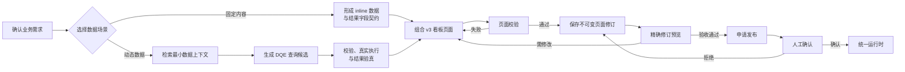

# 看板页面构建过程：从需求到人工确认发布

> 文档状态：Schema v3 当前流程
> 配套协议：[PAGE-METADATA.md](../PAGE-METADATA.md)
> 配套运行态：[dashboard-runtime-architecture.md](./dashboard-runtime-architecture.md)

## 1. 总体流程

页面搭建从业务需求开始，不从旧指标目录或现有组件清单反推需求。

## 2. 确认需求

最小需求输入包括：

| 输入 | 需要明确的内容 |
|---|---|
| 目标 | 页面要支持什么判断或决策 |
| 受众 | 谁使用、具有什么权限和背景 |
| 分析问题 | 当前值、趋势、对比、构成、排名、异常或明细 |
| 时间范围 | 分析周期、默认粒度和时区 |
| 数据时态 | 固定内容还是打开页面时动态查询 |
| 交互 | 是否需要筛选、页内联动或跨页下钻 |
| 验收标准 | 数据、性能、布局和交互达到什么条件 |

含义不清时必须先澄清，不允许 Agent 猜测字段、权限或查询语义。

## 3. 选择数据场景

### 3.1 `inline` 静态场景

选择条件：

- 数据与页面修订一起固化；
- 页面打开时不需要重新取数；
- 不需要筛选联动、组件 action 或远程分页；
- 适合固定报告、离线交付或说明性页面。

页面作者直接形成：

- 静态数据行；
- 完整结果字段契约；
- 使用稳定字段 id 的组件绑定。

`inline` 不需要数据上下文或数据网关。

### 3.2 DQE 动态场景

选择条件：

- 页面打开或筛选变化时需要重新查询；
- 已有受支持的 DQE 执行环境；
- 查询能够在当前身份下通过安全、权限和资源校验；
- 页面能显式声明结果字段契约和筛选绑定。

当前不虚构 SQL 执行协议。SQL 只有在外部端点和请求体正式确认后才能成为新的查询语言分支。

### 3.3 `mixed` 场景

同一页面可以同时包含固定说明数据和动态 DQE 数据。每个组件按实际绑定的数据源获得能力，不能用同页其他动态数据源为静态组件制造假交互。

## 4. 数据上下文与 Schema 元数据

DQE 查询生成前，Agent 通过 `search_data_context` 取得当前身份可使用的最小数据上下文：

- 执行环境；
- Schema、对象与字段；
- 字段类型、说明、别名、单位和角色；
- 关系、时间字段和粒度；
- 权限、安全和资源限制；
- 已验证问题—查询示例；
- 预期结果字段契约。

数据上下文不包含业务数据行。详细契约见 [schema-metadata.md](./schema-metadata.md)。

如果上下文不足：

1. 补充字段、关系、权限或执行限制；
2. 缩小需求范围；
3. 或改用可诚实表达的 `inline` 固定场景。

系统返回 `DATA_CONTEXT_ERROR`，不再登记指标缺口。

## 5. 生成并验真 DQE 查询

### 5.1 查询候选

查询候选必须：

- 只返回页面需要的字段和行数；
- 保持外部 DQE 协议原始结构；
- 把动态条件放在可受控绑定的维度或时间语义位置；
- 为公式输出声明稳定 alias；
- 不包含页面布局或组件逻辑。

### 5.2 校验与执行

候选依次通过：

| 层次 | 检查内容 | 失败处理 |
|---|---|---|
| 结构 | DQE 请求体可解析，`dsl_list` 形态合法 | 修正查询 |
| 安全 | 禁止操作、敏感字段和数据最小化要求 | 阻断 |
| 权限 | 当前身份可访问执行环境、对象和字段 | 阻断或申请权限 |
| 资源 | 超时、输出行列数和复杂度限制 | 缩小或拆分查询 |
| 执行 | 真实 DQE 服务成功返回 | 修正查询或执行环境 |
| 结果 | 字段、类型、角色、单位、空值和基数符合预期 | 修正查询或字段契约 |

真实业务数据只用于验真和预览，不进入 Schema 元数据或普通审计日志。

### 5.3 形成页面查询定义

验真通过后，页面数据源内嵌：

- `language: "dqe"`；
- 外部查询协议的原始 `body`；
- 完整结果字段契约；
- 页面字段 id 到 DQE 字段名的显式 `queryField`；
- 页面筛选器到 DQE 语义位置的 `filterBindings`。

页面不保存旧指标 code、目录推导规则或 `fieldOverrides`。

## 6. 组合看板页面

页面作者或 Agent：

1. 为每个分析问题选择匹配的受治理组件；
2. 用命名页面数据源承载数据；
3. 用组件数据槽复用同一页面数据源；
4. 用稳定页面字段 id 完成字段绑定；
5. 把展示格式写入组件字段绑定；
6. 只在动态 DQE 组件上声明 action；
7. 按决策优先级组织内容分区；
8. 只在目标页面和目标筛选器确实存在时声明跨页下钻。

组件不得携带查询、数据行、网络请求或任意代码。

## 7. 页面校验

`validate_page` 和 `pnpm validate` 执行同一组规则：

| 校验层 | 内容 |
|---|---|
| Schema | `schemaVersion: "3.0"`、结构、必填字段和未知属性 |
| 字段契约 | 类型、角色、单位、空值和静态数据行 |
| 查询映射 | DQE 输出、公式 alias 和 `queryField` 一一覆盖 |
| 引用 | 页面数据源、数据槽、组件字段、筛选器和目标页面 |
| 筛选绑定 | 筛选器类型、DQE 目标和显式映射 |
| 组件能力 | 数据形状、必填 props、action 和分页 |
| 治理 | 禁止脚本、HTML、表达式、自动同名和组件直连 |

校验失败返回稳定错误 code 和 JSON Pointer。Agent 必须修正文档，不得绕过校验器。

## 8. 保存页面修订

首次保存前：

1. 页面必须通过 v3 校验；
2. 页面 id 必须是可读且唯一的真实值；
3. 用户必须明确确认页面 id。

保存后形成不可变页面修订，记录：

- 完整 v3 页面文档；
- 创建人和创建时间；
- 基线修订；
- 内容哈希；
- `dataContextVersion`。

纯 `inline` 页面使用 `dataContextVersion: null`。包含 DQE 查询的页面记录创作时使用的数据上下文版本。

编辑既有页面必须从最新页面修订形成新的未保存页面文档，不原地修改历史修订。

## 9. 精确修订预览

预览必须绑定 `pageId + revisionId`：

1. 加载精确页面修订；
2. 执行 `inline` 或 DQE 页面数据源；
3. 形成数据快照；
4. 由纯渲染组件呈现；
5. 检查真实数据、空态、错误、排序、单位、性能、布局和交互。

发现问题时形成新的页面修订。预览成功不等于同意发布。

## 10. 人工确认发布

只有用户明确申请发布后：

1. 页面生命周期取得页面级发布租约；
2. 复验 v3 页面、DQE 执行权限和结果字段契约；
3. 发布者查看精确修订、真实预览和风险提示；
4. 发布者明确确认或拒绝；
5. 确认后前移当前已发布修订指针；
6. 所有结束路径释放发布租约。

Agent、保存动作、查询成功和预览链接都不能代替发布者。

## 11. MCP 能力

页面搭建使用：

| 类型 | 能力 |
|---|---|
| Prompt | `build_dashboard_page` |
| Resource | 页面 JSON Schema |
| Resource | 组件能力目录 |
| Resource | `inline` 最小示例 |
| Resource | DQE 最小示例 |
| Resource | 页面规则 |
| Resource | 数据上下文 Schema 与示例 |
| Tool | `search_data_context` |
| Tool | `search_templates` |
| Tool | `validate_page` |
| Tool | `save_page` |
| Tool | `list_pages` / `get_page` |
| Tool | `preview_page` |
| Tool | `request_publish` |

旧指标目录、指标候选、指标状态和指标缺口工具已经退出。

## 12. 失败与续接

| 阻断 | 处理 |
|---|---|
| 需求不清 | 补充或确认需求 |
| Schema 元数据不足 | 补充数据上下文或缩小范围 |
| DQE 查询不合法 | 修正查询候选 |
| 权限或安全失败 | 由数据所有方处理 |
| 执行或结果验真失败 | 修正查询和结果字段契约 |
| 页面契约不足 | 调整页面或登记平台能力缺口 |
| 业务验收失败 | 形成新的页面修订 |

系统可以保存结构化需求摘要和失败证据，但不保存未经授权的数据行或完整对话原文。

## 13. 关键不变式

1. 未确认需求不进入可保存页面；
2. `inline` 与 DQE `query` 是并列正式场景；
3. NL2DQE 只发生在创作期；
4. DQE 查询必须经过真实执行验真；
5. 页面完整声明结果字段契约；
6. 页面字段与 DQE 字段只通过 `queryField` 显式映射；
7. 筛选状态只通过 `filterBindings` 影响查询；
8. 组件只消费数据快照；
9. 页面修订不可变；
10. 人工确认发布是独立闸门。
