# 看板页面构建流程

本文描述看板页面从业务需求到发布修订的标准工作流。

相关规范：

- [看板页面协议](../PAGE-METADATA.md)
- [数据上下文 Schema 元数据](./schema-metadata.md)
- [统一运行时架构](./dashboard-runtime-architecture.md)

## 1. 流程

```mermaid
flowchart LR
    REQUIREMENT["定义页面需求"]
    MODE{"选择数据模式"}
    INLINE["准备 inline 数据"]
    CONTEXT["检索数据上下文"]
    QUERY["形成 DQE 查询"]
    VERIFY["执行与验真"]
    PAGE["组合看板页面"]
    VALIDATE["校验页面"]
    SAVE["保存页面修订"]
    PREVIEW["精确修订预览"]
    REQUEST["申请发布"]
    CONFIRM["人工确认"]
    PUBLISHED["发布修订"]

    REQUIREMENT --> MODE
    MODE -->|"静态"| INLINE
    MODE -->|"动态"| CONTEXT
    MODE -->|"组合"| INLINE
    MODE -->|"组合"| CONTEXT
    CONTEXT --> QUERY
    QUERY --> VERIFY
    INLINE --> PAGE
    VERIFY --> PAGE
    PAGE --> VALIDATE
    VALIDATE -->|"通过"| SAVE
    VALIDATE -->|"失败"| PAGE
    SAVE --> PREVIEW
    PREVIEW -->|"修改"| PAGE
    PREVIEW -->|"验收通过"| REQUEST
    REQUEST --> CONFIRM
    CONFIRM -->|"确认"| PUBLISHED
    CONFIRM -->|"拒绝"| SAVE
```



## 2. 定义页面需求

页面需求包含：

| 项目 | 内容 |
|---|---|
| 业务目标 | 页面支持的判断、分析或决策 |
| 使用者 | 受众、角色和数据权限 |
| 分析问题 | 当前值、趋势、对比、构成、排名、异常或明细 |
| 时间范围 | 分析周期、时区和默认粒度 |
| 数据模式 | 静态、动态或组合 |
| 交互 | 筛选、页内下钻和跨页下钻 |
| 验收标准 | 数据、布局、交互和性能条件 |

需求中的字段、口径、权限或时间语义不明确时，页面构建停留在需求状态，不生成猜测性查询。

## 3. 选择数据模式

### 3.1 静态数据

`inline` 适用于：

- 数据与页面修订保持一致；
- 页面访问时不需要重新查询；
- 页面不需要查询驱动的筛选或 action；
- 数据量适合直接保存在页面文档中。

输入：

- 业务数据行；
- 字段类型和角色；
- 标签、单位、可空性和展示格式。

输出：

- `inline` 页面数据源；
- 完整结果字段契约。

### 3.2 动态查询

DQE `query` 适用于：

- 页面访问或筛选变化时需要查询；
- 数据上下文包含所需对象、字段和关系；
- DQE 执行环境允许该查询；
- 查询结果可声明稳定字段契约。

输入：

- 业务问题；
- 数据上下文版本；
- DQE 执行环境；
- 字段、关系、安全和资源约束。

输出：

- DQE 查询定义；
- 结果字段契约；
- 查询字段映射；
- 可选筛选绑定。

### 3.3 组合页面

`mixed` 页面用于同一页面中的静态说明和动态分析。每个页面数据源独立声明来源和字段契约。

## 4. 检索数据上下文

页面搭建 Agent 调用 `search_data_context` 检索与业务问题相关的：

- 执行环境；
- Schema；
- 数据对象；
- 字段；
- 对象关系；
- 已验证查询。

检索遵循最小范围原则，只使用返回结果中明确存在的内容。

数据上下文不足时返回 `DATA_CONTEXT_ERROR`。处理方式：

- 补充 Schema 元数据；
- 获取所需权限；
- 缩小页面需求；
- 选择能够准确表达需求的静态数据。

## 5. 形成 DQE 查询

DQE 查询定义满足：

- `language` 为 `dqe`；
- `body.dsl_list` 包含一个查询项；
- 输出字段只覆盖页面需要的数据；
- 公式输出具有稳定别名；
- 动态维度和时间条件具有明确绑定位置；
- 查询满足执行环境的只读、安全、行列数和超时约束。

查询验证包括：

| 层次 | 内容 |
|---|---|
| 协议 | DQE 请求体结构和输出声明 |
| 安全 | 只读要求、敏感字段和数据最小化 |
| 权限 | 执行环境、对象和字段访问范围 |
| 资源 | 输出行列数、批量数和超时 |
| 执行 | DQE 服务返回成功结果 |
| 结果 | 字段名、类型、角色、单位、空值和基数 |

真实执行结果用于验证和预览，不写入 Schema 元数据。

## 6. 建立结果字段契约

每个页面数据源为输出声明：

- 稳定页面字段 id；
- `type`；
- `role`；
- 可选 `label`；
- 可选 `unit`；
- 可选 `nullable`；
- 可选 `defaultFormat`。

DQE 查询数据源同时为每个页面字段声明 `queryField`。

字段契约来自已确认的查询输出。页面组件只引用页面字段 id。

## 7. 组合页面

页面由以下内容组成：

1. `dataSources`：命名数据集；
2. `filters`：页面级筛选状态；
3. `sections`：内容分区；
4. `components`：受治理组件；
5. `data`：组件数据槽；
6. 字段绑定：组件对页面字段的引用；
7. action：页内筛选写入或跨页导航。

组件选择依据：

| 分析意图 | 组件 |
|---|---|
| 单值、变化、进度 | `metricCard` |
| 类别比较 | `barChart` |
| 时间趋势 | `lineChart` |
| 构成占比 | `pieChart` |
| 明细和多字段比较 | `table` |
| 地理分布 | `mapChart` |
| 排名 | `rankingCard` |
| 标题和说明 | `reportHeader`、`text` |

组件不包含查询定义、数据行或网络请求。

## 8. 校验页面

MCP 使用 `validate_page`。仓库文件使用：

```bash
pnpm validate
```

校验范围：

| 范围 | 内容 |
|---|---|
| 结构 | 版本、必填字段、允许属性和标识符 |
| 数据源 | 来源判别、字段契约和静态数据行 |
| 查询 | DQE 输出、公式别名和字段映射 |
| 筛选 | 声明、默认值和 DQE 绑定 |
| 引用 | 页面数据源、数据槽、字段和筛选器 |
| 组件 | 属性、字段角色、action 和分页 |
| 页面能力 | 静态页面、动态页面和混合页面约束 |

校验错误包含错误类型、JSON Pointer 路径和消息。页面文档在错误清零后进入保存步骤。

## 9. 保存页面修订

首次保存需要：

- 合法且唯一的页面 id；
- 页面 id 的用户确认；
- 通过页面校验；
- `baseRevisionId: null`；
- 幂等键。

编辑页面需要：

- 从 `get_page(selector=latest)` 取得最新修订；
- 使用该修订的 `revisionId` 作为 `baseRevisionId`；
- 保存完整页面文档；
- 使用幂等键。

保存成功产生不可变页面修订。查询页面记录 `dataContextVersion`，静态页面记录 `null`。

## 10. 精确修订预览

`preview_page` 使用 `pageId` 和 `revisionId` 生成精确修订预览。

预览检查：

- 页面标题和内容层级；
- 数据正确性和字段格式；
- 加载、空态和错误态；
- 筛选默认值和联动；
- 表格排序、筛选和分页；
- 页内下钻与跨页下钻；
- DQE 请求和响应；
- 页面性能。

预览中发现的问题通过新的页面修订处理。

## 11. 发布

`request_publish` 为最新页面修订创建发布请求。发布请求包含限时确认 URL，并持有页面级发布租约。

发布者可以：

- 确认发布；
- 拒绝发布；
- 取消发布请求；
- 在管理员权限下强制释放租约。

确认发布更新页面的发布修订引用。每个发布操作产生审计事件。

## 12. 页面搭建 MCP

| 类型 | 名称 | 用途 |
|---|---|---|
| Prompt | `build_dashboard_page` | 页面搭建工作流 |
| Tool | `search_data_context` | 检索数据上下文 |
| Tool | `search_templates` | 检索页面模板 |
| Tool | `validate_page` | 校验页面文档 |
| Tool | `save_page` | 保存页面修订 |
| Tool | `list_pages` | 列出页面 |
| Tool | `get_page` | 获取页面修订 |
| Tool | `preview_page` | 创建精确修订预览 |
| Tool | `request_publish` | 申请发布 |

Resources 提供页面 Schema、组件说明、页面示例、页面规则和当前数据上下文快照。

## 13. 失败状态

| 状态 | 处理 |
|---|---|
| 需求不完整 | 补充目标、字段、权限或验收条件 |
| `DATA_CONTEXT_ERROR` | 补充数据上下文或调整需求 |
| DQE 协议错误 | 修正查询定义 |
| DQE 执行错误 | 修正查询或执行环境 |
| 结果字段不一致 | 修正查询和字段契约 |
| 页面校验错误 | 按 JSON Pointer 修改页面文档 |
| 修订冲突 | 基于最新修订重新编辑 |
| 页面被发布租约锁定 | 完成或释放发布请求 |
| 预览不符合验收标准 | 保存新的页面修订 |
| 发布被拒绝 | 保留修订并根据原因处理 |

## 14. 交付物

完成的页面交付包含：

- 看板页面文档；
- 页面校验结果；
- 页面修订引用；
- 精确修订预览；
- DQE 查询执行证据（查询页面）；
- 数据上下文版本（查询页面）；
- 发布请求和审计记录（发布页面）。
