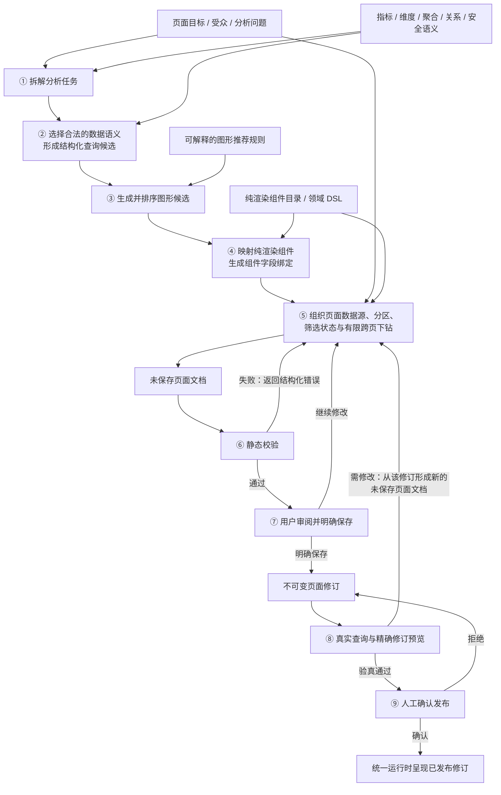
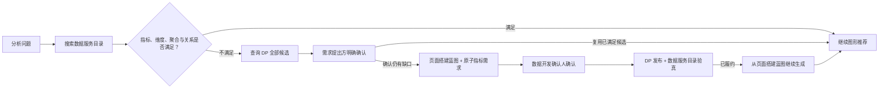

# 看板页面构建过程：从页面目标到人工确认发布

> 文档状态：下一阶段目标流程
> 编写日期：2026-07-30
> 关系说明：本文描述新设计下的看板页面构建过程，不按现有 Module 清单反推流程；领域术语遵循 [`CONTEXT.md`](../CONTEXT.md)。
> 范围说明：本文是新增文档，不修改或替代现有解决方案与 ADR。

## 1. 目标流程

下一阶段的看板页面构建不是“前端先搭页面，再逐个接数据”，也不是“AI 根据原始字段自由生成界面”。完整过程是一次发生在创作期的受治理编译：

```text
页面目标 / 受众 / 分析问题
        +
数据服务治理的指标、维度、聚合、关系与安全语义
        +
可解释的图形推荐规则
        +
受治理的纯渲染组件目录与领域 DSL
        ↓
未保存页面文档
        ↓ 静态校验
用户确认保存为页面修订
        ↓
真实查询与精确修订预览
        ↓
人工确认发布
        ↓
统一运行时呈现已发布修订
```

这条流程有三个不可交换的状态边界：

1. **先生成未保存页面文档，再做静态校验。** 此时可以反复调整，不产生页面修订。
2. **用户明确保存后，才产生不可变页面修订。** 真实查询和预览必须绑定这个精确页面修订。
3. **真实查询与精确修订预览通过后，才申请人工确认发布。** 预览本身不代表发布同意。

### 1.1 全景示意图

示意图省略页面修订和发布，只保留页面生成到运行的六个核心框。


关键关系：

- 数据服务既提供生成所需的数据语义，也为统一运行时提供真实数据；
- 知识准备把业务问题和推荐规则整理成生成输入；
- 生成结果经组件目录、领域 DSL 和静态校验后，形成看板页面聚合根；
- 统一运行时只负责取数和呈现，不重新生成页面结构。

## 2. 四类生成输入

四类输入缺一不可。页面模板和 AI 都只是改善生成效果的可选手段，不能替代其中任何一类。

### 2.1 页面目标、受众与分析问题

这一输入回答“为什么做、给谁看、需要回答什么”，约束整页叙事，而不是直接指定组件。

| 输入项 | 必须回答的问题 | 对页面生成的影响 |
|---|---|---|
| 页面目标 | 页面要支持什么业务决策或动作 | 决定页面主线和成功标准 |
| 受众 | 谁使用、具有什么业务背景和数据权限 | 决定信息密度、默认粒度和可见范围 |
| 分析问题 | 用户要判断当前值、趋势、对比、构成、排名、异常还是明细 | 决定分析任务及候选图形 |
| 时间范围 | 分析哪个周期，默认粒度是什么 | 决定时间筛选状态和趋势查询 |
| 决策优先级 | 哪些问题必须首先被回答 | 决定分区顺序、组件权重和页面层级 |

最小输入不是“给我销售额和区域”，而应接近：

> 面向区域经营负责人，判断本月销售是否达标、趋势是否异常、哪些区域贡献最大，并能下钻查看区域明细。

如果页面目标或关键分析问题仍有实质歧义，生成过程必须暂停确认；不能用图形推荐代替业务意图。

### 2.2 数据服务治理的数据语义

这里的“数据驱动”不是读取一批原始数据行后猜字段含义，而是消费数据服务治理的语义。

| 语义 | 需要的最小信息 | 生成阶段的用途 |
|---|---|---|
| 指标 | 稳定 code、业务定义、值类型、单位、默认聚合、可加性、默认时间维度 | 选择要回答问题的业务度量，约束格式和可比较性 |
| 维度 | 稳定 code、业务定义、语义角色、值类型、基数、层级、排序、可筛选性 | 选择切分角度，判断趋势、分类、地域或明细 |
| 聚合 | 每个指标允许的聚合及适用粒度 | 防止页面引用错误口径 |
| 关系 | 指标可使用哪些维度、合法关系路径、结果粒度和 fanout 风险 | 防止“目录中都存在，但不能一起查” |
| 安全语义 | 当前身份可见的指标/维度、行列权限和敏感字段限制 | 在生成候选之前缩小可用空间 |
| 质量语义 | 新鲜度、质量状态、未知或暂不可用能力 | 决定阻断、警告或降级 |

数据服务承担两种不同能力：

1. **创作期语义供给：** 提供当前用户有权使用的指标、维度、聚合、关系与安全语义，形成版本化元数据快照。
2. **预览和运行期取数：** 接收生效查询，施加数据权限并返回标准化数据行。

生成过程不得补写指标计算、绕过关系限制或扩大安全语义。未知能力必须显式阻断或要求确认，不能用“任意指标 × 任意维度 × 任意聚合均可用”的默认值代替。

### 2.3 可解释的图形推荐规则

图形推荐规则把“分析问题 + 数据形状”转换为排序后的图形候选。规则分为两层：

| 规则类型 | 回答的问题 | 示例 |
|---|---|---|
| 硬约束 | 这个图形能否正确表达当前任务与数据形状 | 趋势图必须有时间维度；地图必须有明确地域角色；不兼容单位不能自动共轴 |
| 软偏好 | 多个合法候选中哪个更适合当前受众和问题 | 低基数分类优先柱状图；精确核对优先表格；高层受众优先核心指标卡 |

每次推荐至少输出：

- 当前分析问题及被识别出的分析任务；
- 使用的指标、维度、聚合与结果形状；
- 通过的硬约束；
- 候选图形及排序分数；
- 入选原因；
- 其他候选被排除或降级的原因；
- 需要用户确认的软偏好。

AI 可以帮助识别分析任务、理解自然语言和组合候选，但不能更改硬约束。相同规则版本、元数据版本和输入应得到稳定的合法候选集。

### 2.4 纯渲染组件目录与领域 DSL

图形推荐得到的是“适合使用哪类图形”，纯渲染组件目录和领域 DSL 决定“平台允许如何表达和运行”。

纯渲染组件目录需要为每个组件声明：

- 组件类型和业务用途；
- 支持的分析任务；
- 所需数据槽、字段角色和数据形状；
- 必填 props 与组件字段绑定；
- 默认跨度、允许的交互和降级行为；
- 禁止使用的字段形状或数据规模。

领域 DSL 负责把候选编译成：

- 命名页面数据源；
- 结构化查询；
- 字段契约；
- 内容分区；
- 纯渲染组件及组件字段绑定；
- 筛选状态；
- 有限且目标明确的跨页下钻。

页面文档只能引用组件目录中已登记的纯渲染组件，不携带组件代码、任意脚本、HTML、CSS 或查询字符串。组件只消费数据快照，不直接访问数据服务。

## 3. 从四类输入到未保存页面文档



### 3.1 拆解分析任务

生成过程把每个分析问题拆成一个或多个可执行任务，例如：

| 分析问题 | 分析任务 |
|---|---|
| 本月销售是否达标 | 当前值 + 目标对比 |
| 最近十二周走势是否异常 | 时间趋势 |
| 哪些区域贡献最大 | 分类对比 + 排名 |
| 某区域为什么下降 | 维度切分 + 明细入口 |

分析任务是生成过程中的结构化中间结果，不是新的平台资产。它只用于将业务目标连接到结构化查询和图形推荐。

### 3.2 选择合法的数据语义

对每个分析任务：

1. 从当前权限范围内搜索候选指标；
2. 选择合法维度和聚合；
3. 验证指标—维度—聚合兼容关系；
4. 检查关系路径、粒度、单位和安全语义；
5. 形成命名页面数据源及结构化查询候选；
6. 记录使用的元数据快照版本。

如果必需指标不存在，或所需维度/聚合不被支持，进入指标缺口分支，不能在页面中临时定义计算逻辑。

### 3.3 推荐图形

推荐 Module 对每个“分析任务 + 结构化查询候选”执行：

```text
硬约束过滤
    ↓
得到合法图形候选
    ↓
按受众、问题、基数、单位和页面上下文应用软偏好
    ↓
输出排序候选与解释
```

推荐 Module 不直接生成页面代码，也不决定发布。它只负责把一个分析任务映射为可解释的合法图形候选。

### 3.4 映射纯渲染组件

每个入选图形必须在组件目录中找到对应的纯渲染组件，并完成：

- 页面数据源到组件数据槽的绑定；
- 指标、维度字段到组件字段的绑定；
- 展示格式写入组件字段绑定；
- 默认跨度和必要 props 的补全；
- 允许交互到筛选状态或跨页下钻的声明。

如果没有受治理组件能够承载候选图形，该候选必须被拒绝或降级到已登记组件，不能现场生成新组件代码。

### 3.5 组织整页

整页组织由页面目标和分析问题优先级驱动：

1. 首屏先回答最重要的决策问题；
2. 当前值、趋势、原因、明细形成由总到分的阅读顺序；
3. 多个组件复用同一数据需求时使用命名页面数据源，不在组件中重复查询；
4. 页面级条件进入筛选状态；
5. 只有目标看板页面和目标筛选器明确存在时，才声明跨页下钻；
6. 页面模板可提供布局起点，但不能覆盖当前目标和语义校验。

完成后只产生**未保存页面文档**及其生成解释，不自动形成页面修订。

## 4. 未保存页面文档到发布

### 4.1 静态校验

未保存页面文档必须依次通过：

| 校验层 | 校验内容 | 失败结果 |
|---|---|---|
| Schema 校验 | 页面结构、必填字段、类型和 `schemaVersion` | 返回精确路径和结构错误 |
| 引用校验 | 页面数据源、数据槽、组件字段绑定、筛选器和跨页下钻引用 | 返回缺失或悬空引用 |
| 组件能力校验 | 组件类型、数据形状、必填 props 和允许交互 | 返回不受支持的组件用法 |
| 数据语义校验 | 指标/维度存在性、聚合、兼容关系、粒度、单位和安全语义 | 返回不可用组合或权限阻断 |
| 治理校验 | 禁止脚本、任意代码、组件直连数据服务和页面层计算旁路 | 拒绝保存 |

此时不把页面当成已经保存的资产，也不以模型自评替代校验器。

### 4.2 用户审阅与明确保存

静态校验通过后，用户审阅：

- 页面是否回答目标分析问题；
- 受众看到的信息密度和顺序是否合适；
- 指标、时间范围、维度和聚合是否符合业务预期；
- 每个图形的推荐理由是否可接受；
- 是否存在降级、警告或未履约依赖。

用户可以继续修改未保存页面文档。只有用户执行明确保存动作后，页面生命周期 Module 才：

1. 再次校验页面文档；
2. 检查 baseRevisionId 和并发条件；
3. 固化所用元数据快照版本；
4. 形成新的、不可变的页面修订。

### 4.3 真实查询与精确修订预览

页面修订产生后，统一运行时读取该精确页面修订：

1. 解析页面数据源；
2. 将结构化查询与当前筛选状态合成为生效查询；
3. 经数据网关调用数据服务；
4. 由数据服务施加安全语义并返回数据行；
5. 统一运行时形成数据快照；
6. 纯渲染组件呈现真实结果；
7. 用户检查空结果、基数、排序、单位、耗时、可读性和交互。

精确修订预览必须绑定 `pageId + revisionId`，不能预览“当前可能继续变化的草稿”。

如果真实结果不适合展示，不修改既有页面修订。系统从该修订形成新的未保存页面文档，修改后再次保存为下一页面修订，并重新执行真实查询与精确修订预览。

### 4.4 人工确认发布

只有真实查询与精确修订预览完成后，页面搭建者才为当前最新页面修订申请发布：

1. 页面生命周期 Module 取得发布租约；
2. 按当前数据服务目录重新校验页面修订，识别保存后发生的目录漂移；
3. 发布者查看精确修订、真实预览、生成解释和未履约依赖；
4. 发布者明确确认或拒绝；
5. 确认后，该精确页面修订成为已发布修订；
6. 统一运行时继续确定性消费该页面修订，不在打开时重新生成结构。

模型、Agent、预览链接、页面搭建者的保存动作都不能代替发布者的人工确认。

## 5. 创作期生成 Module

四类输入应收敛到一个深 Module，而不是由页面创作工作台分别调用若干浅规则和模型工具。

### 5.1 Interface

```text
compile({
  goal,
  audience,
  analysisQuestions,
  catalogSnapshot,
  recommendationRules,
  componentCatalog,
  optionalBasePage
})
  → {
      document,
      explanation,
      confirmations,
      blockers
    }
```

Interface 的语义：

- `document`：未保存页面文档，不是页面修订；
- `explanation`：任务拆解、语义选择、图形候选、入选和淘汰原因；
- `confirmations`：只有业务用户能回答的实质歧义；
- `blockers`：指标缺口、兼容关系未知、权限不足或无合法组件。

### 5.2 Implementation

Implementation 可以包含：

- 分析任务拆解；
- 数据语义候选检索；
- 硬约束过滤；
- 软偏好排序；
- 页面模板匹配；
- 页面数据源复用；
- 自动网格和分区组织；
- AI 对自然语言的理解和候选组合。

页面创作工作台只依赖 `compile` Interface。规则引擎、模型提供方或布局算法变化被限制在该 Module 内，获得 Locality；同一 Interface 可供页面创作工作台、MCP 和回归测试复用，获得 Leverage。

模型提供方是可选 Adapter。没有模型时，规则和页面模板 Implementation 仍应能生成受限场景，或返回需要用户补充的信息。

## 6. 服务与 Module 如何支撑主流程

| 流程阶段 | 依赖 | 提供的能力 | 输入 | 输出 |
|---|---|---|---|---|
| 身份建立 | 身份与权限体系 | 用户、租户、角色和能力上下文 | 登录态 | 有权使用的创作会话 |
| 目标输入 | 页面创作工作台；模型提供方可选 | 录入或理解页面目标、受众和分析问题 | 自然语言 / 结构化表单 | 已确认的生成输入 |
| 数据语义供给 | 数据服务；目录发现 Module | 指标、维度、聚合、关系、安全和质量语义 | 当前身份与搜索条件 | 版本化元数据快照 |
| 页面生成 | 创作期生成 Module | 任务拆解、语义选择、图形推荐、组件映射和整页组织 | 四类生成输入 | 未保存页面文档及解释 |
| 静态校验 | 看板页面领域 Module | Schema、引用、组件能力、数据语义和治理校验 | 未保存页面文档 + 元数据快照 | 结构化错误或通过 |
| 用户保存 | 页面生命周期 Module | 幂等保存、并发控制、不可变页面修订 | 已确认页面文档 | 精确页面修订 |
| 真实查询 | 统一运行时 + 数据网关 + 数据服务 | 生效查询、权限施加和标准化数据行 | 精确页面修订 + 筛选状态 | 数据快照 |
| 精确修订预览 | PageRepository + 统一运行时 + 纯渲染组件 | 按精确修订呈现真实页面 | `pageId + revisionId` | 可审查预览 |
| 人工发布 | 页面生命周期 Module | 发布租约、当前目录复验、确认/拒绝和审计 | 当前最新页面修订 | 已发布修订或拒绝原因 |
| 生产呈现 | PageRepository + 统一运行时 | 读取已发布修订并确定性渲染 | `pageId` | 可访问看板页面 |

### 6.1 关键 Seam 和 Adapter

| Seam | Interface | Adapter | 作用 |
|---|---|---|---|
| 目录发现 ↔ 数据服务 | `CatalogProvider.current()` | 数据服务目录 Adapter；版本化元数据快照 Adapter | 把远程协议和目录版本变化隔离在语义供给侧 |
| 统一运行时 ↔ 数据服务 | `DataGateway.fetchData/fetchDimensionValues` | 数据服务 Adapter；开发期 mock Adapter | 组件和页面生成不感知数据服务协议 |
| 统一运行时 ↔ 页面来源 | `PageRepository.load/list` | 静态文件 Adapter；平台 Adapter | 运行时不感知页面存储方式 |
| Agent ↔ MetricCanvas | MCP tools | 进程内 MCP；未来远程 Adapter | Agent 只能通过受治理动作参与流程 |
| 页面创作工作台 ↔ 生成策略 | `compile(...)` | 规则/模板 Implementation；规则/模板/AI Implementation | 隔离生成算法变化，保持主流程稳定 |

## 7. 指标缺口如何进入流程

指标缺口发生在“选择合法的数据语义”阶段，而不是在页面发布后补救。



约束：

- Agent 不能自动选择 DP 候选；
- 用户确认后才登记原子指标需求；
- 只有被指定且具备 `metric_reviewer` 能力的数据开发确认人可以完成数据开发确认；
- DP 的 `published` 状态不等于已履约；
- 必须由当前数据服务目录验证最终指标 code 以及所需维度和聚合；
- 页面搭建蓝图只用于指标缺口后的暂停与续接，不是通用未保存页面文档。

## 8. 角色协作

| 角色或职责 | 参与阶段 | 必须作出的贡献或决定 |
|---|---|---|
| 需求提出方 | 目标输入、歧义确认、指标缺口、保存前审阅 | 明确页面目标、受众和分析问题；确认业务含义、指标复用/新增及可接受降级 |
| 页面搭建者 | 全部创作期阶段 | 检查生成解释，修改未保存页面文档，明确保存并在预览后申请发布 |
| 数据服务维护团队 | 数据语义供给、真实查询 | 治理指标、维度、聚合、关系和安全语义；保证目录与查询一致 |
| 图形规则维护职责 | 图形推荐 | 维护硬约束、软偏好、解释模板和回归样例，不通过规则改写数据语义 |
| 纯渲染组件维护职责 | 组件目录与领域 DSL | 维护组件能力、数据形状、默认值和允许交互；组件不自行取数 |
| 数据开发确认人 | 指标缺口分支 | 确认原子指标需求可实现性，退回结构化原因，关联稳定 DP 指标 ID |
| 发布者 | 人工发布 | 审查精确页面修订、真实预览、生成解释和未履约依赖，确认或拒绝 |
| 管理员 | 页面模板与异常治理 | 治理页面模板，处理发布租约异常；不能替代 `metric_reviewer` |

Agent 不是责任角色。它只是在创作期生成 Module 或 MCP 后面的自动化参与者，不能替代需求提出方、数据开发确认人或发布者作出确认。

## 9. 关键不变式

1. 没有页面目标、受众和分析问题，不生成完整业务看板页面；最多返回探索候选。
2. 指标、维度、聚合、关系和安全语义全部来自数据服务，不由页面或 AI 补写。
3. 图形推荐规则必须可解释；硬约束与软偏好分离。
4. 只有组件目录中登记的纯渲染组件可以进入页面文档。
5. 生成结果先是未保存页面文档，不能被称为页面修订。
6. 静态校验通过不等于真实数据适合展示。
7. 用户明确保存后才形成页面修订；页面修订不可变。
8. 真实查询和预览必须绑定精确页面修订。
9. 预览失败后的修改必须形成下一页面修订，不能原地改写。
10. 人工确认发布是独立闸门，模型、Agent 和预览不能代替。
11. 已发布页面结构只随新的页面修订和发布动作变化，统一运行时不在打开时重新生成。
12. 纯渲染组件不访问数据服务，所有取数都经过统一运行时和数据网关。

## 10. 当前基础与下一阶段新增

| 流程能力 | 当前基础 | 下一阶段需要完成 |
|---|---|---|
| 页面目标输入 | 页面创作工作台与 Agent 对话 | 结构化目标、受众、分析问题和歧义确认 |
| 数据语义 | 元数据快照已有指标、维度和部分兼容能力 | 数据服务真实供给聚合、关系、安全、角色、基数和质量语义 |
| 图形推荐 | 组件目录已有自然语言用途说明 | 机器可判定的硬约束、软偏好、排序和解释 |
| 组件与领域 DSL | 纯渲染组件、页面数据源、结构化查询和组件字段绑定已存在 | 把组件能力目录完整纳入生成输入 |
| 页面生成 | Agent 提示词可组合页面 | 建立统一的创作期生成 Module 与 `compile` Interface |
| 静态校验 | Schema、引用和当前元数据校验已存在 | 扩展关系、安全、单位和结果形状相关校验 |
| 保存与页面修订 | 页面生命周期已存在 | 记录生成使用的规则与元数据版本 |
| 真实查询与精确修订预览 | 统一运行时、数据网关和精确修订预览已存在 | 将真实预览明确设为申请发布前的必经步骤 |
| 人工确认发布 | 发布租约、确认/拒绝、复验和审计已存在 | 在发布审查中展示生成解释和未履约依赖 |

下一阶段的核心不是再增加一条独立页面协议，而是把前四类输入稳定地编译为现有领域 DSL，再复用现有页面修订、真实预览、发布租约和统一运行时。
