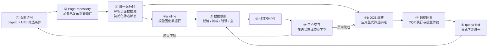

# 看板页面运行态架构

> 文档状态：Schema v3 当前架构
> 配套流程：[dashboard-page-building-process.md](./dashboard-page-building-process.md)
> 范围：页面访问、取数、数据快照、渲染与交互

## 1. 运行态主流程



关键关系：

- 普通访问只加载当前已发布页面修订；
- `inline` 与 DQE `query` 都使用页面声明的结果字段契约；
- `inline` 不调用数据网关；
- DQE 查询定义由页面内嵌，统一运行时不生成或改写查询；
- 筛选状态只通过 `filterBindings` 进入 DQE 语义位置；
- 外部响应只通过 `queryField` 归一为稳定页面字段 id；
- 组件不感知数据来源和查询过程。

## 2. 主要职责

| 部分 | 运行态职责 |
|---|---|
| 应用壳 | 解析路由，完成身份与页面访问权限检查 |
| PageRepository | 按 `pageId` 返回当前已发布页面修订 |
| 统一运行时 | 解析页面数据源、初始化筛选状态、实例化组件和处理交互 |
| `inline` 解析 | 校验固化数据行并同步形成终态数据快照 |
| DQE 编排 | 形成生效查询，负责去重、并发、取消和竞态控制 |
| 数据网关 | 执行 DQE、透明批量、分发结果和归一字段 |
| DQE 适配器 | 原样提交外部请求体并处理外部协议错误 |
| 纯渲染组件 | 消费数据快照和展示 props，通过事件上抛交互 |

Schema 元数据和数据上下文不属于运行态依赖。

## 3. 页面数据源

### 3.1 `inline`

1. 读取页面声明的结果字段契约；
2. 校验每行键集合、标量类型和空值；
3. 同步形成 ready 或 empty 数据快照；
4. 分发给绑定该页面数据源的组件。

纯 `inline` 页面没有筛选重查、组件 action 或远程分页。

### 3.2 DQE `query`

1. 读取内嵌 DQE 查询定义；
2. 读取完整结果字段契约和 `queryField`；
3. 根据 `filterBindings` 选择相关筛选状态；
4. 形成 DQE 生效查询；
5. 经数据网关执行；
6. 将 DQE 响应键显式归一为页面字段 id；
7. 校验返回值与结果字段契约；
8. 形成数据快照。

页面字段 id 与 DQE 字段名永不隐式同名匹配。

### 3.3 `mixed`

同一页面的 `inline` 和 DQE `query` 页面数据源独立形成数据快照。能力按组件实际绑定来源推导：

- 只绑定 `inline` 的组件保持静态；
- 绑定 DQE `query` 的组件可以响应已绑定筛选器；
- 同一组件可以通过不同命名数据槽消费多个页面数据源；
- 一个页面数据源失败不阻断无依赖的其他页面数据源。

## 4. DQE 调度与批量

一个 DQE `query` 页面数据源表示一个命名数据集，其 `body.dsl_list` 恰好包含一个查询项。

数据网关可以把同一调度窗口内的多个逻辑查询合并为一个外部批量请求：

```text
页面数据源 A ─┐
页面数据源 B ─┼→ 合并 dsl_list → DQE → results 按位置拆分
页面数据源 C ─┘
```

规则：

- 不改写每个原始查询项；
- 保持逻辑查询提交顺序；
- `dsl_list[i]` 与 `results[i]` 必须稳定对应；
- 失败项也必须占据对应位置；
- 返回项数量不一致时拒绝整批结果；
- 页面和组件不感知物理批次；
- 运行时并发上限约束逻辑查询窗口，而不是页面 Schema。

## 5. 筛选与交互

### 5.1 初始化

1. 从页面声明创建筛选状态；
2. 恢复 URL 中允许携带的筛选条件；
3. 用页面默认值补齐；
4. 只为绑定相关筛选器的 DQE 页面数据源形成查询。

### 5.2 页内联动

1. 筛选器或组件 action 写入页面筛选状态；
2. 运行时找出声明对应 `filterBindings` 的页面数据源；
3. 取消其过期请求；
4. 形成新的生效查询；
5. 新数据快照到达后更新对应组件。

组件之间不直接连线。

### 5.3 跨页下钻

跨页 action 把允许的筛选条件写入目标 URL。目标页面重新执行首次加载流程，不复用来源页面的组件状态。

## 6. 数据快照

数据快照是统一运行时向组件分发的数据包：

| 状态 | 含义 |
|---|---|
| `loading` | DQE 查询进行中 |
| `ready` | 已取得至少一行合法数据 |
| `empty` | 查询成功但没有数据行，或 `inline` 行数组为空 |
| `error` | 页面数据源校验、协议或执行失败 |

组件不自行维护这些状态。统一运行时负责一致的加载、空态和错误反馈。

## 7. 错误处理

| 情形 | 行为 |
|---|---|
| 页面不存在或无权限 | 应用壳显示不可访问状态 |
| 页面不是 v3 | 阻止渲染并报告 `SCHEMA_ERROR` |
| `inline` 数据行不符合契约 | 对应页面数据源进入 error |
| DQE 输出映射缺失或重复 | 请求前阻断并报告 `QUERY_MAPPING_ERROR` |
| 筛选绑定悬空 | 请求前阻断并报告 `FILTER_BINDING_ERROR` |
| DQE 查询失败或超时 | 对应页面数据源进入 error |
| DQE 批量结果错位 | 拒绝整批并报告 `DQE_PROTOCOL_ERROR` |
| 查询结果为空 | 对应页面数据源进入 empty |
| 部分页面数据源失败 | 只影响绑定该来源的组件 |

运行时不使用旧数据伪装成功，也不从返回行猜测字段契约。

## 8. 缓存、取消与竞态

- 生效查询的确定性内容作为去重和缓存键；
- 筛选状态变化后取消可取消的过期请求；
- 不可取消请求返回时，通过请求代次丢弃过期结果；
- `inline` 页面数据源不进入远程缓存；
- 页面修订变化天然形成新的缓存边界；
- 缓存不能绕过当前身份、权限或 DQE 执行限制。

## 9. 已挂起的数据源依赖

“上游页面数据源结果成为下游页面数据源输入”的集合式级联场景已经确认需要支持，但输入绑定语义尚未确定。

统一 `in` 筛选不能覆盖实际 SQL/DQE 输入选择方式，因此当前运行态：

- 不实现数据源依赖调度；
- 不向页面 Schema 暴露临时表达式；
- 不把组件局部视图当作下游查询输入；
- 不允许通过字符串模板拼装查询。

已确认边界和恢复设计时的未决项见 [ADR-0015](./adr/0015-defer-cascading-data-source-input-semantics.md)。

## 10. 运行态不变式

1. 普通访问只消费已发布页面修订；
2. 只接受 `schemaVersion: "3.0"`；
3. `inline` 与 DQE `query` 都使用显式结果字段契约；
4. 统一运行时不执行 NL2DQE；
5. 筛选状态只通过显式筛选绑定影响查询；
6. DQE 响应只通过 `queryField` 归一；
7. 所有远程取数都经过数据网关；
8. DQE 批量是传输优化，不是页面概念；
9. 纯渲染组件不发请求、不访问全局状态、不管理数据状态；
10. 页面或查询定义变化必须形成新页面修订并重新发布。
