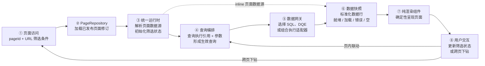

# 看板页面运行态架构

> 文档状态：新版本目标架构
> 编写日期：2026-07-30
> 关系说明：本文按 ADR-0014 描述已发布看板页面的运行态；领域术语遵循 [`CONTEXT.md`](../CONTEXT.md)。
> 配套流程：页面从需求到上线的过程见 [`dashboard-page-building-process.md`](./dashboard-page-building-process.md)。
> 范围说明：只描述页面访问、取数、渲染和交互，不包含 NL2SQL/NL2DQE、查询验真、页面保存与发布。

## 1. 运行态主流程

运行态读取已经发布的页面修订，执行其绑定的精确查询修订，并把数据快照交给纯渲染组件。运行态不重新生成查询，也不改变页面结构。

### 1.1 全景示意图

关键关系：

- 普通访问只加载当前已发布页面修订；精确修订预览属于创作期流程；
- 页面修订通过查询执行引用绑定精确查询修订，不引用可漂移的“最新查询”；
- 查询编排只把筛选状态绑定到参数契约，不修改 SQL 或 DQE；
- 数据网关统一调度 SQL、DQE 和组合执行适配器，组件不感知查询来源；
- inline 页面数据源不经过远程查询，直接形成终态数据快照；
- 用户交互只更新筛选状态或触发跨页下钻，不直接调用查询执行环境。

## 2. 主要职责

| 部分 | 运行态职责 |
|---|---|
| 应用壳 | 解析路由、完成身份与页面访问权限检查 |
| PageRepository | 按 `pageId` 返回当前已发布页面修订 |
| 统一运行时 | 解析页面数据源、初始化筛选状态、实例化组件并处理交互 |
| 查询编排 | 合成生效查询，负责去重、缓存、并发、取消和竞态控制 |
| 数据网关 | 校验查询执行引用和参数，选择执行适配器并返回标准化数据行 |
| SQL/DQE/组合执行适配器 | 执行精确查询修订，施加对应权限与资源限制 |
| 纯渲染组件 | 根据数据快照、结果字段契约和展示 props 呈现内容，通过事件上抛交互 |

## 3. 两类运行循环

### 3.1 首次加载

1. 应用壳根据 `pageId` 检查访问权限；
2. PageRepository 加载当前已发布页面修订；
3. 统一运行时恢复 URL 中的筛选条件，并使用页面默认值补齐；
4. query 页面数据源形成生效查询，经数据网关执行；
5. inline 页面数据源直接形成终态数据快照；
6. 纯渲染组件消费数据快照并呈现页面。

### 3.2 交互更新

1. 筛选器或组件 action 写入筛选状态；
2. 只有绑定了相关参数的页面数据源重新形成生效查询；
3. 查询编排取消过期请求，并复用可命中的缓存或去重结果；
4. 新数据快照到达后，对应组件更新；
5. 跨页下钻把允许的筛选条件写入目标 URL，由目标页面重新走首次加载流程。

## 4. 错误与状态

| 情形 | 运行态行为 |
|---|---|
| 页面不存在或无权限 | 应用壳显示明确的不可访问状态 |
| 页面修订或引用损坏 | 阻止渲染并报告页面资产错误 |
| 查询加载中 | 数据快照进入加载状态，组件区域显示统一加载反馈 |
| 查询失败或超时 | 数据快照进入错误状态，不用旧数据伪装成功 |
| 查询结果为空 | 数据快照进入空状态，页面结构保持可见 |
| 部分页面数据源失败 | 只影响绑定该数据源的组件，其余组件继续工作 |

## 5. 运行态不变式

1. 普通页面访问只消费已发布页面修订。
2. 统一运行时不执行 NL2SQL/NL2DQE，不生成或改写查询修订。
3. 页面修订和查询修订必须通过精确引用绑定。
4. 筛选状态只能通过参数契约影响查询。
5. 所有远程取数都经过数据网关。
6. 组合查询在服务端执行，中间结果不进入浏览器。
7. 纯渲染组件不发请求、不访问全局状态、不管理加载态。
8. 页面或查询定义发生变化时，必须回到创作期形成新修订并重新发布。
