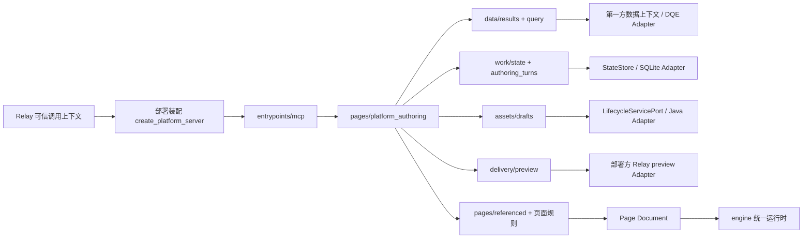

# MetricCanvas 架构检视与代码规模

> 本文记录修改前的审计快照。第 1、2、3 项已在后续修改中处理，当前交付与验收见[退役验收记录](../2026-09-22-authoring-retirement/README.md)。原关系复现脚本引用当时的旧模块，仅用于保留修改前证据；当前复现请使用退役记录中的现行命令。

检视日期：2026-09-22。对象是当前工作区（包含已有未提交修改），不是仅 HEAD；HEAD 为 `0864ff572adefe4c3cb18e606347de2aea67d7ed`。计数时间和逐文件 SHA-256 见 [inventory.json](inventory.json)。检视期间其他工作仍在更新测试文件，测试运行与计数是分别记录的时间点，不宣称工作区原子快照。

结论：业务模块划分总体合理，创作期与渲染期已分离，HTTP/SQLite 实现没有通过 Python import 泄漏到业务模块；但不能声称内部系统变化完全局部化。现状仍包含一条可运行的旧保存入口、一组未被生产入口消费的旧编排、Java/Lab 原始字段在业务层的解析，以及尚未交付的 Relay 生产装配。最需要处理的是迁移收口和接入接口，而不是按目录大小全面拆包。

本次只新增审计材料，没有删除源码、改协议或重生成其他任务的锁文件。静态检查覆盖全部 Python 源文件的导入图、入口可达性、全仓引用和重复内容；动态检查覆盖现有 Python 全量清单、三组 TypeScript 隔离/契约测试与关系丢失复现。未对全部前端组件做逐函数正确性审查，也未访问真实 Relay/Java 部署。

## 1. 当前实际调用路径

此图是接口调用关系，Relay 左端与 preview 右端仍需部署方实现，不能解释为已经上线。

- 平台现行工具面：九个 MCP 工具。`query_data` 获取授权证据；`compose_page/edit_page` 消费结果引用、更新工作稿并在内部保存草稿；`page_metadata_emit_preview` 交付精确产物，不再次保存。
- 普通问数 Relay 面：`METRICCANVAS_TOOL_SURFACE=relay` 使用 `discover_data_context + compose_page`，产物不自动保存。
- 兼容默认面：未设置上述变量时选择 `compatibility`，仍有执行并保存的 `build_page`。
- `metriccanvas-content`、`metriccanvas-lifecycle` 也仍是 pyproject 注册的 console script。旧统一平台入口已删除不代表这些所有兼容入口均已删除。

## 2. 需要优先处理的发现

### A1 · 高：关系能力留在旧编排，现行平台路径没有接上

证据：`pages/referenced.py:65` 调用 `block_component(block, sources, pattern)`，没有传入 relations；`pages/composition/page_structure.py:80` 的默认值是空元组；`pages/components/section_presentation.py` 要求同比/环比的 evidenceRef 匹配可信关系。旧 `structure_composition.py` 会调用 `load_relations`，现行 `QueryResults` 与 `pages/referenced` 没有相应交付链。

使用仓库现有 presentation_plan 与本地依赖实际复现：旧 compose_structure 返回 changed；把同样已执行的数据源与章节送入现行 compose，三个指标卡均返回 STRUCTURE_CHANGE_RELATION_UNVERIFIED，整体 failed。见 [复现代码](reproduce-relations.py) 与 [结果](relations-result.json)。这是带可信同比/环比关系的指标摘要场景，不能泛化成所有指标卡失败。

后果：`test_structure_current.py` 的绿色不能证明现行 MCP 工具具备相同能力。先决定并迁移关系授权、结果记录和消费链，再删除旧编排；验收必须通过现行 query→compose/edit 接口。

### A2 · 高：旧 Java 强保存链不是死代码，默认兼容入口仍可触发

证据链：`pyproject.toml` 注册 metriccanvas-authoring → `bootstrap/compatibility.py:29` → `environment.configure_tool_surface`（默认 compatibility）→ `entrypoints/compat/fastmcp.py:232` / `:352` → `ask/build_page.py:103` → `JavaPageAssetPort.save_revision`。

它仍按 `/pages/{pageId}/revisions` 和旧幂等键协议保存，并向模型声明同请求重试安全。现行平台使用 KnownLifecycleHttp 的资源型 POST/PUT、单次发送和未知结果停止。两者语义不相同。仓内 Relay JSON 显式设 relay，因此该配置本身不触发旧保存；风险在默认 CLI 或旧消费者。

建议先确认外部普通问数消费者，取消默认暴露的旧写能力，然后成组退役 build_page 保存用例、旧 PageAssetPort/JavaPageAssetPort、java_save_fingerprint 和专属测试。不能只删 fingerprint 或 HTTP 文件，也不能将当前 build_page 描述成纯临时页面态。

### A3 · 高：有可注入工厂，没有完整的生产 stdio 装配

`bootstrap/platform.py:27` 的 create_production_platform_server 仅创建 DataContext 与 DQE 依赖。current_turns、StateStore、analysis_authorization、lifecycle_service、lifecycle_identities、relay_preview、参数程序及可信源描述均没有在该函数中配置。平台工厂接受这些参数，但运行 console script 不会自动获得 Python 对象。

当前独立进程能公布工具，真正执行时会明确拒绝缺失能力；这是合理的失败策略，但不是可用的生产接线。`relay/mcp_configs/metriccanvas-authoring.json` 是普通问数 Relay 面的示例，不是九工具平台启动配置。必须提供部署入口及上下文传输实现，在 stdio 子进程内把可信调用信息转换成各 Port，再调用 create_platform_server；单纯增加环境变量或把 command 改名不够。

### A4 · 中高：Java/Lab 元数据形状已进入 data 业务模块

`data/semantic_catalog.py:20` 的 metric_card 和 discover 直接理解 `workspace_id`、`logical_schema.field_schema.metrics`、`calculate_conf`、JSON 字符串 description、column_id 等提供方字段。`JavaDatasetMetadataProvider` 大体转交原始 model，而非一份稳定的内部指标描述。

因此 HTTP URL、headers、retCode 修改通常可限于 Adapter；但提供方指标结构改名会同时影响 Adapter 和 SemanticCatalog。bootstrap 还用 isinstance(JavaDatasetMetadataProvider) 决定自动装配目录，其他提供方必须显式传 semantic_catalog。

建议让提供方 Adapter 输出稳定的内部 MetricDefinition（身份、定义、单位、维度、执行定义、冲突证据），领域层只做投影与业务判断。SemanticCatalogPort/MetadataPort 明确化，避免外部原始 JSON 成为事实上的 Interface。

### A5 · 中高：身份隔离在接口上可做，默认装配未统一

Java 元数据与保存使用 LifecycleIdentity(actor_id, workspace_id, token)；DQE 默认由 `environment.py:160` 构造 EnvIdentityPort，并在构造时固定 workspace_id。configure_dqe 不接受 identities 注入参数，需部署代码自行构造 DqeHttpExecutionPort。

因此只换 Java 身份提供方不能保证 DQE 同步按本轮用户访问。接线应将同一可信 binding 映射到两种现有身份接口，按调用隔离用户与空间；不能在共享进程里轮流改环境变量。所需改动主要在 Adapter/装配层，但现状尚没有一份贯穿所有依赖的生产实现。

### A6 · 中：页面装配/呈现有一个静态导入环

AST 检出 `page_structure ↔ section_presentation ↔ structure_presentation` 同一强连通分量。部分 import 放在函数内，因此不等价于运行时 ImportError；问题是错误类型、字段解析、契约和呈现互相拥有。

建议把 StructureError、field_id 与呈现读取的契约事实放到明确归属的低层页面规则模块，使装配调用呈现，呈现不反向 import 装配。没有必要为此引入通用 utils。

### A7 · 中：装配仍静态依赖兼容工具面，接入接口部分靠 duck typing

`bootstrap/environment.py` 只为 ToolSurface 类型 import compat.fastmcp，但该模块进一步加载 build_page 与旧保存依赖。故现行启动图仍会加载兼容代码；不是运行时 fallback，也不意味着平台调用旧保存，但增加删除与安装隔离的成本。

current_turns 与 StateStore 有明确 Protocol；analysis_authorization、relay_preview、semantic_catalog 等构造参数主要依靠方法约定与 dict。协议文档存在，但换实现时缺少足够明确的类型与共享适配器契约测试。可把 ToolSurface 放到兼容装配内部，并为实际需替换的能力定义消费方 Interface；不增加第二层通用工厂框架。

### A8 · 中：当前分发锁与源码不一致

本次 check_bundle 报 7 个摘要不匹配；契约导出 --check 报 bundle.lock.json stale。TypeScript 隔离测试也有 2 项因同一 stale lock 失败。这与当前未提交修改吻合，不能据此推断已发布包损坏，但当前工作区不能标记为分发检查通过。

本次是审计，未覆盖其他任务正在更新的锁文件。待变更稳定后由现有导出器再生一次，再跑检查。

## 3. 冗余文件判断与删除顺序

全量 Python AST 检查发现 14 个非 __init__ 模块未从四个 console-script 入口静态可达。此列表不是自动删除清单：有公开注入 Adapter，也有明确尚未接线的规则。无发现非空业务实现文件字节完全重复；主要冗余是旧行为路径与生成副本。

| 分类 | 文件/内容 | 行数 | 判断 |
|---|---|---:|---|
| 优先退役候选 | pages/composition/unified_composition.py | 59 | 全仓活动源码无外部调用者，旧统一入口删除后的残留；连同下行处理 |
| 优先退役候选 | pages/editing/unified_edit_page.py | 129 | 只被上一文件消费；先核对需要迁移的能力 |
| 旧编排簇 | structure_composition.py、structure_preflight.py、structure_scope.py、structure_diagnostics.py、structure_revision.py | 360 | 无 console 入口调用，但仍有结构测试/验收脚本消费；迁移 A1 和验收后退役 |
| 旧编排支撑 | data/metric_relations.py、data/structure_query_cache.py | 84 | 由上述旧编排消费；关系能力不能随垃圾一起丢失，缓存应与 QueryResults 收敛 |
| 尚未接线的规则 | ask/rules.py | 1,106 | Skill 明确引用、规则测试使用；不能当普通死文件。应选接入普通问数或退出当前产品声明 |
| 注入实现 | adapters/storage/platform_state.py、lifecycle_programs.py；adapters/firstparty/parameter_program.py、sqlite_parameter_records.py | 201 | 测试/部署注入使用，不能因 console 默认未装配而删 |
| 活的旧保存链 | ask/build_page.py、assets/java_save_fingerprint.py、adapters/firstparty/java_page_assets.py | 298 | 不是死代码；需要关闭/迁移入口后整体删除，并清理共享 ports 中不再使用的符号 |
| 公开导入兼容委托 | tool/metriccanvas_authoring/platform_server.py | 16 | bundle/console script/文档都引用；成本小，保留比突然断外部导入合理 |
| 自包含分发副本 | contract-snapshot、Skill page-metadata 参考、安装包 _bundle | 见计数 | 必须保留运行时所需副本。应优化生成和分发范围，不能手工删 |

前两行 188 行为最明确的旧入口残留；旧编排与支撑合计 444 行；两组总计 632 行。清理不等于单删 632 行：必须同时迁移能力、相关测试、结构修订契约和评测入口，并更新 Bundle 锁。结构计划 schema / page_structure / section_editing 被现行路径共享，不能跟旧编排一起删除。

保留历史 Schema 读取兼容、测试证据与 Relay 两个占位符。`candidate_id` 的参数选择候选、发布候选也不能与已删除的旧页面候选链混为一谈。`platform_state.py` 注释仍提保留旧记录，代码只创建 platform_state 表，不能仅凭注释判定旧候选存储仍存在。

## 4. Relay / Java 应怎样接入

| 能力 | 当前 Interface / 注入位置 | 部署责任与状态 |
|---|---|---|
| 当前创作轮次 | CurrentAuthoringTurnPort；current_turns | 同轮次绑定 actor、workspace、page、baseline、run；Relay 到子进程的可信传输未随包实现 |
| 用户确认与模型证据授权 | analysis_authorization.authorize | 授权绑定请求摘要、上下文版本；禁止模型自行声称已确认 |
| 工作/预算/结果/提交 | StateStore.read / compare_and_swap | 已有 SQLite；部署保证持久目录与隔离，后续可换其他具备原子 CAS 的存储 |
| 指标发现与执行上下文 | JavaDatasetMetadataProvider / DataContextPort | POST query-dataset-from-lab；trusted dataset IDs；原始定义与受治理执行能力分别控制 |
| 数据查询 | DqeExecutionPort / DqeHttpExecutionPort | POST dsl/execute；返回标准执行结果；身份与 workspace 必须匹配本轮 |
| 查询来源说明 | SourceDescriptionPort | 平台查询强制 require_source_description；部署补可信描述实现，不能仅装配 DQE |
| 页面当前基线与保存 | LifecycleServicePort / KnownLifecycleHttp | 资源 GET；新建 POST、更新 PUT；base_revision_id 由 Java 原子校验 |
| 页面预览 | relay_preview.prepare | 根据精确 artifactRef 提交 Relay 产物；返回 status=ready、artifactRef、ref；真实卡片协议由部署实现 |
| 页面参数 | parameter_dependencies / SubprocessParameterProgram | 明确部署 TS 参数程序与记录存储；Python wheel 不等于自动具备该程序 |
| 前端语言集成 | __METRICCANVAS_AUTHORING__ / LanguagePort | apps/platform/src/lib/dialogue/authoring-integration.ts；prepare/run/lookup/read，由可信部署程序注入 |
| 人工页面资产操作 | platform page-assets/java-adapter.ts | 独立消费 Java 接口；AI 成功保存的产物不可再经此二次保存 |

接入实施顺序：

1. 由部署入口组合上表依赖并启动平台 MCP。普通问数配置与平台配置分别标明，不复用旧 build_page 保存入口。
2. 打开页面时按 pageId 解析 resourceId，GET 当前文档与 revisionId，再创建可信轮次。当前 KnownLifecycleHttp 只按资源读取，不负责猜 pageId 的查询 URL。
3. Relay 从当前请求传递可信身份、基线、计划确认与取消状态。每次调用维持相同 binding；多用户并行验证互不串用 token/空间/结果引用。
4. 数据任务先发现、确认计划、查询，记录有界模型证据和完整程序结果；compose/edit 只消费已验证结果。
5. Python 内部单次保存并验证回执，document 剥离 query initial，previewJson 保留对应预览数据。Java 应原子拒绝过期基线。
6. Relay 只把 modelSummary 交给模型，完整 artifactEnvelope 留给程序；按精确 artifactRef prepare 后替换 RESPONSE_START / PAGE_METADATA_PREVIEW_JSON 两个标记并交给工作台。
7. 验收首次保存、下一次编辑新基线、他人并发修改、取消、未知写结果、partial、保存成功预览失败和交错请求。未知保存不得换 operationId 重发；预览失败只重试原产物预览。

这是对现有 Interface 的落地路径，不是宣布真实 Relay/Java 已经完成。真实 Java 后端源码及 Relay 服务代码不在本次工作区源代码统计内，service/*.yaml 是接口描述。

## 5. 后续能否只改内部系统部分

| 内部系统改动 | 预期修改位置 | 当前能否局部修改 |
|---|---|---|
| Java 页面 URL、字段、响应 envelope | Python lifecycle_http + 前端 java-adapter；相应测试 | 可以限定在两个消费者 Adapter 与配置，但不是全项目只改一个文件 |
| Java 原始指标字段结构 | dataset_metadata_http + 当前 semantic_catalog | 尚未完全隔离；先完成 A4 的内部规范化描述 |
| Relay 卡片格式、占位符替换机制 | 部署 relay_preview Adapter / Relay 集成程序 | Interface 保持时可以；实际生产 Adapter 尚待补齐 |
| Relay 可信上下文传输 | current_turns、身份 Adapter、部署装配 | 原则上可局部化；必须补现行 stdio 入口接线 |
| DQE HTTP URL、header/envelope | Python dqe_http；渲染期 engine/data-gateway | 可限定在两端 Adapter；前后端进程各有消费者是合理的 |
| DQE 查询语言变化 | data/executable_units、查询 schema、runtime gateway | 不保证只改 Adapter；DQE 原始查询体本来就是持久化页面契约的一部分 |
| SQLite → 其他数据库 | StateStore Adapter、部署装配与原子竞争测试 | 已有较好的隔离；保持 CAS/持久化/读写隔离语义 |
| Java 从单次保存变成不同发布/版本语义 | assets、platform workbench、协议与测试 | 不应承诺外层零修改，这是产品语义变化 |
| 页面 Schema/组件语义改变 | packages/page、engine、Python 校验、导出契约 | 跨产品公共契约，属于预期联动 |

目标应是“协议格式变化止于 Adapter，领域语义变化显式传播”。不建议为了一个配置文件而新增代理后端或大一统 integration 模块；先收敛实际泄漏的提供方字段和生产装配。

## 6. 代码行数与规模判断

统计使用 git 已跟踪 + 非忽略未跟踪的实际文件，排除不存在文件、软链接目标、忽略的 node_modules / venv / build / cache、本审计新增材料。代码按扩展名计物理行（包含注释、空行）；非空行也保存在 inventory 中，但不等于去注释 SLOC。JSON/YAML/TOML、文档、地图数据不算代码。分类按路径和文件名，开发原型为显式 prototype、dev route、命名 fixture 文件等保守识别，不能当成生产打包体积分析。

| 模块 | 实现 | 测试/夹具/评测 | 工具/配置代码 | 开发原型 | 归档代码 | 合计 |
|---|---:|---:|---:|---:|---:|---:|
| metriccanvas-authoring | 14,354 | 13,190 | 178 | 0 | 0 | 27,722 |
| packages/engine | 16,440 | 10,043 | 1 | 0 | 0 | 26,484 |
| apps/platform | 7,717 | 4,996 | 66 | 7,344 | 0 | 20,123 |
| packages/page | 9,125 | 4,931 | 0 | 0 | 0 | 14,056 |
| packages/embed | 798 | 3,593 | 59 | 0 | 0 | 4,450 |
| tools/dqe-sim | 0 | 1,553 | 2,460 | 0 | 0 | 4,013 |
| tools/scripts | 0 | 0 | 3,901 | 0 | 0 | 3,901 |
| apps/playground | 789 | 960 | 53 | 0 | 0 | 1,802 |
| tools/design-facts | 0 | 391 | 1,148 | 0 | 0 | 1,539 |
| packages/metric-canvas | 597 | 379 | 23 | 0 | 0 | 999 |
| tools/package-build | 0 | 54 | 457 | 0 | 0 | 511 |
| tests | 0 | 497 | 0 | 0 | 0 | 497 |
| packages/application-runtime | 139 | 0 | 0 | 0 | 0 | 139 |
| .agents | 0 | 0 | 126 | 0 | 0 | 126 |
| docs | 0 | 0 | 0 | 0 | 115 | 115 |
| (root) | 0 | 0 | 13 | 0 | 0 | 13 |
| **合计** | **49,959** | **40,587** | **8,485** | **7,344** | **115** | **106,490** |

实现 49,959 行；测试/夹具/评测 40,587 行；工程工具 8,485 行；开发原型 7,344 行；归档脚本 115 行。总代码 106,490 行，不应把整个文本仓库近 80 万行看成业务代码。

Authoring Python 主包按职责：

| 模块 | 代码行数 |
|---|---:|
| pages | 5,872 |
| data | 2,632 |
| adapters | 1,872 |
| ask | 1,248 |
| assets | 822 |
| entrypoints | 773 |
| work | 343 |
| bootstrap | 299 |
| (根共享文件) | 119 |
| delivery | 52 |
| **Python 主包合计** | **14,032** |

此外 tool 构建钩子/入口共 22 行，contracts/authored 中 TypeScript 契约/程序 300 行；因此 Authoring 实现栏为 14,354 行。现行平台编排 pages/platform_authoring.py 为 171 行，MCP 接口为 105 行，主要体积集中在页面规则与校验，而非主用例。

Engine 内部进一步拆分：

| 子模块 | 实现 | 测试 | 合计 |
|---|---:|---:|---:|
| widgets | 8,121 | 3,113 | 11,234 |
| runtime-ui | 5,419 | 1,157 | 6,576 |
| runtime | 1,877 | 3,780 | 5,657 |
| data-gateway | 1,023 | 1,993 | 3,016 |

非代码与分发副本：

| 位置 | 全部文本行 | 解释 |
|---|---:|---|
| metriccanvas-authoring/contract-snapshot/ | 185,082 | 离线产品契约副本 |
| metriccanvas-authoring/skill/ | 47,726 | Skill 与生成参考 |
| metriccanvas-authoring/contracts/ | 26,967 | 创作契约，含 300 行 TS |
| contracts/ | 185,534 | 产品导出契约 |
| pages/ | 21,166 | 示例页面数据 |
| service/ | 1,159 | 外部服务 YAML |

全仓非空多行文本的字节相同组有 504 组，多余拷贝合计 265,941 行，主要是契约/参考/夹具分发。未发现非空实现代码的字节完全重复。内容相同不表示可删除：安装后的 Python/Skill 不可依赖开发仓源码。

规模解读：

- engine 是渲染与组件主体，16,440 行实现合理；widgets 8,121 行占最大部分，不能仅按文件数认为过度设计。
- authoring 实现 14,354 行中，Python 页面规则 5,872 行、数据 2,632 行、Adapter 1,872 行。方向合理，问题集中在旧编排、未接线规则和接口泄漏。
- page 9,125 行实现承担公共契约、校验、版本与参数，Python page_validation 2,475 行与 TS validate 2,007 行意味着双语言维护成本；需继续以单向 Schema 导出和共同 conformance 控制，不能简单删 Python 语义验证。
- platform 实现 7,717 行，另有显式开发原型 7,344 行，几乎相当。优先考虑开发入口/原型交付隔离，再讨论拆业务模块；本统计不证明原型进入生产 chunk。
- 单文件复杂度需关注 RuntimeSurface.svelte 1,542 行、Table.svelte 1,403 行、ask/rules.py 1,106 行。按变化原因拆职责，行数本身不是缺陷证明。
- metric-canvas 597 行、application-runtime 139 行的实现规模小，但分别提供搭建画布与运行配置接口，不能因薄就判定多余；已有多个应用消费者。

## 7. 本次检查结果

| 检查 | 结果 |
|---|---|
| Python AST 导入图 | 全包扫描，业务层直接 import 具体 Adapter 为 0；1 个页面呈现强连通分量；14 个非空入口不可达候选需分类判断 |
| 测试分类清单 | 52 个文件：rules 15、adapters 8、delivery 28、evaluation 1；覆盖登记通过 |
| Python 全量 | 使用现有 tool/.venv，409 项通过，约 30 秒；见 python-tests.log |
| TypeScript 专项 | 28 项中 26 通过，2 项因 bundle.lock stale 失败；见 ts-tests.log |
| Bundle 检查 | 7 个摘要不匹配 |
| authoring:contracts:check | bundle.lock.json stale |
| 同比/环比接入复现 | 旧路径 changed；现行 compose failed；不是外部服务或真实模型测试 |
| 真实 Relay / Java / 浏览器端到端 | 本次未运行，不能声称上线验收通过 |

首次用系统 Python 运行时缺 jsonschema 等依赖，因此该次加载失败不作为产品测试失败；随后用仓内已有虚拟环境完成全量运行。没有安装依赖，也没有真实模型调用。

推荐收口顺序：先修现行关系链及入口级验收；补真实部署装配和统一身份；关闭旧默认保存并迁移消费者；删除旧编排簇与测试入口；规范化元数据接口并解除导入环；最后再生分发物、重跑门禁。无需先进行整个仓库的大拆分。

复现计数：在仓根运行 `python3 docs/evidence/2026-09-22-architecture-audit/measure.py`。它重写 inventory.json；README 是本次冻结的解释与计数，不会自动更新。关系复现使用 `PYTHONDONTWRITEBYTECODE=1 metriccanvas-authoring/tool/.venv/bin/python docs/evidence/2026-09-22-architecture-audit/reproduce-relations.py`。
