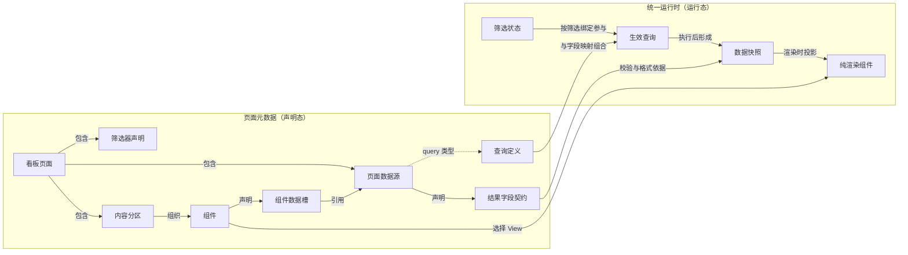
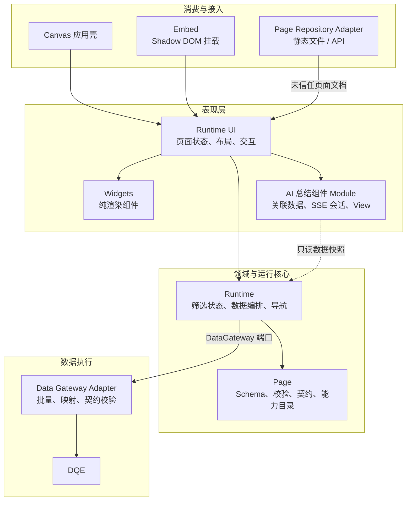
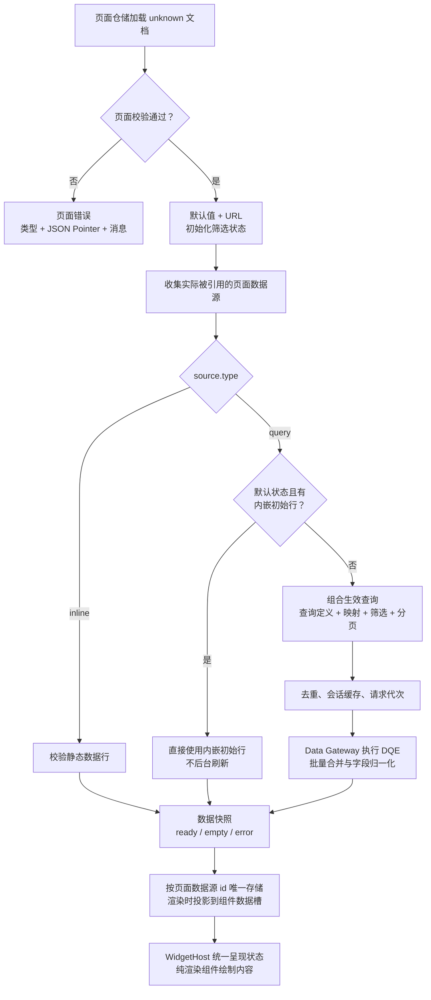
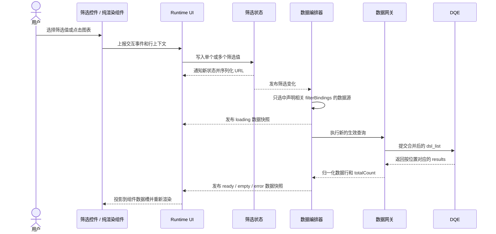

# 前端渲染框架：能力、架构、运行逻辑与扩展点

> **一句话定位**：前端渲染框架是一个以看板页面为唯一输入、确定性执行领域 DSL 的受控渲染引擎，不是通用低代码容器。

## 阅读摘要

| 维度 | 当前结论 |
|---|---|
| 页面输入 | 统一消费 `schemaVersion: "5.0"` 的页面元数据 |
| 数据模式 | 支持 `inline`、`query` 和两者组成的 `mixed` 页面 |
| 渲染能力 | 固定 12 列布局，内置 10 类组件，统一处理加载、空和错误状态 |
| 交互能力 | 页面级筛选、URL 同步、页内下钻、跨页下钻、本地/查询分页 |
| 运行原则 | 组件不取数；数据快照按页面数据源 id 唯一存储；多个消费者共享数据 |
| 主要扩展方式 | 替换页面仓储、数据网关、导航和宿主接入适配器 |

## 1. 范围与设计原则

### 1.1 文档范围

| 包含 | 不包含 |
|---|---|
| 看板页面协议 | Platform 页面搭建 |
| 统一运行时与 Runtime UI | 页面修订和回滚管理 |
| Widgets 纯渲染组件 | 页面模板管理 |
| 数据网关与 DQE 适配 | 发布租约与人工确认发布 |
| Canvas 消费端与 Embed | NL2DQE 和数据上下文检索 |

### 1.2 设计原则

- 看板页面是统一运行时的唯一页面输入。
- 页面使用严格声明式领域 DSL，不携带任意脚本、HTML、计算表达式、自定义样式或组件代码。
- 组件只消费数据快照和展示属性，不发起查询、不访问页面全局状态。
- 外部系统通过端口和适配器接入，执行地址、鉴权和长期凭据不进入页面文档。

## 2. 核心概念与能力

### 2.1 概念关系

### 2.2 页面数据源

| 类型 | 内容 | 首次呈现 | 交互能力 |
|---|---|---|---|
| `inline` | 结果字段契约 + 静态数据行 | 同步形成数据快照 | 不查询，不支持页面筛选和 action |
| `query` | 结果字段契约 + DQE 查询定义 | 优先使用内嵌初始行，否则执行 DQE | 支持筛选绑定、action 和查询分页 |
| `mixed` | 同一页面同时包含两类数据源 | 各数据源独立执行 | 能力按组件实际绑定的数据源推导 |

每个页面数据源都完整声明结果字段契约：

| 契约信息 | 作用 |
|---|---|
| 字段类型 | 约束 `string`、`number`、`boolean`、`date` 和 `datetime` |
| 字段角色 | 区分维度字段和度量字段 |
| 标签、单位、可空性 | 提供展示与数据校验依据 |
| `defaultFormat` | 提供默认展示格式，可被组件字段绑定覆盖 |
| `queryField` | 将 DQE 输出字段显式映射为稳定页面字段 id |

### 2.3 组件与布局

| 组件 | 核心能力 |
|---|---|
| 报告头 | 展示页面标题、说明、时间点和标签 |
| 指标卡 | 展示核心指标、变化值和进度环 |
| 柱状图 | 类别对比，支持多序列、堆叠、横向和双轴 |
| 折线图 | 趋势分析，支持平滑、面积填充、堆叠和双轴 |
| 饼图 | 少量类别的占比与构成展示 |
| 表格 | 多级表头、固定列、本地排序/筛选/分页、查询分页和单元格选择 |
| 地图 | 中国/世界地域着色和散点叠加 |
| 排名卡 | 展示 Top N、排名及变化值 |
| 文本 | 展示说明、口径提示、后端返回的摘要、已确认结论和跨页链接；显式支持受控语义 HTML 分色正文 |
| AI 总结 | 需求明确声明时，基于关联数据通过 SSE 流式生成总结 |

布局规则：

- 页面由内容分区组成。
- 每个分区使用固定 12 列自动流布局。
- 组件顺序决定排布顺序，组件只声明 1–12 列的跨度。

### 2.4 筛选、下钻与 AI 总结

| 能力 | 当前行为 |
|---|---|
| 维度筛选 | 支持下拉、标签、树和搜索展示 |
| 时间范围 | 支持日期或日期时间精度 |
| URL 同步 | 从默认值和 URL 恢复筛选状态，变化后反向序列化 |
| 页内下钻 | 图表 action 回写筛选状态；表格单元格可原子写入多个筛选器 |
| 跨页下钻 | 通过导航适配器携带或设置目标页筛选条件 |
| AI 总结 | 只读 `relatedData` 白名单内的数据，支持 SSE 流、取消、迟到结果隔离、重试和受限 Markdown |

AI 总结是独立的垂直组件 Module，不是第三种页面数据源。它的配置或生成失败只影响当前 AI 总结组件。
摘要默认由后端随页面文档返回并用 `text` 渲染；未明确声明运行时 SSE 时不选择 AI 总结组件。
文本正文默认是纯文本；声明 `bodyFormat: "semanticHtml"` 时，与排行详情共用受控语义 HTML Module，统一执行白名单解析、失败关闭、节点渲染和正负中性颜色映射。

## 3. 架构分层

### 3.1 整体架构

### 3.2 模块职责

| 模块 | 职责 | 不负责 |
|---|---|---|
| `@metriccanvas/page` | JSON Schema、语义校验、类型、结果字段契约、组件能力目录 | 页面加载和查询执行 |
| `@metriccanvas/runtime` | 筛选状态、生效查询、数据编排、数据快照和导航语义 | 具体应用 UI 和 DQE HTTP 细节 |
| `@metriccanvas/data-gateway` | DQE 筛选覆盖、批量执行、字段归一化、契约校验、超时和诊断 | 组件展示和页面导航 |
| `@metriccanvas/runtime-ui` | 页面状态、筛选控件、12 列布局、组件分发和 action | 业务查询生成 |
| `@metriccanvas/widgets` | 根据就绪数据和 props 绘制内容，上报交互事件 | 数据获取、筛选状态和页面导航 |
| Canvas | 页面目录、路由、页面加载和即时预览 | Platform 管理能力 |
| Embed | Shadow DOM 挂载、`mount/update/destroy` 生命周期与宿主事件 | 修改宿主 URL 或路由 |

## 4. 运行逻辑

### 4.1 页面加载与渲染

| 阶段 | 处理内容 | 结果 |
|---|---|---|
| 1. 加载 | 页面仓储按 id 返回未信任文档 | `unknown` 文档 |
| 2. 校验 | 检查结构、引用、字段角色、查询映射和组件能力 | 合法看板页面，或带 JSON Pointer 的错误 |
| 3. 初始化 | 合并筛选默认值与 URL 状态 | 页面级筛选状态 |
| 4. 编排 | 只执行被组件数据槽或关联数据引用的数据源 | 按数据源 id 存储的数据快照 |
| 5. 投影 | 将同一数据快照投影给多个组件数据槽 | 无重复数据和重复取数 |
| 6. 渲染 | `WidgetHost` 处理 loading/empty/error，View 渲染 ready 数据 | 页面内容 |

#### 空与错误快照的稳定呈现

- `loading` 数据快照继续由 `WidgetHost` 呈现加载骨架。
- `empty` 和 `error` 数据快照在统一运行时中保留原始状态与诊断信息；Runtime UI 仅在投影到组件数据槽时将其转换为 `rows: []` 的就绪数据快照。
- 纯渲染组件因此继续呈现标题、容器、坐标轴、表头和底图，只清空数据标记或数据行，不用整块“暂无数据”文字替换组件。
- `pages/empty-state-showcase.json` 提供指标卡、柱状图、折线图、饼图、表格、排名卡和地图的确定性视觉验收入口。该页面使用空的 `inline` 页面数据源稳定复现呈现效果；查询失败使用同一投影规则。

### 4.2 查询执行保障

| 能力 | 实现方式 |
|---|---|
| 生效查询 | 组合查询定义、查询字段映射、当前筛选值和分页状态 |
| 去重与缓存 | 以生效查询的确定性 JSON 为键，复用会话内的 ready/empty 结果 |
| 竞态处理 | 通过请求代次丢弃迟到结果 |
| DQE 批量 | 同一微任务窗口的查询合并为 `dsl_list`，按位置拆分 `results` |
| 查询分页 | 修改克隆查询项的 `order.offset/limit`，使用 `total_count` 派生页码 |
| 错误隔离 | 数据源失败只影响引用它的组件 |
| 结构化查询错误 | 数据快照错误态保留稳定查询错误分类与脱值消息（`QueryErrorCode`，单点声明于 `@metriccanvas/page`）；`WidgetHost` 按分类的处理语义呈现，统一运行时视图向宿主上抛 `data-error` 事件，消费方不解析错误字符串 |
| 查询诊断 | 每次执行落一条封闭形状的诊断记录（标识、耗时、行数、状态、错误分类），默认不保留业务数据行；字段与安全约束见 `docs/dashboard-runtime-architecture.md` 第 16 节 |

### 4.3 页内下钻时序

筛选变化后，统一运行时只重新执行声明了相关 `filterBindings` 的查询数据源。查询分页同时回到第一页；返回结果导致页码越界时，会校正到最后一页。

## 5. 扩展点

| 扩展点 | 接口/形式 | 可替换内容 | 保持不变的部分 |
|---|---|---|---|
| 页面仓储 | `PageRepository` | 静态文件、其他 API 或存储实现 | 加载后仍使用统一页面校验器 |
| 数据网关 | `DataGateway` | DQE 环境、鉴权、HTTP 适配和维度候选值服务 | 组件仍只消费标准化数据快照 |
| 导航 | `RuntimeNavigation` | 宿主路由、URL 写入和跨页导航策略 | action 的页内/跨页语义 |
| Embed 接入 | `mount/update/destroy` + 运行时事件 | 宿主页面和框架集成方式 | Shadow DOM 内仍复用同一 Runtime UI |
| AI 总结 | 宿主注入的连接配置 | 连接地址与环境参数 | 端点和协议参数不进入页面文档 |
| 画布交互 | 版本化 authoring 协议 | 宿主对选中、移动、标题和跨度修改意图的处理 | 画布不直接依赖管理端实现 |

### 新增组件

新增组件不是动态注册，而是一次受控协议扩展：

1. 扩展 Page 类型和 JSON Schema。
2. 补充组件能力目录和语义校验。
3. 实现纯渲染组件。
4. 在 Runtime UI 增加数据投影和组件分发。
5. 补充契约、组件和集成测试。

## 6. 当前能力边界

| 边界 | 当前约束 |
|---|---|
| 页面表达 | 不支持脚本、HTML、计算表达式、自定义样式和自定义组件逃生舱 |
| 静态数据 | `inline` 不支持页面筛选和 action |
| 查询分页 | 表格必须独占查询数据源，暂不支持排序和表头筛选 |
| 数据刷新 | 不提供后台刷新和显式刷新 |
| 数据源关系 | 页面数据源之间不串联，一个数据源的结果不自动成为另一个的查询输入 |
| 页面计算 | 不支持页面层临时派生计算，复杂计算应在查询或数据服务边界内完成 |
| 地图 | 当前底图只支持中国和世界 |

上述约束是当前的明确能力边界。后续如需扩展，应通过页面协议、端口或架构决策记录显式演进，不在组件内增加隐式例外。
