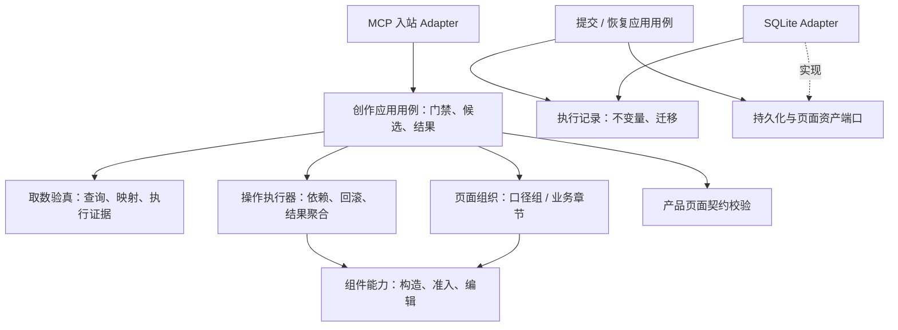

# metriccanvas-authoring 架构评审

日期：2026-09-18。基线：HEAD `14526fb` 加当前未提交工作区；结构计划相关文件为本轮看到的新增实现。仅评审，未修改业务代码。

## 结论

分层方向正确，但尚不满足“能力扩展不产生散弹式修改”的要求。主要短板不是目录命名，而是规则所有权和复用接口：不同变化原因穿过同一个页面构建模块，同一规则又散落在不同执行路径。

这里的单一真源指每项事实与规则只有一个权威作者；生成快照、接口投影和持久化副本可以存在。新增真正的组件类型需要 Schema、渲染与创作能力配套交付，这是合理协作；修改一种创作策略却需要同步多个调度器、白名单或传输包装，才是需要消除的散弹式修改。

架构风险优先级：P1 为继续扩展前应优先收敛的接口与规则所有权；P2 为可逐步治理的维护风险，不等同于已发生生产故障。

## 发现

### 1. P1：取数、组件构造和完整页面组装没有独立接口，复用依赖页面的偶然形状

证据：
- [structure_composition.py](/Users/moon/Documents/Code/公司项目/DataDashboard/metriccanvas-authoring/tool/metriccanvas_authoring/application/structure_composition.py:25) 为获得数据，强行指定 detail/table，调用完整 compose，再取页面第一个数据源。
- [unified_edit_page.py](/Users/moon/Documents/Code/公司项目/DataDashboard/metriccanvas-authoring/tool/metriccanvas_authoring/application/unified_edit_page.py:42) 为已有页新增组件，先创建整页，按非 reportHeader 过滤组件，并要求只剩一个。
- [page_building.py](/Users/moon/Documents/Code/公司项目/DataDashboard/metriccanvas-authoring/tool/metriccanvas_authoring/domain/page_building.py:175) 将查询结果转页面数据源、组件构造、口径组分区和页头装配放在同一出口。

影响：页头类型、自动说明组件、口径组组织、表格准入或页面装配策略的变化，都可能影响仅想取数或新增一个组件的调用者。结构路径拿到的是页面 initial 样例；[page_structure.py](/Users/moon/Documents/Code/公司项目/DataDashboard/metriccanvas-authoring/tool/metriccanvas_authoring/domain/page_structure.py:119) 随后把该样例作为构件验真的行证据，导致拥有完整执行结果的当前请求也被页面样例上限约束。

建议：抽出“取数单元验真”应用接口，返回已验证查询、稳定字段、完整执行结果、源描述、口径和 formula 留痕；再提供显式的组件构造接口及页面数据源投影。普通问数、业务章节组织、已有页新增分别消费这些结果。完整数据仍只留可信程序通道，最终页面才裁剪 initial 样例。

验收：调整普通问数页头或分区策略，不需改已有页新增和结构取数；三个路径共用查询/字段验真；组件装配不再伪造空查询和空 UnitScope。

### 2. P1：组件能力事实分散，且调用者依赖私有构造函数

证据：
- [page_building.py](/Users/moon/Documents/Code/公司项目/DataDashboard/metriccanvas-authoring/tool/metriccanvas_authoring/domain/page_building.py:14) 的 ASSEMBLED_COMPONENT_TYPES 与 [component_editing.py](/Users/moon/Documents/Code/公司项目/DataDashboard/metriccanvas-authoring/tool/metriccanvas_authoring/domain/component_editing.py:12) 的 DATA_COMPONENTS 分别维护当前同一组十种数据组件。
- [page_building.py](/Users/moon/Documents/Code/公司项目/DataDashboard/metriccanvas-authoring/tool/metriccanvas_authoring/domain/page_building.py:410) 统一长分支负责各组件 props。
- [component_editing.py](/Users/moon/Documents/Code/公司项目/DataDashboard/metriccanvas-authoring/tool/metriccanvas_authoring/domain/component_editing.py:169)、[container_building.py](/Users/moon/Documents/Code/公司项目/DataDashboard/metriccanvas-authoring/tool/metriccanvas_authoring/domain/container_building.py:20) 和 [page_structure.py](/Users/moon/Documents/Code/公司项目/DataDashboard/metriccanvas-authoring/tool/metriccanvas_authoring/domain/page_structure.py:142) 都构造虚拟 ExecutableUnit 后调用私有 _component_for。
- [layout_policy.py](/Users/moon/Documents/Code/公司项目/DataDashboard/metriccanvas-authoring/tool/metriccanvas_authoring/domain/layout_policy.py:40) 手写依赖高度的组件集合；[page_structure.py](/Users/moon/Documents/Code/公司项目/DataDashboard/metriccanvas-authoring/tool/metriccanvas_authoring/domain/page_structure.py:135) 另写图表单位、比例完整性和宽度规则。

影响：新增一个可自动装配且可切换的组件，必须追踪多个手写集合及集中分支；新增展示规则也容易只覆盖某个入口。当前 component 扩展仅能选择已有组件，不解决这类扩展成本。

建议：建立按组件聚合的创作能力模块，明确构造、准入、允许编辑、容器资格、布局需求。权威产品事实继续由产品契约导出；创作权限与默认策略由创作模块拥有，不能把“可渲染”等同于“可自动构造”或“允许编辑”。从注册实现派生能力集合，由组合根检查完整性，禁止静默覆盖注册项。

验收：新增一种已具备产品支持的创作构造器，只修改该能力模块与显式注册/契约；不改通用调度、提交、恢复和其他组件模块。

### 3. P1：执行记录的业务不变量落在存储 Adapter，恢复依赖提交协调器内部实现

证据：
- [sqlite_authoring_state.py](/Users/moon/Documents/Code/公司项目/DataDashboard/metriccanvas-authoring/tool/metriccanvas_authoring/adapters/outbound/sqlite_authoring_state.py:27) 自有状态闭集、终态与不可变字段。
- [sqlite_authoring_state.py](/Users/moon/Documents/Code/公司项目/DataDashboard/metriccanvas-authoring/tool/metriccanvas_authoring/adapters/outbound/sqlite_authoring_state.py:101) 决定 not-applied 能否进入 sending、取消不可回退、回执不可变及验证状态单调性。
- [authoring_submission.py](/Users/moon/Documents/Code/公司项目/DataDashboard/metriccanvas-authoring/tool/metriccanvas_authoring/application/authoring_submission.py:95) 又校验执行记录、终态和业务引用。
- [authoring_recovery.py](/Users/moon/Documents/Code/公司项目/DataDashboard/metriccanvas-authoring/tool/metriccanvas_authoring/application/authoring_recovery.py:75) 构造 turns=None 的提交协调器，仅为调用其私有 _validate_record。

影响：替换 SQLite 或增加恢复状态时，需要同时理解和维护 Adapter、提交与恢复中的业务规则。端口声明约束而不提供共享规则实现，使不同 Adapter 容易出现行为差异。

建议：将执行记录建模为拥有不变量和合法迁移的领域模块；提交/恢复应用模块负责外部读取、权限复核与调用顺序，领域模块负责纯状态判断，Adapter 负责原子 claim/CAS、序列化和持久化。适配器可再次调用同一领域校验形成防御，但不另写一份业务规则。单次保存与旧强保存策略保持显式区分，不合并其不同承诺。

验收：两个存储 Adapter 使用同一状态迁移测试向量；新增合法状态迁移无需编辑存储业务分支；恢复不再调用提交协调器私有方法。

### 4. P2：操作批次执行规则存在两份，扩展靠调度器分支

证据：
- [page_editing.py](/Users/moon/Documents/Code/公司项目/DataDashboard/metriccanvas-authoring/tool/metriccanvas_authoring/domain/page_editing.py:19) 与 [unified_edit_page.py](/Users/moon/Documents/Code/公司项目/DataDashboard/metriccanvas-authoring/tool/metriccanvas_authoring/application/unified_edit_page.py:74) 重复批次输入校验、ID 唯一性、dependsOn、逐操作提交、失败跳过和最终状态聚合。
- 统一编辑还按 add_data_component、SECTION_TYPES 和其他操作分流；其他操作被包装成一个单操作批次交回旧调度器。
- [unified_composition.py](/Users/moon/Documents/Code/公司项目/DataDashboard/metriccanvas-authoring/tool/metriccanvas_authoring/application/unified_composition.py:11) 独立维护创建操作集合，再用无效 opcode 实现拒绝。

影响：变更 partial/unchanged、依赖和错误定位语义时要修改两个实现；增加具备异步能力或创建权限的操作需要修改中央分支与多个集合。

建议：一个应用层操作执行器拥有批次事务语义，领域操作只产出候选变更与影响。操作注册项声明输入契约、处理器、可用上下文和能力需求；同步/异步处理在统一接口中适配。旧入口用兼容 facade 消费同一执行器。

验收：新增操作不改通用循环；所有入口共享失败回滚、依赖跳过、无变化与部分成功的行为测试。

### 5. P2：统一入站 Adapter 通过另一个 MCP Server 复用应用行为

证据：[unified_content_mcp.py](/Users/moon/Documents/Code/公司项目/DataDashboard/metriccanvas-authoring/tool/metriccanvas_authoring/adapters/inbound/unified_content_mcp.py:80) 的 compose 路径创建旧 content MCP Server，get_tool → tool.run，再拆 structured_content.artifactEnvelope。

影响：复用核心用例需要了解 FastMCP 工具名、旧工具参数、信封结构和产物位置。旧传输包装变化会波及统一入口；创建/编辑直接调用用例，compose 却经框架绕行，调用方式不一致。

建议：统一创作用例负责轮次门禁、候选链和结果投影；新旧 MCP Adapter 分别映射请求到同一个应用接口。入站 Adapter 只拥有传输语义，兼容协议映射留在旧 Adapter。

验收：不启动 FastMCP 即可测试统一创作全过程；更改旧 MCP 返回信封不影响统一创作应用测试。

### 6. P2：文档词面参与确定性选型，变化率不同的事实被耦合

证据：[component_selection.py](/Users/moon/Documents/Code/公司项目/DataDashboard/metriccanvas-authoring/tool/metriccanvas_authoring/domain/component_selection.py:202) 从 purpose、chooseWhen 拼接中文文本并按关键词加分；时间维度偏好还从 dataShape 字符串是否含 date 判断。

影响：仅修改组件说明文字或翻译，就可能改变默认选型。这是文案演进与领域策略演进的隐式耦合，单向导出目录也不能消除这种风险。

建议：目录提供显式的机器事实，例如支持/偏好的分析意图和时间维度适配；选型只消费这些字段与硬约束，说明文字用于解释。策略覆盖可继续使用现有 component_policy 端口。

验收：仅替换 purpose/chooseWhen 文案，选型结果保持不变；调整偏好需要显式机器字段及策略测试。

### 7. P2：结构真源已统一，语义校验仍是跨语言人工双实现

证据：[page_validation.py](/Users/moon/Documents/Code/公司项目/DataDashboard/metriccanvas-authoring/tool/metriccanvas_authoring/domain/page_validation.py:35) 使用导出 JSON Schema，但参数、字段绑定、导航和组件不变量另行实现；产品侧 [validate.ts](/Users/moon/Documents/Code/公司项目/DataDashboard/packages/page/src/validate.ts:241)、page-param.ts、param-bindings.ts 也拥有对应语义。当前已有导出 conformance 向量，这是必要的防漂移措施。

影响：Schema 导出只能同步结构事实，不能自动同步这些语义。新增绑定或参数规则仍要求修改 TS、Python 与测试向量。不能因为快照有哈希就宣布全部规则真源归一。

建议：保留独立 Python 交付前提。先逐项登记语义规则作者、消费者和共同向量；可声明的规则导出中立数据，复杂规则保留跨语言实现但强制差分测试。只有运行环境允许时才考虑统一可执行校验器，不能为减少代码副本引入新的生产网络依赖。

验收：规则变化自动触发全部语言消费者验真；明确“规则权威唯一”与“执行实现只有一份”的区别，不用无限扩大的通用规则 DSL 取代领域代码。

## 新增结构路径的交付缺口

[page_structure.py](/Users/moon/Documents/Code/公司项目/DataDashboard/metriccanvas-authoring/tool/metriccanvas_authoring/domain/page_structure.py:13) 在导入时读取 section-patterns.json，但 [pyproject.toml](/Users/moon/Documents/Code/公司项目/DataDashboard/metriccanvas-authoring/tool/pyproject.toml:34) 的 sdist force-include 清单没有该文件。

源码环境能从 Bundle 根目录读取该文件，当前打包声明却不会携带它。按声明清单，离开源码树导入统一内容入口将缺少该资源。这说明增加运行时资产仍依赖手工同步打包清单，源码测试不能替代安装态验收。

本次静态核对确认缺项；实际 sdist 构建因本地所选构建环境缺少 hatchling 未完成，因此不将其写成已经复现的安装失败。建议由一份运行时资产清单派生打包配置和完整性检查，并在 CI 中执行隔离安装后的五工具枚举。

## 应保留的设计

- Skill、确定性工具、契约快照和测试替身分开交付；产品契约单向导出，并有锁与向量。
- 基线、候选、提交、恢复职责已有显式入口；内容创作不直接拥有保存权限。
- DataContext、DQE、SourceDescription 等端口支持真实差异；扩展清单不能随意 import 外部代码。
- Domain AST 导入检查未发现向 Application、Adapter、FastMCP 或 httpx 的上述反向导入。问题主要是规则归属和横向复用，不是全面依赖倒置失败。
- 已有真实不同消费者：普通问数按口径组组织，Platform 按业务章节组织。二者可以共享取数与组件构造，保留独立页面组织策略。
- 没有证据要求拆成微服务；优先在同一个 Bundle 内形成有业务含义的模块。

## 推荐模块关系与实施顺序

以下为建议设计，尚未实施；它们是同一创作上下文中的职责模块，不机械宣称每个目录都是独立限界上下文。



| 顺序 | 收敛目标 | 完成判据 |
|---|---|---|
| 1 | 运行时资产完整性、统一应用调用 | 隔离安装可列工具；统一入口不调用旧 MCP Server |
| 2 | 取数验真 / 组件构造 / 页面组织分离 | 消除造整页再拆页；不再伪造空查询与口径 |
| 3 | 组件能力和单一操作执行器 | 增加能力不改通用调度；能力集合来自显式作者 |
| 4 | 执行记录领域模块 | 状态规则与存储解耦；提交和恢复消费公共接口 |
| 5 | 显式机器策略与跨语言规则治理 | 文案变化不影响选型；共同向量验证全部消费者 |

每阶段保持现有入口兼容，通过重定向到共同核心替换旧实现，避免再叠一层长期双轨。优先以真实变化用例衡量模块深度，不按文件长度拆模块。

建议把扩展演练作为架构验收：新增一种取数 Adapter、一个组件构造能力、一种章节模式、一个编辑操作、一条恢复状态规则，记录实际修改点。外部协议、组件业务、章节组织、批次执行、存储技术应各有明确变化范围；不能仅凭分层图承诺永久无散弹式修改。

## 本次验证与限制

执行：
```text
PYTHONDONTWRITEBYTECODE=1 PYTHONPATH=metriccanvas-authoring/tool:metriccanvas-authoring/test-harness/tests
metriccanvas-authoring/tool/.venv/bin/python -m unittest
  test_structure_plan test_unified_composition test_authoring_submission
  test_authoring_recovery test_sqlite_authoring_state
```

结果：60 项测试通过。检查 Domain 导入与运行时资源声明；没有执行真实 Relay/Java/DQE 联调，也没有完成全量测试或隔离安装。测试通过证明这些已有行为通过定向回归，不反证本文列出的架构演进风险。
