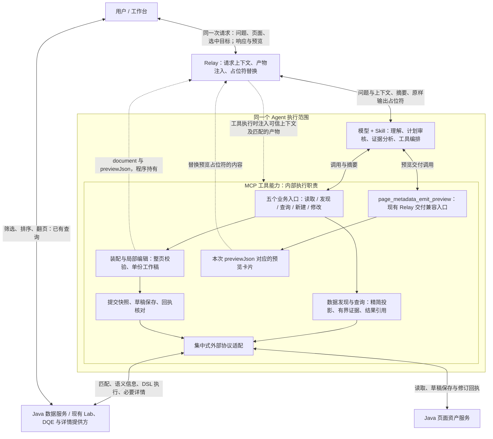
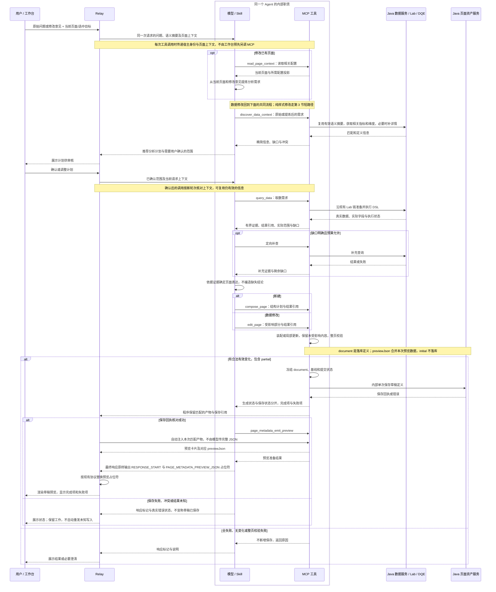
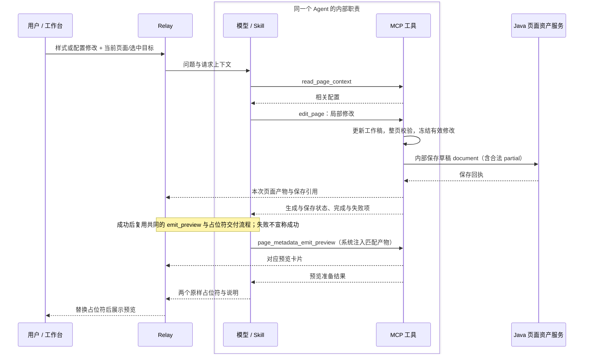
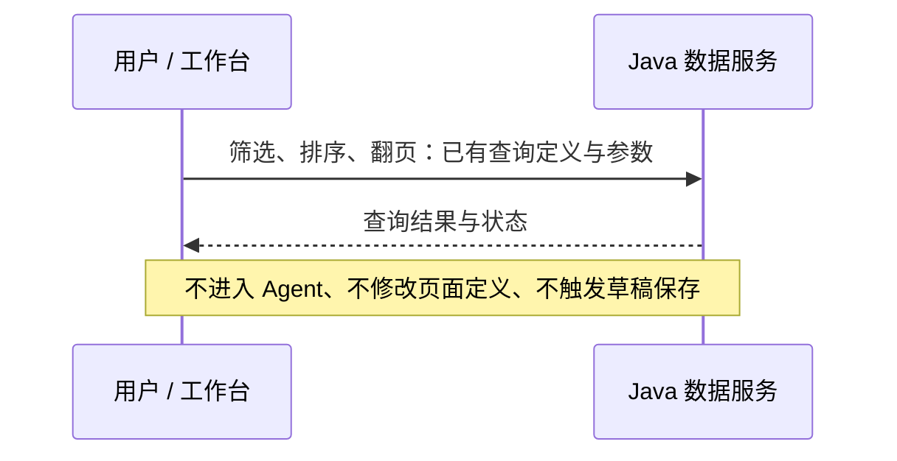

# 页面创作 v2：修订时序图与架构图

日期：2026-09-20。状态：用户确认方向后的目标设计；尚未实施。此次修正同一个 Agent 的职责表达、统一请求入口、数据修改回流，以及真实 Relay 占位符交付约束。

依据：[原始交互设想](../../调查报告/Agent交互逻辑.md)、[最小链路计划](./2026-09-20-authoring-minimal-flow-and-skill-plan.md)、用户本轮提供的实际 create Step 1–6。实际部署约束与影响见 [架构影响说明](./2026-09-20-authoring-relay-impact.md)。

## 1. 架构图

内部目录、模块依赖与变化场景的配套方案见 [创作模块架构调整识别](./2026-09-20-authoring-module-architecture.md)。下图显式保留预览交付入口，其成功之后仍须由 Relay 替换占位符，工作台才能消费预览。



这是职责图，不是进程部署图：模型和工具属于同一个 Agent 的执行流程，是否跨进程由实际部署决定。不要求工作台先独立调用 MCP 注入上下文。问题和页面上下文随同一次请求进入；身份由宿主取得，不能因同包传输而改成模型自报。

五个业务入口是目标分工，不是当前部署只能注册五个工具。`page_metadata_emit_preview` 作为现有 Relay 必需的交付兼容入口继续保留。保存内部化不代表删除占位符协议，也不代表工具直接向浏览器推送页面。

## 2. 首次构建与数据修改共用分析流程



图中的占位符文字是简写，实际响应必须使用第 5 节的双大括号原文。工具调用和系统注入是同一次调用的内部步骤，不是模型先发空参失败后再补注入。

数据修改回流包括需求提炼、指标信息、计划审核、查数与分析；复用有效信息不等于跳过业务审核。最终局部更新，不强制重建整页。纯文本创建不机械执行数据发现和查询。核心证据不足时停止依赖它的结论；合法部分内容可以保存并明确未完成。

## 3. 样式修改短路径



该图展示保存成功路径；全失败、无变化、非法页面不新增保存，保存未知不自动重发。样式修改不重复查询；如没有可复用的有效预览数据，不伪造 initial，按运行时既有能力取数或如实标明数据状态。

## 4. 运行态与发布



发布不在本次创作简化中另行改造。真实 create 文本现有路径是：工作台收到发布意图 → Relay/Agent 进行维度实例选择 → 调用现有 update_page_metadata 转发布 → Relay 返回结果。此前图中的“工作台必须直接调用 Java 发布”不能作为当前实现要求。计划审核的“确认/可以”不得被错当成发布意图；页面确认与发布按所处阶段处理。维度裁剪、公共参数提取、草稿历史与发布版本号的现有声明记录为部署事实待验证，不从本仓不同契约推断已兼容。

## 5. Relay 交付协议：本期保留

预览准备工具成功之后，最终响应中保留以下原文；模型不把 JSON 填进占位符，也不使用本地 output 文件替代：

```text
{{RESPONSE_START}}
{{PAGE_METADATA_PREVIEW_JSON}}
```

- `{{RESPONSE_START}}`：当前 Skill 声明的响应开始标记，必须原样输出；实际解析细节依 Relay 协议。
- `{{PAGE_METADATA_PREVIEW_JSON}}`：由系统替换为预览内容供工作台渲染。先准备对应的预览卡片，再输出标记。
- `compose_page_result`：现有系统注入的完整产物，模型无需传。新 compose/edit 内部保存后，仍需产出可供该注入链消费的兼容产物；不能只返回 draftId 就宣称交付闭环完成。
- `document`：保存的页面定义，不含本次查询结果行。
- `previewJson`：document 与 previewData 合并，携带本次有效 initial；仅预览，不写入 Java 页面定义。
- 注入缺失则报告交付失败，不重复空调用，不回退到任意“最近一次结果”。保存已成功但预览失败时，只修复匹配产物的预览交付，不能重新保存来碰运气。

## 6. 状态归属与暂挂项

分析计划和结构计划供模型判断与工具执行；查询结果、当前工作稿与提交快照由程序持有。会话保留资源/修订标识及必要的 draftSpec，不存完整 document。单份工作稿不是多方案候选链；提交快照用于固定本次发送内容。

用户确认计划随草稿跨会话保存继续挂起；有效结果复用仍需核对身份、范围与版本。普通问数/探索不因共用构造能力自动保存资产。补查与修复保持有界，未知保存不自动重发。
