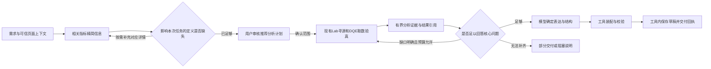

# 基于现有语义模型的页面自动生成与 Skill 调整计划

日期：2026-09-20。状态：核心方向已获用户认可；本文落盘近期方案与 Skill 功能规划，未实施工具协议、业务代码或正式 Skill 改写。工具新增名称与参数以下均为目标设计，不是当前可调用接口。

### 2026-09-20 交互与架构简化决策（最新）

用户已确认以下目标，取代此前目标方案中“保留候选链、由 Relay 单独选择候选并提交”的安排；当前代码和已发布协议尚未迁移。

- 新建数据页面先审核推荐分析计划：默认选好相关指标、维度、时间、筛选与选择理由，其他相关指标可展开选择；不是要求用户浏览全量目录。查数前的趋势/排行是分析方向，查数后才确定最终表达。
- 普通筛选、排序、翻页由渲染期执行已有查询，不触发 Agent 创作；用户明确要求重新分析或修改默认配置时才进入创作。
- 用户确认的计划随草稿跨会话保存是认可的后续方向，本期挂起；不把聊天历史当作可靠的持久计划库。
- 当前不提供同轮多方案比较、旧候选任选或分叉。内部维护单份工作稿，提交时冻结不可变快照；候选链不再作为目标接入前置。
- 平台页面生成或修改成功后，由 compose_page / edit_page 内部完成草稿保存并返回 draftId 及可核验的资源/修订回执；不要求模型搬运完整 document 或另调草稿保存，也不要求 Relay 单独选择候选并提交。现有 page_metadata_emit_preview 与两个 Relay 占位符保留，不能把草稿保存合并误作预览协议可删除。draftId 与 Java 资源标识的具体映射在契约对账时确定。
- 页面生成状态与保存状态分别表达。用户确认 partial 也可自动保存：保留成功修改和未受影响内容，明确完成项、失败项与缺失说明，整体页面必须通过校验。全失败、无变化或整页校验失败不新增保存；冲突或保存结果未知时保留工作并停止自动重发。部分保存不表示核心问题已完整回答。
- 保留宿主提供的身份、页面目标、创作基线与迟到结果隔离；可信程序职责收进 MCP 应用实现，不强制另建服务。上下文引用是否隐藏取决于宿主能否可靠注入调用上下文。
- 工作稿更新须串行或带版本竞争检查；保存使用冻结的 document/base/operationId，不能因后续编辑改变发送内容。远端并发保护依赖 Java 的基线修订检查，本地 hash 不能替代它。
- 普通问数/探索的临时页面态不随本决定自动落库；本次自动保存只适用于平台页面创作。

迁移必须同时替换提交/恢复中对旧 candidateRef 的回读依赖，不能仅覆盖或删除候选记录。此处记录产品与架构方向，不宣称生产宿主或 Java 联调已经完成。

供用户检查的完整目标流程见 [新版时序图与架构图](./2026-09-20-authoring-flow-v2.md)。

### 实际 create 流程补充后的修正

- 用户操作工作台是统一交互端；所有播报、审核、澄清、预览和结果经过工作台。模型与 MCP 是同一个 Agent 执行范围的内部职责，不代表两个业务系统或必须同进程。
- 原始问题、当前页面和选中目标随同一次请求进入 Agent；宿主在工具执行时传递可信身份与页面上下文，不要求工作台另行预调用 MCP。
- 数据修改从“当前页面＋修改意见”提炼分析需求，回到与新建共用的发现、计划审核、查数、分析流程；最终局部更新。样式修改走短路径。有效信息可复用，不机械重新查全量数据。
- 用户提供的真实 create 已采用系统注入 compose_page_result，不能再描述为模型搬运完整页面。PlanAgent 的语义摘要是已有输入，发现能力优先复用仍有效的信息。
- 保留 page_metadata_emit_preview 及最终响应原样输出的 `{{RESPONSE_START}}`、`{{PAGE_METADATA_PREVIEW_JSON}}`。Relay 负责替换并交付工作台；五个目标业务入口之外保留这个协议兼容入口，不以工具数量为由删除。
- 保存 artifact.document（页面定义，不含查询结果行）；artifact.previewJson 合并本次 previewData/initial，仅供预览。合并后的 compose/edit 必须保持与当前系统注入可兼容的产物关联，不能只交 draftId。
- 保存成功而预览失败应报告两个独立状态；修复预览不能再次触发保存。原流程的“保存失败可重试”不能覆盖本方案已经确认的未知写入不自动重发规则。
- 当前发布仍沿实际部署的发布意图、维度实例选择和 update_page_metadata 路径；本轮不因画图改成工作台必须直接调 Java，也不擅自删除发布前维度选择。公共参数提取等格式与本仓契约的差异在迁移前验证。

详细差异、实施影响及验收补充见 [Relay 架构影响说明](./2026-09-20-authoring-relay-impact.md)。

### 架构组织优化要求（本轮仅识别）

用户要求对 tool 及相关目录按领域职责、单一真源、高内聚低耦合、相同变化原因和命名行为一致性优化。具体证据、模块归属、目标目录、源与派生产物、迁移顺序及验收见 [创作模块架构调整方案](./2026-09-20-authoring-module-architecture.md)。先消除伪复用和重复规则，再安排物理归位；不以本计划授权代码修改或全仓目录搬迁。

预览交付是主流程中的必需步骤：compose/edit 内部保存成功 → page_metadata_emit_preview（系统注入匹配产物）→ 最终响应原样输出两个占位符 → Relay 替换 → 工作台渲染。业务工具合并不能删除此兼容链路。

## 1. 本轮目标与依据

使用现有Lab语义模型完成指标发现，按需补充对应指标平台详情，沿现有Lab寻源及DQE执行链查数、核对结果，再由模型决定页面表达，确定性工具完成装配。近期不以全量业务本体、完整指标装配库、跨表关联图或精确成本估计为前置。

范围与工具所有权沿 [MCP讨论基线](./2026-09-18-authoring-mcp-boundaries.md) 和 [完整盘点](./2026-09-18-authoring-mcp-inventory.md)。[数据全景v2](./2026-09-20-data-context-panorama.md) 保留为数据侧能力对账与长期演进参考，不是本轮必做清单。绕过Lab分词继续挂起。

真实输入：

- [语义层查询结果](../../调查报告/数据/语义层查询结果.json)：23个语义指标，9个formula、14个calculate_conf；7个synonyms非空，23个definition与名称相同，unit/frequency全部为空。字段结构已存在不等于业务语义完整。
- [指标详情](../../调查报告/数据/metric-detail.md)：机会点样例提供measurement、refreshFrequency、statisticalDescription等；能补业务定义，但与Tokens样例的对应关系尚未提供，不能串用单位或口径。
- [DQE返回](../../调查报告/数据/tokens的dqe查询结果.json) 与 [DataFilter说明](../../调查报告/数据/DataFilter说明.md)：用于结果字段与格式核对；实际数据、身份与完整性不能由语义模型定义代替。

页面生成的完成条件：用户要求的核心问题有足够取数证据，页面绑定和可见口径正确，页面校验通过并形成候选；保存成功须另有可信回执。不能仅凭校验成功宣称分析准确或任务全部完成。

## 2. 最小生成链与五个真实缺口

图中的定义补充和取数补查均有终止条件，不是无限回路。定义补查针对选定指标和具体缺口；同一来源已确认缺失后停止重复读取。已有有效指标上下文可直接取数，图中各内部步骤不对应固定数量的模型调用。

| 缺口 | 最小处理 | 尚需确定的接线事实 |
|---|---|---|
| 元数据到查询的绑定 | 保留来源限定的指标/模型/字段身份，复用现有Lab链和确定性查询派生 | 可查询语义模型的访问方式、业务详情映射和现有链实际输入输出 |
| 指标与维度的执行支持 | 区分模型维度、指标声明和派生继承；优先已有校验，必要时执行验真 | 空dimensions、派生继承、组合支持的服务规则 |
| 单位、刻度和时间口径 | 只对选中且影响本任务的缺口补详情；原值与展示分离，显式时间优先并核对实际范围 | 对应指标的单位来源、规则优先级及格式解码 |
| 定义不一致 | 标记并隔离受影响指标，保留原定义和冲突；不静默修公式 | 例如“近30天tokens流水变化”引用7天前字段，由数据侧解释 |
| 结果可信性 | 核对实际口径、字段、截断状态、结果引用和可刷新查询依据 | DQE实际结果契约、总数含义、可重放保证及结果存储接线 |

缺失信息仅阻塞依赖它的能力。例如未知单位时不能作货币缩放或与另一指标混轴；若工具契约允许保留原始数字并明确单位未知，可以展示原值。当前契约不允许的情况仍明确失败，不能仅靠Skill指示绕过源描述或治理校验。可加性缺失时不折叠结果，目标粒度重新查询。支持升级必须与工具契约、测试同步。

## 3. 模型与工具的职责

| Skill / 模型负责 | 工具与可信程序负责 |
|---|---|
| 理解任务、保留用户明确时间/范围/组件要求 | 读取和归一化语义模型与对应详情；记录来源、版本和覆盖 |
| 根据精简信息选择指标，识别会改变答案的歧义 | 解析嵌套JSON、校验ID/引用、识别字段冲突和未知信息 |
| 形成有针对性的取数单元，区分核心与辅助证据 | 当前Lab寻源、查询派生、DQE执行、输出字段验真与格式解释 |
| 基于有界真实结果判断是否补查、怎样表达 | 并发、去重、结果引用、取数预算和可重试错误处理 |
| 提交页面结构计划或局部编辑操作 | 组件构造、字段绑定、布局、完整页面校验与候选管理 |
| 解释实际成功、失败、缺失和交付状态 | 身份门禁、数据通道隔离、预览和单次保存回执处理 |

Skill不维护单位枚举、DataFilter数字表、DQE构造规则、派生公式解析或组件props白名单；它消费已解码且有来源的工具结果。工具不替模型决定业务重点，也不暗中改查询范围以求成功。

## 4. 目标工具分工与可见数据

目标分工承接已确认五工具：read_page_context；discover_data_context；query_data（暂名）；合并后的compose_page（暂名）；edit_page。

- discover_data_context：候选与相关定义的精简投影；按需补详情优先在该能力内部复用已有服务，不因新增详情接口就再加一个模型工具。
- query_data：批量取数与有界证据，沿当前Lab/DQE链；需要更多已取得结果时可提供受控读取分支，具体接口另定。单独取数不是当前已注册能力的声明。
- compose_page：合并新建职责，消费结果引用和结构计划，装配校验后内部保存草稿并返回回执。纯文本创建不要求发现或查询。
- edit_page：基于当前页或工作稿局部修改，成功后内部保存草稿。新增取数在目标流程先query_data，再引用结果编辑；已有源复用和纯配置修改不取数。旧add_data_component在兼容协议中保留，不能在新路径重复执行取数。
- read_page_context：只读配置与引用，不自动刷新业务数据；已有数据源定义存在不等于有可供本轮分析的有效执行结果。

### 精简指标信息（目标字段职责，不冻结JSON名）

只包含选中或有区分价值的少量候选：来源限定引用与规范名称、必要近义词、业务定义摘要、单位/刻度已知状态、时间与维度支持、相关基础/比较指标、缺口/冲突、详情引用。标记source-known、unknown、conflict，避免模型把名称重述当充分定义。补充业务详情先验证身份，未匹配时保留缺失而非拿近似指标填补。

### 有界分析证据（新的程序/模型通道契约）

工具提供本次实际范围、字段标签/角色/单位、相关结果值、截断说明、数据截止信息（若可得）和结果引用。小结果在上限内可以完整投影；大结果提供任务相关排序/聚合或有限行，明确计算和覆盖依据。投影后的值也是业务数据，必须经过当前身份及模型通道策略校验；“摘要”命名不代表自动安全。

原始整份响应、完整查询、物理SQL、未授权字段、全页面和凭据继续留程序侧。模型不可直接读取原始产物。预算超限、脱敏/投影能力缺失时返回明确不可用，不能为实现分析而撤掉当前通道隔离。格式化值与原始数字分开，未知刻度不由模型反推。

这是从当前“所有数据行都不进模型”到“授权的有界证据可进模型”的明确变更，须同时更新Adapter、工具Schema、Skill和测试，不是只改一句提示词。

## 5. 现有Skill差异及目标调整

现状依据为当前工作区，正式文件本轮未修改。

| 位置 | 当前行为 | 规划调整 |
|---|---|---|
| [platform SKILL.md](../../metriccanvas-authoring/skill/metriccanvas-platform-authoring/SKILL.md) | 路由新建/修改/配置问答；五工具含两个新建入口；模型只看modelSummary | 保留入口路由，目标工具清单替换为独立取数＋合并新建；允许受控分析证据；完成与停止条件放主文件 |
| [create.md](../../metriccanvas-authoring/skill/metriccanvas-platform-authoring/workflows/create.md) | 完整报告先形成request.plan，create_content_page内取数；快速结果用compose_page | 先明确任务与取数需求，取得证据后完成结构计划；用一个新建入口；场景参考作为可调整阅读目的，不预设结论 |
| [edit.md](../../metriccanvas-authoring/skill/metriccanvas-platform-authoring/workflows/edit.md) | add_data_component内部取数并构造组件 | 样式修改走短路径；数据修改提炼需求后回到共用发现、计划审核、取数和分析流程，再局部编辑；使用单份工作稿与工具内草稿保存 |
| [tools.md](../../metriccanvas-authoring/skill/metriccanvas-platform-authoring/references/tools.md) | 当前五工具Schema、隔离与源描述约束 | 契约上线后同步目标工具与引用作用域、结果失效和证据投影；当前保证不能提前删除 |
| [errors.md](../../metriccanvas-authoring/skill/metriccanvas-platform-authoring/references/errors.md) | 按code/path/stage处理错误与候选 | 区分定义缺口、口径冲突、取数失败、空结果、截断、预算耗尽；相同无进展请求终止；聚合反馈定向修复 |
| [scenarios.md](../../metriccanvas-authoring/skill/metriccanvas-platform-authoring/references/scenarios.md) | 场景与章节组合指导完整报告 | 将取数前阅读意图与取数后证据支持的结构分开，禁止用固定章节驱动无目的补查；保留当前组件合法性约束 |
| [examples.md](../../metriccanvas-authoring/skill/metriccanvas-platform-authoring/references/examples.md) | 当前参数和操作示例 | 新增直接取数、一次必要补查、纯编辑、部分候选及冲突停止示例；示例必须通过目标真实Schema |
| [page-builder SKILL.md](../../metriccanvas-authoring/skill/metriccanvas-page-builder/SKILL.md) | 独立普通问数入口，两工具，每轮发现，compose含取数；多阶段决策与各自预算 | 保留独立临时页面态入口；仅在其部署也接通新契约后迁移共用数据/证据规则，不能让旧两工具部署调用不存在的query_data |

两个Skill按用户入口区分，不因为共用取数而合并：platform针对资产页面上下文与局部编辑，page-builder针对普通问数/探索的临时页面态。共享的是取数、证据、停止规则和模块，不混用基线、context_ref或保存语义。当前page-builder关于Lab/Relay解析分工的文字也要在内部接线核对后修正，不能沿用文案替代真实调用链证据。

### Skill的组织方式

- 主SKILL.md保留路径选择、工具选择依据、通道约束、终止与交付条件。
- 数据发现、选指标、读证据和补查规则放一个按需加载的data-analysis工作流（目标新增）；只有新取数、解释业务数据或改变口径时加载。
- create/edit继续承载各自上下文与操作流程；配置问答只读取当前配置。布局/场景仅在需要组织页面或改变布局时加载。
- 两个Skill共用的数据参考保持一个维护源，构建时纳入各自可独立安装的目录；打包和链接校验保证一致。具体目录由实施选择，不要求Agent运行时访问源码仓。
- 完整数据全景和本文是设计输入，不注入每轮运行上下文；部署说明与凭据配置属于安装文档，不与业务步骤混排。

## 6. 目标运行流程与完成条件

| 步骤 | Skill行为 | 可观察的退出条件 |
|---|---|---|
| 任务判定 | 新建/修改/配置问答；固定用户时间、范围、目标和钉住项 | 唯一有效目标与所需可信上下文；无歧义才进入写操作 |
| 按需发现 | 读取相关语义指标卡，仅补影响本任务的定义 | 有可执行候选及明确缺口；无进展就澄清/停止，不遍历全库 |
| 计划审核 | 新建数据页面展示推荐范围和选择理由，允许直接确认或调整 | 用户确认分析范围；不要求确认 DSL，不承诺尚未取得的分析结论 |
| 首批取数 | 一次提交已明确、互不依赖的取数单元 | 每项有执行状态、实际口径、结果引用或明确错误 |
| 证据判断 | 检查范围与完整性，判断核心问题是否已回答 | 足够则装配；不足且有具体下一步则补查；不可补则部分交付或阻塞 |
| 页面表达 | 据证据确定趋势/排行/概况及章节；保留用户要求，无法满足时说明原因 | 每块数据内容都有可信结果引用，陈述与覆盖范围一致 |
| 装配与检视 | 新建用合并入口；修改用edit；检查聚合反馈和可见口径 | 合法候选或明确失败；无变化保持原页 |
| 交付 | 消费创作工具内保存结果，调用现有预览交付工具，最终原样输出 Relay 占位符；区分生成、保存与预览状态 | 回执验证后才宣称保存；系统注入匹配产物，Relay 替换占位符供工作台展示；未知保存不重发；计划确认不触发发布 |

补查只为缺少的必要证据，记录“缺什么、怎样影响回答、改变了什么查询条件”。只想换一种表达时复用结果。首次就足够的任务不强制补查、二次评审或额外模型决策轮；多个模型判断可在一次推理中完成，不逐项拆成模型调用。

预算继承已确认试验方向：首批后最多两轮业务补查、最多一次模型页面修复，共用配置的时间、工具调用与返回量上限；定义补读、已有结果读取和技术重试也计入整体预算。具体数值应由部署配置注入，Skill不再复制各阶段上限导致预算相乘。当前旧Skill预算保持，迁移时与执行器同步切换。

部分交付：辅助证据不足可形成注明缺失的候选；核心证据不足不生成貌似完整的回答。已有页修改遇到失败保留原内容与合法成功部分，不能通过重建整页绕过失败。预测、因果归因或自动分析正文不是仅有“分析”二字就自动获得的新能力；业务陈述须由本轮证据支持，具体内容能力仍遵守已实现契约。

## 7. 实施顺序、修改范围与上线条件

| 阶段 | 交付 | 完成条件 |
|---|---|---|
| P0 最小对账 | 确认选定指标的语义模型读取、必要详情定位、现有Lab/DQE请求与实际结果契约；标出未知 | 一个身份对应的真实问题贯穿定义→查询→结果，不能用机会点详情补Tokens单位 |
| P1 数据投影 | 在现有发现/数据上下文Adapter接入精简指标信息、按需详情、冲突与覆盖标记 | 正常任务不读全库；缺单位/冲突仅限制依赖能力；原始输入可追溯 |
| P2 共享取数与证据 | 从compose中提取取数应用能力，加入结果引用、有界模型证据与预算，部署独立取数契约 | 取数不造整页；结果引用隔离有效；模型分析不暴露完整产物；真实接线或明确不可用 |
| P3 新建合并与编辑复用 | 合并模型可见新建入口，创建/编辑共享构造校验；兼容旧协议 | 同一Skill无重复新建入口；页面装配不重查已有结果；不通过旧MCP Server调用应用逻辑 |
| P3a 工作稿与保存收敛 | 单份工作稿替换候选链，提交时冻结快照；compose/edit 内部调用共同保存用例 | 不再依赖 Relay 选候选；重复调用、迟到结果、冲突与未知结果处理有效；普通问数不自动保存 |
| P4 Skill迁移 | 按第5节修改工作流、工具说明、错误和示例；同步manifest、打包和部署文档 | 注册面、Schema、证据通道、Skill allowed-tools、示例及安装资产一致 |
| P5 场景验收 | 功能测试＋真实模型轨迹＋页面检查 | 下列用例通过，记录耗时、调用数、上下文量及已知接入限制 |

P1能先改善当前发现质量；P2/P3就绪前，正式Skill继续当前工具契约，不宣传数据后分析已实现。迁移以部署整体版本切换；同轮绑定版本不变，不能因某工具不可用退回旧兼容入口绕过门禁。仅新增提示词不能完成P2。

目标改动区域：application下的discover/compose/structure_composition/unified_edit等取数与装配调用；数据上下文、源描述、DQE与可信结果存储端口/Adapter；unified_content_mcp入站；Skill目录、Bundle清单/锁和契约测试。具体文件拆分由实施阶段按真实复用点决定，不按字段表机械建模块，不修改其他团队工具实现。

## 8. 验收清单

| 编号 | 场景 | 必须观察到的行为 |
|---|---|---|
| S01 | 指定时间的Tokens消耗量趋势，定义已足够 | 首批取数成功后一次装配；零业务补查；无强制详情/全量枚举 |
| S02 | 单位缺失且需金额缩放 | 只补对应指标详情；映射未知则不套用其他指标单位；不二次缩放 |
| S03 | 14类派生指标中formula为空但calculate_conf有值 | 识别为已有派生配置，复用现有服务；不认为指标不存在或自行补公式 |
| S04 | 请求使用“近30天”冲突指标 | 暴露具体冲突和受影响项，不偷偷改公式或换指标；其他独立可用项不受拖累 |
| S05 | 单指标dimensions为空或维度组合被拒绝 | 保留未知与服务反馈；不自动删除筛选，不重试同一失败条件 |
| S06 | 首批发现需补查一个对象的构成 | 有证据缺口驱动的补查；已查结果复用，满足目标后立即装配 |
| S07 | 大结果或TopK截断 | 模型输入受限且显式覆盖范围；不将子集排名/占比当全体结论 |
| S08 | 辅助查询失败与核心查询失败 | 前者候选保留缺失说明；后者停止核心结论；失败/空/零分开 |
| S09 | 修改标题、列宽或询问配置 | 不调用发现/DQE；只修改授权目标或只读回答 |
| S10 | 已有页新增图表，已有结果可复用 | 读取有效结果引用后编辑；不造整页再拆，不因展示改变重新查数 |
| S11 | 相同失败、预算耗尽或权限拒绝 | 程序终止对应分支，Skill如实说明；无无界回路、无换入口绕过 |
| S12 | 跨身份/页/轮次/版本的无效结果引用 | 明确拒绝，不复用不匹配结果；未知保存仍单次停止 |
| S13 | 纯文本页面 | 直接创建候选；没有业务查询和无必要发现 |
| S14 | 安装包与兼容入口 | 新部署工具/Schema/Skill一致；旧部署维持原流程，无法接线时明确不可用 |
| S15 | 新建数据页面的计划审核 | 推荐范围可直接确认或调整；确认前不执行该计划的业务查询 |
| S16 | 创作工具内保存 | 生成成功与保存成功分别报告；真实回执后返回 draftId；前端不重复保存 |
| S17 | 工作稿更新与提交重入 | 提交内容冻结；迟到结果不覆盖新工作；重复提交不重复发送，未知保存不自动重发 |
| S18 | 页面运行态操作与临时问数 | 筛选/排序/翻页不进入 Agent；普通问数不因共用构造模块而保存草稿 |
| S19 | 数据修改回流 | 当前页面与修改意见形成分析需求，经过共同计划审核与证据流程；仅更新受影响内容 |
| S20 | Relay 预览协议 | 两个占位符原样输出；系统注入正确的 compose/edit 产物；模型不填写完整 JSON，无旧预览串用 |
| S21 | 保存与预览分离 | document 无预览数据行；previewJson 可有 initial；保存成功但预览失败不重新保存 |
| S22 | 阶段性确认与发布兼容 | 计划阶段“确认/可以”只确认计划；现有明确发布阶段继续维度选择与发布流程，不自动扩大本轮范围 |

现有 `test-harness/tests/test_skill_contract.py` 包含两工具注册、Schema示例、状态与通道约束检查。迁移时按部署版本改验证目标，不能删除断言来掩盖新旧混用。增加行为轨迹评测，避免只检查Skill是否出现某句话。

每个评测记录问题、所用定义与版本、工具序列、实际查询/结果证据、模型可见字节或token量、总耗时、补查/重复查询次数、产物校验、页面可见口径及未完成项。既检查数据正确，也检查表达是否回答用户问题。首期用相同问题比较当前与目标流程，不预先承诺准确率或提速比例。

## 9. 本轮完成状态

- 已落盘近期最小链路、Skill责任调整、迁移依赖与验收计划。
- 数据全景保留为后续对账参考；当前目标不要求61项信息全部齐备。
- 正式Skill、工具代码、Schema与Bundle均未按本计划改写；未进行真实Lab/DQE调用。
- 仍需P0接线事实与目标输入输出细化，之后才能进入代码/Skill实施。
