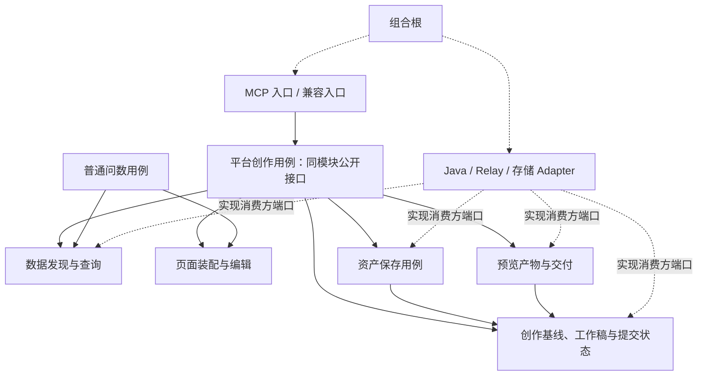

# 创作模块组织与架构调整识别

日期：2026-09-20。状态：仅架构方案识别；用户要求本轮不改代码、不移动目录、不修改正式 Skill 或运行契约。目标目录与名称为建议，不代表已实施或兼容性已验证。

相关：[交互与 Skill 计划](./2026-09-20-authoring-minimal-flow-and-skill-plan.md)、[修订时序与架构图](./2026-09-20-authoring-flow-v2.md)、[Relay 架构影响](./2026-09-20-authoring-relay-impact.md)。本轮重新读取关键源码验证问题，不将 [9 月 18 日评审](2026-09-18-authoring-architecture.md) 的旧测试结果当作当前验证结果。

## 1. 调整目标与范围

以用户确认的流程为目标：同一个 Agent 编排；问题与工作台上下文一起进入；新建和数据修改共用分析与计划审核；样式修改短路径；平台 compose/edit 内部保存合法有效变化（包括 partial）；单份工作稿加不可变提交快照；保留 Relay 预览工具和两个占位符。

本次先覆盖 `metriccanvas-authoring/tool/metriccanvas_authoring`，再识别其 contracts、skill、test-harness、scripts 与仓库导出脚本的联动。其他业务目录不凭“看起来散乱”批量重排；外部 Relay 与 Java 只列出对接影响，不假设可以修改。

原则中的“真源归一”解释为每项事实或规则只有一个权威维护源，而非物理上只能有一份文件。运行快照、独立安装包和协议投影可以复制，须可追溯、可再生成、可验证。

## 2. 主要判断

问题不只是 application/domain/adapters 文件多，而是一些文件的职责由历史入口命名决定，业务能力跨文件重复，调用者依赖另一流程生成的偶然产物形状。单纯搬到更深目录不会消除耦合。

建议维持仓库已有的单一领域上下文，在内部按业务能力组织模块；模块不等于微服务、独立限界上下文或独立 MCP 工具。无需为目录治理引入事件总线、通用工作流引擎、领域事件体系或泛化插件平台。

## 3. 已核实的问题与架构影响

以下路径相对 `metriccanvas-authoring/tool/metriccanvas_authoring/`，除注明者。优先级表示迁移依赖，不表示已发生生产故障。

| 编号 | 现状与证据 | 违反的原则 / 影响 | 目标处理 |
|---|---|---|---|
| A01 · P0 | `application/structure_composition.py:25` 构造 detail/table Spec，调用整页 compose 后取第一个数据源；`application/unified_edit_page.py:42` 新增组件先生成整页再过滤页头 | 低内聚，表现策略影响取数和局部编辑；函数注释称独立取数但实现依赖完整页面 | 抽取真正的查询执行结果接口；构件生成直接消费结果，不造临时整页 |
| A02 · P0 | `adapters/inbound/unified_content_mcp.py:80` 为复用 compose 创建旧 MCP Server，调用 tool 后拆包重包 | 业务复用依赖传输协议，调用层与变化原因不一致 | MCP 入口直接调用共同用例；兼容入口也调用同一用例 |
| A03 · P1 | `domain/page_building.py:15`、`domain/component_editing.py:12` 分别维护构造/编辑集合；多个文件导入 `_component_for`；布局规则又散在 layout_policy/page_structure | 相同能力事实重复维护，私有函数跨模块成为隐式公共接口 | 产品事实从产品契约导出；创作准入、构造、编辑、布局需求按组件聚合，暴露明确内部接口 |
| A04 · P1 | `domain/page_editing.py` 与 `application/unified_edit_page.py:74` 都处理批次、依赖、失败与状态；后者将普通操作再包装成单项批次 | 操作语义双真源；partial 规则改变需改多处 | 一个应用层批次执行器；各操作只负责自己的变更和校验，不再次调度批次 |
| A05 · P0 | `authoring_candidates`、`authoring_submission`、`authoring_recovery` 依赖完整候选记录和父链 | 与已确认的单份工作稿及工具内保存不一致 | 引入工作稿/提交快照职责，迁移提交和恢复的读取来源，取消目标链路的候选选择步骤 |
| A06 · P1 | `adapters/outbound/sqlite_authoring_state.py:27` 定义状态、不变字段及迁移规则；submission 重复核对；recovery 调 submission 的 `_validate_record` | 存储拥有业务规则、恢复依赖另一个用例私有方法 | 提交状态与不变量集中一处；存储只负责原子操作和持久化，复用共同校验 |
| A07 · P0 | `application/authoring_deployment.py:104` 要求 stable_save/exact_read/operation_lookup；已接受单次保存模式，`lifecycle_http.py` 仅声明 current_read/single_save | 部署装配条件与目标行为不一致 | 按目标部署实际能力装配；旧强保存兼容路径隔离，不作为新路径前置或失败回退 |
| A08 · P1 | `server.py`、`content_server.py`、`unified_content_server.py`、`lifecycle_server.py` 及多个 inbound MCP 文件；`ports.py` 汇集身份、数据、资产等类型 | 新旧入口并列不易辨认；泛化名称隐藏职责 | 一个目标组合根；旧入口显式列为兼容。端口按消费模块归属，不再增大总 ports 文件 |
| A09 · P1 | `domain/agent_core.py` 实际是 Ask/Explore 的确定性规则；`domain/idempotency.py` 同时含 canonical_json 与旧 Java 指纹幂等假设 | 命名暗示通用 Agent 或当前普遍能力，实际行为范围更窄 | Ask/Explore 规则独立归属；通用确定性编码与旧幂等策略分开，禁止将旧保证带到新单次保存 |
| A10 · P0 | 实际运行 create 依赖 compose_page_result 注入、emit_preview 与占位符；本仓统一入口用 artifactEnvelope/modelSummary | 两种宿主交付实现不能直接互换；“删除预览工具”会破坏真实流程 | 将预览数据构造与 Relay 协议包装分离；保留现有工具和标记，适配新 compose/edit 产物 |
| A11 · P1 | `contracts/metriccanvas`、bundle `contract-snapshot`、Skill page-metadata references 同时包含页面契约；导出脚本从 `packages/page` 和 authored 输入生成 | 文件相似不等于冗余；手工合并或各自修补会制造漂移 | 记录源→导出→快照→安装包链；派生产物禁止手工维护，不删离线安装所需副本 |
| A12 · P1 | `test-harness` 混有不同 stdio 测试入口、浏览器检查及 model-evals；Skill 含运行参考与打包副本 | 验证层次和部署入口易混淆 | 按纯行为、适配契约、宿主交付、真实模型评测分类；生产装配不导入测试入口 |

A03 中“可渲染”“可自动构造”“允许编辑”是不同事实，不能为了单一真源强行用同一个列表替代三种能力。应消除相同事实的重复定义，并明确不同能力之间的关系。

## 4. 目标模块及变化原因

| 模块（建议名） | 拥有的职责 | 不拥有的职责 | 主要变化原因 |
|---|---|---|---|
| `data` | 指标发现、语义摘要复用、查询需求解析、执行和字段核对、证据投影与结果引用 | 章节布局、保存页面、Relay 占位符 | 数据提供方和取数语义 |
| `pages` | 结构计划、组件构造、数据绑定、布局、局部编辑、操作批次与页面验证 | HTTP、身份获取、Java 保存、模型循环 | 页面表达和产品组件能力 |
| `work` | 创作轮次和基线、工作稿、提交快照、提交状态及合法迁移 | 指标业务判断、Java JSON 字段、预览卡片格式 | 创作一致性与请求生命周期 |
| `assets` | 页面读取、单次草稿保存用例、回执验证；隔离既有发布兼容行为 | 模型业务分析、结果行管理、卡片生成 | 页面资产服务契约及保存政策 |
| `delivery` | 按匹配产物生成 previewJson、定义/预览一致性、交付状态 | 查询新数据、保存草稿、Agent 计划选择 | 工作台呈现和交付协议 |
| `ask` | 普通问数/探索的确定性业务规则与临时页面态 | 平台自动保存 | 普通问数交互 |
| `entrypoints` | MCP 参数与返回投影、目标工具编排入口、兼容旧注册名 | 复制领域规则或创建另一个 MCP 调用自己 | 工具协议和宿主接入 |
| `adapters` | Java/Lab、Relay、存储等具体协议与技术实现 | 另定义业务状态机或自动改口径 | 外部接口和存储技术 |
| `bootstrap` | 依赖选择、能力核对、资源定位与启动 | 运行中的业务决策 | 打包和部署 |

`work` 是创作内部模块，不新增跨会话长期计划产品；`assets` 不复制 Java 的资产领域模型。模块颗粒度可在实现时合并小文件，但职责所有权保持明确。

“变化率一致”指同一原因改变时相关实现集中，而非没有历史测量就给文件编造高低频率。稳定的页面契约不随 Relay 标记变动，Java 字段变化不要求改 Skill，组件策略变化不触碰提交记录。后续可用实际变更记录检验这些假设。

## 5. 建议目录骨架

先保留安装根 `tool/metriccanvas_authoring`，避免把包路径重命名和业务重构混成一次迁移。内部建议如下，不要求建立没有内容的文件或每个概念一个类：

```text
metriccanvas_authoring/
  bootstrap/                  # 目标装配、能力选择、资源加载
  entrypoints/
    mcp/                      # 新平台业务入口与预览兼容入口
    compat/                   # 有明确消费者的旧工具/启动入口
  data/                       # 发现、查询、结果与证据；端口随消费方
  pages/
    composition/              # 页面结构与装配
    components/               # 按组件聚合的创作能力
    editing/                  # 操作与共同批次执行
    validation/               # 页面契约消费与语义校验
  work/                       # 基线、工作稿、提交快照及状态规则
  assets/                     # 读取、草稿保存、回执；旧发布策略隔离
  delivery/                   # 文档/预览投影及交付状态
  ask/                        # 普通问数规则
  adapters/
    java/                     # 数据和资产接口转换，按接口继续区分
    relay/                    # 上下文、产物注入、卡片与占位符协议
    storage/                  # SQLite 等技术实现
```

模块内部只在复杂度确有需要时拆 `model.py / service.py / ports.py` 等。避免再给每个目录复制完整 application/domain/adapters 三层模板；简单纯函数直接放在所属能力内。

保留少量确有多个消费者且语义相同的技术函数，如确定性 JSON 编码。禁止新建宽泛 `common/utils/helpers/core` 收纳暂时不知道归属的业务代码。

## 6. 依赖方向与用例编排



实线是调用依赖，虚线是装配或端口实现关系，不是网络层级。平台用例可以放在 `pages` 的应用入口中，不另外建设通用协调平台。它先消费数据结果，再构造/编辑页面，使用 work 冻结结果、assets 保存；预览交付继续由现有 emit 工具入口消费同一产物，不要求重复整个用例。

依赖约束：

- 纯页面构造和状态规则不 import MCP、HTTP 客户端或 SQLite。
- `data` 不调用页面装配；`pages` 的构造器不直接执行 DQE；需要新数据由上层用例先取得。
- `assets` 不重新选择组件；`delivery` 不补查业务数据、不保存页面。
- 端口在需要能力的模块声明；Adapter 实现端口，不让应用层依赖具体 Adapter。
- 跨模块只调用公开接口，不导入 `_component_for` 或用另一协调器的私有方法做校验。
- 兼容层单向委托新内核；新内核不能调用旧 MCP Server，也不能因新接入缺失退回旧无约束路径。
- Ask 可以复用数据与构造能力，但不默认调用平台保存用例。

## 7. 真源与派生资产清单

| 信息或规则 | 权威维护位置 | 可以存在的派生物 | 约束 |
|---|---|---|---|
| 页面字段、组件产品契约、版本策略 | 现有 `packages/page` 及既有产品参考维护源 | `contracts/metriccanvas`、bundle snapshot、Skill 页面参考 | 通过现有导出链；不在 Python 和提示词手工另写同一规则 |
| 创作输入契约 | `metriccanvas-authoring/contracts/authored` 中各项真实维护源 | 展开后的 MCP Schema、conformance 和 manifest | 记录各文件是手写输入还是生成结果，不把 authored 目录所有文件都默认当手写真源 |
| 组件的创作准入、构造与编辑策略 | `pages/components` | 工具能力投影、可选项、测试用例 | 不与产品“可渲染”能力混为一谈 |
| 操作顺序、依赖、partial/unchanged | 一个批次执行规则实现 | 新建与编辑调用结果 | 不在两个调度器复制 |
| 工作稿与提交状态不变量 | `work` | 数据库约束、回执状态摘要 | Adapter 可复用规则核对，不能自建第二套迁移表 |
| Java 字段与错误映射 | 对应 Java Adapter；外部协议事实以实际提供方为准 | 内部类型和模型摘要 | 新旧 Java 契约显式区分 |
| Relay 标记、卡片和注入协议 | Relay 实际协议及其 Adapter；本仓保留已验证兼容说明 | emit 工具参数、Skill 输出示例 | 两个标记不能因目录重构或简化工具数量而更名 |
| Skill 工作流 | 各入口维护源；共享分析规则一个维护源 | 可独立安装的 Skill 包 | 不把完整架构规划注入模型上下文 |
| 保存 document | 本次冻结的页面定义；保存后以核验回执关联 Java 资源 | 预览定义部分 | 不把 previewJson initial 保存为页面定义 |
| 预览结果 | 匹配本次页面定义与执行范围的程序产物 | previewJson、卡片、占位符替换内容 | 允许初始数据差异，不要求与 document 字节相等 |

当前导出链依据 `tools/scripts/export-authoring-contracts.ts`；bundle 完整性检查依据 `metriccanvas-authoring/scripts/check_bundle.py`。本轮不运行生成器，以免改动大量派生文件。

## 8. 命名与行为一致性

- 外部工具名可以保留兼容名称；其文档和返回结构必须明确新副作用。目标平台 `compose_page` / `edit_page` 会保存草稿，不能继续描述为“仅产生候选、不保存”。
- 内部区分 `assemble_page`（纯装配）和 `compose_and_save_draft`（平台用例）等明确语义；名称为建议，不要求现在冻结函数签名。
- `page_metadata_emit_preview` 当前准备预览卡片，Relay 最终替换并交付；它的成功不等于用户已经看到了页面。内部宜称准备预览，外部名字保留兼容。
- `query_data` 承担执行和证据，不能只返回元数据；discover 不应偷偷生成完整页面。
- `unified_*`、`content_*` 等历史名称需要按实际职责归位，不能长期用“新/统一/旧”替代业务含义。
- `candidate` 不再作为目标工作稿命名；但指标候选、查询候选等仍有有效含义，不能全仓字符串替换。
- `draftId` 是产品表达，`page_metadata_id`、`revision_id` 是既有协议身份；明示映射，不凭名称假设一个 ID 能替代全部身份。
- 不用 idempotency 或 recovery 名字暗示远端 exactly-once 或可自动重发。单次保存与旧强保存模式各自说明真实保障。

## 9. 其他目录的组织影响

| 目录 | 本期识别的目标 | 明确不做 |
|---|---|---|
| `contracts/authored` | 按数据、页面创作、工作状态、交付、兼容协议建立索引；迁移路径需保持 `$id/$ref` 与导出一致 | 不为视觉整齐直接移动所有 Schema |
| `skill` | 主文件路由，共同分析流程，create/edit 入口差异，Relay 交付规则单独参考；进展播报和最终标记明确 | 不删现有 emit 步骤，不把工具协议实现写入提示词 |
| `test-harness` | 按模块行为、Adapter 契约、MCP/Relay 交付、模型评测分类；fixture 与真实接线证据区分 | 不把测试服务器当生产组合根 |
| `scripts` 与根 `tools/scripts` | 区分源码导出器与独立 bundle 校验器，标明调用方向、输入、输出 | 不为了收进一个目录破坏独立安装包自校验 |
| `contract-snapshot` 与安装参考 | 标记 generated、维护来源与生成命令 | 不手改、不删必需离线副本 |
| `ARCHITECTURE.md` / `RELAY-HANDOFF.md` / ADR | 实施时同步真实入口和状态；本轮用目标计划链接防止读者混淆 | 不把尚未实施目标覆盖为现状；不顺手改已接受决策 |

## 10. 分步迁移建议与退出条件

1. **先对账真实入口与产物。** 锁定当前 Relay 注入/替换、Java 资源/修订、document/previewJson 的样例；列旧消费者。退出条件：新旧调用与保存/预览状态可对照，非只靠 Skill 文案。
2. **先建立真实复用接口。** 从 compose 提取查询结果和组件构造能力，旧新入口调用共同用例。退出条件：取数不造整页，新增组件不拆页头，内部不创建 MCP Server。
3. **统一操作与组件所有权。** 消除重复调度和相同能力清单。退出条件：一种操作规则只改一处；组件创作变化不触碰保存或 Relay。
4. **收敛工作稿与保存。** 平台工具内部保存，冻结提交内容，迁移旧候选回读依赖。退出条件：partial 保存、未知写入不重发、无变化不保存；旧候选链不作为目标启动前提。
5. **保留并接通 Relay 交付。** compose/edit 产物经兼容注入供 emit 工具使用，两个标记原样保留。退出条件：真实工作台看到匹配修订的预览，预览失败不再次保存。
6. **最后物理归位与退役。** 按本方案移动模块、整理测试、更新安装路径与文档，旧入口仅留有消费者的兼容委托。退出条件：包安装、Schema 引用、导出检查和真实消费者均通过；不能先删兼容再补调用者。

步骤是依赖顺序，不要求每一步都大范围搬文件。每一步应可独立验证；代码回退不重放未知远端写入。旧数据保留/转换、候选与提交记录生命周期要在实际迁移中明确，不能为了清理目录删运行记录。

## 11. 架构验收：按变化场景检验

| 变化场景 | 应主要变化的位置 | 不应被迫变化的位置 |
|---|---|---|
| Java 某字段改名 | Java Adapter 和契约样例 | Skill、组件构造、操作执行器 |
| Relay 修改预览包装 | Relay Adapter、协议参考和交付测试 | 查询领域、页面组件、Java 保存 |
| 新增一种已被产品支持的创作组件 | 对应组件能力与显式注册/一致性检查 | 通用批次循环、提交状态、数据库 |
| 调整 partial 结果聚合 | 共同操作规则与结果投影 | 每个入口各写一次、存储迁移表 |
| SQLite 换存储 | 存储 Adapter 与原子性契约测试 | 业务状态机、Skill、查询语义 |
| 新增数据提供方 | 数据端口的 Adapter 与真实样例对账 | 页面保存、Relay 标记 |
| 数据修改使用已有结果 | 共用分析流程和有效性判断 | 不重新构建整页，不绕过计划审核 |
| 保存成功但预览失败 | 交付状态与匹配产物重用 | 不触发再次保存或查数 |

实施阶段通过模块依赖检查、公共接口行为测试、契约一致性和真实 Relay 渲染验收证明这些边界。新增产品组件本来就需要产品契约与渲染配套，不把合理跨模块协作误判为耦合缺陷。

## 12. 本轮交付边界

已完成：现状证据核对、模块职责与目标目录建议、真源表、命名规则、迁移影响和架构验收标准。

未执行：源码/目录移动、正式 Skill 改写、Schema 迁移、生成器运行、测试代码新增、生产联调。没有把旧评审的测试通过结论算作本轮证明。后续实现前应依实际接口和存活消费者细化改动批次；本方案不是允许一次性全仓重排的指令。
