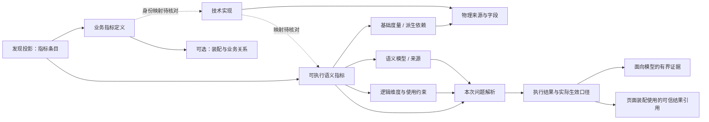

# 数据上下文与查询证据全景：数据侧可行性对账稿

日期：2026-09-20。版本：v2，纳入可查询的语义模型与指标详情。状态：讨论草案，供数据侧确认可提供的信息、获取阶段与语义；不是已批准接口、JSON Schema 或实施要求。

目标：先展示理想情况下创作 Agent 可以取得的全部信息，再逐项确认哪些已有、哪些可开放、哪些需补维护、哪些暂时不可行。不要把“理想全景”理解成一次返回全部信息，也不要求为此重建 Lab。当前 Lab 分词与 DQE 执行链继续使用，绕过 Lab 的试验仍挂起。

**近期范围已收敛：** 用户确认先基于现有语义模型完成页面自动生成，按所选指标补充必要详情。本文61项信息用于对账和演进，不是全部实施前置。近期链路、五项实际缺口及Skill调整见 [最小生成链与Skill计划](./2026-09-20-authoring-minimal-flow-and-skill-plan.md)。

## 1. 证据与阅读方法

| 输入 | 已观察到的内容 | 不能由此推出的结论 |
|---|---|---|
| [已有指标信息](../../调查报告/已有指标信息.md) | 指标名称、metric_code、数据集 ID/名称、数据集维度名、角色列表 | 不证明有完整口径、指标唯一身份、合法维度组合或当前用户权限 |
| [Tokens DQE 返回](../../调查报告/数据/tokens的dqe查询结果.json) | 数据行、结果列、模型与指标内部 ID、表达式、别名、时间层级、默认条件、实际过滤、格式配置 | 只是一次执行的返回；不证明返回全模型，不证明详细字段可在查数前读取 |
| [DataFilter 说明](../../调查报告/数据/DataFilter说明.md) | 外部展示规则编号、顺序处理、缩放、百分号、颜色和 HTML 等行为 | 展示格式不等于业务定义；currencyFlag 等其他编号的含义不由此自动得到 |
| [指标装配试验](../../调查报告/数据/indicator-assembly.json) | 原子度量、修饰词、周期、复合公式、物理字段定位的草案 | 不是全量权威模型，不证明关联路径、口径或执行映射已验证 |
| [可查询语义模型](../../调查报告/数据/语义层查询结果.json) | 一个Tokens模型：物理SQL表、逻辑基础度量、维度、可查询指标、派生配置、字段树与权限配置 | 不证明全部字段非空、列举维度可任意组合，或SQL可绕过原服务直接执行 |
| [指标详情](../../调查报告/数据/metric-detail.md) | 机会点数的业务定义、单位、统计范围、维度定义、技术指标、关联来源与物理字段、治理信息 | 与Tokens不是同一指标；业务定义、技术指标、语义指标间不存在已证实的全链映射 |
| 用户最新补充 | 可以查询语义层信息与指标详情，样例未全部一一对应；标识映射可导出；Lab 分词仍为当前链路 | 修正前版“所有详细定义只能查数后取得”的过宽假设；具体接口、投影及覆盖范围仍需对账 |

证据标记：**I**＝初次匹配样例可见；**E**＝执行样例可见；**F**＝DataFilter 说明；**A**＝装配试验草案；**S**＝新增语义模型；**B**＝新增业务指标详情；**U**＝用户说明；**N**＝未在上述材料中证实。字段出现但为空，标“S/空”等，不算该信息已经可用。N 不是断言底层不存在。

获取阶段：**D**＝能力发现时；**P**＝实际执行前的解析/校验；**R**＝执行后。表中是理想获取阶段，实际阶段请数据侧填写。优先级：**P0**＝优先核对，影响身份、口径、结果可信性；**P1**＝减少上下文与补查的重要增强；**P2**＝更深入分析或治理所需。优先级不等于必须立即建设。

## 2. 总体结构与关系



三类对象分开：

- **稳定定义**：指标、维度、来源、查询能力及其关系，属于数据上下文快照。版本化依据也需确认。
- **本次解释**：用户问题解析成什么指标、筛选和时间，包含默认值、候选与歧义，不覆盖稳定定义。
- **执行证据**：实际查了什么、返回什么、范围是否完整，包含业务数据行，不归入 Schema 元数据。

同一业务指标可以有多个执行绑定；不同来源的同名指标不能自动合并。初次匹配名称、metric_code、业务资产guid、业务指标内部ID、技术指标ID、执行指标ID、model_id、dataset_id分别保留，在映射核对前不假定它们相等。metric_code 不作为跨层唯一指标键。

### 2.1 v2 的核心修正：先整合现有知识，再补缺口

现在已有三类查询前知识源：初次匹配索引、语义模型详情、业务指标详情。业务数据仍由执行得到。近期重点从“要求数据侧从零补齐一套元数据”转为：**建立来源限定的身份关联、提取机器可用定义、检查冲突、按任务投影给模型**。

| 模型对象 | 回答什么 | 新材料依据 | 理想关系 |
|---|---|---|---|
| 指标条目（发现投影） | 用户要找哪个可用指标，有哪些候选差异？ | I＋S＋B 的相关摘要 | 不替代下列对象；汇总已确认关联和缺失信息 |
| 业务指标定义 businessMetrics | 为什么衡量、统计谁、业务口径与责任归谁？ | B.metric.attributes、businessAttributes | 一个定义可对应多个技术实现，关系需明确映射 |
| 技术实现 technicalMetrics | 该业务指标在哪些来源和字段上落地？ | B.metric.techMetric、techMetricRelatedSourceList | 引用业务ID与物理来源；不自动等于DQE可查询指标 |
| 语义模型 semanticModels | 哪组可执行指标/维度共享一个模型和来源？ | S.id、logical_schema、physical_schema | 模型内保存字段、指标和关系；不等于业务域 |
| 可执行语义指标 semanticMetrics | DQE实际可选择什么，计算依据是什么？ | S.logical_schema.field_schema.metrics | 绑定模型，引用基础度量或其他语义指标 |
| 基础度量 measures | 表达式使用哪些逻辑数值字段？ | S.logical_schema.field_schema.measures | 引用逻辑字段及物理来源；与业务“原子指标”分类分开 |
| 维度定义与维度实现 | 业务维度是什么意思、在模型中如何表达与使用？ | B.metricDimension 与 S.dimensions | 两端通过明确映射相连，保留多层级、属性、时间角色 |
| 物理来源 physicalSources | 数据从何处来、SQL/表/字段是什么？ | S.physical_schema；B.tables 与技术来源 | 作为可追溯依据留程序侧；不是模型自由查询入口 |
| 事实与映射证据 evidence / mappings | 哪条关联来自原始ID、哪条只是候选？是否冲突？ | 跨文件及文件内的显式引用 | 每条边保留来源路径、状态、版本与范围 |

这是数据建模草案中的分层对象，不是在产品词汇表中新增九个已批准领域概念。无需每层建独立服务，也不要求引入图数据库。关系使用显式引用即可。

### 2.2 新样例的结构事实与不确定性

- S 有 **1个物理SQL表、10个基础度量、9个逻辑维度、23个语义指标**；23个指标中9个有formula，14个有calculate_conf。**formula为空不能再当作计算定义缺失**，需要联合读取计算模式。
- B 的“机会点数”提供measurement=个、去重计数描述、天/月/年周期及“外部、公有云、按创建时间”的统计说明。它证明业务语义可获得，但不能填入Tokens指标。
- S.id 与 I 中Tokens流水数据集ID完全相同，名称也相同：可以记录这份样例的ID对应证据，不能推广为全系统 dataset_id 永远等于 model_id。B 的机会点详情和 E 的Tokens执行样例没有因此串成同一条链。
- B.metric.guid 与 B.metric.techMetric.businessMetricId 是两个不同ID；应分别记录资产GUID与内部业务ID，不能覆盖成单一id。B.metric.attributes.techMetric 和 metric.techMetric 是两种表示，需检测一致性后归一化，不维护两个独立真源。
- S 中“近30天tokens流水变化”的formula/display_formula引用了7天前字段。保留为名称与公式的待核对冲突；不擅自把7改成30，也不凭名称重算。
- S.classification=atomic 的指标也可能是差值或比率表达式。这里的atomic是源系统分类，不能等同于A草案的业务原子指标，更不能推导可加性。
- S.logical_schema.relations为空，但physical_schema.sql_text内有cross join；逻辑关系集合为空不等于没有物理依赖。field_tree是展示组织，不直接构成业务本体。
- S.description中updateTimeColumn指向账期，SQL还产生“数据截止日期”字段。前者是字段约定，后者是来源表达式，都不等于已知本次执行的实际数据截止值。

可解析的结构与证据样例见 [v2语义对象与关联证据](./2026-09-20-data-context-semantic-evidence.json)。

### 2.3 不能合并的五种维度集合

| 集合 | 当前样例 | 它证明什么，不证明什么 |
|---|---|---|
| 业务统计维度 | B.metricDimension解码后6项 | 业务上认可的分析语义；不保证某个DQE模型已实现 |
| 技术关联维度列 | B相关列18项中15项标DIMENSION | 技术落点相关列；编码列/名称列可以对应同一业务维度，不能按列数计分析维度 |
| 模型定义维度 | S.field_schema.dimensions有9项 | 模型定义了这些维度；不能自动认定每个指标都可按全部维度分组 |
| 指标声明的维度 | S中9个公式指标有dimensions，14个派生指标该字段为空 | 单指标显式配置；空值的继承/不支持/未维护语义待解释；visualization_level保留为系统项待分类 |
| 明确准入配置 | B.advanceConfig.dimensions_can_use.ids为空 | 配置存在；空集合是否表示无限制、未配置或禁用，必须由服务方说明 |

目标结构保留各集合与来源，并由数据侧规则提供effectiveDimensionUses（filter/groupBy/drill及组合限制）；不能简单求并集或交集代替规则。S的8个普通维度虽然有hierarchies包装，但每个仅一层；B六个业务维度的hierarchy/records均为空，不自动产生可下钻的组织树。

### 2.4 解析、关系和覆盖质量也需要结构化

- B.metricDimension等字符串化JSON采用rawPath＋decodedPath留证；B的两份techMetric表示本次解析后相等，可去重，但未来不一致时返回冲突。
- B技术来源有18个关联列，tables.columns只展开2个；18个列的dataType均为空，只有1个associatedEntityId非空且指向业务部维度。未绑定的17个不能按remark自动补边。
- B物理表rowCounts/tableSize的0保留原值及unknown解释状态，不当作空表证明。
- S的23个指标unit均为空；全部有format不代表单位已知。14个派生配置中的from都能在本模型指标集合解析，是可用的显式依赖；完整比较/占比语义仍需规则说明。
- 关系应区分定义关联、查询准入和本次执行绑定：只有源中存在某字段不能提升为“可查询”，查询成功一次也不能提升为所有身份和时间范围均支持。
- 每个来源保存coverage、局部版本与采集时间；模型version、技术指标version、业务资产updateTime不得强行拼成一个未经保证的全局业务版本。

以下为**逻辑形状示意**，不要求服务采用这些字段名，不是一次 MCP 返回体。各集合的详细字段见后续字典。尖括号内容为占位符，不是生产值。

```json
{
  "catalog": {
    "snapshot": {"version": null, "capturedAt": null, "coverage": "unknown"},
    "metrics": [{
      "ref": "<指标条目引用>",
      "identity": {"name": "<指标名>", "aliases": [], "metricCode": null},
      "semantics": {"definition": null, "quantity": null, "aggregation": null, "time": null},
      "bindingRefs": ["<执行绑定引用>"],
      "relationRefs": [],
      "presentation": {"rawRules": null, "normalized": null}
    }],
    "bindings": [{
      "ref": "<执行绑定引用>", "metricRef": "<指标条目引用>",
      "sourceRef": "<来源引用>",
      "providerIdentifiers": {"datasetId": null, "modelId": null, "measureId": null},
      "queryName": null, "dimensionUses": [], "timeCapabilities": null,
      "combinationConstraints": null
    }],
    "dimensions": [{"ref": "<维度引用>", "definition": null, "valueAccess": null, "hierarchies": null}],
    "sources": [{"ref": "<来源引用>", "capabilities": null}],
    "businessMetrics": [],
    "technicalMetrics": [],
    "semanticModels": [],
    "semanticMetrics": [],
    "measures": [],
    "physicalSources": [],
    "mappings": [],
    "assemblyDefinitions": [],
    "factEvidence": [{
      "path": "/catalog/metrics/0/semantics/quantity",
      "state": "unknown", "sourceRef": null,
      "observedAt": null, "reason": "待数据侧提供"
    }]
  },
  "resolution": {
    "question": "<本次问题>", "status": "unresolved",
    "units": [], "alternatives": [], "assumptions": [], "issues": []
  },
  "execution": {
    "requestRef": "<本次请求引用>", "units": [{
      "unitRef": "<取数单元引用>", "status": "not_executed",
      "effectiveScope": null, "fields": [], "coverage": null,
      "resultRef": null, "queryArtifactRef": null,
      "modelEvidence": null, "issues": []
    }]
  }
}
```

示意里的 null/空数组表示尚未填充，不证明“不存在”。正式数据建议用 `factEvidence.state` 区分 `known / unknown / not_applicable / unavailable / conflict`，并以对应状态明确空集合是否经确认。`unsupported` 属于能力检查的否定结果，不能与缺失元数据混为一谈。未经业务确认的 A 类关系应标为 proposed，并保留出处。

## 3. 稳定定义字段字典

### 3.1 快照、身份与执行绑定

| 编号 | 建议字段 | 类型与含义 | 当前证据 | 阶段 / 优先级 | 暂不可得时的处理 |
|---|---|---|---|---|---|
| C01 | snapshot.version / capturedAt | 字符串/时间；所用定义的版本与采集时点，采集时间不等于源版本 | S 顶层version/update_date；B多种updateTime和技术version；全局版本语义未确认 | D / P0 | 记录采集时点和局部源版本，不伪称跨请求一致快照 |
| C02 | snapshot.coverage / scope | 枚举＋范围；全量或子集、主题范围、分页、返回是否完整 | I初次目录；S一个完整形状的模型；B一个指标详情；全域覆盖边界待确认 | D / P0 | 标明未知或局部，未命中不等于系统无此指标 |
| C03 | metric.ref / identity | 稳定引用＋名称、别名、业务域、外部编码 | I名称/code；S语义ID/model_id；B资产guid、业务code、qualifiedName；跨层身份仍需映射 | D / P0 | 保留来源限定的身份，不按同名或同 code 合并 |
| C04 | binding.providerIdentifiers / queryName | datasetId、modelId、measureId 与执行名称；连接指标条目与查询入口 | S.id与I的Tokens dataset_id本样例相等；B有techMetric/来源/字段显式ID；跨层全链未齐 | D / P0 | 未核对的跨阶段映射不得自动绑定；沿当前已可执行链处理 |
| C05 | binding.selectionRules | 多来源的差异、默认来源及适用条件 | I的KC数量关联两数据集；B technical source允许列表；选择规则仍N | D / P1 | 展示候选差异或保留当前服务选择及其依据，不能宣称等价 |
| C06 | factEvidence | 字段出处、版本、可信状态、冲突及原因；可由我们记录，也可由源提供 | S/B存在局部时间戳、版本、状态及B治理信息；字段级统一证据需本方整理 | D/P/R / P0 | 至少保留原始响应与明确未知，不能用模型补值冒充源事实 |

### 3.2 指标的业务含义

| 编号 | 建议字段 | 类型与含义 | 当前证据 | 阶段 / 优先级 | 暂不可得时的处理 |
|---|---|---|---|---|---|
| M01 | semantics.definition / population | 文本或受控条件；衡量什么、统计哪些对象、包含和排除什么 | B definition/objective/statisticalDescription提供业务解释；S definition通常重复名称；不能跨样例填补 | D / P0 | 按原指标调用，不把名称解释当作确认口径 |
| M02 | semantics.quantity | kind、unit、currency、rawScale、ratioRepresentation；原始数值单位及刻度，例如小数比率与百分数值 | B机会点measurement=个；S的23个unit为空、format单位/币种为空；Tokens单位仍未知 | D，R可补充 / P0 | 保留原值，单位未知；禁止猜币种、重复缩放或自动乘100 |
| M03 | semantics.formula | 原始表达式、语言、说明、引用指标；定义口径，不等于授权执行任意 SQL | S 9个formula＋14个calculate_conf；B function为文本且技术表达式为空；A公式草案 | D按需 / P1 | 当前执行链可继续；不凭缺失表达式自行重算指标 |
| M04 | semantics.aggregation | 可加性、跨时间处理、去重键/范围、允许折叠的条件 | S基础度量aggregator=SUM；B明确机会点去重计数；跨维度/时间可加性仍未声明 | D / P0 | 聚合标记或 SUM 不能证明可加性；缺失时不跨粒度折叠结果，目标粒度重新查询 |
| M05 | semantics.time | 统计时间角色、事件/快照含义、累计或当期、默认窗口、时区、自然/业务日历 | B统计说明指定机会点创建时间、statisticalPeriod；S默认时间与账期层级；日历/对齐仍需解码 | D / P0 | 原样保留已知默认规则，影响答案的时间歧义明确暴露 |
| M06 | relations.comparison | 与基础值、同比、环比、变化量的关系；基期对齐、相对增幅/百分点、零分母处理 | S calculate_conf.conf.from显式引用基础语义指标，type/classification为比较规则；枚举含义仍待确认 | D / P1 | 使用已有指标，不从名称自行生成或替换计算 |
| M07 | semantics.qualityPolicy | 缺失值/零值区分、异常值含义、可用时间范围及更新约定 | B refreshFrequency=天；S description和SQL有截止字段线索；实际新鲜度与缺失规则仍未证明 | D，R校验 / P1 | 无数据不变成零；展示空值规则不作为业务缺失规则 |
| M08 | relations.analysis | 获批归因定义、可比较指标、分析维度、阈值/目标及适用范围 | S correlations为空；B objective可作业务目的，不等于获批归因规则 | D按需 / P2 | 允许描述差异；不由关联推断因果或虚构目标 |

### 3.3 维度、时间与组合支持

| 编号 | 建议字段 | 类型与含义 | 当前证据 | 阶段 / 优先级 | 暂不可得时的处理 |
|---|---|---|---|---|---|
| D01 | dimension.identity / definition | 稳定 ID、名称、别名、类型、业务含义、所属来源 | B metricDimension解码后6个业务维度含code/id/说明；S 9个模型维度含类型与字段身份 | D / P0 | 保留来源限定名称；账号/华为云账号等不自动认定同义 |
| D02 | binding.dimensionUses | 指标在该来源可按哪些维度筛选/分组及支持的运算符 | I维度名；S维度及部分指标dimensions/filter_type/group_type；B统计维度；三者语义不能等同 | D / P0 | 数据集有此维度不等于每个指标支持任意用法 |
| D03 | dimension.valueAccess | 是否可搜索取值、值 ID/展示名、别名、分页与范围；只返回相关值 | B维度description含枚举例子，records为空；S is_vectorized_enums等配置；完整可检索值服务未证实 | D/P按需 / P1 | 继续复用 Lab 条件解析；不全量拉取客户/账号名单 |
| D04 | dimension.hierarchies | 层级、父子关系、基数及生效时间；业务组织层级与时间层级分开 | S账期时间层级；B业务维度description有层级说明，但hierarchy/parent字段为空；机器关系待核对 | D / P1 | 不从名称或排列顺序推断组织归属或下钻路径 |
| D05 | binding.timeCapabilities | 时间维引用、支持粒度/窗口、时间范围约束 | S时间层级与visible；B statisticalPeriod；支持粒度及窗口组合仍需确认 | D / P0 | 年/月层级存在不证明每指标均可执行；分钟不可见也不直接判不支持 |
| D06 | binding.combinationConstraints | 指标＋维度组合＋时间＋筛选的支持约束或检查能力；不要求穷举所有组合 | S指标dimensions部分为空；I列表及B业务维度均不证明组合可执行 | D/P / P1 | 允许执行时得到明确拒绝；不静默删除不支持的条件 |
| D07 | dimension.cardinalityHint | 基数估计、估计范围、采集时间与是否精确 | N | D/P / P1 | 用保守返回预算，不能凭估计声称实际结果总行数 |
| D08 | relations.crossSource | 跨来源维度等价、键映射、关联基数、去重与历史归属规则 | B部分associatedEntityId连接业务维度；技术sourceGuid连接物理表；S relations为空且SQL含依赖，跨源join规则不完整 | D按需 / P2 | 不能按同名维度自动 join；分别查询和展示 |

### 3.4 来源能力、权限与展示

| 编号 | 建议字段 | 类型与含义 | 当前证据 | 阶段 / 优先级 | 暂不可得时的处理 |
|---|---|---|---|---|---|
| S01 | source.capabilities | 协议类型、可执行查询或一次性结果、是否可保存刷新；实现细节留程序侧 | S模型id/ds_type/物理与逻辑定义；E dqe对象；可提交/刷新契约仍待核对 | D / P0 | 不把查询说明或执行回显直接当可刷新查询定义 |
| S02 | capabilities.batch / projection / ordering / limit | 批量、字段选择、服务端排序、聚合后TopK/分页、各类限制及作用顺序 | E orders/limit/offset；limit=-1；支持边界未知 | D/P / P1 | 逐项确认；不能先截断原始数据再称全量排名 |
| S03 | capabilities.executionLimits | 服务已有并发、超时、返回量、调用限制及计数口径 | 此批样例 N | D/P / P1 | 使用本方保守预算，不承诺控制上游内部调用 |
| S04 | accessScope | 元数据可见范围、执行时身份范围、指标/列/行限制及检查阶段；只给不敏感摘要 | S权限开关、permission_list及SQL权限标记；B安全级别/治理状态；不等于当前用户实际可执行范围 | D/P/R / P0 | 空角色表不等于开放；发现可见不等于当前用户可执行 |
| S05 | presentation.rawRules / normalized | 有序原始 dataFilters、规则版本、结构化显示刻度/精度/符号/空态；与原始数值分离 | S查询前可见description.dataFilters与format；E返回同类结构；F编号规则；优先级仍未知 | D可取部分，R核对 / P0 | 未知编号留痕，不猜；规则冲突保留两源并报告，不能任意选优先级 |
| S06 | presentation.direction / thresholds | 业务正负向、阈值及颜色建议的出处和适用范围 | S format/description＋F颜色规则；正式业务方向声明仍未证实 | D按需 / P2 | 不把颜色方案认定为“业务越高越好”的权威定义 |

### 3.5 v2 新增：多层语义对象及可追溯关系

这些字段补足v1将多类指标压成单一metric/binding的不足。仍按来源保留原始类型；规范化结果不覆盖源值。

| 编号 | 建议字段 | 类型与含义 | 当前证据 | 阶段 / 优先级 | 暂不可得时的处理 |
|---|---|---|---|---|---|
| G01 | businessMetrics.identity | assetGuid、internalBusinessId、code、qualifiedName、catalogScope；分别标记命名空间 | B.metric.guid/attributes.code/qualifiedName；techMetric.businessMetricId | D / P0 | 不能把这些ID互相替代；内部业务ID在当前例中是显式引用，具体归属需提供方确认 |
| G02 | businessMetrics.meaning / stewardship | 业务目的、统计对象、定义、范围、单位、刷新约定、解释部门/责任角色及发布状态 | B.attributes、businessAttributes、metricRecords | D / P0 | 业务状态与技术状态分开；员工标识/完整记录留程序侧，默认只投影必要业务说明 |
| G03 | technicalMetrics.realization | technicalId、businessMetricRef、version、sources、字段角色和表达式引用 | B.metric.techMetric及嵌套source/column列表 | D按需 / P1 | 有物理落点不等于有完整SQL或DQE映射；不以模型生成SQL补缺 |
| G04 | semanticModels.identity / schema | modelId、来源、域、版本与字段集合；field_tree另存为展示信息 | S顶层、logical_schema、physical_schema | D / P0 | 模型与业务域、业务资产分开，不按同名合并 |
| G05 | semanticMetrics.calculation | 有标签的计算描述：expression、derivedConfig、providerManaged、unknown/conflict；保留原始枚举 | S formula、calculate_conf、classification、calculate_logic | D / P0 | formula为空时检查calculate_conf；枚举未解码不翻译成确定业务算法；多份定义冲突单独标记 |
| G06 | semanticMetrics.dependencies | 依赖的语义指标/基础度量引用、引用类型、证据路径、解析状态 | S calculate_conf.conf.from；formula中的字段引用 | D按需 / P0 | from可做精确ID关联；表达式依赖提取须标derived及解析器版本，不等同于完整计算语义 |
| G07 | measures.fieldBinding | 逻辑基础度量ID、fusion ID、来源字段、聚合器、可见性、类型和formatter | S.field_schema.measures共10项 | D按需 / P1 | 不把隐藏基础字段直接列为用户可查询指标；SUM不证明跨粒度可加 |
| G08 | dimensionDefinitions / dimensionBindings | 业务维度code/id/属性与模型维度、level/字段实现之间的映射 | B.metricDimension、associatedEntityId；S.dimensions | D / P0 | 业务维度、模型字段、组织层级区分；只有文本同名时保留候选关系 |
| G09 | physicalSources.lineage | 来源表、字段、逻辑SQL、上游引用、时间与权限注入线索，标明完整性 | S SQL虚拟表；B sources/tables/columns；存在部分显式ID关联 | D程序侧 / P1 | SQL不全量给模型，不改变现有鉴权执行路径；SQL文本血缘提取只是解析证据 |
| G10 | mappings | from/to带命名空间、关系类型、状态、证据来源、适用版本/环境 | S↔I样例ID对应；B内部ID边；跨B↔S与S↔E样例未全对应 | D / P0 | 区分source_declared/observed_id_match/proposed/conflict/unresolved；不把猜测绑定投入执行 |
| G11 | governance.sourceStates / consistency | 每来源的状态/版本/时间，发布和审核含义、冲突检查结果；没有全局状态优先级 | B多层状态与审核记录；S status/version；枚举含义部分未知 | D/P / P1 | 不将status=0/-1/2映射为允许/拒绝执行；保留冲突并请求解释 |
| G12 | discoveryProjection | 面向任务的精简指标卡：定义、单位、关键支持、映射状态、重大缺口、详情引用 | 本方从I/S/B归一化派生 | D / P0 | 投影不能丢掉影响口径的冲突，不能把提取文本变成已确认结构化规则 |

对来源优先级按问题划分：业务定义以业务口径作者为依据，实际计算记录语义模型/执行表达式，展示引用格式配置，权限以执行服务为准。冲突时同时保留，不能通过“业务详情优先”之类全局规则静默覆盖另一源。

## 4. 本次解析与执行证据字段字典

### 4.1 本次问题解析（不属于稳定指标定义）

| 编号 | 建议字段 | 类型与含义 | 当前证据 | 阶段 / 优先级 | 暂不可得时的处理 |
|---|---|---|---|---|---|
| Q01 | resolution.units | 每个取数单元选择的指标、绑定、groupBy、filters、时间与期望结果形状 | U Lab返回维度/条件；E 有最终查询 | P / P0 | 保留原问题与服务解析；未执行前不能宣称结果口径已核实 |
| Q02 | resolution.alternatives / issues | 歧义候选、差异、未匹配和不支持原因、阻塞性；不以任意分数代替解释 | 本批未提供真实分词响应 | P / P0 | 影响答案的歧义停在此处，不默选另一口径 |
| Q03 | resolution.assumptions | 每项条件来自用户显式指定、源默认、Lab推断还是模型建议 | E 默认条件与实际条件均有；决策来源 N | P / P0 | 无法确认来源时标未知，展示实际采用范围 |
| Q04 | resolution.costHint | 行数/时间/资源估计、估计依据与不确定性；非执行承诺 | N | P可选 / P2 | 不以精确成本估计为执行前置，沿本方和上游限额 |

### 4.2 执行结果与实际生效范围

| 编号 | 建议字段 | 类型与含义 | 当前证据 | 阶段 / 优先级 | 暂不可得时的处理 |
|---|---|---|---|---|---|
| R01 | unit.status / issues | 单元成功/空结果/拒绝/失败/未执行，错误类别与是否可重试；批量必须逐项对应 | E code=SUCCESS；其他状态契约未给出 | R / P0 | 不以整个HTTP成功替代单项成功，不把失败当空值 |
| R02 | effectiveScope | 实际指标绑定、分组、时间、条件、排序与限制；与Q01差异可核对 | E dqe.measure_columns/dimension_columns/filters/orders | R / P0 | 没回显的部分标“未核实”，不能把请求原样复制成执行证明 |
| R03 | fields | 稳定输出字段引用、外部键、标签、类型、角色、单位、空值和格式说明 | E columns 的 alias/caption/id/data_type/model_type/description | R / P0 | 外部ID稳定性待确认；映射由工具保存，不让模型按位置猜 |
| R04 | coverage | returnedRows、matchedRows、truncated、hasMore、缺失分区、完整性证明；行数可未知 | E 6行但total_count=0、limit=-1；总数语义不能据此确定 | R / P0 | returnedRows可本地计数；matchedRows与完整性未知，不能用0覆盖6行 |
| R05 | freshness | 执行时间、数据截止日期、最近完整账期、是否局部更新、查询间是否同快照 | S可查截止字段与生成表达式；B refreshFrequency；实际截止值和跨查询同快照仍需执行证据 | R / P0 | 不把元数据更新时间当数据截止时间；多查询同快照不默认成立 |
| R06 | rows / rawResultRef | 原始业务数值与可信程序持有的结果引用；格式化字符串另存 | E data；结果引用需本方管理 | R / P0 | 若只得到格式化值标明不可无损恢复；避免反解析HTML当数值 |
| R07 | queryArtifactRef / replayability | 实际查询产物、协议与重放能力、参数绑定依据，敏感内容留程序侧 | S语义定义可先准备绑定；E dqe回显；请求契约及可重放保证仍未确认 | R / P0 | 未证实可重放则标未知；一次性结果与可刷新页面来源分别表达 |
| R08 | requestRef / unitRef / provenance | 请求与结果对应、身份范围、源版本、执行证据；不向模型泄露凭据 | 本方可生成引用；上游关联ID能力待确认 | P/R / P0 | 引用只在授权作用域内有效；不是全局缓存键或永久查询资产 |

### 4.3 给模型的有界证据（程序持有全结果不等于模型读全结果）

| 编号 | 建议字段 | 类型与含义 | 当前证据 | 阶段 / 优先级 | 暂不可得时的处理 |
|---|---|---|---|---|---|
| V01 | modelEvidence.projection | completeRows / selectedRows / aggregate；列、排序、限制与对应原结果范围 | 需本方投影，服务支持见S02 | R / P0 | 明确是截取、全量还是聚合，不能只给几行而省略限制 |
| V02 | modelEvidence.statistics | 问题相关的计数、极值、趋势、排名等及计算依据、分母范围 | N；可在规则允许时从完整结果确定性计算 | R / P1 | 不把TopK之和当总量；不可加或不完整时不擅自汇总 |
| V03 | modelEvidence.access | 已有结果的分页/字段投影/明细读取能力、过期时间、remaining预算 | 本方拟提供，不要求数据服务负责Agent上下文存储 | R / P1 | 返回引用无读取能力则不能承诺随时展开；过期后明确反馈 |
| V04 | modelEvidence.gaps | 已满足的取数项、缺失证据、原因与可行后续动作 | 本方汇总上游状态；业务重要性由模型判断 | R / P0 | 不强制补查；核心不足停止结论，辅助不足可交付有缺失说明的候选 |

## 5. indicator-assembly 在全景里的位置（可选增强）

它补充指标之间的组成关系，不取代可查询能力及执行绑定。新S样例已有14个calculate_conf依赖和9个formula，可先从这些已存在的计算描述建立有来源的关系，不要求先人工重建全量装配库。A的业务“原子/衍生/复合”分类与S.classification不直接对应。以下字段暂作P2，不能成为本轮工具优化的硬前置。

| 编号 | 理想结构 | 含义与当前差距 |
|---|---|---|
| A01 | atomicMeasures | 业务度量、计算单位、事实粒度、表达式与物理绑定。草案已有function/field/table，但事实粒度和关系需核对 |
| A02 | modifiers | 显式区分筛选、范围限定、日历转换和其他受控变换；声明适用对象。“华为日历工作日”不能按普通WHERE条件执行 |
| A03 | compositeDefinitions | 引用已登记度量或指标，公式、分子分母的时间/维度对齐、零分母处理。年度预算不能仅继承分子的天/月粒度 |
| A04 | physicalBindings / joins | 物理字段、关联路径、基数、防重复规则、生效期；草案note中的关联线索不是已验证可执行计划 |
| A05 | governance | proposed/confirmed/deprecated、责任人、版本、依据与适用范围；“近似”“备选”“待确认”必须保留不确定状态 |

如果已有Lab定义足以支持执行，可以先只提供业务解释和原有执行绑定，不要求把所有底层表和SQL开放给模型。解析 SQL 或名称得到的猜测不能自动进入 confirmed。

## 6. 用现有Tokens返回对照：能填什么，不能填什么

配套文件：[Tokens证据映射示例](./2026-09-20-data-context-tokens-evidence.json)。这是对给定执行文件的局部整理，**不是全景的完整实例，不是线上响应，也没有与初次匹配清单建立已确认关联**。

- 可以保留名称 Tokens流量、别名 Tokens总流量、内部指标ID与模型ID、原始表达式和实际月份/区域条件。
- 可以识别本次按月返回6行；不能把total_count=0理解为实际无数据，也不能据此宣称全量。
- 可以保留默认日级相对时间配置；本次实际查询是2024-05至2024-10，二者必须分开。
- 可以保留时间层级列表；不能宣称每种列出的层级均已验证可用于本指标。
- 可以按提供说明把[92,1]解释为COPILOT_PC、THOUSAND_SIGN；不计算最终显示值，不擅定format与dataFilters谁优先。
- 业务单位、币种、可加性、数据截止日、角色含义和跨样例身份映射保持未知。is_agg、AMOUNT或SUM表达式不能替代这些声明。
- 本次过滤出现“区域部”，但dimension_columns仅展开“周期”；因此不能拿该数组代表全部可用维度。

## 7. 获取方式与信息量控制诉求

全景描述可取得的信息，不规定必须建设对应数量的服务或MCP。

| 读取方式 | 最小结果 | 按需展开 | 不应默认返回 |
|---|---|---|---|
| 候选检索 | 指标引用/名称、一句话定义、来源候选、关键差异与缺失项 | 候选分页 | 全指标全集、所有数据集字段 |
| 指定指标批量描述 | 单位、时间、维度支持、执行绑定及可信状态 | 公式、关系、详细规则 | 所有SQL、完整物理表拓扑 |
| 条件解析 | 本次取数单元、默认项、歧义 | 相关维度取值搜索 | 客户/账号完整枚举 |
| 批量执行 | 单项状态、实际范围、字段与结果引用、有界数据 | 指定已有结果的明细/统计 | 所有行无差别进入模型上下文 |

用户已确认语义模型与指标详情可查询。待对账的是如何定位、批量/分页读取、哪些字段覆盖全部指标、版本/权限/接口成本，而不再泛问“有没有详情”。无需模型每次顺序调用四步；工具可复用内部定义，明确查询走快速路径。返回字节/行数/候选数上限、是否分页、是否稳定快照均由双方明确。详情缺失不应用反复试查来无限“补全目录”。

## 8. 数据侧对账填写方式

请按上表编号回答，可以一行覆盖相同来源与能力的多个编号。不要仅答“支持”：已有但只在执行后返回，与可在发现前读取，是不同结论。

| 字段编号 | 可行性 | 实际获取阶段 | 服务/接口或导出方式 | 返回字段与脱敏样例 | 口径/覆盖限制 | 开放或维护改动及负责人 |
|---|---|---|---|---|---|---|
| 待填，例如C04 | 待确认 | D/P/R/仅离线 | 待填 | 待填 | 待填 | 待填 |

可行性建议填写：**已有可用 / 已有但需开放 / 可派生（附规则与依据） / 需业务补维护 / 暂不可提供 / 不适用**。字段由哪方持有与最终由谁实现分开写，避免把本方结果存储/投影误列成数据侧必须开发的接口。

建议先完整扫一遍全景，随后优先核对C03–C04、M01–M05、D02/D05、S01/S04/S05、R02–R07：它们决定能否选对指标、控制取数、正确解释结果。其他字段可以明确暂缓，不需要一次补齐。

对账后才裁决：可依赖的发现前字段集合、必须执行后补充的字段、未知信息下的可支持场景、MCP输入输出及运行预算。当前文档不修改产品契约、术语表或ADR。

## 9. v2 对近期整体方案的影响

1. **发现更有依据**：先按问题在I里收窄候选，再读取关联S/B详情（具体映射缺口保留），归一化为精简指标条目。无需先执行查询来探测已可读取的定义。
2. **取数仍沿现有Lab链**：查询前用已确认定义校验匹配、时间和单位；得到执行结果后核对实际生效口径。可读取物理SQL不构成绕过Lab、权限代理或改写查询的授权。
3. **模型上下文只加载相关投影**：候选卡展示必要业务含义、时间/维度支持、默认条件与冲突；选中指标时才展开相关计算依赖。大SQL、技术字段全集、全审核记录及人员标识留程序侧。模型只需理由时不让它读整个血缘。
4. **共享归一化而非多个真源**：模型详情、业务详情和执行结果通过各自Adapter解码；按源对象身份和版本保存，派生发现投影。JSON字符串中嵌套的metricDimension/techMetric/description要显式解码并保留原文路径；重复表示不同时静默选择一份。
5. **全景不以全量完善为前置**：先用可取的字段改善选指标与结果解释；可加性、单位刻度或映射缺失只限制依赖它们的能力，不能伪造为默认值。页面创建仍消费已取得的结果引用。

数据侧下一轮最值得核对的具体事项：

- I.dataset_id与S.id是否有稳定契约；从I的一条指标如何定位S.metrics，以及B的业务定义？没有现成全链时可否导出映射表？
- S.calculate_conf的type/classification、时间对齐、占比总体范围和零分母语义在哪里定义？formula、calculate_conf、calculate_logic不一致时服务实际采用哪个？
- B业务定义与S执行口径何时同步、如何修订？“近30天”引用“7天前”的样例是源配置问题、特殊命名还是导出问题？
- 指定模型/指标详情是否支持批量、分页、版本或更新时间获取？B技术来源与tables.columns是否可能只返回部分字段？
- S/B权限字段和数值状态各是什么含义，哪些是设计配置、哪些是在当前身份下计算的有效权限？这些标记不替代执行鉴权。

v2仍待数据侧对账。未向上游发请求、未实施元数据缓存或规范化Adapter、未修改真实指标定义。
