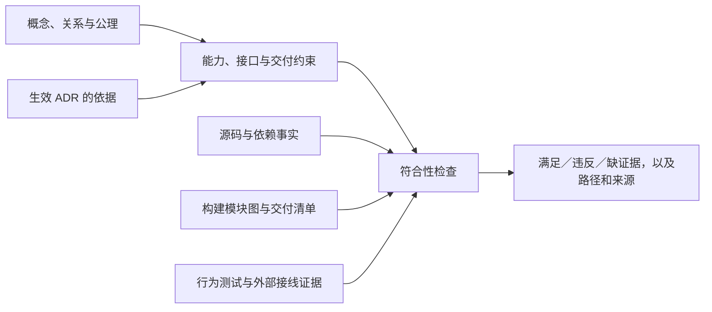

# MetricCanvas 架构形式化模型草案

状态：供 #95 后续 grill 与实现规划评审。已确认的目标和迁移策略见 [ADR-0076](../adr/0076-formal-architecture-contract-scope-and-enforcement.md)；下文的具体模型、谓词和采集设计是候选方案，尚未实现校验器或接入 CI。

本模型同时服务概念设计和实现符合性检查。概念定义、关系、公理与操作语义表达“设计要求什么”；模块、接口、执行环境和交付物表达“由什么实现”；代码和构建证据表达“实际是什么”。三者通过显式映射关联，不把手写的期望关系当成已观察到的事实。

## 1. 已确认范围与尚待选择的边界

- 第一版覆盖 #95 主干：创作期/渲染期、页面/页面修订/临时页面态、页面搭建工作台/搭建画布/渲染引擎、Python/Skill/Relay、外部页面资产与 DQE，以及本仓交付物。
- 纳入范围的未归属新模块、禁止依赖与旧代码进入目标交付物应阻断检查，并给出规则和路径。
- 迁移开发检查禁止新增、扩大或恢复已消除的违规；既存违规精确登记执行票与退出条件。目标交付检查不接受旧代码混入的迁移豁免。
- 第一版承担声明、校验和生成架构图，不生成业务代码。
- **待决 S1：** 概念定义和形式约束各自的编辑来源，是否及如何生成 `CONTEXT.md`。当前词汇表仍是术语真源，本草案不替代它。
- **待决 S2：** 行为规则先关联接口测试证据，还是首版加入状态机模型检查。本文的时间公式用于明确语义，不宣称已有形式证明。

## 2. 类型与模型语义

模型由有类型的对象集合、关系签名、公理和解释组成。关系规定两端类型及基数，公理规定哪些解释合法。文档序列化采用 JSON、YAML 或 RDF 不决定这些语义；最终格式与工具选择尚未冻结。

### 2.1 分开描述领域对象、表示与实现

| 类别 | 第一批类型 | 含义 |
|---|---|---|
| 领域对象/状态 | `Page`、`PageRevision`、`TransientPageState`、`PageDataSource`、`QueryDefinition`、`AnalysisSession`、`SessionCheckpoint` | 词汇表定义的对象与状态；不会因为共用页面协议就合并身份 |
| 表示 | `PageDocument`、`PageBuildArtifact` | 前者指页面元数据的文档表示，后者指跨创作接口传递的页面构建产物；不是新的页面资产类型 |
| 行为 | `Operation`、`LogicalCommand`、`Execution`、`Phase` | 操作种类、逻辑命令、一次调用尝试以及创作期/渲染期；同一保存命令可有多次重试，平台可同时承载两期 |
| 架构 | `Module`、`Interface`、`Package`、`ExternalSystem` | 职责实现、调用契约、物理发布容器和外部系统；Module 与 Package 不要求一一对应 |
| 交付与验证 | `Artifact`、`EntryPoint`、`Environment`、`SourceFile`、`Rule`、`Decision`、`Evidence` | 交付文件及入口、执行环境、代码归属、规范、ADR 决策及带来源的检查证据 |

这是建模类型表，不向 `CONTEXT.md` 新增通用工程术语，也不改变页面 Schema。领域公理中的变量量化于业务对象实例；架构图用 `DomainType` 标识这些领域类型的定义，例如 `PageRevision` 的类型标识，而不是某个具体修订。`Scope` 指所建模的部署及能力范围，不据此发明租户隔离语义。文件关系使用 `File`（源码、生成文件、契约和交付文件的共同类型），`SourceFile` 是其中的源码子类。这样，类型的实现归属与具体对象的资产归属处于不同层次。

### 2.2 第一批关系签名

下表的箭头给出关系两端类型。`1` 表示每个左侧对象必须恰有一个右侧对象，`*` 表示数量由具体规则限制。总函数要求右侧对象在模型中明确存在，不能靠“可能在外部”补足缺项。

| 关系 | 类型与基数 | 语义 |
|---|---|---|
| `revisionOf` | `PageRevision → Page`，1 | 每个页面修订属于一个稳定页面身份 |
| `revisionBody` | `PageRevision → PageDocument`，1 | 修订的不可变完整状态 |
| `transientBody` | `TransientPageState → PageDocument`，1 | 临时页面态使用同一页面协议的文档 |
| `realizes` | `Module → Operation`，* | 模块实现某项能力；能力不等于目录名 |
| `exposes` | `Module → Interface`，* | 模块对调用者提供接口 |
| `invokes` | `Module × Interface × Phase × Environment` 上的四元关系 | 在指定阶段与环境调用接口，显式区分调用与代码打包 |
| `stateAuthority` | `(DomainType, Scope) → (Module ∪ ExternalSystem)`，对声明持久化的类型恰有1个 | 指定范围内的唯一持久化权威；页面资产归外部 Java，分析会话与会话检查点目标归 Relay。缓存、读取和文档持有另列关系，不混作所有权；目标角色存在不代表外部接口已经兑现 |
| `memberOf` | `Module → Package`，* | 模块归入发布容器；包不是领域对象 |
| `sourceOwner` | `SourceFile → Module`，1 | 纳入扫描范围的每个文件有唯一叶模块归属；父级包通过聚合得到成员，不重复认领文件 |
| `typeImports` / `valueImports` | `SourceFile → (SourceFile ∪ EntryPoint)`，* | 类型引用与值引用分开采集；外部依赖入口也是 EntryPoint；类型引用不自动计为浏览器执行代码 |
| `generatedFrom` | `File → File`，* | 生成文件/快照指向作者文件/契约；跨语言生成不暗示消费者运行作者语言 |
| `bundles` | `Artifact → Module`，* | 模块代码实际进入产物，可以只是经过裁剪的一部分 |
| `ships` | `Artifact → File`，* | 完整交付文件清单，包含生成代码、静态复制资源、声明文件等 |
| `justifiedBy` | `Rule → Decision`，* | 哪份生效 ADR 给出规则依据，不能充当测试通过证据 |
| `checkedBy` | `Rule → Evidence`，* | 当前用什么检查或执行证据检验规则，缺证据须如实记录 |

建模例子：页面是领域概念，`PageDocument` 是文档表示，`packages/page` 是物理容器，协议校验是能力；这四者分别建立关系，不用一个 `Page` 节点同时代指它们。

## 3. 第一批公理与操作语义

下列公式中，`∀` 表示“对每一个”，`∃!` 表示“恰有一个”，`∅` 表示空集。成功/失败、输入/输出与操作者意图必须由接口执行证据提供，不能从函数名推断。

| ID | 约束 | 依据与验证方式 |
|---|---|---|
| D-01 | `∀ r ∈ PageRevision, ∃! p ∈ Page: revisionOf(r,p)` | 页面修订只能属于一个页面。ADR-0008；模型关系基数检查 + 页面资产接口证据 |
| D-02 | 同一修订身份在任意两次成功读取时，完整修订内容相等；后续保存通过新修订表达 | ADR-0008；行为约束。外部服务尚未提供或尚未验证时标记待证实，不能因接口名称叫 revision 就通过 |
| D-03 | `TransientPageState ∩ PageRevision = ∅`；二者均可拥有 `PageDocument` 表示 | ADR-0030/0058；模型类型关系与生命周期测试。持有同形 JSON 不代表拥有相同资产身份 |
| D-04 | 临时页面态进入资产态所对应的逻辑保存命令须有用户显式沉淀意图；服务端明确拒绝提交时不创建修订 | ADR-0030/0064；只限定临时→资产路径，不禁止人工页面搭建保存；客户端超时或取消不能推出事务未提交 |
| D-05 | 人工页面搭建对已有页面的一个新逻辑保存命令首次提交成功时产生新修订；同一命令的幂等重放返回同一修订，旧修订不变 | ADR-0008/0072；按逻辑命令身份比较结果，不把每次成功 HTTP 响应都视作新的保存 |
| D-06 | 渲染执行消费已确定的页面文档与查询定义，不生成新的 DQE 查询定义或页面元数据结构，也不保存页面修订 | ADR-0032/0060；允许由现有筛选绑定形成生效查询及计算 DOM 布局；能力映射、接口调用边界与行为测试 |
| D-07 | AI 总结组件可在渲染期按显式声明与关联数据生成文本，其能力不包含查询生成、页面装配或页面资产写入 | ADR-0019/0027；禁止把 D-06 泛化为“渲染期不得调用任何生成服务” |
| D-08 | Python 的目标 `compose_page` 执行不持久化页面修订、临时页面态、分析会话或会话检查点；平台显式保存与外部持久化分别建模 | ADR-0064/0070；目标工具面与接口副作用测试，旧 compatibility 工具面单列为迁移对象 |

保存观察需区分 `committed`、`rejected` 与 `unknown`：前两者分别有服务端提交或拒绝的证据；`unknown` 是超时、断线等造成的认知状态，不是事务的第三种实际结果。逻辑保存身份如何映射到提供方协议仍归 #105，本模型不虚构幂等字段或恢复接口。

D-02 的“所有可能执行都成立”是规范语义；有限测试只能为选定场景提供证据。模型自身逻辑一致、代码静态符合以及运行行为符合是不同结论，报告必须分别说明。

## 4. 架构约束与可执行判据候选

在模型定义的入口和环境中，`runtimeClosure(e)` 表示通过已解析值引用及构建模块图得到的运行依赖闭包。构建配置的 Node 导入不属于浏览器入口闭包，但构建插件生成或复制进交付物的文件属于 `ships`。

| ID | 候选判据 | 失败示例 |
|---|---|---|
| A-01 | 纳入范围的源码文件具有唯一叶模块归属；新增文件、依赖入口和资源不能靠未登记而绕过扫描 | 新目录未匹配任何模块，或同时落入两个叶模块 |
| A-02 | 实际模块依赖及接口子路径满足允许关系；禁止路径按传递闭包检查 | `widgets → 某工具模块 → workbench` 间接进入创作能力 |
| A-03 | 每个纯渲染交付入口（engine/embed）的 `runtimeClosure` 与创作专用模块集合不相交 | embed 经新子路径打入搭建画布；不能只匹配旧目录名；平台本身同时承载创作期，不能套用纯渲染资格 |
| A-04 | 每个目标交付物的代码和文件清单均不包含退役实现 | JS chunk、静态复制文件或发布包文件清单带入旧服务源码 |
| A-05 | 浏览器入口不依赖服务端专用能力；开发/构建工具可在 Node 执行 | 组件导入 `node:fs` 失败；Vite 配置导入 `node:url` 合法 |
| A-06 | 外部系统调用不等于本仓交付包含；从公开接口消费页面资产不要求打包 Java 服务 | 为满足 HTTP 客户端而让产品 CI 构建旧 Java 服务 |
| A-07 | Python 消费锁定中立契约，契约生成边不得被算成 Python 运行时依赖 TypeScript | 因 JSON Schema 由 TS 导出就错误判定 Python 执行 Node |
| A-08 | 对声明同步支持的每类可装配组件，两侧都有构造能力与共享规则用例 | 目录允许选择但浏览器没有构造实现；十类能力只验一条柱图 |
| A-09 | 规范声明不能由观察结果自动覆盖；当前实现输出不能自动成为自身预期 | 检查时将新出现的禁止依赖直接写入允许列表 |

`A-03` 应覆盖纯渲染交付物真实承诺的各入口/格式；一次 embed 构建通过不能代表其他 npm 子路径或所有发行文件都通过。平台允许包含创作能力，按自己的资格接受 `A-04` 等适用规则，不纳入 `A-03` 的纯渲染限定。实现采集器无法解析的动态导入、外部化依赖或生成资源必须明确报告；必要证据缺失时不能给出目标交付通过结论。具体失败分类和出口行为随 S2/执行设计冻结。

## 5. 第一版模块映射

以下为 2026-09-08 工作区观察；观察基于 HEAD `07536fd7cccfdc9571496732db4e9d57b0eb6e60` 及当时工作区，不是可复现历史基线，也不是已完成验收的证明。并行迁移可能继续改变路径，实施时必须重新抽取事实。

| 模块或外部角色 | 实现/接口位置 | 环境与边界 |
|---|---|---|
| 页面协议与校验 | `packages/page/src/` | 浏览器兼容协议入口；`validate-cli.ts` 单列开发工具，不能一包一执行环境 |
| 查询与筛选编排 | `packages/engine/runtime/src/` | 声明网关端口，消费已确定页面与筛选状态 |
| 纯渲染组件 | `packages/engine/widgets/src/` | 浏览器；数据通过数据槽供给；地图资源加载不是业务查询能力 |
| 渲染表面 | `packages/engine/runtime-ui/src/` | 正式 UI；`./ui/composition` 是供搭建画布使用的组合接口 |
| AI 总结组件 | `packages/engine/runtime-ui/src/ai-summary/` | 渲染期垂直生成能力；与工作台盘古对话入口、DQE 网关分别建模 |
| DQE 网关 | `packages/engine/data-gateway/src/` | 实现网关端口，HTTP 调用 DQE；对 runtime 的类型引用不等同打入全部 runtime |
| 搭建画布 | `packages/metric-canvas/src/` | 浏览器覆盖层，使用共享渲染表面；不拥有页面文档与保存 |
| 页面搭建工作台 | `apps/platform/src/lib/workbench/` | 文档、局部组件构造、沉淀与交互；当前仍有旧对话类型等待退出 |
| 应用运行配置 | `packages/application-runtime/src/` | 平台与页面试验场的接线；端点与凭据由集成门户提供 |
| JS 挂载入口 | `packages/embed/src/` | ESM/IIFE 正式渲染交付；构建代码和浏览器代码分环境 |
| 页面试验场 | `apps/playground/` | ADR-0075：按需开发工具，退出默认产品构建/上传，仍参加测试和类型检查 |
| Python 创作能力 | `metriccanvas-authoring/tool/metriccanvas_authoring/` | Python 服务端；目标 `relay` 工具面与旧 compatibility 面分开登记 |
| MetricCanvas Skill | `metriccanvas-authoring/skill/metriccanvas-page-builder/` | Relay 加载；模型输入受约束，完整页面产物交付事实仍待外部验证 |
| Relay / Java 页面资产 / DQE | 外部系统 | 声明责任与消费接口；未提供的接口能力保持待确认，不虚构 endpoint 或成功证据 |
| 退役实现、冻结用例、构建工具、DQE 仿真 | 依实际文件逐类登记 | 冻结用例不是旧服务；合法测试和构建依赖不能被“旧代码”大标签误伤 |

## 6. 现有证据与缺口

本次只阅读下列检查，不将“已有测试文件”当作本次已运行通过。

| 现有检查 | 可复用的证据 | 仍需补齐 |
|---|---|---|
| `tests/public-api.test.ts` | 公开导出名及子路径覆盖 | 类型兼容性、模块关系与实际发布入口匹配 |
| `packages/embed/tests/authoring-isolation.test.ts` | 已声明安装依赖闭包、实际 embed 构建模块图和 JS/CSS | 平台及完整交付矩阵、稳定模块归属、静态复制资源、改名后仍能识别违规 |
| `tests/authoring-export-isolation.test.ts` | 当前契约导出无需复制旧服务源码，冻结向量篡改与契约漂移检测 | 完全独立安装仍未证明，测试复用 node_modules；不代表所有构建都已独立 |

已经观察到的迁移差距包括平台仍使用 adapter-node、声明旧服务包依赖，以及旧对话/服务路由仍在。契约导出已摆脱旧算法源码，不再把它记录为当前阻塞；人工组件构造已抽入工作台并出现十类分支，但共享用例是否完整需另验。

另有文档漂移：`docs/runtime-architecture.md` 仍把页面仓储和可选创作能力列为渲染引擎输入，与 ADR-0065/0066 冲突。该文档应按新边界更新，不能因它写得较概括就覆盖生效决策；本草案只记录发现，未据此修改协议。

## 7. 迁移规则如何生效

将某个违规归入迁移清单，需要精确的规则、实际对象/依赖边、对应执行票和退出条件；不能只登记“忽略 legacy/**”。新增或扩大违规、已经消除后又重新出现，都应失败。迁移清单不能由检查命令自动刷新。

开发检查报告现存差距并阻止退化；目标发布检查要求该交付物全量满足规则。一个平台构建仍输出 Node 服务端，不能通过改名为“暂时产物”而取得静态平台交付通过结论。开发工具、测试与按需演示有单独资格，不默认属于产品交付物。

## 8. 下一步可执行切片（候选）

1. 冻结 S1/S2 和具体模型格式；为首批概念、公理与模块指定来源，确认关系签名及反例。
2. 实现结构/引用/归属校验，建立源码、子路径与执行环境事实提取；用一个合法依赖与一个禁止的传递依赖验证判据。
3. 接入真实构建模块图和最终交付清单，以“创作模块间接进入 embed”和“静态复制旧文件”作为反例；验证所有承诺入口。
4. 生成架构图与有来源的符合性报告；接入开发/发布两种门禁和精确迁移清单。
5. 按 S2 接入行为证据或状态机验证，不把缺失外部接口自动归为支持或不支持。

工具最终选型前，以上签名和反例已经足以评估是否表达了真实概念与边界。交付验收需证明检查器能识别故意引入的违规，并确认规则没有把合法的构建工具、契约快照与 AI 总结能力误判。
