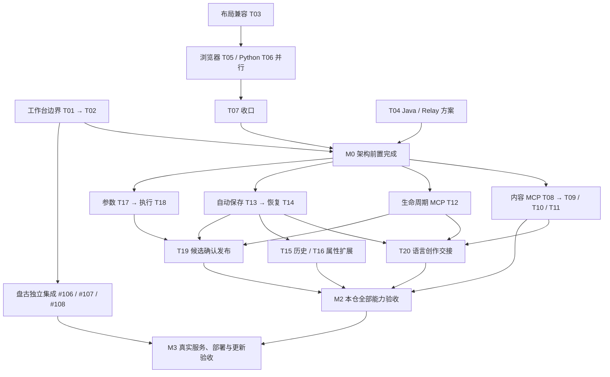

# #126 开发推进计划

日期：2026-09-14。用户已认可 20 张票的拆分方向；本计划将验收票组织为开发工作包。T01–T20 已发布为 GitHub #127–#146，正式映射见同目录 README。本轮制定计划和发布任务，不启动功能实现。

## 推进原则

先完成本版必要架构调整，让盘古、创作协调和协议迁移有明确边界；随后并行建设四条核心能力线，并允许盘古真实集成独立推进。优先打通“语言修改→保存→只传引用→读回画布”的最小完整闭环，同时推进模板发布所需的参数与执行能力。组件覆盖率扩展不阻塞最小闭环，但必须在完整版本验收前完成。

验收票、开发工作包与分支不是一一对应：20 张票保留独立验收；相关票由同一负责人连续开发；每张票以短分支或按依赖排列的 PR 交付，避免一个大分支承载整个版本。没有外部服务实证时只能记录本仓行为通过，不能把待联调状态隐藏在“完成”之中。

未给定团队人数、工作日或提供方交付时间，因此使用能力里程碑和资源优先级排期，不承诺虚构日期。下面的并行关系是技术可行性，不代表必须配置五位开发者。

## 第一阶段：架构前置

| 工作包 | 包含任务与内部顺序 | 为什么放在一起 | 完成出口 |
|---|---|---|---|
| A 工作台边界 | T01 → T02，由同一工作台负责人连续实施；内部可先各自开发独立模块，共享组装点顺序合入 | 同时触及工作台，拆给两人同时大改会冲突；先固定对话接入，再整理创作协调 | 对话模块可单独启动和嵌入；原有打开、手工修改、保存、精确预览仍可运行 |
| B 页面协议迁移 | T03 → T05 与 T06 并行 → T07 | 跨端共同协议必须一次定形，先兼容、分端迁移、再收口 | layout 写出统一、约定旧文档仍可读，浏览器/Python/交付物验证一致 |
| C 外部服务修改方案 | T04 与 A/B 并行，内部消费契约由同一架构负责人对齐 | 服务缺口早暴露，避免 UI、MCP、Relay 各设计一套保存或发布语义 | 修订、幂等、候选、执行和程序产物的方案与样例可评审；已知/拟新增/未知明确分开 |

本阶段合入顺序：共享契约先合入，独立消费者随后合入，最后再删过渡实现。T05 若触及工作台，只做迁移所需最小改动，由 A 的负责人协调，避免与 T01/T02 同时改写组装点。T05/T06 的生成快照由 B 的协议负责人统一更新。

T04 不等待提供方全部实现；冻结的是本仓消费需求与明确标记的外部提案。实际服务契约发生差异时，先调整适配层并补契约验收；涉及产品语义变化再回到决策，不将未知事实让用户重复选择。

**M0 架构完成门槛：** T01/T02/T03/T04/T05/T06/T07 完成，公开边界、独占修改范围、可运行示例和兼容策略齐备。随后集中开展新业务功能。这个阶段门槛是排期策略，不是给每张票伪造全量 Blocked by。

## 第二阶段：并行建设核心能力

| 开发线 | 推荐连续任务 | 可并行部分 | 对外输出 |
|---|---|---|---|
| 内容编辑线 | T08，随后 T09/T10/T11 | T08 合入后，三项分别扩展组件构造与交互操作，独占模块可并行；共享工具注册由同一负责人合入 | 无持久化副作用的合法页面产物、部分成功摘要 |
| 生命周期 MCP 线 | T12；后续参与 T19 的发布工具 | 与内容编辑、Platform 同步及运行时线并行 | 精确草稿读取与保存引用、历史及候选操作工具 |
| Platform 工作副本线 | T13 → T14；优先汇合 T20，再推进 T15；T16 可分配独立属性面板负责人 | T16 在 T13 后可与 T14 并行；若只有一位前端，先恢复和语言闭环，再做历史与属性扩展 | 有序保存、浏览器恢复、语言交接、撤销历史与手工属性 |
| 参数与执行线 | T17 → T18 | 与前述三线并行；C0 独占参数协议变更，Python 只同步生成契约 | 可实例化模板、正确初值和后续筛选、可消费执行结果及预览 |
| 盘古集成线 | T01 后沿 #106/#107/#108 的真实接口资料推进 | 与所有核心线独立；缺少真实接口时继续独立适配开发和可用资料验证，不编造 SDK 字段 | 真实对话、用户身份/路由、草稿通知或可信产物读取，以及上游同步后集成验证 |

T11 先处理既有 filters/filterBindings 和链接下钻，不自行定义 params 新语法；模板参数形状由 T17 唯一负责。T18 不改保存协调，T16 不另造保存队列，T12 不复制内容编辑规则。由此避免“同一个需求被不同模块各做一次”。

**M1 可演示的创作闭环：** T01/T08/T12/T13/T14/T20 完成，可用已有代表性组件演示首次生成、局部修改、保存、只传引用、读回画布，以及断网恢复和失败保留旧页。先用边界替身验证，真实盘古接通后复用同一场景。T09/T10/T11/T15/T16 不阻塞这次演示，但仍属于完整版本必须交付范围。

## 第三阶段：两处汇合

### 汇合一：语言创作交接 T20

真正前置为 T01、T08、T12、T14，由 Platform 创作协调负责人集成。内容 MCP 和生命周期 MCP 的负责人仅处理各自接口问题，不一起修改工作台。无需等待全部 17 类新构造路径完成，先以现有指标卡/表格等代表性页面验证整条路径。

### 汇合二：候选确认发布 T19

真正前置为 T12、T14、T18。Platform 发布界面负责人主导，生命周期 MCP 负责人完成对应发布工具，两者共用一份候选及人工确认契约。在独立模块中并行开发、分别验收，最终同一票闭环；公开导出和工作台入口由指定负责人合入。

建议优先完成 T20 再让同一 Platform 负责人集成 T19，这是人力与风险安排，不给 T19 新增对 T20 的技术阻塞边。若人员与独占范围允许，T20/T19 可并行。T19 不在本仓实现 Java 提取和发布事务，只建设消费流程。

**M2 本仓版本能力齐备：** 20 张票全部完成本仓验收，并完成下述页面元数据参考手册补充交付。覆盖 17 类语言创建、受控编辑及部分成功、保存/恢复/历史、手工属性、参数初始化、执行消费和候选确认。协议生成、静态构建、既有交付门禁与关键浏览器行为通过；此时仍须单独列出外部未兑现能力。

### 补充交付：页面元数据参考手册

2026-09-14 用户确认纳入 #126。详细范围见[参考手册方案](../2026-09-14-page-metadata-reference.md)。C0 负责真源、字段生成、Bundle/Skill 分发与漂移门禁，各模块负责人补充语义和示例；沿现有任务实施，不另建重复功能票。

- T03 / #129 冻结版本策略时可完成盘点与目录骨架。
- T07 / #133 收口后启动主体，以 gauge、table、数据源打通样板。
- 随 T08–T11 / #134–#137 补齐组件与交互；随 T17 / #143 参数契约落地更新参数章节。各章节以实际落地契约为准，不混入未来设计。
- 不阻塞 M1；M2 前完成全模块字段/分支/枚举说明、可校验正反例、独立 Bundle 与 Skill 查阅、覆盖及防漂移检查。无需等待外部服务全部就绪，但静态示例不冒充真实执行证据。

上述是排期与共享交付责任，不给原有票新增虚假的技术阻塞关系。

## 第四阶段：沿 #95 完成真实集成

真实对接应在相关模块就绪时开始，不等所有功能做完才第一次联调。

| 真实门槛 | 沿用任务 | 输入与验收 |
|---|---|---|
| Java 能力与消费 | #105，衔接 T04/T12/T18/T19 | 提供方实现精确修订、幂等、历史、候选提取/发布、执行与权限等所需能力；按契约验证实际服务 |
| 盘古与 Relay | #106/#107/#108，衔接 T01/T20 | 按用户身份和受控路由真实调用工具，可信传递产物/引用，验证确认、取消、迟到结果及必要恢复 |
| Platform 真部署 | #104 | 沿用已经完成的静态产物，在真实载体验证配置注入、CORS/鉴权和创作流程；不新建第二套部署任务 |
| 引擎真实消费 | #103 | 沿既有内网续跑材料验证新协议与参数/执行结果，保留真实异构消费证据 |
| 旧链收尾 | #125 | 仅对账仍存在的旧消费者和清理证据；新生命周期 MCP 或新发布 UI 不是恢复旧链的理由 |

**M3 真实版本可用：** 本版创作与发布相关外部能力在目标环境通过验收，上游代码更新后配置保留、适配生效，无需手工补改工作台或上游源码。#95 中本版以外的普通问数、完整分析会话恢复等目标仍独立计数，不能因 #126 完成自动关闭 #95。

## 人力有限时的顺序

- 有五条开发线资源：按第二阶段五线并行，Platform 仍优先 T13→T14→T20，随后 T19。
- 只有三条开发线资源：一条固定 Platform 保存/恢复/交接；一条先 T08、T12 打通两个独立 MCP，再扩展组件；一条先 T17/T18，再接 T19 工具或真实盘古联调。盘古资料到位时优先安排验证，组件扩展可后移到 M2 前。
- 同一个开发者负责两个 MCP 可以减少协调成本，但模块、入口与测试仍分开。不能因人力合并而把内容编辑与保存发布重新混在一个工具里。
- 不用等待“某个旧 Issue 全部关闭”替代具体能力就绪判断；外部不能推进时，转去组件、历史或确定性契约用例，不反复等待同一问题。

## 合入与验收纪律

1. 每张票开工记录责任模块、独占修改范围、共享触点、前置版本与验证入口；共享触点由一个所有者控制。
2. 同一工作包连续开发、分票验收与短分支合入；消费者基于已合入契约。确需依赖未合入 PR 时使用清晰的依赖顺序，不在多个分支各复制一份契约。
3. 共享 Schema、注册器、导出与生成快照集中维护；其他模块提交源变更需求，不独立改生成物。
4. 每票通过公开行为验证后即可合入，不拖到版本末尾大合并。汇合票验证跨模块组合，不重复各模块全部内部用例。
5. 人工界面有外部设计源时按仓库 SDD 规则执行；纯逻辑、协议与适配器按对应测试边界验证。
6. 看板同时记录本仓完成、外部契约确认、真实联调完成三个状态。任务因本仓范围完成而关闭时，外部依赖必须仍有明确跟踪入口。

## 简化推进图

图按工作包简化；精确技术依赖以每张票 Blocked by 为准。例如 T20 只等待内容线的 T08，不等待 T09–T11；T16 在 T13 完成后即可启动。
