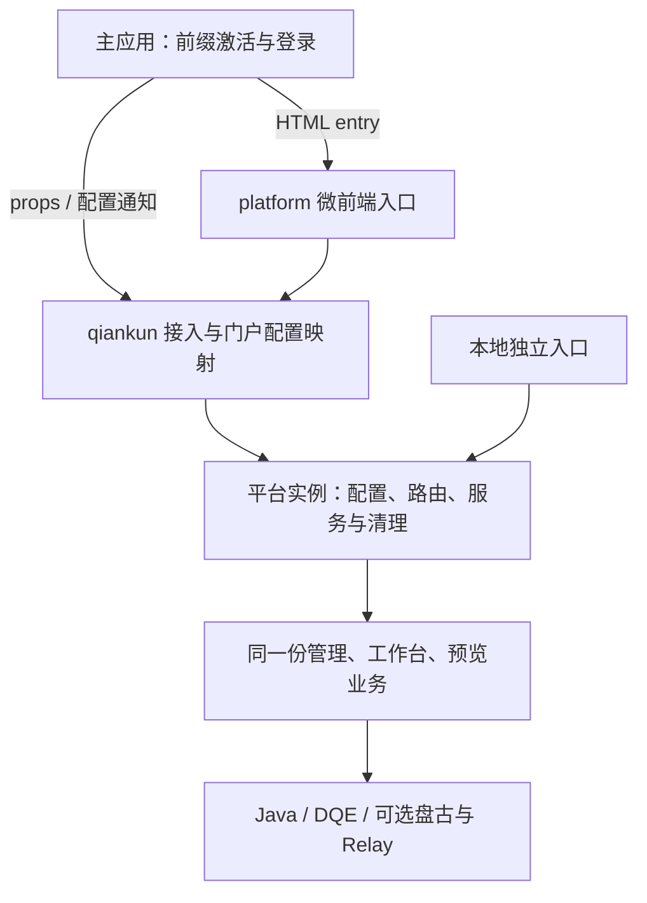

# Platform HTML 微前端改造与 qiankun 集成方案

> 2026-09-28 实施进度：源码、静态归档及候选 qiankun 2.10.16 测试主应用验收已落地；目标门户与真实服务仍为 NOT_RUN。现行实现、证据与交付摘要见 [实施验收](../../evidence/qiankun-platform/implementation.md)。下文方案阶段状态描述保留为交接基线。
日期：2026-09-28。状态：按本次用户确认调整的实施方案，尚未实施或验证。本文替代此前“外部子应用消费平台 npm 包、平台内部使用内存导航”的方案。

执行交接：[MC 维护者](./handoff-mc.md)、[主应用维护者](./handoff-qiankun.md)。版本与构建事实参考 [官方研究](./official-research.md)；目标暂按 qiankun 2.x，精确版本以主应用锁文件为准。

## 1. 已确认目标与范围

直接改造当前 `apps/platform/`，由 platform 自己作为微前端子应用，输出 HTML 入口和完整静态资源，交由主应用注册和加载。保留本地独立运行能力，复用同一份业务实现。

- 主应用拥有平台路由前缀；platform 拥有该前缀内的具体 URL 路由。
- 内部导航必须改变地址栏，支持浏览器前进/后退、刷新定位与深链接。
- qiankun 生命周期、环境变量和门户配置映射集中在接入层，不进入业务视图、页面资产协议或渲染引擎。
- 首版单活动实例，优先复用已有页面管理、页面搭建工作台、预览、人工保存与发布。
- AI 沿用已有可信接线，未提供盘古/Relay 时如实显示未接通，单独验收。
- 不交付平台 npm 包，不要求另一个业务子应用安装平台依赖或包裹平台。
- 不新增跨服务数据域恢复隔离、存储迁移、多实例、KeepAlive 或 SDK 自动发现能力。
- 首版按同一部署固定连接服务目标验收；保留原 IndexedDB 记录及恢复规则。服务目标变化仍使活动会话失效，但不承诺换目标后重挂/刷新能隔离同标识草稿；需要切换数据域时另行设计。

这里的主应用承担词汇表中的“集成门户”职责；platform 仍是装载渲染引擎的第一方集成应用。



## 2. 路由归属与用户行为

以下 `/metrics` 仅为示例，实际前缀由主应用与平台部署约定；它不是 Java/DQE 地址，也不是静态资源前缀。

| 地址示例 | 平台界面 |
|---|---|
| `/metrics/` | 页面搭建工作台 |
| `/metrics/manage` | 页面管理 |
| `/metrics/manage/pages/abc?resource=xxx` | 页面详情 |
| `/metrics/?page=abc&resource=xxx` | 编辑当前页面，沿用现有参数形式 |
| `/metrics/manage/pages/abc/edit?resource=xxx` | 保留现有编辑兼容跳转语义 |

1. 主应用匹配前缀时加载平台，范围内切换路径保持同一平台实例，离开范围才卸载。前缀匹配须有路径段边界，`/metrics-other` 不属于 `/metrics`。
2. platform 管理内部路径解析、链接生成、页面加载和编辑离开保护；主应用不维护平台的详情/编辑路由表。
3. 地址栏是定位依据，不同时维护一套与 URL 竞争的内存路由。前进/后退与点击导航使用相同的路由解析和保护逻辑。
4. 直接访问或刷新内部深链接时，服务器返回主应用入口；主应用激活平台后，平台读取当前 URL 恢复目标视图。恢复视图不等于恢复未保存内容，后者沿用已有规则。
5. 平台内部导航在提交 URL/切换业务前检查编辑状态；取消离开应保留原视图及 URL。浏览器后退触发的离开也需验证，不能只保护按钮点击。
6. 离开整个平台区域的保护通过可选主应用 guard 在导航提交前执行。qiankun unmount 只清理，不通过拒绝/悬挂卸载实现保护。
7. 页面文档中的跨页下钻沿用已有普通 URL 语义；仅对明确归平台所有的 URL 执行内部导航，不擅自重写业务链接。
8. 嵌入入口不设置全局 `<base>`，不改写前缀外路由；文档标题默认归主应用，独立入口保持原标题语义。

## 3. SvelteKit 的处理：先验证复用，再决定替换

已确认的是 URL 路由体验，不是“SvelteKit 必须保留”或“必须删除”。当前独立入口使用 SvelteKit + adapter-static；静态 HTML 输出本身不提供 qiankun 生命周期。

第一项工程工作是有界兼容验证：使用当前平台的生产构建或最小必要入口改造，在目标 qiankun 版本的测试主应用中验证：

- 在主应用容器内启动，平台不接管主应用根节点。
- 详情→编辑→前进/后退、带页面/资源参数的深链接刷新。
- 前缀内导航不重复挂载，离开前缀可完整卸载，重新进入正常。
- 挂载中退出、监听器与请求清理、资源地址和局部样式。
- Kit 构建期 base 与实际路由前缀一致，并且路由器不接管主应用其他路径。

通过：保留 Kit 路由，使用经验证的入口与构建适配；不为抽象而迁移全部路由业务。

不通过且无法局部解决：采用普通 Svelte 入口与客户端 URL 路由，迁移现有路由业务为共用视图，保持上述路径和使用体验。记录具体失败证据，再决定替换实现；不同时交付两套路由框架，也不退回内存导航。

路由前缀由接入层统一提供/核验；如保留 Kit 且只能使用构建期 base，交付时明确绑定前缀，挂载发现不一致须明确报错。不得承诺同一产物支持任意运行时前缀。移除 Kit 与否、单构建还是双构建，在验证后收敛。

## 4. 接入层与实例接口

建议目录（待实现，最终文件可按验证结果合并）：

```text
apps/platform/src/
  microfrontend/
    entry.ts                 # bootstrap / mount / unmount
    qiankun-adapter.ts       # 容器、环境标记、生命周期衔接
    portal-config.ts         # 主应用 props/变量到平台契约的映射
  standalone/                # 独立启动接线；保留 Kit 时可落在 routes 层
  lib/
    integration/
      mount.ts               # 内部启动与可等待销毁
      services.ts            # 页面资产、DQE、对话等实例组装
      session.ts             # 会话失效与资源清理
      navigation.ts          # 统一内部 URL 导航接口
    views/                   # 按需要从路由提取业务视图
    PageAuthoringWorkbench.svelte
```

只在 `microfrontend/` 及其构建配置中使用 qiankun 特有变量。门户业务变量只在 `portal-config.ts` 映射，业务不读取原始 props、`window.currentLoginUser` 或 qiankun 标记。不在 platform 内安装并启动第二套 qiankun。

内部可继续使用 `mountPlatform(container, adapter)` 和 `destroy()`，但它们不再是对外 npm 接口。主应用消费 HTML 及生命周期，MC 提供一份正式的 props/事件/配置接入契约，方案只引用该契约。

目标接线语义（字段名在实现时形成正式类型，不是现有接口）：

| 输入 | 语义 |
|---|---|
| `routeBase` | 平台所属的路径前缀，与主应用激活规则、必要构建期 base 一致 |
| `readConfig` | 每次请求现读 Java/DQE 端点与当前身份；无会话返回 null |
| `subscribeConfig` | `(changed: () => void) => () => void`，有运行中身份变化时必须连接真实通知源 |
| `onEvent` | 挂载就绪、需要登录、会话失效等稳定事件码与脱值消息 |
| `registerLeaveGuard` | 可选，将平台离开检查接入主应用路由，返回注销函数 |
| 对话/可信创作接线 | 可选，沿用现有端口，不要求提供 AI 才能人工编辑 |

运行配置沿用 `dqeEndpoint`、`pageMetadataBaseUrl`、`authToken`、`operatorId`、`workspaceId` 和可选 `cftk`。页面资产调用保留“不依赖 DQE 端点完整”的现有语义。优先传读取与订阅函数，不把初始凭据快照当成持续同步；确需读取门户全局变量时仅通过映射层。

## 5. 模块修改、增加与删除范围

| 模块 | 整改内容 |
|---|---|
| `routes/+layout.svelte`、`+layout.ts` | 保留可复用外壳、局部样式和 DEV 独立接线；按 Kit 验证结论调整入口，嵌入不引入开发配置 |
| `routes/manage/**` | Kit 可复用时减少迁移；替换路由时将列表、详情提取到 `lib/views/`，删除旧路由里的重复业务 |
| `PageAuthoringWorkbench.svelte` | 页面选择来自路由输入，导航经统一接口；注入身份、页面资产、DQE 与通知源；删除业务内 Kit/门户环境耦合 |
| `RevisionPreview.svelte` | 注入实例读取端口和网关，退出默认模块级客户端 |
| `page-assets.ts` | 模块级客户端/保存端口改为实例工厂，复用保存前管理记录核查 |
| `page-assets/java-adapter.ts` | 接收配置读取与受控请求依赖，保留现有 Java 协议、凭据和回执核验 |
| `page-assets/management.ts` | 注入身份与有效性检查，保留删除/回退的未知结果保护 |
| `packages/application-runtime/src/runtime-config.ts` | 提取配置源注入能力；保留独立入口和页面试验场使用的全局兼容包装 |
| `workbench/data-gateway.ts` | 使用实例配置，开发查询明细不得进入生产产物 |
| `workbench/authoring-coordinator.ts` 等 | 仅补实例失效/清理接线，保留编辑、单次保存、恢复与可信创作规则 |
| `dialogue/PanguDialogue.svelte`、`runtime.ts`、`authoring-integration.ts` | 明确注入；全局读取留在独立/门户接线层；缺 SDK 显示未接通 |
| `dialogue/lifecycle.ts`、通知端口 | 复用迟到挂载清理，事件源按实例；保留精确引用和权限检查 |
| `PlatformFrame.svelte`（按需新增）及弹层 | 提取已有容器化样式；嵌入精简外壳保留业务导航，不重设计 UI |
| 微前端构建配置与静态归档脚本（新增） | 输出 HTML 与全部资源、版本清单和摘要；不生成平台 npm 发布清单 |

删除的是共用业务中的隐式全局接线、模块级活动实例和迁移后重复实现。是否删除 Kit 路由/配置由第 3 节验证决定。开发 fixture/原型不进入生产产物，但不借机删除仓内无关资产。

不修改页面协议、渲染引擎职责、`packages/embed`、Python 创作流程或 Relay 核心。持久化数据库名、key 和恢复记录不做迁移。

## 6. 配置变化、挂载与卸载

- 工厂只保存接线定义；挂载时创建资源并订阅，导入包不启动平台。
- 挂载只等待有限本地初始化，不等待 Java/DQE/SDK 网络；失败挂载负责清理。
- 请求现读配置；同身份刷新 token 不重建。写请求发送前及异步回写前检查活动会话。
- 退出登录、actor/workspace 或服务目标变化使旧会话失效：停止新操作、取消可取消请求、丢弃旧界面回写，通知主应用按生命周期销毁并重挂。
- 不使用新凭据提交旧身份草稿；原身份恢复记录保留。停止客户端请求不能保证撤回服务端已经接受的写入，结果不明沿用未知状态，不自动重试。
- 销毁先失效，再清理请求、路由监听、订阅、观察器、计时器、DOM 和自有对话实例；可等待且幂等。
- 主应用/接入层串行化进入退出，包括挂载未完成就离开；unmount 不自动保存、发布或删除恢复记录。
- 共享 SDK 仅清理本实例拥有的资源，不删除其他功能的脚本或实例。首版退出即销毁，不设计暂停恢复。

## 7. 构建与交付

目标交付目录示例：

```text
apps/platform/dist/microfrontend/
  index.html
  assets/                    # JS、CSS、字体和必要静态资源
  release.json               # 版本、源码 SHA、路由前缀限制与兼容信息
```

交付完整目录归档、SHA-256 和接入说明。主应用部署/引用 HTML URL；它不安装平台包、不编译平台源码、不需要 Svelte 插件。平台版本升级通过切换部署入口或版本目录完成，不要求主应用重编译平台业务。

候选命令 `build:microfrontend` / `pack:microfrontend` 待实现，后者表示静态归档，不是 npm pack。独立 `dev/build` 先保留；最终能否共用同一 HTML/构建由兼容验证决定，若分开构建输出必须互不覆盖。

qiankun 2.x 下，普通 Svelte + UMD 生命周期入口 + HTML 是候选后备构建路径；Vite 库模式的 UMD 输出不自动生成 HTML，也不代表当前 Kit 产物已兼容。优先验证实际生产加载、生命周期识别与资源路径，不直接采用针对 qiankun 3 的插件配置。

产物不得含 DEV 凭据、fixture、未解析仓库别名或 workspace 私有导入。不得直接把 ESM JS URL 当成 qiankun 2.x HTML entry。

## 8. 部署地址与样式

| 地址 | 示例 | 所有者 |
|---|---|---|
| 用户路由前缀 | `/metrics` | 主应用约定，平台管理内部路径 |
| 平台 HTML entry | `/micro/metriccanvas/releases/R1/index.html` | 平台发布与主应用注册 |
| 平台静态资源前缀 | `/micro/metriccanvas/releases/R1/assets/` | 平台构建与静态部署 |
| Java/DQE/Relay 地址 | `/rest/...` 或批准的完整 URL | 运行配置与网关 |

平台不能依据浏览器 `/metrics/manage` 拼接静态资源地址。Webpack 注入 publicPath 变量不是 Vite/Kit 的通用配置。

路由深链接回退主应用 HTML；静态资源缺失必须 404；API 路径不得回退 HTML。平台 standalone 地址与主应用深链接使用各自明确的部署回退规则。

版本目录不可变，先上传完整资源再切入口，保留旧目录供回滚及旧会话加载。跨域静态资源与带凭据 API 分别核对 CORS/CSP；本地代理不能证明生产可达。

主应用提供明确容器高度；平台沿用根节点局部样式、容器布局和局部弹层，不锁门户 body。默认不新增 Shadow DOM。qiankun 沙箱不替代 CSS/SDK/图表 resize 验证。

## 9. 实施顺序与证据

| 阶段 | 工作 | 放行条件 |
|---|---|---|
| 1 | 锁定主应用版本、前缀与 Kit 兼容验证 | 用事实决定保留 Kit 或迁移客户端路由，保留已确认 URL 体验 |
| 2 | 接入层、实例配置与必要业务解耦 | 独立入口可用，业务不读 qiankun/门户变量 |
| 3 | HTML 生产构建、URL 路由与生命周期 | 实际 qiankun 测试主应用完成深链接、导航、卸载重挂 |
| 4 | 人工业务与服务联调 | 挂载→页面管理→打开→编辑保存→重新打开→卸载→重挂 |
| 5 | 可选 AI 接线与发布 | AI 单列证据，固定静态版本、部署和回滚说明齐备 |

证据分别报告：类型/确定性测试、静态生产构建、测试主应用的真实 qiankun 加载、目标门户浏览器、真实 Java/DQE/盘古/Relay 服务。测试主应用成功不等于真实门户或生产服务成功。

浏览器检查只覆盖必要风险：前缀边界、内部路由保持实例、前进后退、刷新/深链接、离开取消后的 URL 一致性、卸载重挂、容器/弹层、快速切换及凭据变化。复用已有保存/恢复/对话测试，不扩展全站测试。

外部输入未齐时继续配置注入、接口和本地验证；缺少精确版本时只能标为候选版本验证，不宣称现网兼容。

## 10. 文档、责任与当前状态

MC 负责平台入口、生命周期、内部路由、业务整改、静态产物和消费契约。主应用团队负责前缀激活、容器、配置/身份通知、HTML 部署接入、主应用离开保护及门户验证。服务方负责真实鉴权、接口和网关能力。

实施时更新正式 `host-contract`、ADR-0073 相关部署结论与主题页：平台业务保持框架隔离，但平台交付入口现在明确实现 qiankun 适配；旧“不实现微前端协议”不能继续作为整个交付物的现行限制。本次只落盘方案，尚未修改正式运行契约或应用代码。

已确认：HTML 微前端交付、前缀归主应用、内部 URL 路由归平台、代码接入隔离、最小业务范围。待验证：Kit 保留与否、最终构建方式、实际前缀/qiankun 小版本/浏览器、主应用真实配置和可选 SDK 接线。

当前所有实现、生产构建、浏览器接入和真实服务验收均为 **NOT_RUN**；文档完成不表示功能已实现。
