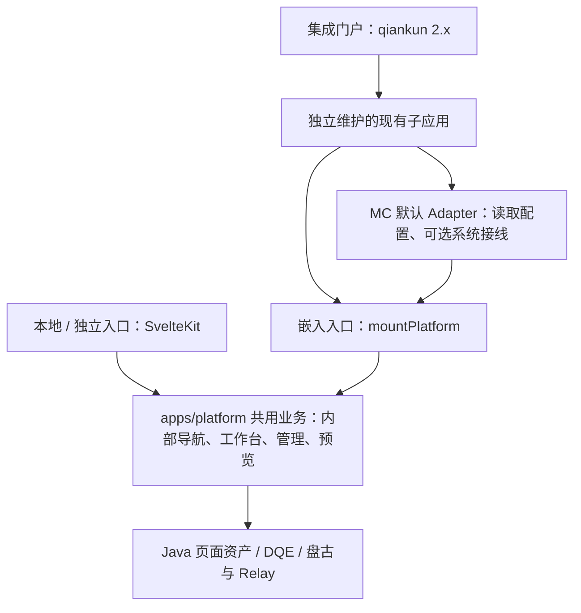

# Platform 双入口改造与 qiankun 2.x 集成方案

日期：2026-09-28。状态：按用户确认更新的实施方案，尚未实施。原代码核查基线为 `b0bad83a`，本次在 `d84ebaa4` 再次核对 platform 构建、路由及配置依赖。外部框架、构建器、qiankun 2.x 小版本和发布地址仍待集成方提供。

执行交接：[MC 维护者 handoff](./handoff-mc.md)；[qiankun 服务/子应用维护者 handoff](./handoff-qiankun.md)。

## 1. 已确认的方案

直接改造 `apps/platform/`，形成**双入口、双构建、单业务实现**：本地与独立运行继续使用 SvelteKit；现有独立维护的 qiankun 2.x 子应用通过通用挂载入口嵌入平台。MC 提供默认 Adapter 工厂，集成方供给真实配置与必要系统接线。

首版由平台自己完成页面管理、页面选择、工作台和内容预览的内部切换。用户从平台内部打开已有页面，集成方无需传页面标识或管理这些视图。

此次明确收敛：

- 不新增 `packages/platform`，业务实现保留在 `apps/platform/src/lib`。
- 默认调用为 `mountPlatform(container, adapter)`，实例只公开 `destroy()`。
- 不提供初始 `location`、`chrome`、`setLocation` 或 `openPage`；不要求集成方实现平台页面路由映射。
- 嵌入入口默认采用嵌入外壳；本地入口采用独立外壳，不暴露外观模式开关。
- 外部子应用继续管理 qiankun 生命周期、整个功能区域的 URL、登录和发布。
- 交付暂按固定版本 npm 包设计；源码位置与包发布方式互不约束。发布名暂定 `@metriccanvas/platform`，尚不存在。



术语遵循 [CONTEXT.md](../../../CONTEXT.md)：装载 platform 的子应用承担直接集成门户职责，platform 仍是装载渲染引擎的第一方集成应用。本文接口、目录和新增命令均为待实现设计。

## 2. 范围与当前缺口

首版包含已有页面搭建工作台、页面管理列表与详情、内容预览、人工保存和发布。对话与 AI 创作按提供方能力接入，未接通能力明确不可用；不增加后端接口尚不支持的历史修订读取。DEV 原型、测试入口与开发凭据不进入嵌入产物。

| 核查项 | 当前事实 | 改造任务 |
|---|---|---|
| 构建 | [package.json](../../../apps/platform/package.json) 是私有应用；Svelte 5、SvelteKit 2、Vite 8 | 在同目录增加普通 Svelte library 构建，与独立 SPA 分开输出 |
| 静态部署 | [svelte.config.js](../../../apps/platform/svelte.config.js) 为 adapter-static + index.html fallback，仅有 `METRICCANVAS_BASE_PATH` | 保留独立运行；不要把历史记录中的 assets 配置视为当前实现 |
| 页面切换 | [布局](../../../apps/platform/src/routes/+layout.svelte) 与[工作台](../../../apps/platform/src/lib/PageAuthoringWorkbench.svelte) 依赖 `$app/paths`，工作台读取 window.location.search | 共用业务使用内部视图状态；独立入口适配 Kit，嵌入入口使用内存导航 |
| 配置 | [application-runtime](../../../packages/application-runtime/src/runtime-config.ts) 每请求读取全局配置 | 注入每实例配置读取函数，独立入口继续通过 Adapter 使用现有全局源 |
| 页面资产 | [page-assets.ts](../../../apps/platform/src/lib/page-assets.ts) 为模块级实例；[Java Adapter](../../../apps/platform/src/lib/page-assets/java-adapter.ts) 直接引用全局配置读取函数 | 由实例工厂创建客户端与保存端口，继续复用业务协议 |
| 对话和创作 | [盘古](../../../apps/platform/src/lib/dialogue/runtime.ts) 使用 document/window；[创作接线](../../../apps/platform/src/lib/dialogue/authoring-integration.ts) 使用全局注入 | 保留现有语义，改为实例注入；系统 SDK 接线明确可选 |
| 通知 | 工作台监听 window 上的页面通知 | 收敛到实例事件源，保留精确引用和权限核对 |
| 嵌入能力 | [embed](../../../packages/embed/README.md) 只提供页面渲染 | 完整平台另设入口，不扩充渲染包职责 |

这次不是把当前 index.html 直接包装给 qiankun。需要解耦共用业务对整页入口的依赖，但不需要迁移到新源码包，也不需要外部子应用维护平台内部导航。

## 3. 目录与双入口

```text
apps/platform/
  src/
    routes/                       # SvelteKit 薄路由包装
    lib/
      PlatformRoot.svelte         # 共用业务组合
      PageAuthoringWorkbench.svelte
      views/                      # 从路由中提取的管理、详情等唯一实现
      integration/                # 内部视图状态、实例服务、默认 Adapter
    integration/
      index.ts                    # 嵌入公共入口与稳定类型
  vite.config.ts                  # 现有独立应用构建
  vite.integration.config.ts      # 新增库构建，无 SvelteKit 插件
  scripts/                        # 嵌入产物清单和打包脚本
  package.json                    # 保留 workspace 名 platform 和 private:true
  build/                          # 现有独立 SPA 输出
  dist/integration/               # 独立的可发布包根目录

external-child/                    # 集成方独立仓库
  src/qiankun-entry.*              # 现有子应用生命周期
  src/routes/metrics.*             # 一个平台功能区域
  src/metriccanvas/adapter.*       # 使用 MC 工厂，连接真实配置/SDK
```

所有业务视图只维护一份。独立入口与嵌入入口各自组装导航环境和外壳，平台内部创建实例服务。共用业务不能导入 `$app/*`；这些依赖只留在独立入口 Adapter。构建别名可以用于开发，但不能泄漏到发布 JS 或声明文件中。

[ADR-0073](../../adr/0073-static-platform-direct-access-with-injected-runtime-config.md) 中“不实现微前端协议、无生产 Node 服务”保持成立；“仅静态 SPA、唯一全局配置、不加回调”的限制需在实施时通过新 ADR 修订为双入口和实例配置源。平台交付物及接口说明同步更新相关 ADR 主题页与 host-contract；不因源码目录未变而跳过契约变更。

## 4. 默认接入 Interface

以下是待实现示例。外部应用消费编译后的包，不深导入本仓源文件。

```ts
import {
  createPlatformAdapter,
  mountPlatform
} from '@metriccanvas/platform';
import '@metriccanvas/platform/style.css';

const adapter = createPlatformAdapter({
  readConfig: () => appSession.getMetricCanvasConfig()
});

const platform = await mountPlatform(container, adapter);

// 离开平台功能区域或卸载子应用时
await platform.destroy();
```

`appSession` 是集成方现有登录/配置系统的示意名称，不是 MC 提供的对象。MC 工厂负责将读取函数转换为内部配置源，创建 Java/DQE 等既有客户端；不要求集成方手工实现整个 Adapter。

```ts
interface PlatformRuntimeConfig {
  dqeEndpoint: string;
  pageMetadataBaseUrl: string;
  authToken: string;
  operatorId: string;
  workspaceId: string;
  cftk?: string;
}

interface PlatformInstance {
  destroy(): Promise<void>;
}
```

`readConfig` 返回上述配置或 null；字段语义沿用 [当前契约](../../host-contract.md)。Adapter 的完整内部结构由 MC 工厂封装，集成方不构造它的内部字段。

### 4.1 最小接入与按需接线

| 工厂输入 | 用途 | 首版规则 |
|---|---|---|
| `readConfig` | 每次请求读取端点与当前用户凭据 | 基础接入必需；缺配置时 UI 可启动，服务操作明确失败 |
| `subscribeConfig` | 订阅登录、身份、工作空间或服务目标变化，返回取消订阅函数 | 存在运行中切换的生产环境必须接；最小示例仅适用于配置作用域在挂载期间固定的场景 |
| `dialogue` / `authoring` | 对话 SDK 与既有可信创作程序接线 | 需要 AI 能力时接；普通管理与人工编辑不因此阻塞 |
| `registerLeaveGuard` | 向外部路由注册离开检查函数，返回注销函数 | 门户支持离开保护时接；不用扩大 PlatformInstance 的方法集合 |
| `onEvent` | 接收脱值错误、需要登录、会话失效等通知 | 需要外层处理登录恢复和身份切换时接 |

配置订阅建议签名为 `(changed: () => void) => () => void`：平台挂载时订阅、卸载时取消；回调触发后重新执行 readConfig。MC 不知道某个门户如何通知身份变化，不能通过一个读取函数假装已经实现即时订阅，也不以轮询代替明确通知源。

离开检查由 MC 在平台内部切换视图时自行执行；可选 `registerLeaveGuard(check)` 仅把相同检查接入离开整个平台区域的外部路由。`check` 返回是否允许及原因，UI 决策归外层。缺少外部 guard 时，MC 仍保持已完成的本地恢复记录，但不能承诺强制卸载绝不丢失编辑。

### 4.2 生命周期与身份语义

1. 导入包没有挂载副作用；每容器只允许一个活动实例。首版支持每子应用单活动实例，不承诺盘古 SDK 多实例。
2. mount 在本地根组件与清理机制就绪后 resolve，不等待 Java、DQE 或 SDK 网络请求；网络失败通过平台状态或通知呈现。失败挂载自行清理已分配资源。
3. 每请求重新读取配置。同一 actor/workspace/服务目标下刷新 token 不重建工作台。每次写入及异步结果回写前也复核会话作用域，避免身份变化后处理旧结果。
4. 登录退出、actor/workspace 或服务目标变化时，封住旧会话写入、取消可取消请求并丢弃旧回调，通知会话失效。集成方等待 destroy 后重新挂载；原身份恢复记录保留，不能用新凭据提交旧页面草稿。
5. destroy 幂等、可等待；清理请求、订阅、观察器、计时器、平台 DOM 与自己拥有的对话实例。不得自动保存、发布或删除恢复记录，且不以拒绝销毁来拦截 qiankun 卸载。
6. 工厂生成的 Adapter 是连接定义，不在工厂调用时启动监听。每次挂载创建资源并承担清理，避免把复杂度转移成另一个必须调用 dispose 的对象。
7. 页面通知仍须经可信读取和精确引用核对；身份声明不是权限证明。服务端继续负责鉴权。
8. 就绪通知仅表示 UI 挂载就绪，不代表真实 Java/DQE/Relay 验收通过。事件不包含 token、业务数据行或原始服务响应。

## 5. 内部导航与嵌入外观

| 行为 | 本地 / 独立入口 | 嵌入入口 |
|---|---|---|
| 默认进入 | 保留现有独立入口语义 | 工作台 |
| 列表、详情、编辑切换 | MC 提供 Kit 导航适配 | MC 提供内存视图状态 |
| 浏览器地址 | 由独立入口路由维护 | 只显示集成方的平台功能区域，例如 /ops/metrics |
| 浏览器刷新 | 按独立 URL 恢复路由 | 重新进入默认工作台；草稿仅按原恢复规则处理，不承诺自动恢复上一个内部视图 |
| 浏览器前进/后退 | 独立入口路由历史 | 外部子应用历史，不记录平台内部切换 |
| 页面选择 | 平台自己的页面管理 | 平台自己的页面管理 |
| 外壳 | 独立导航和品牌 | 默认精简外壳，保留业务操作与平台内页面管理入口 |

嵌入入口不修改 history、hash、document.title 或 `<base>`，也不读取子应用 URL 的 page/resource 参数。平台内部提供“页面管理”“返回工作台”等必要操作：精简外壳不能把内部导航一起隐藏，导致只能从外部 API 打开已有页面。

首版没有内部页面深链、外部指定编辑页面和 URL 双向同步。以后确有外部列表直达编辑的需求，再单独设计明确语义的接口；不提前留 openPage 占位。

页面文档中的跨页下钻仍沿用既有导航语义，与平台管理视图切换分开；不得把这些业务 URL 偷偷改写为内存视图。若某个页面依赖独立平台页面地址，需在联调中核实目标真实可达，内部详情深链不作为首版新增承诺。

尺寸由集成方给出：挂载节点和父级必须有明确可用高度，内部采用 width/height:100%、min-width/min-height:0。平台 CSS 限定在根节点，弹层位于平台区域，不锁门户 body；样式仍需在真实全局 CSS 中验证。

不默认对整个平台增加 Shadow DOM，现有盘古 selector/document 行为需先核实。IndexedDB 保持原 actor/workspace/page/resource 作用域和恢复规则；不因改入口直接换存储 key 导致旧记录遗失。

## 6. 双构建、打包与发布

### 6.1 MC 仓

保持 workspace 应用 `platform` 为私有，在 `apps/platform/` 内新增独立的 integration 构建配置与打包脚本。

```bash
# 现有命令继续保留
pnpm --filter platform dev
pnpm --filter platform build

# 以下命令待实现
pnpm --filter platform build:integration
pnpm --filter platform pack:integration
```

`build:integration` 使用普通 Svelte 插件与 Vite library mode，不使用 Kit 插件；输出预编译 ESM、CSS 和完整声明。首版合并平台 JS 单入口，打入 Svelte 与必要浏览器实现，集成方无需 Svelte 编译插件。具体目标语法按外部构建器与浏览器验证；构建器配置参考已有 [Vite 官方资料](https://vite.dev/guide/build.html#library-mode)，实施时以锁定版本为准。

```text
apps/platform/dist/integration/       # 可发布包根，不进入 workspace 包扫描
  package.json                       # name: @metriccanvas/platform，独立版本/exports/files
  platform.js
  platform.css
  index.d.ts                         # 所有可达声明一并交付
  README.md / CHANGELOG.md / LICENSE
```

`pack:integration` 先生成并校验该目录的发布清单，再在该目录打 tarball。应用根 package.json 保持 private:true；发布清单只允许列出的交付文件、公开依赖及稳定导出，不照抄 workspace 应用清单。输出目录互不清理覆盖；独立 SPA 继续写 build/。

MC 需要同时保证：

- 运行 JS 无未解析 `$app`、`$lib`、仓路径或私有裸导入；声明文件同样不泄漏私有源码类型。
- 声明引用公开包时写清兼容依赖；发布清单无 workspace:*。
- CSS 通过稳定子路径导出，并声明 sideEffects 避免被删除。
- production 分支固定；产物不含 DEV 注入、fixture、开发凭据与非生产调试明细。
- tarball 在仓外消费者安装、类型检查与构建通过，不能仅靠 workspace 链接验收。

CI 沿用当前仓 Node/pnpm 锁定基线，执行安装、必要依赖构建、platform 类型检查、两种构建与包消费检查后，发布固定版本 RC 到内部 registry。包版本、源码 SHA、摘要、公开契约兼容性及页面 Schema 区间分别记录。

### 6.2 集成方仓

集成方安装已发布的固定版本，导入 JS 与 CSS，并纳入自己的 qiankun 2.x 子应用生产构建。升级平台依赖后重建子应用；回滚子应用版本同时回滚平台版本。首版不实现远程热升级 loader。

现有子应用仍提供 qiankun 可识别的 bootstrap/mount/unmount。平台 ESM 在构建阶段打入它的产物，不把 ESM 文件直接用作 qiankun HTML entry，也不再嵌套启动一套 qiankun。现网已工作的构建链优先沿用，Vite/UMD/资源路径事实见 [官方研究](./official-research.md)。

## 7. 集成方接入顺序

1. 在现有子应用内增加一个平台功能区域，例如 /ops/metrics；外部菜单只需负责进入该区域。
2. 创建有明确尺寸的容器；用 MC 工厂将真实配置源及所需订阅/SDK 接线转换为 Adapter。
3. 区域挂载时调用 mountPlatform，平台自行提供工作台与管理入口。
4. 离开区域时 await destroy；卸载整个子应用时同样等待平台销毁再移除外层 DOM。
5. token 同身份刷新继续读取新值；身份/目标改变按通知销毁并重挂。需要 AI 功能再接真实盘古/Relay。

挂载尚未完成就离开也要处理。以下为生命周期顺序示意；调用方须串行化进入与退出，错误交给子应用现有错误展示：

```ts
let pending: Promise<PlatformInstance> | undefined;

function enterPlatform(container: HTMLElement) {
  if (pending) throw new Error('平台区域已挂载或正在挂载');
  pending = mountPlatform(container, adapter);
  return pending;
}

async function leavePlatform() {
  const current = pending;
  if (!current) return;
  try {
    const instance = await current;
    await instance.destroy();
  } finally {
    if (pending === current) pending = undefined;
  }
}
```

mount 必须是有限的本地初始化，不得等 SDK 网络请求才完成；这样退出可以等待其完成后清理，不需要把 signal 或位置输入强塞进默认调用。挂载拒绝已由 MC 清理；集成方仍需处理 Promise 错误。缓存/KeepAlive 默认按退出销毁处理，暂停恢复另行定义。

离开检查要在导航提交前发生；qiankun unmount 只执行清理。若整个功能区域的退出受门户控制，集成方协调门户注册可选 guard。不要通过不 resolve unmount 来阻止退出。

## 8. 生产部署、路径与网关

四类地址分别配置：

| 地址 | 示例 | 所有者 |
|---|---|---|
| qiankun HTML entry | `/micro/ops/releases/R1/index.html` | 集成门户注册与子应用发布 |
| 浏览器路由前缀/activeRule | `/ops`，平台区域 `/ops/metrics` | 门户与子应用路由 |
| 子应用静态资源前缀 | `/micro/ops/releases/R1/` | 子应用构建器/publicPath |
| Java/DQE/Relay 地址 | `/rest/...` 或经批准的完整服务 URL | 运行配置/系统 Adapter |

平台 npm 包没有独立 HTML entry，也不推导任何一类地址。qiankun 2 Webpack 子应用如使用 `__INJECTED_PUBLIC_PATH_BY_QIANKUN__`，必须在加载依赖与异步 chunk 之前设置 `__webpack_public_path__`；Vite 不使用 Webpack 变量，按现有构建器方式配置。资源 URL 不能错误地跟随浏览器 `/ops/metrics` 路由解析。

推荐同源网关提供门户、子应用静态资源与业务服务代理。Nginx 示例仅说明路径责任，替换为实际网关配置：

```nginx
# /srv/www/micro/ops/releases/R1/index.html + assets/...
root /srv/www;
location ^~ /micro/ops/releases/ {
    try_files $uri =404;
}
# /ops/... 深链刷新返回最外层门户，由其启动 qiankun。
location /ops/ {
    try_files $uri /index.html;
}
# /rest/ 与 Relay 前缀应先命中对应网关代理规则，不能回退 HTML。
```

发布顺序：上传完整不可变版本目录 → 校验 HTML/JS/CSS/字体/chunk → 切换门户发布配置到新 entry → 小流量验证 → 扩大范围。门户 index/动态发布清单使用 no-cache，带版本和 hash 的资源使用 immutable；保留上一版本目录和可能仍被旧会话引用的 chunk，避免滚动发布 404。失败时将 entry 切回旧版本，并让受影响会话重新加载。

若 HTML/资源跨域，需按 loader 实际 fetch 设置资源 CORS 和 CSP。业务 API 跨域与静态资源跨域分别验证。页面资产当前使用 `credentials:'include'` 与可选 cftk；服务须允许具体 Origin、凭据和实际请求头，不能用 `Access-Control-Allow-Origin:*` 搭配凭据。DQE 按现有 token/actor/workspace 头传递。Cookie 仍受 Domain/Path/SameSite 限制，静态资源 URL 与 API base 均不能替代这些要求。参见 [当前契约](../../host-contract.md)。

浏览器仍直接消费服务或网关；没有新增 Node 平台服务。盘古 SDK 的资源 URL、版本、加载所有权由外部 Adapter 明确指定，复用外部已加载实例前核实版本；销毁平台只能销毁自己拥有的对话实例，不能移除其他功能共享的 SDK。

## 9. MC 侧具体工作事项

| 编号 | 工作 | 交付与完成条件 |
|---|---|---|
| MC-01 | 收敛并冻结公开契约 | mountPlatform + destroy；默认工厂及配置字段；标明按需订阅/SDK/guard，不暴露页面路由操作 |
| MC-02 | 在 apps/platform 内提取共用根与业务视图 | 原地改造、单份工作台和管理实现，Kit 只留在独立入口 |
| MC-03 | 实现平台内导航与双外壳 | 内部页面选择、返回与编辑保护均由 MC 完成；嵌入不改浏览器 URL，仍可访问管理页 |
| MC-04 | 实现默认 Adapter 与实例服务 | Java/DQE 客户端复用现有协议；配置每次读取；模块级单例与全局依赖收口 |
| MC-05 | 完成配置变化和资源清理 | 同身份刷新不重建；身份变化封住旧会话；快速卸载和重复销毁不留订阅/请求/DOM |
| MC-06 | 提供对话/可信创作接缝 | 复用现有语义，系统实现可注入；未接通能力明确不可用 |
| MC-07 | 完成嵌入尺寸与样式收口 | 有限容器内工作，保留业务入口与工具栏，弹层和样式不影响外围 |
| MC-08 | 增加双构建和发布清单 | dev/build 保持可用；新增 build:integration/pack:integration，输出独立 JS/CSS/types 包 |
| MC-09 | 完成必要验证和示例 | 独立入口回归、实例契约测试、干净仓外 tarball 消费、最小集成样例 |
| MC-10 | 提交架构与交付文档 | ADR 修订、host-contract、发布版本/兼容范围/升级说明和接入手册 |

MC 不要求集成方复制业务代码、改用 Svelte、重写 Java/DQE 客户端或维护平台内部页面标识。内部实现虽需视图状态和配置端口，也不因此全部暴露为外部参数。

## 10. 集成方具体工作事项

| 编号 | 工作 | 交付与完成条件 |
|---|---|---|
| INT-01 | 提供现网基线 | 框架、构建工具、qiankun 2.x 小版本、浏览器、现有 entry/生命周期与部署路径 |
| INT-02 | 安装版本包并接入现有构建 | 固定版本和 lockfile，导入 JS/CSS，生产产物可被现网 qiankun 装载 |
| INT-03 | 创建一个平台功能区域 | 菜单入口、挂载节点和明确宽高；不需要平台内部页面 URL 映射 |
| INT-04 | 供给运行配置 | 真实端点、token、用户、工作空间与必要 cftk；使用 MC 工厂，不手写全部 Adapter |
| INT-05 | 连接会话变化与生命周期 | 有身份切换时提供订阅；区域退出/qiankun 卸载 await destroy；处理挂载中退出和会话失效重挂 |
| INT-06 | 按需接盘古/Relay 和外部离开保护 | 确认 SDK 版本/资源所有权；有 AI 需求时接程序接口；协调门户导航 guard |
| INT-07 | 配置资源、网关与权限 | HTML entry/publicPath、功能区域深链、Cookie/CORS/CSP 和服务可达性 |
| INT-08 | 独立 CI、灰度、发布与回滚 | 用生产构建验收；固定资源版本、保留旧资源，升级与回滚流程可执行 |

最外层门户若由第三方团队维护，INT-05～07 中门户注册、登录通知、应用级离开保护由集成方协调；服务鉴权与跨源配置由服务提供方实施，MC 负责给出实际请求契约。

## 11. 共同里程碑与证据

| 阶段 | MC 侧 | 集成方 | 放行条件 |
|---|---|---|---|
| 1. 基线与接口 | 冻结最小契约和默认行为 | 提供技术栈、真实配置形态 | 不再要求外部页面导航和外观参数 |
| 2. 双入口与载体 | 完成共用业务、默认工厂和双构建 | 准备一个区域及配置接线 | 本地入口正常，RC 可安装构建 |
| 3. 人工业务闭环 | 修复平台业务/生命周期问题 | 提供真实 Java/DQE 环境和账号 | 挂载→页面管理→打开→编辑→保存→重新打开→卸载→重挂 |
| 4. AI 接线 | 提供可信创作与对话接口 | 提供真实盘古/Relay 接线 | 单独核验真实创作结果与工作台接受 |
| 5. 发布 | 提供固定版本和兼容说明 | 灰度及回滚演练 | 生产资源、功能区域刷新、身份变化和清理行为通过 |

确定性检查集中在接口与真实风险：导入无副作用、重复挂载拒绝、挂载失败清理、挂载中离开、重复销毁、旧请求回写拒绝、身份变化停止写入、内部导航不会混用草稿、内部导航不改外部 history、嵌入管理入口可达、两种产物互不覆盖、types 和 tarball 可独立消费。

浏览器集成只覆盖必要的微前端风险：真实 qiankun production entry 的挂载/卸载/重挂、外部区域深链刷新（不是平台内部页面深链）、CSS/弹层/SDK、图表 resize、快速切换和带凭据请求。不扩展成无关全站浏览器测试。

真实服务另行记录：Java 页面读取和保存回执、DQE 筛选重查、盘古/Relay 可信产物读取、身份切换和权限拒绝。保存结果未知仍按原恢复规则处理，不能自动重试写请求；替身证据不能替代真实服务验收。

本次状态：方案已更新、代码事实已复核；应用实现未修改。库构建、外部消费构建、qiankun 浏览器、真实服务与回滚验收均为 **NOT_RUN**。

剩余外部输入只有：子应用框架/构建器/2.x 小版本/浏览器范围，真实配置与身份通知源，盘古/Relay 是否需要及其接线资料，发布 registry/资源地址，门户能否注册离开保护。首版单活动实例；多实例和平台内部 URL 同步不列为前置工作。
