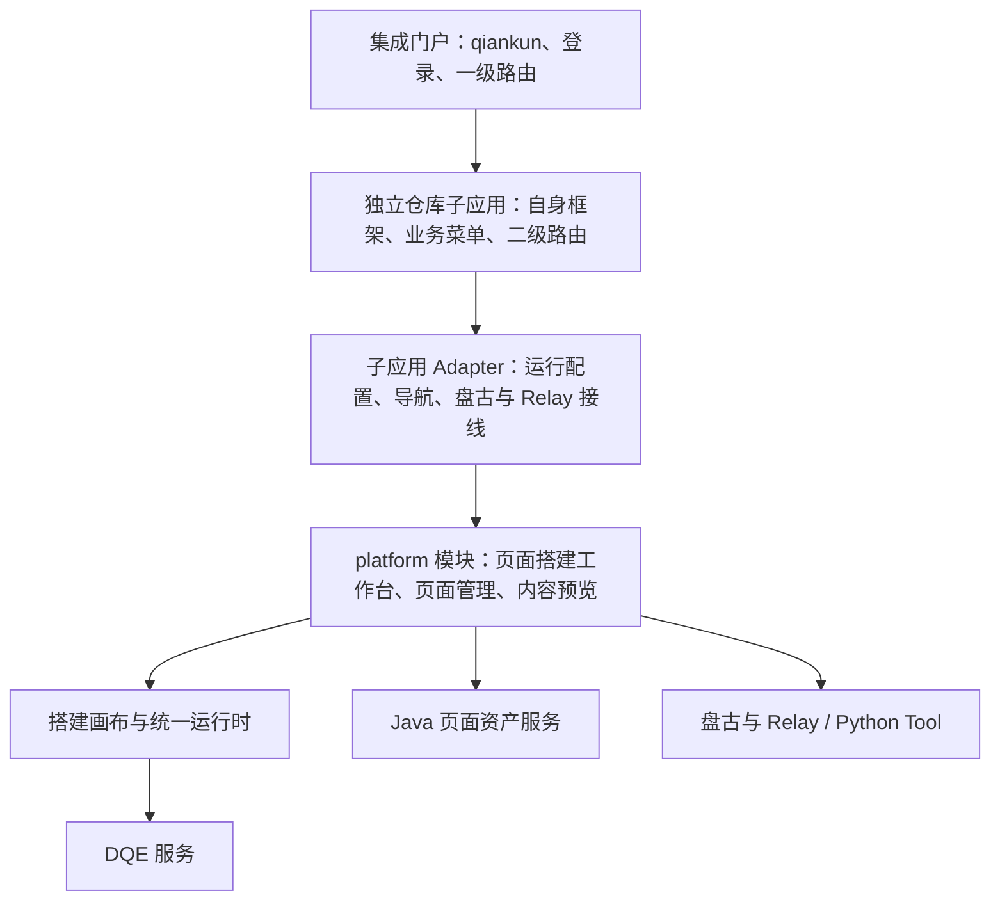

# Platform 作为独立 qiankun 子应用的一部分：构建与集成方案

日期：2026-09-28。状态：架构提案，尚未实施。代码基线：`b0bad83a` 加当前工作区只读核查；不包含工作区中并行进行的 Python 修改。

用户已确认：在现有独立维护的子应用中嵌入 platform，先支持 qiankun 2.x。外部框架、构建器、qiankun 2.x 精确小版本、发布地址尚未提供；示例地址与包名均为提案。完整 platform 包、下述 Interface 和新增构建命令目前不存在。本文交付方案，不声明 qiankun 或真实内网集成已经通过。

## 1. 推荐结论与范围

MetricCanvas 仓维护 platform 的业务界面、状态机和通用挂载 Interface；外部子应用仓维护 qiankun 生命周期、应用路由、登录配置和系统专属 Adapter。通过版本固定的 npm 包交付，外部子应用独立构建、部署、回滚。



这里子应用承担装载平台的职责，是 platform 的直接集成门户；最外层门户管理 qiankun。platform 内仍是装载渲染引擎的第一方集成应用。术语遵循 [CONTEXT.md](../../../CONTEXT.md)。

首版范围：现有页面搭建工作台、页面管理列表与详情、现有内容预览，以及已有人工保存/发布行为。AI 创作通过已有可信创作程序 Interface 接入；提供方未接通的历史修订、参数发布或 AI 能力继续明确不可用。生产包不包含 DEV 原型和测试入口。

| 方案 | 独立维护/发布特征 | 本次定位 |
|---|---|---|
| platform npm 模块 + 外部子应用 Adapter | 两仓独立；子应用锁定依赖，升级包后重建自己 | 推荐，适合“作为子应用的一部分” |
| platform 远程 JS 模块 + 外部子应用 Adapter | platform 资源可独立发布；需要资源加载与兼容版本治理 | 仅在明确要求升级免重建子应用时选择 |
| platform 整体包装成 qiankun 子应用 | 平台拥有整块子应用功能；外部仓可只维护薄包装 | 若实际需求是整应用注册，可复用同一挂载 Interface |
| iframe 承载现有 SPA | 文档、路由隔离更直接；配置和业务交互需单独桥接 | 可用备选，但不是本文主线 |

“独立维护”默认包含仓库、CI、版本、部署独立，不隐含依赖升级时完全免构建。npm 模块也不要求子应用改用 Svelte。

## 2. 当前事实与缺口

| 核查项 | 当前事实 | 为本方案需要做什么 |
|---|---|---|
| 构建入口 | [platform/package.json](../../../apps/platform/package.json)：私有应用，Svelte 5、SvelteKit 2、Vite 8 | 新增平台库构建；保留独立 SPA |
| 静态部署 | [svelte.config.js](../../../apps/platform/svelte.config.js)：adapter-static，fallback=index.html，仅配置 `METRICCANVAS_BASE_PATH` | 当前配置没有 `METRICCANVAS_ASSETS_URL`，不能沿用历史记录当作现状 |
| qiankun 生命周期 | 未发现 platform 的 bootstrap/mount/unmount 导出 | 由外部子应用维护，不写入平台业务层 |
| 路由 | [布局](../../../apps/platform/src/routes/+layout.svelte)、[工作台](../../../apps/platform/src/lib/PageAuthoringWorkbench.svelte) 依赖 `$app/paths`；工作台读 `window.location.search` | 提取中立位置输入、导航 Interface；Kit 仅留在独立 SPA Adapter |
| 运行配置 | [application-runtime](../../../packages/application-runtime/src/runtime-config.ts) 每请求读 `globalThis.__METRICCANVAS__` | 改成每实例配置源；独立 SPA Adapter 可继续读取原全局对象 |
| 页面资产 | [page-assets.ts](../../../apps/platform/src/lib/page-assets.ts) 导出模块级实例；[Java Adapter](../../../apps/platform/src/lib/page-assets/java-adapter.ts) 硬连全局配置读取函数 | 注入配置读取函数，实例工厂统一创建客户端/保存端口 |
| 对话与创作 | [盘古 Adapter](../../../apps/platform/src/lib/dialogue/runtime.ts) 访问 window/document；[创作接线](../../../apps/platform/src/lib/dialogue/authoring-integration.ts) 读全局对象 | 通过实例 props/context 注入；盘古实现由外部系统 Adapter 提供或调用明确的可选实现 |
| 通知 | 工作台当前监听 window 上的页面通知 | 迁移到实例作用域事件源；遗留全局事件桥仅允许一个明确接收实例 |
| 容器和 CSS | 根 `.platform-app` 已使用容器尺寸与局部规则；入口 HTML 提供全页高度 | 保留容器规则，独立导出 CSS；提取菜单显示模式 |
| 现有 embed | [packages/embed](../../../packages/embed/README.md) 是页面渲染的 JS 挂载入口 | 不把它宣称为完整平台嵌入，也不混入创作工作台 |

因此，给现有 SvelteKit build 加一个 `mount()` 包装并不足够：工作台自身、配置源、路由、通知和状态实例仍需解耦。SvelteKit 生成的内部启动器不作为稳定对外 Interface。

## 3. 维护责任、资产与知识

| 所有者 | 维护任务 | 交付资产与依据 |
|---|---|---|
| MetricCanvas 团队 | 平台业务、通用挂载、实例生命周期、Java/DQE 既有协议适配 | npm 包、声明文件、CSS、契约文档、CHANGELOG、离线消费样例；依据页面协议与现行 ADR |
| 外部子应用团队 | qiankun 入口、子应用页面布局、路由映射、凭据读取、盘古/Relay 系统接线 | 独立仓、锁文件、Adapter、静态 dist、发布配置；依据本系统 SDK 与登录协议 |
| 集成门户团队 | 注册子应用、登录与用户切换、应用级离开保护 | qiankun 配置、身份更新通道、门户导航策略 |
| 服务提供方 | 页面资产/DQE/Relay 鉴权与权限、跨源与 Cookie 配置 | 已确认 HTTP/SDK 契约、真实环境验收记录 |

本仓负责维护 Interface，外部仓实现系统差异。外部不复制工作台源码，不深导入 `apps/platform/src/lib`，不修改 platform DOM；平台不解析某门户专有的用户对象。

## 4. 代码组织与架构调整

建议新增 `packages/platform`，发布名暂定 `@metriccanvas/platform`：

```text
MetricCanvas/
  packages/platform/
    src/index.ts             # mountPlatform + 公共类型
    src/PlatformRoot.svelte  # UI 组合与实例 context
    src/views/               # 工作台、管理、详情，移入唯一实现
    src/integration/         # Interface、实例服务组装、导航映射
    src/styles/              # 平台壳样式
    vite.config.ts           # 普通 Svelte 插件 + library mode，无 Kit 插件
  apps/platform/             # 继续作为 SvelteKit 独立入口
    src/routes/              # 薄路由包装，消费同一平台模块
    src/lib/integration/     # Kit 导航、全局配置、DEV 配置 Adapter

external-child/              # 外部独立仓库
  src/qiankun-entry.*        # 原有子应用生命周期
  src/routes/metrics.*       # platform 路由/区域载体
  src/metriccanvas/adapter.* # Portal props -> platform Interface
```

执行时从 `apps/platform` 移动唯一业务实现，不能长期保留两份工作台。不强制增加第三个“core”公开包；内部模块按真实依赖组织即可。引擎四包发布体系保持原责任，新增平台包作为上层独立交付物。

现行 [ADR-0073](../../adr/0073-static-platform-direct-access-with-injected-runtime-config.md) 的“平台不感知微前端协议、无生产 Node 服务”继续成立；“仅自包含 SPA、唯一全局配置注入、不加回调”需由新 ADR 明确修订为“独立 SPA + 平台模块双入口、实例配置源”。新增包也需更新 ADR-0071 的交付清单说明、主题页与 host-contract。本文不提前把提案写成 accepted 决策。

## 5. 建议的对接 Interface

以下 TypeScript 是待实现设计，不是现有导出。`DialogueAdapter`、`AuthoringIntegration` 复用现有语义并从新包导出稳定类型；不能要求外部引用本仓内部路径。

```ts
type PlatformLocation =
  | { view: 'workbench'; pageId?: string; resourceId?: string }
  | { view: 'management'; page: number; state?: 'draft' | 'published' }
  | { view: 'detail'; pageId: string; resourceId: string };

interface PlatformRuntimeConfig {
  dqeEndpoint: string;
  pageMetadataBaseUrl: string;
  authToken: string;
  operatorId: string;
  workspaceId: string;
  cftk?: string;
}

interface PlatformAdapter {
  contractVersion: 1;
  runtime: {
    read(): PlatformRuntimeConfig | null;
    subscribe(changed: () => void): () => void;
  };
  navigation: {
    href(target: PlatformLocation): string;
    navigate(target: PlatformLocation, options?: { replace?: boolean }): void;
  };
  dialogue?: DialogueAdapter;
  authoring?: AuthoringIntegration;
}

interface PlatformInstance {
  setLocation(location: PlatformLocation): Promise<void>;
  canLeave(): Promise<{ allowed: boolean; reason?: string }>;
  destroy(): Promise<void>;
}

declare function mountPlatform(
  target: HTMLElement,
  options: {
    adapter: PlatformAdapter;
    location: PlatformLocation;
    chrome: 'embedded' | 'standalone';
    signal?: AbortSignal;
    onEvent?: (event: PlatformEvent) => void;
  }
): Promise<PlatformInstance>;
```

约束同样属于 Interface：

1. 每容器只允许一个活动实例；导入模块不得自动渲染、注册全局监听或读取配置。首版生产范围是每子应用一个活动平台实例；不承诺盘古 SDK 的多实例能力。
2. `mountPlatform` 在挂载根和清理机制就绪后 resolve，不等待所有业务服务在线。结构性配置错误/版本不兼容直接失败；缺少运行凭据仍显示 UI，用到服务时按既有错误语义失败。挂载失败和 signal 取消必须释放已分配资源。
3. `runtime.read` 每次请求读取，返回的值只用于当前请求。同一用户刷新 token 不重建工作台；`subscribe` 必须在用户、工作空间或服务目标改变时通知。服务端继续验证凭据和权限，前端字段不是授权证明。
4. actor/workspace 或数据服务目标变化后立即封住旧会话写入、取消可取消请求、丢弃旧回调；保留原身份作用域内的恢复记录，返回需要重新挂载的事件。外层等待销毁完成再挂载新会话。登录退出返回 null，同样停止旧会话。不得在旧页面内容上直接换成新用户凭据继续保存。
5. `setLocation` 只由外层路由的已提交状态驱动，不再反向导航。快速切换按序列号丢弃旧异步结果；`new` 应映射为无 pageId 的新工作台状态，不复用上一页草稿。
6. `canLeave` 读取并保护当前编辑状态；未保护草稿、保存中或结果未知时返回原因。外层路由在离开前决定等待、留下或明确丢弃。它不是远端保存成功的保证。
7. `destroy` 幂等且 awaitable；停止请求与流、清理订阅/计时器/DOM/对话实例/观察器。销毁不会自动提交、发布、丢弃恢复记录，也不能靠抛异常阻止 qiankun 已经开始的卸载。
8. `PlatformEvent` 拟封闭为 `ready`、`error`、`auth-required`、`session-invalidated`、`leave-state-change`；带类型化错误码与脱值消息，不携带 token、页面数据行。`ready` 仅表示界面挂载就绪，不代表 Java/DQE/Relay 集成成功。
9. 页面通知进入实例事件源；遗留 `apply-page`/saved-draft 桥保留既有权限读取和精确引用核对，不把 `pageId` 通知当作可信页面文档。

运行配置保持现有字段，Java 与 DQE 客户端继续由平台维护；不要求每个子应用重写业务协议。若未来确有第二种页面资产系统，再在已有 PageAssets Interface 替换 Adapter。对话/AI 是显式可选能力，未提供时显示未接入，不静默加载内网 SDK。

公开 types 必须汇总内部依赖：包含对话/创作回调所需类型，或仅引用明确发布的包；不能在 `.d.ts` 里漏出 `$lib`、Kit 类型、仓内私有包及源路径。普通外部应用只消费编译后 JS 和声明文件。

## 6. 路由、容器与样式

外部子应用拥有唯一浏览器路由；platform 以受控位置运行，无 browser/hash router，不修改 `history` 或 `<base>`。

| 外部 URL 示例 | 平台位置 |
|---|---|
| `/ops/metrics/build` | `{view:'workbench'}` |
| `/ops/metrics/build?page=p1&resource=r1` | 工作台指定页面与资源 |
| `/ops/metrics/manage?page=2&state=draft` | 管理列表及筛选 |
| `/ops/metrics/pages/p1?resource=r1` | 页面详情 |

Adapter 负责 URL 编解码、返回栈、前进后退和刷新恢复。平台链接用 `navigation.href` 保留复制链接/新标签能力；普通内部点击交给 `navigate`，外层路由提交后再调用 `setLocation`，禁止双向循环。统一运行时原有跨页导航接管 Interface 继续使用，不能把所有外链强制改写为平台路由。

`chrome:'embedded'` 隐藏平台品牌/全局导航栏，但保留页面操作工具栏；子应用给出菜单和面包屑。`standalone` 保留现有平台导航。UI 提取不重新设计业务页面。

```css
/* 外部子应用：父级也必须有明确高度；也可使用父级 flex/grid 剩余区域。 */
.metrics-slot { width: 100%; height: 100%; min-width: 0; min-height: 0; }
```

CSS 首选现有根节点作用域方案，所有平台壳规则限定在 `.platform-app` 下；不写全局 body reset，不改 document.title（改用外层路由标题），弹层不传送到 document.body，不锁门户滚动。统一运行时呈现沿用既有规则。子应用避免向挂载区域施加强制全局 reset。

不默认给整个 platform 加 Shadow DOM：现有盘古 Adapter 使用 document/selector，必须先核实 SDK 是否可访问 ShadowRoot。也不把 qiankun CSS 隔离当作绝对保证。验收需覆盖外部全局 CSS、弹层、图表尺寸、焦点恢复、隐藏后再显示的 resize。

IndexedDB 不由 qiankun 自动隔离。继续保持 actor/workspace/page/resource 的存储分区；如需加入部署/实例命名空间，先设计迁移与旧记录恢复，不在本次抽包时直接改 key 丢失待确认保存记录。

## 7. 构建、包与版本

### 7.1 MetricCanvas 仓

首版发布编译后的 ESM + CSS + 完整声明，包含 Svelte、平台内部实现和渲染依赖的浏览器实现；外部无需安装 Svelte 编译插件。类型若引用 `@metriccanvas/page` 等公开包则声明固定兼容依赖；禁止运行产物出现未解析裸导入或 `workspace:*`。为降低与 qiankun 2 loader 的组合复杂度，首版平台 JS 合并单入口，测量体积后再按实际子应用工具链引入分块。

```text
@metriccanvas/platform
  dist/platform.js
  dist/platform.css
  dist/index.d.ts           # 所有可达声明随包交付
  package.json              # exports 仅暴露 . 和 ./style.css
  README.md / CHANGELOG.md / LICENSE
```

建议 Vite library mode，使用普通 `@sveltejs/vite-plugin-svelte`，输出 `formats:['es']`；Vite 8 的单文件控制采用 `build.rolldownOptions.output.codeSplitting:false`，CSS 单独输出并导出固定访问路径。CSS 不能被 tree-shaking 删除（声明相应 sideEffects）。构建期显式固化 production 分支、排除 DEV config/fixture，扫描产物中的 `$app`、`$lib`、绝对仓路径、开发凭据与服务地址。Vite 库模式及 CSS 交付参考 [官方构建文档](https://vite.dev/guide/build.html#library-mode)。

建议命令（新增包和脚本完成后才可执行）：

```bash
# 采用当前 CI 工具链：Node 24、pnpm 11；以冻结锁文件为准
pnpm install --frozen-lockfile
pnpm build:packages
pnpm --filter @metriccanvas/platform check
pnpm --filter @metriccanvas/platform build
pnpm --filter @metriccanvas/platform pack --pack-destination ../../artifacts
```

用 tarball 在仓外的最小消费者安装、类型检查和构建，不能只通过 workspace 链接验收。发到内部 npm registry，版本固定为已验收的 release/RC；发布工作由 CI 使用 registry 凭据完成。记录包版本、源码 SHA、摘要、公开 Interface 版本和支持的页面 Schema 区间；它们不是同一版本序列。

独立 SPA 同样消费新模块，保留当前命令 `METRICCANVAS_BASE_PATH=/metriccanvas pnpm --filter platform build`，作为回归与开发入口。npm 嵌入路径不消费 SvelteKit 的 build/index.html，也不使用其 base 配置。

### 7.2 外部子应用仓

```bash
# 示例版本号占位；实际用发布成功且验收过的版本
pnpm add --save-exact @metriccanvas/platform@<version>
pnpm install --frozen-lockfile
pnpm build
```

```ts
import { mountPlatform } from '@metriccanvas/platform';
import '@metriccanvas/platform/style.css';
```

子应用构建将平台模块纳入自己的依赖图和静态 dist。不要把 Svelte、MetricCanvas 或 qiankun 外部化到不可核实的 window 全局共享对象。较老子应用打包器若不能消费当前 ESM/语法目标，需要指定目标浏览器并做消费构建验证，不能仅靠安装成功放行。

平台包与子应用独立维护；子应用 lockfile 固定平台版本和所有传递依赖。升级通过明确依赖更新进入子应用 CI，不使用运行时 latest。回滚子应用 dist 即同时回滚平台版本。

## 8. 外部子应用接入流程

已有子应用的 `bootstrap/mount/unmount` 保持拥有整个子应用；进入 metrics 路由后，路由载体调用 `mountPlatform`，离开该路由销毁实例。不要在子应用里为了装 platform 再启动一套 qiankun，也不要将整个子应用的 mount 替换成仅挂工作台。

下面是框架无关的**流程伪代码**；routeAdapter、session、renderChildShell 均由外部仓实现，不是本仓已有函数：

```ts
// 子应用原生命周期
async function mount(props) {
  session.acceptPortalProps(props);
  await renderChildShell(props.container);
  // 路由进入 /metrics 后才调用下面的 enterMetrics。
}

let instance;
let mounting;
let entering;

async function enterMetrics(slot, location) {
  mounting = new AbortController();
  entering = mountPlatform(slot, {
    adapter: createSystemAdapter(session, routeAdapter),
    location, chrome: 'embedded', signal: mounting.signal,
    onEvent: handlePlatformEvent
  });
  instance = await entering;
}

async function routeChanged(location) {
  await instance?.setLocation(location);
}

async function beforeRouteLeave() {
  const state = await instance?.canLeave();
  return state?.allowed ?? true; // 拦截阶段由子应用呈现 reason
}

async function disposeMetrics() {
  mounting?.abort();
  // 既要处理尚未完成挂载，也要 await 已挂实例的完整清理。
  const active = instance ?? await entering?.catch(() => undefined);
  await active?.destroy();
  instance = entering = mounting = undefined;
}

async function unmount() {
  await disposeMetrics();
  await destroyChildShell();
}
```

正式外部载体须串行化 enter/dispose，使用代次标识拒绝旧 mount 的回写，并处理重复 mount/快速离开；伪代码只展示责任顺序。React effect 清理/严格模式、Vue 路由缓存或 KeepAlive 必须映射为同一生命周期策略。首版默认退出就销毁；隐藏缓存需要另行定义暂停与恢复语义。

portal props 的凭据更新应进入 session 的可订阅配置源。是否通过 qiankun `update`、外部 SDK 订阅或门户状态通道交付取决于现网；不能假设 `registerMicroApps` 会自动刷新初始 props。普通 token 刷新不销毁平台，用户/工作空间/服务目标改变则按 §5 重建。

应用级切走由最外层门户事先调用子应用的离开保护；qiankun `unmount` 是执行清理的位置，不是弹确认框并拒绝卸载的位置。若门户不给保护机制，明确记录强制切走的草稿恢复限制，不承诺零丢失。

### qiankun 2.x 集成基线

用户指定先支持 2.x。外部子应用已能被现网 qiankun 装载时，保留其现有工具链，只增加平台依赖和路由载体。

- qiankun 2：官方传统路径是 HTML entry + 可识别的生命周期导出（常见 UMD）；ESM 平台包在子应用构建阶段打进该产物，不把平台 ESM 文件直接用作 qiankun HTML entry。若现有 Vite 子应用使用适配插件，需以其真实版本产物验证；不从本仓引入未经验证插件。
- qiankun 3：官方新文档另有 ESM/bundler-plugin 路径；不能把新文档直接用于现网 2.x，也不为了平台接入强制升级门户。
- 按路由加载子应用用 `registerMicroApps`；门户在局部区域手工装载整个子应用时可用 `loadMicroApp`，并持有句柄显式卸载。它们注册/加载的都是外部子应用，不是平台 npm 包。

版本资料、ESM、sandbox、publicPath 细节见 [官方研究](./official-research.md)。

## 9. 生产部署、路径与网关

四类地址分别配置：

| 地址 | 示例 | 所有者 |
|---|---|---|
| qiankun HTML entry | `/micro/ops/releases/R1/index.html` | 集成门户注册与子应用发布 |
| 浏览器路由前缀/activeRule | `/ops`，平台区域 `/ops/metrics` | 门户与子应用路由 |
| 子应用静态资源前缀 | `/micro/ops/releases/R1/` | 子应用构建器/publicPath |
| Java/DQE/Relay 地址 | `/rest/...` 或经批准的完整服务 URL | 运行配置/系统 Adapter |

平台 npm 包没有独立 HTML entry，也不推导任何一类地址。qiankun 2 Webpack 子应用如使用 `__INJECTED_PUBLIC_PATH_BY_QIANKUN__`，必须在加载依赖与异步 chunk 之前设置 `__webpack_public_path__`；Vite 不使用 Webpack 变量，按现有构建器方式配置。资源 URL 不能错误地跟随浏览器 `/ops/metrics` 路由解析。

推荐同源网关提供门户、子应用静态资源与业务服务代理。Nginx 示例仅说明路径责任，替换为实际网关配置：

```nginx
# /srv/www/micro/ops/releases/R1/index.html + assets/...
root /srv/www;
location ^~ /micro/ops/releases/ {
    try_files $uri =404;
}
# /ops/... 深链刷新返回最外层门户，由其启动 qiankun。
location /ops/ {
    try_files $uri /index.html;
}
# /rest/ 与 Relay 前缀应先命中对应网关代理规则，不能回退 HTML。
```

发布顺序：上传完整不可变版本目录 → 校验 HTML/JS/CSS/字体/chunk → 切换门户发布配置到新 entry → 小流量验证 → 扩大范围。门户 index/动态发布清单使用 no-cache，带版本和 hash 的资源使用 immutable；保留上一版本目录和可能仍被旧会话引用的 chunk，避免滚动发布 404。失败时将 entry 切回旧版本，并让受影响会话重新加载。

若 HTML/资源跨域，需按 loader 实际 fetch 设置资源 CORS 和 CSP。业务 API 跨域与静态资源跨域分别验证。页面资产当前使用 `credentials:'include'` 与可选 cftk；服务须允许具体 Origin、凭据和实际请求头，不能用 `Access-Control-Allow-Origin:*` 搭配凭据。DQE 按现有 token/actor/workspace 头传递。Cookie 仍受 Domain/Path/SameSite 限制，静态资源 URL 与 API base 均不能替代这些要求。参见 [当前契约](../../host-contract.md)。

浏览器仍直接消费服务或网关；没有新增 Node 平台服务。盘古 SDK 的资源 URL、版本、加载所有权由外部 Adapter 明确指定，复用外部已加载实例前核实版本；销毁平台只能销毁自己拥有的对话实例，不能移除其他功能共享的 SDK。

若选择远程 platform 模块，另发布带版本 JS/CSS manifest、校验 Interface 版本并固定下载地址；资源加载去重和卸载、CSP、CORS、缓存都由专门 loader 管理。qiankun 2 下原生 ESM 执行与 sandbox 作用域须单独实证，不承诺与 npm 构建路径等价。首版不并行实现两条交付路径。

## 10. 实施顺序与验收

| 步骤 | 具体交付 | 完成条件 |
|---|---|---|
| 1. 冻结契约 | 明确外部框架/qiankun、功能范围、发布模式；新 ADR 和接口稿 | 平台团队与子应用团队使用同一生命周期/导航/配置语义 |
| 2. 提取平台模块 | 单一业务实现、受控路由、每实例 services、通知和配置源 | 可达业务代码不依赖 `$app/*`；独立 SPA 继续使用相同功能 |
| 3. 构建与发包 | library build、CSS、types、tarball、内部 registry RC | 干净仓外消费者无需 Svelte 插件完成 build；无仓库私有引用 |
| 4. 子应用 Adapter | 路由载体、session、系统 SDK 接线、卸载与离开保护 | 真实子应用 production dist 可在指定 qiankun 版本下挂载 |
| 5. 服务联调与发布 | Java/DQE/盘古/Relay、Cookie/CORS、版本回滚 | 逐层记录真实结果与未接通能力，灰度与回滚演练完成 |

需要的确定性证据：

- 同容器重复挂载拒绝；挂载失败、挂载中卸载、重复销毁后无残留；旧请求不能回写新实例。
- token 更新后下一请求使用新值；身份失效立即封住旧会话写入；IndexedDB 和页面事件不串实例。
- 导航映射 round-trip、前进后退、查询参数和空白新建不会混用旧页面；离开保护不自动发布。
- tarball 安装、公开声明、独立 SPA 与外部子应用构建；生产产物无 DEV 入口与注入值。

必要的集成浏览器验收（计划项，本次未运行）：真实 qiankun production entry 挂载/卸载再挂载、快速切换、深链刷新、带凭据请求、图表与弹层/SDK 在真实容器中工作。仅覆盖这些微前端特有风险，不扩大为无关全站浏览器测试。

真实服务验收单独记录：页面目录→读当前页面→人工编辑→保存回执→重新打开；DQE 请求→筛选重查；AI 创作→可信回执/产物读取→工作台接受；身份切换与授权拒绝。保存未知状态沿用现有恢复规则，不能自动重试写请求。替身通过不算真实 Java/DQE/Relay 通过。

本次证据状态：代码与官方资料核查完成；新增平台库构建、外部消费构建、浏览器 qiankun、真实服务联调、部署回滚全部 **NOT_RUN**，因为本文尚未实施。

## 11. 实施前需收敛的架构问题

1. 是否接受 npm 固定版本、升级后重建子应用？若要求 platform 升级免重建，转为远程交付并补 loader 契约。
2. 已确认 qiankun 2.x；外部子应用具体框架、构建器、2.x 小版本和最低浏览器仍需明确，决定最终产物转换与 SDK 兼容证据。
3. 首版是否需要完整工作台与管理，还是只需要工作台？后者可以缩小首版公开位置集合；如果只渲染页面，应消费既有 embed。
4. 门户是否已有盘古实例与 Relay 通道，是否允许应用级离开保护？这决定对话资源所有权与强制切走的恢复能力。
5. 一个子应用会同时打开多个平台实例吗？默认单活动实例；多实例必须进一步核实 SDK、通知和持久化竞争规则。

这些问题用于冻结实施契约；不阻止先评审本方案。当前推荐按 npm、单活动实例、外层唯一路由、已有能力全集、系统 Adapter 外置推进。
