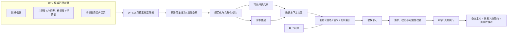
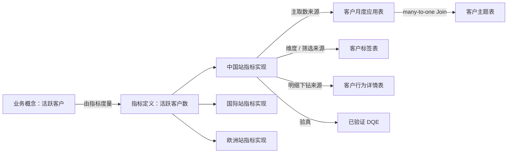

# DP 驱动的语义底座与本体层方案思考

> 状态：讨论记录，尚未形成架构决策  
> 日期：2026-08-14  
> 范围：DataPlatform（DP）、数据上下文快照、指标与数据资产关系、DQE、语义层、本体层及规模化验证路径

## 1. 背景与问题

MetricCanvas 当前以一份仓库内静态 JSON 作为数据上下文快照，由创作期 Data Agent 检索业务域、指标、维度和已验证查询；取数单元再被确定性地派生为 DQE 查询定义和结果字段契约，通过数据网关执行。开发环境默认连接 DQE 仿真，因此查询链路是真实 HTTP 链路，但业务数据默认是 fixture 或确定性合成数据。

实际数据底座的规模和约束远大于当前样例：

- 1000+ 张主题大表；
- 4000+ 个日常治理和更新的指标；
- 中国、国际、欧洲三个站点；
- 指标、表结构、资产关系和业务数据持续变化；
- 已有 DataPlatform（DP）保存指标信息以及指标挂靠的数据资产；
- DP 中的数据资产包括主题表、应用表、标签表、详情表等；
- 可以通过 CLI 查询指标详情、挂靠资产、主题表和应用表信息；
- 真实 DQE 的服务端实现、物理映射和权限接入尚未在当前仓库落地。

因此，待验证的问题不再是“能否把少量指标写进 Prompt 并生成查询”，而是：

1. 如何从 DP 持续获得可发现、可审计、可复现的数据能力；
2. 如何表达指标与多类数据资产的可执行关系；
3. 如何在三个站点之间表达同一业务指标的不同物理实现；
4. 如何控制 4000+ 指标的检索上下文，而不是把全量语义面注入模型；
5. 如何区分业务概念、本体知识与可执行查询语义；
6. 如何证明一个 DP 指标不只是“已发布”，而是真的能被 DQE 正确执行。

## 2. 当前形成的核心判断

### 2.1 DP 是权威来源，MetricCanvas 不复制 DP 的治理上下文

DP 应作为指标信息和指标关联数据资产的权威来源候选。MetricCanvas 不应人工维护第二套指标事实，也不应复制 DP 的完整审批状态机、负责人流转或内部任务状态。

MetricCanvas 只保留创作期需要的稳定来源引用和投影，例如：

- DP 稳定指标 ID / code；
- DP 指标版本和更新时间；
- 指标名称、别名、口径、单位和负责人；
- 指标挂靠的数据资产引用；
- 指标在不同站点的可用性；
- 构建数据上下文快照时使用的 DP 采集批次或水位。

该判断不恢复已被废弃的“指标履约”流程。指标条目仍然只作为创作期的数据能力发现锚点，不进入看板页面协议，也不是形成查询的绝对前置。页面最终保存的是经过验真的查询定义和结果字段契约，而不是 DP 指标引用。

### 2.2 需要数据上下文快照，CLI 不应成为每次问数的实时强依赖

推荐边界：

```text
DP                 = 权威事实源
DP CLI             = 同步与按稳定 ID 补充详情的通道
数据上下文快照     = MetricCanvas 创作期使用的不可变版本化投影
DQE                = 可执行性的最终证据
```

每一步都实时调用 CLI 会带来：

- 一次运行中读到旧口径、新资产和新字段的撕裂状态；
- 无法重放“当时 Agent 看到了什么”；
- DP CLI 延迟、限流或故障直接放大为问数故障；
- 无法建立适合业务域、别名、语义描述和站点过滤的专用索引；
- 很难原子地发布经过完整性校验的语义版本。

快照不包含业务数据行。业务数据的新鲜度由 DQE 查询负责；只有指标、维度、资产关系、表结构、权限和执行能力变化才驱动新数据上下文快照。

### 2.3 全量元数据进入索引，但不进入单次模型上下文

4000 个指标和 1000 张表并不构成存储或索引难题，真正的边界是检索准确率和模型上下文。

推荐两级发现：

1. 第一级在全量索引中检索指标摘要：名称、别名、口径、业务域、站点和状态；
2. 第二级只对少量候选按稳定 ID 读取资产关系、字段、粒度、维度和执行能力。

每次只向模型提供与当前问题相关的一到两个业务域和少量候选，不把全量 DP 内容放进 Prompt。

### 2.4 DP 已提供语义层的重要原料，但“挂靠资产”不等于“可执行”

DP 已经具备初步语义层的两类关键事实：

- 指标的业务语义；
- 指标与数据资产的关联。

但还需要确认或补齐：

- 数据资产的一行代表什么，即粒度；
- 指标以哪个资产作为主取数来源；
- 指标的聚合方式、可加性和时间聚合方式；
- 指标允许使用哪些维度；
- 表之间的 Join 字段、基数和方向；
- 哪个资产只用于筛选、属性补充或明细下钻；
- DP 指标 ID / code 与 DQE 中文指标名的映射；
- 指标在每个站点是否真的可执行；
- 行级、字段级、指标级和站点级权限由谁执行。

因此，`DP published`、`存在挂靠资产` 和 `DQE 可执行` 是三个不同事实，不应互相替代。

## 3. 建议的分层架构



### 3.1 数据资产层

保存 DP 中的资产事实：

- 资产稳定 ID；
- DP 原始资产类型；
- 所属站点和业务域；
- 字段、业务键、时间字段和分区；
- 数据粒度；
- 更新频率与新鲜度 SLA；
- 敏感级别和权限范围；
- 上下游血缘和关联关系。

主题表、应用表、标签表、详情表只是 DP 的来源分类，不能直接决定语义角色。可能的候选映射如下，最终必须以真实粒度和能力证据裁决：

| DP 资产类型 | 可能承担的语义角色 |
| --- | --- |
| 主题表 | 主事实来源、一致性维度来源、公共分析模型 |
| 应用表 | 面向一组指标的服务化或预聚合实现 |
| 标签表 | 实体属性、维度快照、筛选候选来源 |
| 详情表 | 明细事实、子事实或下钻来源 |

### 3.2 可执行语义层

可执行语义层回答：

- 计算什么；
- 基于哪个事实粒度；
- 如何聚合；
- 可以按什么字段切分和筛选；
- 需要哪些 Join；
- 在哪个站点和执行环境可用；
- 如何形成 DQE；
- 权限和查询资源约束是什么。

建议至少包含以下对象：

- 指标定义；
- 指标实现；
- 数据资产；
- 维度；
- 资产关系；
- 指标-维度兼容关系；
- 执行环境；
- 已验证查询。

### 3.3 薄本体层

薄本体层回答：

- 客户、产品、合同、区域、行业等业务概念是什么；
- 概念之间有什么业务关系；
- 用户使用的别名、黑话和正式概念如何对应；
- 哪些指标度量某个概念；
- 哪些数据资产是某个概念的权威来源；
- 三个站点对同一概念是否存在差异定义。

第一阶段不建议引入完整 RDF / OWL 推理体系。本体层不保存 SQL、DQE 原文、物理字段或聚合表达式；这些属于可执行语义层。

### 3.4 Agent 知识层

在数据上下文快照之上，为 Data Agent 提供：

- 同义词和业务说明；
- 已验证查询；
- 公司口径的派生度量模板；
- 常见问题和消歧样例；
- 权威来源和认证信号；
- 检索索引；
- 黄金问题与评测基线。

## 4. 指标与数据资产的关系模型

### 4.1 区分“指标定义”和“指标实现”

“活跃客户数”作为业务口径是一条指标定义；它在中国、国际、欧洲可能分别落在不同资产、使用不同 DQE 名称或具有不同可用维度，因此需要站点级指标实现。



候选对象形状：

```yaml
metric_definition:
  id: active_customer_count
  name: 活跃客户数
  definition: 统计期内至少发生一次有效行为的去重客户数
  unit: 家
  additivity: non_additive
  time_aggregation: period_recompute

metric_implementation:
  metric_id: active_customer_count
  site: cn
  dqe_metric_name: 活跃客户数
  primary_asset: cn_customer_activity_app
  grain: 统计周期 × 客户
  time_field: stat_date
  allowed_dimensions: [区域, 客户级别, 行业]
  status: verified
```

### 4.2 关系本身必须携带语义角色

指标与资产之间不只是一条无类型连线。至少需要区分：

- `primary_source`：主取数来源；
- `dimension_source`：维度或属性来源；
- `filter_lookup`：筛选候选值来源；
- `drillthrough_detail`：明细下钻来源；
- `materialized_by`：预计算或服务化资产；
- `validated_by`：已验证查询或验证证据。

资产之间的 Join 关系至少需要：

- 左右资产和字段；
- 一对一、一对多、多对一或多对多基数；
- Join 方向和用途；
- 生效站点；
- 有效时间范围；
- 是否允许用于指标聚合。

错误的 Join 基数会产生看似正常的重复聚合，是语义层首要防范的问题之一。

### 4.3 三站点不是三个业务域

业务域表达数据的业务含义；中国、国际、欧洲如果具有独立的数据驻留、端点或权限边界，则更接近执行环境或数据驻留分区。

仍需确认三种实际情况：

1. 一个全局指标 ID 对应三份站点实现；
2. 三个站点分别创建三个指标 ID，但口径等价；
3. 同名指标在不同站点口径不同，不能合并。

这一事实可能要求修订当前“各业务域共用同一个执行环境”的架构假设。在确认站点拓扑前，不修改正式词汇表和 ADR。

## 5. 快照与持续更新

推荐更新链路：

```text
DP CLI 拉取
→ 写入暂存区
→ 规范化
→ 检查重复 ID、悬空资产、站点映射和关系基数
→ 构建检索索引
→ 原子发布新数据上下文快照
```

优先使用：

1. DP 变更事件；
2. `updated_since` 等增量读取；
3. 定时全量导出加内容哈希差异计算。

同步失败时继续使用上一个成功版本。一次 Agent 运行固定使用同一快照版本，避免指标、资产和字段来自不同 DP 时点。

建议分层保存：

- 全量指标摘要：全部 4000+ 指标；
- 资产能力摘要：全部 1000+ 数据资产；
- 字段、详细血缘和复杂关系：候选收窄后按稳定 ID 读取或缓存；
- 业务数据行：不进入快照，由 DQE 实时查询。

## 6. DQE 的位置

Data Agent 不直接生成物理 SQL，也不根据物理表名猜指标。推荐链路：

```text
用户问题
→ 数据上下文检索
→ 取数单元
→ 名称、维度、站点、权限、粒度和可加性清单校验
→ 确定性派生 DQE
→ 真实 DQE 执行
→ 物化结果字段契约
```

DP 与 DQE 的职责不同：

| 系统 | 主要回答的问题 |
| --- | --- |
| DP | 有哪些指标、口径是什么、挂靠哪些资产、由谁治理、在哪些站点存在 |
| 数据上下文快照 | 在某个不可变版本下，Data Agent 可以发现和校验哪些能力 |
| DQE | 当前身份和站点下，这个指标、维度、时间与筛选组合是否真的能执行 |
| MetricCanvas | 如何理解问题、形成取数单元、验真并组织成看板页面 |

真实 DQE 尚待补齐的关键证据包括：

- 请求和响应契约；
- DP 指标 ID / code 与 DQE 指标名的映射；
- 维度和时间粒度能力；
- formula 语法和安全边界；
- 站点路由；
- 用户、租户和数据权限；
- 超时、并发、分页和资源限制。

## 7. 对 semantic-creator 元技能的评估

已只读检查第三方仓库中的 `semantic-creator`，未安装到当前环境。

### 7.1 可复用价值

该技能适合作为建模工作流底座，主要价值是：

- evidence-only：只依据 API、CLI、DDL 或表结构证据；
- grain-first：粒度未确认前不挂维度、不定义度量；
- 显式判断事实、维度、度量、可加性和路由；
- 所有决策初始待确认，通过离线 HTML 工作台由用户审批；
- 支持 Kimball YAML 和 Google OKF v0.1 输出；
- 提供引用完整性、悬空关系、粒度和复用检查；
- Apache-2.0 许可。

### 7.2 不能原样使用的原因

该技能默认把 CLI 的 `list/show` 输出视为候选事实或快照。DP CLI 查询的是元数据目录；如果原样运行，可能建出“DP 目录自身的分析模型”，而不是客户、订单、运营等业务过程的语义模型。

此外，它当前没有一等表达：

- 指标定义与站点级指标实现；
- DP 原始资产类型和指标-资产关系角色；
- 三站点的数据驻留与执行环境；
- 权限、新鲜度、版本、血缘和认证状态；
- DQE 可执行性和真实结果验真；
- MetricCanvas 数据上下文快照的目标格式。

### 7.3 推荐的定制方向

可以在其工作流之上形成项目定制版 `dp-semantic-creator`：

```text
DP CLI 元数据
→ DP 专用 Ingest（CLI 输出只作为证据，不作为业务事实）
→ 指标定义 + 指标实现 + 数据资产 + 资产关系
→ grain-first 人工评审
→ MetricCanvas Semantic YAML
→ 数据上下文快照 + 检索索引 + DQE 能力清单
→ 真实 DQE 验真
```

应保留：证据驱动、粒度优先、人工门禁、HTML 评审和结构校验。应新增：站点、指标实现、资产关系角色、权限、新鲜度、版本、MetricCanvas 输出和 DQE 验真。

## 8. 参考 Databricks 得到的启发

Databricks 的当前方向可以映射为：

| Databricks 概念 | 本方案中的对应能力 |
| --- | --- |
| Unity Catalog / Domains | DP 数据资产治理、业务域和认证信号 |
| Metric Views | 可执行语义层：来源、Join、筛选、字段和度量 |
| Local Metric Views | 问数或页面内的临时口径，成熟后再沉淀 |
| Genie Knowledge Store | 同义词、关系、规则、示例查询和可信资产 |
| Genie Ontology | 业务概念和权威知识的关系地图 |
| SQL Warehouse | DQE 背后的真实查询执行能力 |

可借鉴的原则：

1. 可复用指标和 Join 必须进入受治理的显式语义对象；
2. 临时分析口径和公司口径分层；
3. 本体和知识增强发现、消歧与权威判断，但不替代执行语义；
4. 已验证查询、可信资产和评测问题是准确率工程的一部分；
5. 权限必须在真实执行端生效，而不是由前端过滤。

## 9. 建议的启动切片

不要立即为 4000 个指标逐个完成人工建模。第一步选择一个纵向切片：

- 一个业务域；
- 中国、国际、欧洲三个站点；
- 10～20 个代表性指标；
- 1～3 张主题表；
- 2～5 张应用表；
- 至少一张标签表和一张详情表；
- 20～30 条已知正确的业务问题和查询依据。

指标样本至少覆盖：

- 可加指标；
- 去重指标；
- 比率指标；
- 期末值或半可加指标；
- 三站点同口径指标；
- 三站点同名不同口径指标；
- 一个指标挂靠多个资产；
- 一个资产承载多个指标。

实施顺序：

1. 保存 DP CLI 的原始证据；
2. 对每张数据资产确认粒度、业务键、时间字段和站点；
3. 对每个“指标 × 站点”建立指标实现；
4. 确认指标-资产关系角色和 Join 基数；
5. 从已确认语义中抽取薄本体；
6. 生成数据上下文快照、检索索引和 DQE 能力清单；
7. 用真实 DQE 和黄金问题验真；
8. 验证模型形状后，再把全量 4000 指标导入索引和同步链路。

应从第一天使用全量 DP 元数据验证采集、版本、增量和检索规模；执行正确性则先用代表性切片验证。

## 10. 下一步需要的证据

### 10.1 DP CLI

- CLI 名称、版本和脱敏后的 `--help`；
- 指标列表和按稳定 ID 查询详情的原始输出；
- 指标挂靠资产查询；
- 主题表、应用表、标签表、详情表及字段查询；
- 分页、最大返回量、错误码、限流和超时；
- 是否支持更新时间、`updated_since` 或变更事件；
- 草稿、已发布、下线和删除的状态语义；
- CLI 是中央查询三站点，还是每个站点分别连接。

### 10.2 代表性样本

- 三站点口径完全相同的指标；
- 三站点同名但口径不同的指标；
- 仅在一个站点存在的指标；
- 同时挂靠标签表和详情表的指标；
- 一个资产承载多个指标；
- DP 已发布但 DQE 暂不可执行的指标。

### 10.3 DQE 与权限

- 每站点 5～10 组脱敏 DQE 请求和响应；
- DP 指标 ID / code 与 DQE 指标名的映射样本；
- 单指标、分组、时间、筛选、分页、候选值、公式和拒答场景；
- 用户、角色、租户和站点的权限关系；
- 行级、字段级和指标级权限的执行位置。

不要在仓库或讨论记录中提供真实密码、Token、Cookie 或敏感业务数据行。

## 11. 待确认问题

1. 中国、国际、欧洲是三个独立数仓 / DQE 端点，还是同一执行环境中的租户分区？
2. 是否允许跨站点查询或只允许汇总后的跨站点结果？
3. DP 中一个全局指标是否能关联三份站点实现？
4. DP CLI 是否提供稳定 ID、版本、更新时间和增量读取？
5. 主题表、应用表、标签表、详情表在 DP 中的正式定义分别是什么？
6. 指标挂靠资产关系是否携带角色，还是只有无类型关联？
7. DP 是否提供粒度、允许维度、聚合方式和 Join 基数？
8. DP 指标 code 能否直接用于 DQE，还是需要额外映射？
9. DQE 是否已有真实服务，还是需要自建语义查询服务？
10. 数据权限最终由 DQE、数据服务还是 MetricCanvas 承担？
11. 数据上下文快照需要达到什么新鲜度 SLA？
12. 哪些业务问题可以作为首批黄金问题和正确性基线？

## 12. 可能形成的后续决策与词汇

以下内容满足“影响长期边界、存在真实权衡、未来读者需要知道原因”的条件，但目前证据不足，待上述问题确认后再写 ADR：

- DP 是指标条目和关联资产的只读权威来源；
- 数据上下文快照是 DP 的创作期不可变投影，CLI 不成为实时强依赖；
- 指标定义与站点级指标实现分离；
- 业务域与站点 / 数据驻留边界分离；
- 可执行语义层先于薄本体层；
- 本体知识不作为查询执行真源；
- DQE 真实执行是查询可用性的最终证据。

待确认后可考虑向 `CONTEXT.md` 增加或修订：

- 指标实现；
- 数据资产；
- 数据资产角色；
- 站点或数据驻留分区；
- 业务概念；
- 权威来源。

## 13. 参考资料

### 项目内

- [领域词汇表](../../CONTEXT.md)
- [ADR-0023：删除指标履约与目录发现空壳](../adr/0023-remove-metric-fulfillment-and-catalog-packages.md)
- [ADR-0031：指标作为数据上下文的发现锚点](../adr/0031-metrics-as-data-context-discovery-anchor.md)
- [ADR-0032：创作期查询必须经清单校验与真实执行验真](../adr/0032-authoring-time-query-verification.md)
- [ADR-0034：GraphQL / REST 作为数据网关适配器](../adr/0034-graphql-rest-as-data-gateway-adapters.md)
- [Schema 元数据规则](../schema-metadata.md)

### 外部

- [Databricks Unity Catalog semantics](https://docs.databricks.com/aws/en/uc-semantics/)
- [Databricks Model metric views](https://docs.databricks.com/aws/en/uc-semantics/metric-views/basic-modeling)
- [Databricks Data modeling in AI/BI dashboards](https://docs.databricks.com/gcp/en/dashboards/manage/data-modeling/)
- [Databricks Genie Agents concepts](https://docs.databricks.com/gcp/en/genie-agents/concepts)
- [Databricks Genie Ontology](https://docs.databricks.com/aws/en/genie-one/chat)
- [SemanticSkills semantic-creator](https://github.com/ontology-of-everything/SemanticSkills/tree/main/skills/semantic-creator)

