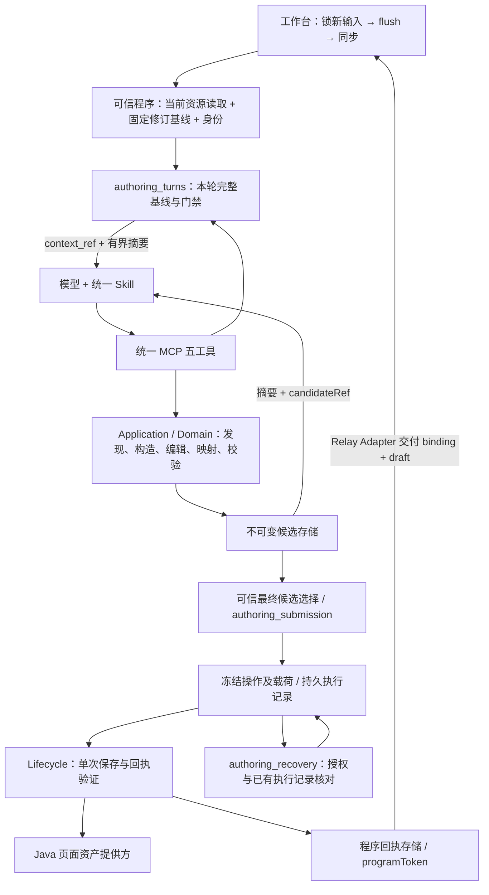

> 历史兼容协议 1.0；当前目标入口见同目录 ARCHITECTURE.md。

# MetricCanvas 创作架构与维护导航

更新：2026-09-16，包含 Java 页面资产单次提交改造；此前集成基线为 `d5aa4be`。本文描述实际源码和能力边界；[目标架构](../docs/archive/unified-authoring/2026-09-15-authoring-agent-architecture.md)保留设计解释与目标目录。

当前 Bundle 为 `0.2.0`，状态 `local-core-verified-external-validation-blocked`。**统一创作的本仓实现与确定性验证已完成，真实模型、内部迁移及生产接入尚未验收。** 完整进度见[交付就绪清单](../docs/archive/unified-authoring/2026-09-15-unified-authoring-release-readiness.md)。

## 2026-09-20 目标流程迁移：第一批内核复用

已按[确认方案](../docs/plan/2026-09-20-authoring-module-architecture.md)开始实施，当前只完成公共能力抽取：

- `data/query.py` 负责规格校验、数据上下文版本、查询派生、源描述映射、DQE 执行与结果字段核对，返回程序持有的执行结果；不构造页面、不选组件、不保存。
- `domain/page_building.py` 的 `build_query_source` 与 `build_data_component` 提供明确的构造接口。章节装配和新增组件直接消费执行结果，不再生成临时整页后拆取。
- `application/compose_content.py` 是兼容内容入口与统一入口共同消费的装配用例；统一入口不再创建另一个 MCP Server。
- `pages/editing.py` 拥有唯一批次规则。同步编辑与异步数据编辑驱动同一个批次，单项处理器不再调度单项批次。

下文的候选链、工具注册和保存方式仍描述当前兼容运行链。独立 `query_data` 模型工具、有界证据与结果引用、单份工作稿、compose/edit 内部保存以及正式 Skill 切换尚未落地；不能将本批内核测试当作目标流程或真实 Relay 验收。实施与证据见[实施记录](../docs/plan/2026-09-20-authoring-implementation-progress.md)。

## 当前 Java 接入裁决（2026-09-16）

[ADR-0080](../docs/adr/0080-java-assets-single-attempt-save-and-status-publication.md) 规定当前保存流程：新 Java Adapter 的 `single_save` 只供持久执行协调器单次调用；确认回执的完整文档存于程序通道，提交结果返回 programToken，前端消费回执而不重复保存。未知写入不重发；服务没有声明的 lookup/exactRead 保持关闭。裸生命周期 MCP 不能绕开持久执行记录调用单次保存。旧强保存 Adapter 仅供既有兼容消费者与测试，不作为新部署回退。

前端部署通过 `__METRICCANVAS_AUTHORING__` 注入可信 LanguagePort；其 connect 钩子将既有盘古指令连接到创作协调器，saved 结果可携带程序 delivery（binding + draft）。这是本仓接缝，不是虚构的盘古 SDK 方法或已验收外部事件。完整部署仍需提供方完成该 Adapter。

## 1. 两条消费链与三个职责

| 消费链 | Skill / 服务 | 状态与保存边界 |
|---|---|---|
| Platform 创建、当前页修改、配置问答 | [metriccanvas-platform-authoring](./skill/metriccanvas-platform-authoring/SKILL.md) / `metriccanvas-platform-content` | 同一入口，可信上下文门禁；内容工具只产生候选，可信程序提交最终草稿；发布由工作台人工确认后更新资产状态 |
| 普通问数与探索 | [metriccanvas-page-builder](./skill/metriccanvas-page-builder/SKILL.md) / [server.py](./tool/metriccanvas_authoring/server.py) | 保留原受治理发现、页面构建产物、临时页面态与显式沉淀边界；不强制消费统一创作的新端口 |

原 `metriccanvas-platform-create` / `metriccanvas-platform-edit` 已退出分发。`define-report` 可作为统一作者的部署注册名，不是第二份 Skill。旧 `content_server`、`build_page` 等兼容入口仍服务存活消费者，不能作为统一部署失败时的回退。

- **模型与 Skill**：理解意图、定位目标、选择按需参考、提出受控请求；不掌握身份、完整页面、任意查询或保存载荷。
- **可信程序与 Python 用例**：验证当前轮次，读取投影，产生/选择候选，协调提交、取消和恢复。
- **外部提供方**：Relay 拥有真实模型循环与执行接线，Java 页面资产服务拥有修订和写入结果；本仓端口与 SQLite 实现不证明这些服务已接通。

决策依据：[ADR-0064](../docs/adr/0064-agent-returns-page-artifact-relay-and-java-own-persistence.md)、[ADR-0078](../docs/adr/0078-dimension-values-templates-and-page-instances.md)、[ADR-0079](../docs/adr/0079-trusted-authoring-turns-gate-content-tools.md)、[ADR-0080](../docs/adr/0080-java-assets-single-attempt-save-and-status-publication.md)。

## 2. 当前统一创作调用链

图中本仓程序、端口与本地替身均有实现；真实身份、Relay 产物分流/回执交接与 Java YAML 行为仍待接入验证；远端幂等查询和历史精确回读不属于本期前置。独立启动统一 CLI 可列出五工具，未注入可信 current-turn 提供方时返回 `CURRENT_TURN_UNAVAILABLE`，不读取旧 token 代替最新页面。

### 每轮与跨轮

1. 工作台封闭新人工写入口，收敛正在编辑的输入并等待同步；失败保留本地工作。
2. 可信程序按资源取得当前文档及其修订基线，注册身份、页、请求/运行/轮次、能力和完整基线；真正新建使用明确空基线。
3. 模型只获得引用与摘要。工具每次重新验证当前可信轮次；补读绑定同一修订，文字明确目标优先于选中状态。
4. 内容工具生成不可变候选，同轮续写保留根基线。独立成功操作可组成合法子集，失败依赖不留下悬空组件。
5. 可信程序只提交选定的最终候选：先持久化冻结操作和载荷，单次调用生命周期，再验证保存响应中的完整文档、资源、修订与草稿状态。无变化、全失败或最终回到原内容不新增修订。
6. 回执未知时只核对程序已有记录；未收到可信成功回执则保留未知状态并停止。取消、预算耗尽、重启和预览失败不重复写入。恢复重新核实当前身份的权限，不复活旧模型编辑轮次。

本轮 hash 校验可信 `documentJson` 的精确 UTF-8 字节，避免 TS/Python 数字重序列化差异；候选 canonical hash 用于完整性检查，不证明 Java 已支持幂等或持久化哈希。结构向量、hash 或引用本身不证明来源或授权。

## 3. 模型工具与程序接口

五工具的实际作者是 [unified_content_mcp.py](./tool/metriccanvas_authoring/adapters/inbound/unified_content_mcp.py)，均要求 `context_ref`：

| 工具 | 职责 |
|---|---|
| `read_page_context` | 读取根基线或指定候选的有界结构/目标配置；显式省略与分页 |
| `discover_data_context` | 新增或改变数据需求的受治理发现；普通标题/布局修改不用它查文档 |
| `compose_page` | 新建上下文中按 Page Build Spec 装配数据候选 |
| `create_content_page` | 新建上下文中组合数据、静态内容及受控布局操作 |
| `edit_page` | 在根基线或同轮候选上应用局部操作，支持原子新增数据依赖组 |

`compose_page` 与 `create_content_page` 分别保留取数规格装配与显式混合组合能力，不是两个可竞争的 Skill。实际输入 Schema 由工具注册生成；模型不填写 `page_id`、旧 `baseline_token`、完整页面、DQE 或数据行。

完整候选保留在 `structuredContent.artifactEnvelope` 程序通道，只向模型提供 `modelSummary`。生命周期保存、候选最终选择与执行记录核对由可信程序调用；本期发布由工作台明确发起，不作为这五个内容工具的直接写入权限。详见唯一模型侧说明[工具与部署约定](./skill/metriccanvas-platform-authoring/references/tools.md)。

## 4. 修改功能时从哪里进入

Python 包继续位于 `tool/metriccanvas_authoring/`；没有搬到目标架构中的 `src/runtime/ports/`。按实际职责复用现有目录：

| 问题 / 职责 | 实际实现 |
|---|---|
| Skill 路由与参考加载 | [SKILL.md](./skill/metriccanvas-platform-authoring/SKILL.md)、[create](./skill/metriccanvas-platform-authoring/workflows/create.md)、[edit](./skill/metriccanvas-platform-authoring/workflows/edit.md) |
| 统一 CLI 与依赖组装 | [unified_content_server.py](./tool/metriccanvas_authoring/unified_content_server.py)；组装已迁入 [bootstrap/compatibility.py](./tool/metriccanvas_authoring/bootstrap/compatibility.py)（原 `authoring_bootstrap.py`） |
| 本轮身份/精确快照/目标/投影 | [authoring_turns.py](./tool/metriccanvas_authoring/application/authoring_turns.py) |
| 候选根基线、不可变版本与摘要 | [authoring_candidates.py](./tool/metriccanvas_authoring/application/authoring_candidates.py) |
| 最终一次提交与回执验证 | [authoring_submission.py](./tool/metriccanvas_authoring/application/authoring_submission.py) |
| 取消、预算、授权与原操作恢复 | [authoring_recovery.py](./tool/metriccanvas_authoring/application/authoring_recovery.py) |
| 本地持久候选/执行记录/程序产物 | [sqlite_authoring_state.py](./tool/metriccanvas_authoring/adapters/outbound/sqlite_authoring_state.py) |
| 生命周期保存与端口；兼容发布规则不用于当前 Java | [lifecycle.py](./tool/metriccanvas_authoring/application/lifecycle.py)、[lifecycle_publish.py](./tool/metriccanvas_authoring/application/lifecycle_publish.py)、[lifecycle_ports.py](./tool/metriccanvas_authoring/application/lifecycle_ports.py) |
| 源描述与稳定字段映射 | [source_description_ports.py](./tool/metriccanvas_authoring/application/source_description_ports.py)、[source_mapping.py](./tool/metriccanvas_authoring/domain/source_mapping.py) |
| 数据装配、已有页新增、混合组合 | [compose_page.py](./tool/metriccanvas_authoring/application/compose_page.py)、[unified_edit_page.py](./tool/metriccanvas_authoring/application/unified_edit_page.py)、[unified_composition.py](./tool/metriccanvas_authoring/application/unified_composition.py) |
| 扩展装配、来源/能力检查 | [authoring_deployment.py](./tool/metriccanvas_authoring/application/authoring_deployment.py)、[business_interpretation.py](./tool/metriccanvas_authoring/application/business_interpretation.py)、[component_policy.py](./tool/metriccanvas_authoring/application/component_policy.py) |
| Java 保存请求与响应映射 | [lifecycle_http.py](./tool/metriccanvas_authoring/adapters/outbound/lifecycle_http.py) |
| 平台资产契约与 Java Adapter | [contract.ts](../apps/platform/src/lib/page-assets/contract.ts)、[java-adapter.ts](../apps/platform/src/lib/page-assets/java-adapter.ts)、[生产组合入口](../apps/platform/src/lib/page-assets.ts) |
| 单次人工保存与管理操作保护 | [single-save.ts](../apps/platform/src/lib/page-assets/single-save.ts)、[management.ts](../apps/platform/src/lib/page-assets/management.ts) |
| Relay 与盘古的部署交接 | [authoring-integration.ts](../apps/platform/src/lib/dialogue/authoring-integration.ts)、[接入契约](../apps/platform/src/lib/dialogue/README.md) |
| 工作台同步与语言编辑交接 | [authoring-coordinator.ts](../apps/platform/src/lib/workbench/authoring-coordinator.ts)、[authoring-language.ts](../apps/platform/src/lib/workbench/authoring-language.ts) |
| 工作台启动后的未决操作恢复 | [authoring-language-recovery.ts](../apps/platform/src/lib/workbench/authoring-language-recovery.ts) |
| 普通问数决策、发现、选型与布局 | [agent_core.py](./tool/metriccanvas_authoring/domain/agent_core.py)、[discover_data_context.py](./tool/metriccanvas_authoring/application/discover_data_context.py)、[component_selection.py](./tool/metriccanvas_authoring/domain/component_selection.py)、[section_layout.py](./tool/metriccanvas_authoring/domain/section_layout.py) |
| 真实数据协议 | [data_context_http.py](./tool/metriccanvas_authoring/adapters/outbound/data_context_http.py)、[dqe_http.py](./tool/metriccanvas_authoring/adapters/outbound/dqe_http.py) |
| 整页及跨引用合法性 | [page_validation.py](./tool/metriccanvas_authoring/domain/page_validation.py) |

依赖为入站 Adapter → Application → Domain，应用通过端口访问外部能力；包顶层 bootstrap 组合具体实现。Domain 不导入 FastMCP/HTTP，Application 不反向导入入站工厂。普通问数的 Relay 模型决策/临时页面交付说明继续参考 [RELAY-HANDOFF.md](./RELAY-HANDOFF.md)，不能把其中旧工具面当作统一创作部署协议。

## 5. 数据映射与扩展的实际能力

源 Adapter 解码外部协议，提供与当前数据上下文版本/查询一致的可信源描述；公共映射生成稳定字段 ID、真实 `queryField`、类型/单位/刻度及展示建议；应用建立查询源与组件依赖组，最终由产品运行时显示。创建与当前页新增消费同一映射；普通属性修改不重新计算全页格式。

当前未支持的规则链和数值转换明确拒绝，例如 fraction→percent 转换与万元再次按元缩放。基础向量和 Schema 合法不代表内部全部旧格式规则等价，也不证明真实源刷新路径已验证。

| 扩展类别 | 已有消费者与限制 |
|---|---|
| data | DataContext、DQE、SourceDescription 三个端口；替换实现不改共享创建/编辑流程 |
| business | `propose` 为 discovery 提出有来源且受治理的候选；冲突返回歧义，时间限已声明的 day/month/year；不改写已确认 Spec |
| component | `choose` 只选产品已有构造/编辑/渲染能力的组件；用户 pinned 优先，未知类型/硬门控失败不降级绕过 |
| system | 注入 current_turns、candidate_store、execution_records、lifecycle_service/programs/identities、recovery_authority，复用同一提交/恢复协调器 |

部署 manifest 只能选择可信 registry 中已实现且兼容的能力，不能动态 import 代码、覆盖核心字段或凭配置开启新能力。新增组件仍需产品 Schema、构造/编辑、renderer 与兼容验证配套交付。内部实际规则/端口与 F1–F17 迁移尚未完成。

## 6. 契约、分发与维护方式

- 产品结构作者在 `packages/page/src/`，语义作者在 `docs/page-metadata/`；经[导出器](../tools/scripts/export-authoring-contracts.ts)单向生成中立契约与完整 `contract-snapshot/`。
- Authoring 作者在 [contracts/authored/](./contracts/authored/)：turn、candidate、recovery、source-description/data-mapping、composition、extension 协议及共同向量；沿现有生成链消费，不手改生成副本。
- 统一 Skill 为作者文件，`referenceProjection=none`；普通问数保持 `page-metadata` 投影。生成器仅清理自己拥有的子树，完整产品参考与正反例继续保留。
- [bundle.json](./bundle.json) 的旧默认 entrypoint 服务普通问数；统一 Skill 显式绑定 `metriccanvas-platform-content`。不可只改旧默认 entrypoint 就宣称统一服务已部署。
- `contract-lock.json` 与 `bundle.lock.json` 锁定来源。修改本文、Skill、程序或测试资产后运行导出并检查锁，独立安装必须在离开源码树后仍可读取引用及契约。

需要改行为时先确定作者与消费者：共同契约随消费者更改；领域规则改 Domain；源协议改 Adapter；业务差异走受控扩展；保存/恢复改协调及生命周期。整页、候选与原始数据不进入 Skill 分发或模型测试报告。

## 7. 验证、交付与未完成事项

| 层次 | 已有证据 | 仍不能推导的结论 |
|---|---|---|
| S0–S7 本仓代码 | `09982cb`：409 Python、312 TS；真实 Chromium 恢复；类型/Svelte 检查；隔离 sdist 安装 | 真实 Relay/Java/源服务已经接通 |
| Java 资产改造 | [实施记录](../docs/archive/java-page-assets/2026-09-16-java-page-assets-implementation.md)：371 项前端与配置测试、431 项 Python、浏览器 HTTP 替身流程、类型检查与构建 | 真实 Java/Relay 联调已验收；真实 AI 新建入口已部署 |
| 新版评测 runner | `e526358`：30 定向测试、12 类本地流程；共享 scripted/HTTP 循环，HTTP 仅 mock | 模型任务成功率、成本或稳定性改善 |
| main 集成 | `d5aa4be`：保留 main 两个测试修正，相关89项测试、导出与1468摘要检查通过，已推送 | 远端 CI 已通过；生产已上线 |
| 真实验收 / S8 | 就绪矩阵与成组回退步骤已写 | 真实模型请求仍为0；真实接入、内部迁移、单写切换与回退未执行 |

真实 DeepSeek 评测需用户批准具体目的服务和项目载荷；真实身份/当前读取/产物分流、Java 单次保存响应、源规则/刷新仍需提供方证据；历史 H1–H15 中依赖强保存的项目按 ADR-0080 重新解释，不再等待 YAML 未提供的幂等查询或历史精确回读。缺能力保持明确不可用；本地 SQLite、替身与 scripted 轨迹不得算作生产能力或模型通过率。

证据入口：

- [S0/S1](../docs/archive/unified-authoring/2026-09-15-unified-authoring-s0-s1-evidence.md)、[S2](../docs/archive/unified-authoring/2026-09-15-unified-authoring-s2-evidence.md)、[S3](../docs/archive/unified-authoring/2026-09-15-unified-authoring-s3-evidence.md)、[S4/S5](../docs/archive/unified-authoring/2026-09-15-unified-authoring-s4-s5-evidence.md)、[S6/S7](../docs/archive/unified-authoring/2026-09-15-unified-authoring-s6-s7-evidence.md)。
- [runner 验收](../docs/archive/unified-authoring/2026-09-15-unified-authoring-runner-evidence.md)、[评测目录](./test-harness/model-evals/)、[交付与剩余门禁](../docs/archive/unified-authoring/2026-09-15-unified-authoring-release-readiness.md)。历史证据里的“未 push”描述当时状态；本次代码已于2026-09-16进入 main，不改写历史测试来源。
