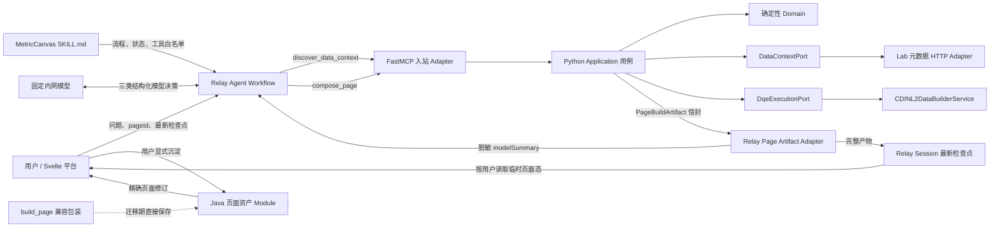
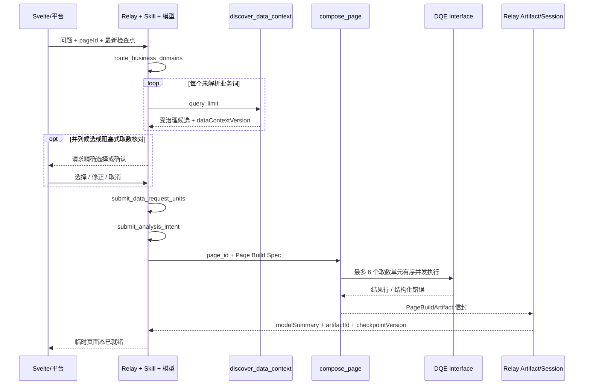
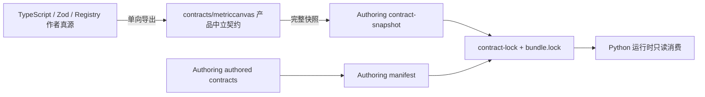

# MetricCanvas 创作 Agent 架构与维护导航

> 文档定位：当前创作 Agent 的维护者入口。需要修改执行逻辑、工具、契约、外部对接或测试时，先从本文定位，再进入实现文件。
>
> 当前基线：Authoring Bundle `0.2.0`，状态 `s5-in-progress`。目标架构以 [ADR-0064](../docs/adr/0064-agent-returns-page-artifact-relay-and-java-own-persistence.md) 为准。

## 1. 先明确“这个 Agent”包含什么

这里的 Agent 不是一个 Python 类，也不等于 `SKILL.md`。它是以下 Module 共同形成的创作链：

1. **Relay Agent Workflow**：加载 Skill、调用固定内网模型、管理对话与工具调度。
2. **MetricCanvas Skill**：规定模型如何做业务域路由、业务词拆分、候选消歧、取数核对、分析意图和多轮调整。
3. **Python Authoring Tool**：通过两个粗粒度 MCP Tool 提供受治理发现和确定性页面装配。
4. **Relay Session / Page Artifact Adapter**：保存步骤事件和最新临时页面检查点，并阻止完整页面文档重新进入模型上下文。
5. **Svelte/平台与 Java 页面资产 Module**：呈现临时页面；用户显式沉淀时才创建页面修订。

模型负责理解和结构化决策，Python 负责可以被契约验证的确定性算法。模型不会直接写 DQE、结果字段契约、组件 JSON、布局或页面协议版本。

## 2. 一分钟定位

| 你要处理的问题 | 首先打开 | 关键符号或位置 | 对应验证 |
|---|---|---|---|
| Agent 为什么调用某个工具、何时询问用户 | [`SKILL.md`](./skill/metriccanvas-page-builder/SKILL.md) | “调用边界”“状态”“执行流程” | [`test_skill_contract.py`](./test-harness/tests/test_skill_contract.py) |
| MCP 暴露了哪些工具、工具参数或返回值不对 | [`fastmcp.py`](./tool/metriccanvas_authoring/adapters/inbound/fastmcp.py) | `create_mcp_server`、`discover_data_context`、`compose_page` | [`test_stdio.py`](./test-harness/tests/test_stdio.py) |
| Tool 启动后没有使用预期 Adapter | [`server.py`](./tool/metriccanvas_authoring/server.py) | `create_production_server`、`configure_*` | [`test_server_config.py`](./test-harness/tests/test_server_config.py) |
| 指标、维度、取值、时间或意图识别不对 | [`business_terms.py`](./tool/metriccanvas_authoring/domain/business_terms.py) | `resolve_metric_terms`、`resolve_business_terms` | [`test_business_terms.py`](./test-harness/tests/test_business_terms.py) |
| 发现结果为空或敏感字段暴露 | [`data_context.py`](./tool/metriccanvas_authoring/domain/data_context.py) | `parse_data_context`、`DataContext.search` | [`test_discover_data_context.py`](./test-harness/tests/test_discover_data_context.py) |
| Lab 元数据 URL、Header、DTO 投影不对 | [`data_context_http.py`](./tool/metriccanvas_authoring/adapters/outbound/data_context_http.py) | `LabDataContextHttpPort`、`_project_snapshot` | [`test_data_context_http.py`](./test-harness/tests/test_data_context_http.py) |
| Page Build Spec 被误接收或误拒绝 | [`page_build_spec.py`](./tool/metriccanvas_authoring/domain/page_build_spec.py) | `validate_page_build_spec` | [`test_page_build_spec.py`](./test-harness/tests/test_page_build_spec.py) |
| DQE 请求、字段映射或结果行不对 | [`page_building.py`](./tool/metriccanvas_authoring/domain/page_building.py) | `derive_executable_units`、`ExecutableUnit.effective_query` | [`test_compose_page.py`](./test-harness/tests/test_compose_page.py) |
| DQE HTTP 调用或错误映射不对 | [`dqe_http.py`](./tool/metriccanvas_authoring/adapters/outbound/dqe_http.py) | `DqeHttpExecutionPort.execute` | [`test_dqe_http.py`](./test-harness/tests/test_dqe_http.py) |
| 组件选型或用户钉住项不对 | [`component_selection.py`](./tool/metriccanvas_authoring/domain/component_selection.py) | `recommend_components` | [`test_compose_page.py`](./test-harness/tests/test_compose_page.py) |
| 口径组、页头、字段绑定或页面装配不对 | [`page_building.py`](./tool/metriccanvas_authoring/domain/page_building.py) | `assemble_page_document`、`_sections_of` | [`test_compose_page.py`](./test-harness/tests/test_compose_page.py) |
| 12 列比例装箱不对 | [`section_layout.py`](./tool/metriccanvas_authoring/domain/section_layout.py) | `pack_section_spans` | [`test_compose_page.py`](./test-harness/tests/test_compose_page.py) |
| 页面生成后校验失败 | [`page_validation.py`](./tool/metriccanvas_authoring/domain/page_validation.py) | `validate_page_document` | [`test_page_validation.py`](./test-harness/tests/test_page_validation.py) |
| Relay 收到了完整页面或数据行 | Relay 仓的 **Page Artifact Adapter** | MCPToolProxy/observer seam；本仓只定义信封 | [`relay-page-artifact-envelope.schema.json`](./contracts/authored/relay-page-artifact-envelope.schema.json) |
| 用户身份没有传到 DQE | [`ports.py`](./tool/metriccanvas_authoring/application/ports.py) | `IdentityPort` | 当前只有 [`env_identity.py`](./tool/metriccanvas_authoring/adapters/outbound/env_identity.py)，生产 Adapter 待接 |
| 页面修订保存失败 | 平台 → Java 页面资产 Interface | 目标链不经过 Agent；兼容链见 `JavaPageAssetPort` | [`test_java_page_assets.py`](./test-harness/tests/test_java_page_assets.py) |
| 改了契约后 Bundle 漂移 | [`export-authoring-contracts.ts`](../tools/scripts/export-authoring-contracts.ts) | 产品契约、快照、manifest、lock 的单向导出 | `pnpm authoring:contracts:check` |
| 查迁移完成度、差分和删除门禁 | [`metriccanvas-agent-full-migration.md`](../docs/plan/metriccanvas-agent-full-migration.md) | F01–F14、M0–M7 | 按计划证据账本验收 |

## 3. 目标架构



这张图有三个必须守住的 seam：

- **模型 ↔ Tool**：唯一业务输入是受契约约束的 Page Build Spec；内部算法不扩成更多 MCP tools。
- **Python ↔ 远程系统**：应用用例只依赖 Port，HTTP 细节留在 Adapter。
- **临时页面态 ↔ 资产态**：Agent 只生成页面构建产物；平台响应用户显式沉淀后才调用 Java 创建页面修订。

## 4. 运行时执行流程

### 4.1 启动与注册

1. Relay 加载 [`metriccanvas-page-builder/SKILL.md`](./skill/metriccanvas-page-builder/SKILL.md)。
2. Relay 读取 [`metriccanvas-authoring.json`](./relay/mcp_configs/metriccanvas-authoring.json)，通过 `uvx --from <sdist>` 启动 `metriccanvas-authoring`。
3. Python 包入口由 [`pyproject.toml`](./tool/pyproject.toml) 的 `metriccanvas-authoring = metriccanvas_authoring.server:main` 注册。
4. [`server.py`](./tool/metriccanvas_authoring/server.py) 从环境变量组装生产 Adapter，并根据 `METRICCANVAS_TOOL_SURFACE` 选择工具面。
5. [`fastmcp.py`](./tool/metriccanvas_authoring/adapters/inbound/fastmcp.py) 注册 MCP Resource `metriccanvas://bundle-info` 和两个模型可见工具。

目标生产配置必须使用 `METRICCANVAS_TOOL_SURFACE=relay`。默认 `compatibility` 是防止 Relay Artifact Adapter 未安装时误开放完整页面产物的迁移保护。

### 4.2 问数与探索主链



对应的 Skill 状态依次为：

`received → routing → discovering → awaiting_user? → planning → composing → page_composed`

失败或取消进入 `failed` / `cancelled`。当前这套状态机由 Skill ReAct 描述，Relay 还没有固定工作流执行器强制它；因此 Skill 文案是迁移输入，不是最终的行为等价证据。

### 4.3 “分词”和模型调用到底在哪里

- 模型 tokenizer 属于 Relay/固定内网模型的 Implementation，不进入 MetricCanvas 契约，也不作为迁移前后等价项。
- 业务语义拆分由 Relay 模型完成：从问题中识别需要检索的指标、维度、筛选值和时间能力，再逐词调用发现工具。
- Python 的 [`business_terms.py`](./tool/metriccanvas_authoring/domain/business_terms.py) 提供规范名、别名、最长命中、稳定排序、封闭取值、相对时间、分析意图和结构操作的确定性解析。
- 如果模型误把整句问题传给 `discover_data_context`，[`_fallback_sentence_search`](./tool/metriccanvas_authoring/application/discover_data_context.py) 会做一次确定性兜底，但它不替代三类模型决策。

三类模型决策不是 MCP Tool：

| 决策名 | 用途 | 契约位置 |
|---|---|---|
| `route_business_domains` | 选择最多两个业务域 | [`agent-model-decision.schema.json`](./contracts/authored/agent-model-decision.schema.json) 的 `routeDecision` |
| `submit_data_request_units` | 首次形成取数单元，或对已有单元执行 `add/modify/replace/remove` | 同文件 `unitDecision` |
| `submit_analysis_intent` | 为每个被触及取数单元选择分析意图 | 同文件 `intentDecision` |

### 4.4 `compose_page` 内部固定流水线

[`create_compose_page`](./tool/metriccanvas_authoring/application/compose_page.py) 是当前最重要的应用用例 Interface：

1. `validate_page_build_spec` 校验 Page Build Spec 的结构和闭集。
2. 校验 `baseRevision.pageId` 与目标 `page_id` 一致。
3. 通过 `DataContextPort.current()` 取得并解析数据上下文快照。
4. `derive_executable_units` 校验规范名、派生 DQE 与结果字段契约。
5. 通过 `asyncio.gather` 并发调用每个取数单元的 `DqeExecutionPort.execute()`；产物顺序与失败归因按原单元序号稳定。
6. `assemble_page_document` 选择组件，形成口径组、页头、字段绑定和布局。
7. `validate_page_document` 执行当前 Page Schema 与已实现的跨引用不变式校验。
8. 返回 `PageBuildArtifact`：页面文档、`documentSha256`、`dataContextVersion` 和 `bundleVersion`。

`compose_page` 没有保存副作用。它的完成阶段只有 `discovery / generation / execution / presentation`。

### 4.5 显式沉淀与兼容路径

目标路径中，Relay 保存的是**临时页面态检查点**，不是页面修订。用户在 Svelte/平台明确执行“沉淀为 Report/Data App”后，平台才以当前用户身份调用 Java `savePageRevision`。

迁移期仍保留 [`build_page.py`](./tool/metriccanvas_authoring/application/build_page.py)：它先调用同一个 `compose_page`，成功后通过 `PageAssetPort` 调 Java 保存，并增加 `save` 阶段。这个兼容包装不在目标 Skill 的 `allowed-tools` 中，Relay 工具面也不会注册它。

## 5. Python Module 结构

```text
metriccanvas-authoring/tool/metriccanvas_authoring/
├── server.py                         # 生产组合根；只做配置和依赖组装
├── runtime_assets.py                 # 源码/sdist 中 Bundle 契约定位
├── adapters/
│   ├── inbound/fastmcp.py            # MCP 传输 Adapter；两个互斥工具面
│   └── outbound/
│       ├── data_context_http.py      # Lab 元数据列表/详情 → Data Context 1.1
│       ├── dqe_http.py               # DQE execute HTTP Adapter
│       ├── env_identity.py           # 共享服务态身份 Adapter（临时）
│       └── java_page_assets.py       # Java 保存 Adapter（仅兼容链）
├── application/
│   ├── ports.py                      # 远程系统 seam 的 Port 与稳定错误
│   ├── discover_data_context.py      # 受治理发现用例
│   ├── compose_page.py               # 无保存副作用的核心装配用例
│   ├── build_page.py                 # 迁移兼容保存包装
│   └── bundle_info.py                # Bundle/契约身份诊断
└── domain/
    ├── business_terms.py             # 确定性业务词解析
    ├── data_context.py               # 快照校验、语义面、检索、敏感隐去
    ├── page_build_spec.py             # Page Build Spec 校验
    ├── page_building.py              # DQE/字段契约派生和页面装配
    ├── component_selection.py        # 组件能力硬闸与排序
    ├── section_layout.py             # 12 列比例装箱
    ├── page_validation.py            # Page Schema 与跨引用不变式
    ├── execution.py                  # DQE 结果、错误与阶段映射
    └── idempotency.py                # canonical JSON；保存兼容链幂等键
```

依赖方向应保持为 `Adapter → Application → Domain`。Domain 不导入 FastMCP、HTTP、Relay 或 Java；Application 不创建具体 HTTP Adapter；生产组合只发生在 `server.py`。

## 6. Port 与 Adapter 对接矩阵

Port 集中定义在 [`application/ports.py`](./tool/metriccanvas_authoring/application/ports.py)。

| Port | 语义 Interface | 当前生产 Adapter | 测试 Adapter | 状态与注意事项 |
|---|---|---|---|---|
| `DataContextPort` | `current() -> Data Context Snapshot` | `LabDataContextHttpPort` | `FakeDataContextPort` | 已实现；发现全量元数据，不代表按用户过滤 |
| `DqeExecutionPort` | `execute(effective_query) -> normalized result` | `DqeHttpExecutionPort` | `FakeDqeExecutionPort` | 已实现；只调 `CDINL2DataBuilderService`，不直连 Lab 查询 |
| `IdentityPort` | `current() -> ServiceIdentity` | `EnvIdentityPort` | 测试内存身份 | 只有服务态身份；按用户注入是生产门禁 |
| `DimensionValuePort` | `values_for(dataset_id, dimensions)` | 无 | 可注入 Fake | 真实 MetricService URL/DTO 未提供，只保留 seam |
| `PageAssetPort` | `save_revision(command)` | `JavaPageAssetPort` | `FakePageAssetPort` | 仅 `build_page` 兼容链使用；目标 Core 删除此依赖 |

### 6.1 Data Context HTTP Adapter

[`LabDataContextHttpPort`](./tool/metriccanvas_authoring/adapters/outbound/data_context_http.py) 的外部调用：

- `GET <datasets-url-template>`，模板必须包含 `{subjectId}`；
- 对每个数据集并发 `GET <detail-url-template>`，模板必须包含 `{datasetId}`；
- Header：`X-Auth-Token`、`X-Workspace-Id`、`apiGw-app-code`；
- 将 Lab DTO 投影为 Data Context Schema `1.1`；
- `dataContextVersion` 使用各数据集更新时间的确定性摘要；
- Lab 没有提供的 `isRatio`、可空性、敏感性等必须由投影治理配置给出，缺失时失败关闭；
- 进程内缓存第一次成功生成的快照，因此一次性 stdio 子进程内各调用看到同一版本。

投影配置样例在 [`data-context-projection.example.json`](./relay/data-context-projection.example.json)。

### 6.2 DQE HTTP Adapter

[`DqeHttpExecutionPort`](./tool/metriccanvas_authoring/adapters/outbound/dqe_http.py) 固定调用：

`POST {METRICCANVAS_DQE_BASE_URL}/dsl/execute`

`METRICCANVAS_DQE_BASE_URL` 应包含真实服务的 `/rest/cdi/cdinl2databuilderservice/v1` 前缀。Header 为 `X-Auth-Token`、`X-Operator-Id`、`X-Workspace-Id`。

每次调用只接受一个 DQE item 和非空查询字段映射。Adapter 校验响应信封、结果码、结果行字段、类型及可空性；`NO_PERMISSION`、`NO_MATCH`、`FILTER_NO_MATCH`、`ERROR` 会转为稳定错误码。

### 6.3 身份 Adapter

[`EnvIdentityPort`](./tool/metriccanvas_authoring/adapters/outbound/env_identity.py) 从 MCP 配置读取 `METRICCANVAS_OPERATOR_ID` 和 `METRICCANVAS_AUTH_TOKEN`。这是共享服务态身份，不是“代表当前用户”。

生产前应在 Relay 的 `on_tool_execute_before` 或 `MCPToolProxy` seam 注入不可被模型查看和修改的当前用户身份，并用新的 Adapter 替换 `EnvIdentityPort`。不应把用户 id 新增为模型可填写的 MCP 参数。

### 6.4 Relay Page Artifact Adapter

本仓定义 [`relay-page-artifact-envelope.schema.json`](./contracts/authored/relay-page-artifact-envelope.schema.json)，但 Adapter Implementation 位于外部 Relay 仓，当前尚未完成。它必须：

1. 识别 `kind=metriccanvas.page-build-artifact`；
2. 从普通工具结果中移除完整 `artifact`；
3. 把完整产物保存为当前 session 的最新 MetricCanvas 检查点；
4. 只向模型返回 `modelSummary + artifactId + checkpointVersion`；
5. 用乐观并发阻止迟到或已取消的结果覆盖更新检查点；
6. 由按用户鉴权的 Session Interface 向 Svelte 提供完整产物。

该 Adapter 未安装时，不得对真实模型启用 `relay` 工具面。

## 7. 契约与真源



| 契约 | 所有权 | 维护入口 | 消费者 |
|---|---|---|---|
| Page Schema、组件能力目录、页面/DQE 错误闭集、Data Context Schema | 产品中立契约 | TypeScript/Zod 作者真源；导出器为 [`export-authoring-contracts.ts`](../tools/scripts/export-authoring-contracts.ts) | Java、Python、TypeScript |
| Page Build Spec | Authoring Interface | [`page-build-spec.schema.json`](./contracts/authored/page-build-spec.schema.json) | Skill、FastMCP、Python |
| 三类模型决策 | Authoring Interface | [`agent-model-decision.schema.json`](./contracts/authored/agent-model-decision.schema.json) | Relay Workflow、迁移差分 |
| 业务词解析 | Authoring Interface | [`business-term-resolution.schema.json`](./contracts/authored/business-term-resolution.schema.json) | TypeScript 基线、Python |
| 步骤事件 | Authoring Interface | [`agent-step-event.schema.json`](./contracts/authored/agent-step-event.schema.json) | Relay Session、Svelte |
| 页面构建产物 | Authoring Interface | [`page-build-artifact.schema.json`](./contracts/authored/page-build-artifact.schema.json) | Python、Relay Artifact Adapter、Svelte |
| Relay 双通道信封 | Authoring Interface | [`relay-page-artifact-envelope.schema.json`](./contracts/authored/relay-page-artifact-envelope.schema.json) | FastMCP、Relay Artifact Adapter |
| Bundle 身份与摘要 | 发布容器 | [`bundle.json`](./bundle.json)、[`contract-lock.json`](./contract-lock.json)、[`bundle.lock.json`](./bundle.lock.json) | sdist、Relay 部署、CI |

`contract-snapshot/`、`contracts/exported/`、manifest 和 lock 都是生成或锁定产物。修改产品规则时先改作者真源，再运行 `pnpm authoring:contracts`；不要手工修补快照绕过漂移检查。

## 8. 配置索引

| 环境变量 | 使用位置 | 作用 |
|---|---|---|
| `METRICCANVAS_TOOL_SURFACE` | `server.py` | `relay` 或 `compatibility`；默认后者 |
| `METRICCANVAS_OPERATOR_ID` | `env_identity.py` | 当前服务态操作者 id |
| `METRICCANVAS_AUTH_TOKEN` | `env_identity.py` | Lab/DQE/兼容 Java 调用 token |
| `METRICCANVAS_DQE_BASE_URL` | `dqe_http.py` | DQE v1 Interface 基地址 |
| `METRICCANVAS_DQE_WORKSPACE_ID` | `dqe_http.py` | DQE workspace Header |
| `METRICCANVAS_DQE_FORBIDDEN_HINT` | `dqe_http.py` | 无权限时附加的申请指引 |
| `METRICCANVAS_DATA_CONTEXT_DATASETS_URL_TEMPLATE` | `data_context_http.py` | Lab 数据集列表 URL，含 `{subjectId}` |
| `METRICCANVAS_DATA_CONTEXT_DETAIL_URL_TEMPLATE` | `data_context_http.py` | Lab 数据集详情 URL，含 `{datasetId}` |
| `METRICCANVAS_DATA_CONTEXT_SUBJECT_ID` | `data_context_http.py` | Lab subject |
| `METRICCANVAS_DATA_CONTEXT_WORKSPACE_ID` | `data_context_http.py` | Lab workspace Header |
| `METRICCANVAS_DATA_CONTEXT_APP_CODE` | `data_context_http.py` | API Gateway app code |
| `METRICCANVAS_DATA_CONTEXT_PROJECTION_CONFIG` | `data_context_http.py` | 投影治理配置绝对路径 |
| `METRICCANVAS_PAGE_ASSETS_BASE_URL` | `java_page_assets.py` | 兼容链 Java 页面资产基地址 |
| `METRICCANVAS_BUNDLE_ROOT` | `runtime_assets.py` | 源码/测试时覆盖 Bundle 资产根；sdist 正常不需设置 |

部署样例的单一入口是 [`relay/mcp_configs/metriccanvas-authoring.json`](./relay/mcp_configs/metriccanvas-authoring.json)。

## 9. 失败分层

所有业务失败应作为结构化 `issues[]` 返回，至少包含 `code / path / stage / message`。MCP 传输失败只表示工具进程或协议本身失败。

| 阶段 | 负责范围 | 典型错误 | 定位文件 |
|---|---|---|---|
| `discovery` | Data Context 获取、投影、Schema 和检索 | `DATA_CONTEXT_*` | `data_context_http.py`、`data_context.py` |
| `generation` | Page Build Spec、规范名、取数单元和 DQE 派生 | `METRIC_NOT_IN_DATA_CONTEXT`、`DQE_CONFIG_ERROR` | `page_build_spec.py`、`page_building.py` |
| `execution` | DQE 鉴权、超时、传输和查询拒绝 | `DQE_AUTH_REQUIRED`、`DQE_FORBIDDEN`、`DQE_TIMEOUT` | `dqe_http.py`、`execution.py` |
| `presentation` | 结果字段契约、组件装配和页面校验 | `DQE_ROW_CONTRACT_ERROR`、页面错误类型 | `page_validation.py`、`execution.py` |
| `save` | Java 页面修订保存 | `REVISION_CONFLICT`、`PAGE_ASSETS_UNAVAILABLE` | 仅 `build_page.py` 兼容链 |

错误到阶段的稳定映射集中在 [`execution.py`](./tool/metriccanvas_authoring/domain/execution.py)。新增 DQE 错误时必须同步此处、产品错误闭集、跨语言向量和 Adapter 测试。

## 10. 当前完成度

### 10.1 本仓已完成

- 自包含 Bundle、Python 3.12+ sdist 和 `uvx` 启动入口。
- 目标 Skill 的工具白名单、注册说明、工具调用契约、九状态流程和安全边界。
- `relay` 与 `compatibility` 两个互斥 MCP 工具面。
- Data Context 1.1 校验、语义投影、检索、敏感隐去和整句兜底解析。
- Page Build Spec 校验、规范名闭集、DQE 与结果字段契约派生。
- 最多六个取数单元的有序并发执行和稳定失败归因。
- 组件硬闸、分析意图映射、口径组、报告页头、比例装箱和完整页面装配。
- 无保存副作用的 `compose(PageBuildSpec) -> PageBuildArtifact`。
- Lab Data Context、DQE 和兼容 Java 页面资产 HTTP Adapter。
- Agent/Authoring 契约、产品契约快照、摘要锁和 Test Harness。

### 10.2 尚未完成，不能宣称生产闭环

| 缺口 | 所有者/位置 | 完成判据 |
|---|---|---|
| Relay Page Artifact 双通道 | 外部 Relay 仓 | 完整产物不进模型/事件正文；检查点可按用户恢复 |
| 固定工作流、预算、等待、取消和多轮状态强制 | 外部 Relay 扩展（M3B） | 不是仅靠 Skill Markdown，自带可执行约束与事件证据 |
| 按用户身份注入 | Relay Plugin 或 MCPToolProxy | 模型不可见不可改；DQE 和后续保存审计为当前用户 |
| 真实 LiteLLM/GLM + Relay E2E | 联调环境 | 黄金问题、工具调用、事件、取消和产物交付通过 |
| 真实 Lab/DQE 环境验收 | 联调环境 | 地址、账号、数据和错误分支全部取证 |
| MetricService 维度取值 Adapter | 外部接口契约 | URL/DTO 明确后实现 `DimensionValuePort` Adapter |
| Python 页面校验全等价 | `page_validation.py` | 当前 10 条合法向量通过 8 条；154 条反例对齐 21 条，pending 清零 |
| 兼容保存路径退出 | 本仓 + 调用方 | Relay/平台目标链稳定后删除 `build_page`、`PageAssetPort` 和 Java Adapter |
| 旧 TypeScript/Node 创作链退出 | `apps/platform`、`packages/mcp` | M5–M7 差分、灰度、回滚门禁通过后删除双实现 |

因此，当前正确表述是：**确定性 Authoring Core 和本仓可实现的外部 HTTP Adapter 已具备；Relay 生产编排与会话双通道尚未收口，Agent 迁移未全部完成。**

## 11. 常见改动的正确落点

### 新增或调整业务词规则

1. 改 `domain/business_terms.py`。
2. 更新 TypeScript 基线导出向量，而不是只加 Python 私有样例。
3. 更新 `test_business_terms.py` 和 `test_agent_contracts.py`。
4. 若改变模型决策输入/输出，再改 `agent-model-decision.schema.json` 和 Skill。

### 调整 Page Build Spec

1. 先改 `contracts/authored/page-build-spec.schema.json`。
2. 同步 Skill 中模型应填写的业务语义；仍不允许把 DQE、字段契约、组件 JSON 或布局加入 Spec。
3. 更新 `page_build_spec.py`、FastMCP 输入 Schema 黑盒和构建向量。
4. 运行契约导出，提交 manifest/lock 变化。

### 接入或修改 Data Context 来源

1. 保持 `DataContextPort.current()` 不变，在 `adapters/outbound/` 增加或修改 Adapter。
2. DTO 映射只能产出产品 Data Context Schema；不可让上游 DTO 泄漏进 Domain。
3. 真实维度取值走 `DimensionValuePort`，不要塞进 Skill 或模型参数。
4. 用运输替身验证 URL/Header/信封，用应用测试验证语义结果。

### 修改 DQE 请求或错误映射

1. 查询业务派生改 `domain/page_building.py`。
2. HTTP 路径、Header、响应信封改 `adapters/outbound/dqe_http.py`。
3. 错误阶段改 `domain/execution.py`。
4. 同时验证精确 DQE request、`code/path/stage` 和结果字段契约。

### 新增组件或改变组件能力

1. 先改 [`packages/page/src/schema/components/`](../packages/page/src/schema/components/) 中的产品作者真源和 `authoringShape`。
2. 运行单向契约导出，更新产品中立契约和 Bundle 快照。
3. 只有确定性选型算法需要新行为时才改 `component_selection.py` / `page_building.py`。
4. 增加 canonical Page JSON 向量；不要在 Python 再维护第二份组件能力表。

### 修改 Relay 返回或检查点

1. 信封语义先改 `relay-page-artifact-envelope.schema.json`。
2. 本仓 FastMCP 只负责形成信封；完整产物截获、持久化、乐观并发和模型摘要替换在 Relay Adapter。
3. Svelte 只通过按用户鉴权的 Session Interface 取完整产物。
4. 至少验证“模型看不到 document/rows”和“迟到结果不覆盖新检查点”两个负向用例。

### 删除兼容 `build_page`

只有以下条件同时满足后执行：Relay Artifact Adapter 已上线；平台显式沉淀链已上线；真实 Relay E2E 与回滚验证通过；没有调用方仍使用 compatibility 工具面。届时删除 `build_page.py`、`PageAssetPort`、`JavaPageAssetPort`、`METRICCANVAS_PAGE_ASSETS_BASE_URL` 及对应兼容测试。

## 12. 验证与证据入口

本地最小充分验证：

```bash
pnpm authoring:contracts:check
python3 metriccanvas-authoring/scripts/check_bundle.py
PYTHONDONTWRITEBYTECODE=1 python3 -m unittest discover \
  -s metriccanvas-authoring/test-harness/tests -p 'test_*.py'
```

分层证据：

| 证据 | 位置 | 能证明什么 | 不能证明什么 |
|---|---|---|---|
| Agent conformance | [`agent-conformance.json`](./contracts/exported/agent-conformance.json) | 业务词、模型决策、步骤事件与 Port 调用的结构等价 | 真实模型稳定性 |
| Build conformance | [`build-page-conformance.json`](./contracts/exported/build-page-conformance.json) | DQE request、canonical Page JSON、稳定错误 | 真实远程服务可用性 |
| 产品 Page conformance | [`contract-snapshot/page/conformance/`](./contract-snapshot/page/conformance/) | 跨运行时页面协议正反例 | Python 尚未对齐的 pending 项 |
| pending 账本 | [`page-conformance-pending.json`](./test-harness/fixtures/page-conformance-pending.json) | 明确剩余 2 条合法与 133 条非法向量差距 | 不能当作豁免永久保留 |
| stdio 黑盒 | [`test_stdio.py`](./test-harness/tests/test_stdio.py) | FastMCP 子进程、工具面和结构化返回可用 | 真实 Relay Artifact Adapter |
| sdist 分发 | [`test_distribution.py`](./test-harness/tests/test_distribution.py) | 安装包内契约与可执行入口完整 | 内网部署配置正确 |
| 真实纵切 | 根命令 `pnpm slice:page-assets` | 兼容链 Python → Java 的本地保存纵切 | 目标 Relay 临时态链 |

## 13. 迁移前的 TypeScript 行为基线

这些文件是迁移差分的参考，不是目标生产创作链：

| 基线行为 | 旧实现位置 |
|---|---|
| 问数固定顺序、消歧、取数核对、多轮修改 | [`apps/platform/src/lib/server/ask/orchestrator.ts`](../apps/platform/src/lib/server/ask/orchestrator.ts) |
| 三类模型 Port | [`apps/platform/src/lib/server/ask/ports.ts`](../apps/platform/src/lib/server/ask/ports.ts)、[`model-port.ts`](../apps/platform/src/lib/server/ask/model-port.ts) |
| 业务词和检索 | [`business-terms.ts`](../apps/platform/src/lib/server/ask/business-terms.ts)、[`retrieval.ts`](../apps/platform/src/lib/server/ask/retrieval.ts) |
| Agent Runner 与事件流 | [`apps/platform/src/lib/server/agent/runner.ts`](../apps/platform/src/lib/server/agent/runner.ts)、[`stream-endpoint.ts`](../apps/platform/src/lib/server/agent/stream-endpoint.ts) |
| 会话事件与最新检查点 | [`apps/platform/src/lib/server/session/`](../apps/platform/src/lib/server/session/) |
| TypeScript 页面装配基线 | [`packages/mcp/src/authoring/`](../packages/mcp/src/authoring/) |

迁移前后比较的是 Interface 上可观察的结果、事件顺序、失败分类、权限、幂等和性能下限，不比较 tokenizer、模型思维链、日志文本或内部代码形状。

## 14. 相关决策和计划

- [ADR-0030：问数与探索的临时页面态](../docs/adr/0030-transient-page-state-for-ask-and-explore.md)
- [ADR-0032：创作期查询验真](../docs/adr/0032-authoring-time-query-verification.md)
- [ADR-0037：问数编排与交互契约](../docs/adr/0037-ask-orchestration-and-interaction-contract.md)
- [ADR-0058：最新会话检查点恢复](../docs/adr/0058-latest-session-checkpoint-restores-transient-page-state.md)
- [ADR-0060：Relay/Python/Java 目标部署](../docs/adr/0060-static-svelte-java-page-governance-relay-python-authoring.md)
- [ADR-0061：自包含 Authoring Bundle](../docs/adr/0061-self-contained-authoring-bundle-and-neutral-contract-export.md)
- [ADR-0063：Relay 与 DQE 真实接口修正](../docs/adr/0063-relay-dqe-facts-revise-authoring-boundaries.md)
- [ADR-0064：Agent 返回页面构建产物](../docs/adr/0064-agent-returns-page-artifact-relay-and-java-own-persistence.md)
- [完整迁移方案](../docs/plan/metriccanvas-agent-full-migration.md)
- [Authoring Bundle 实施计划](../docs/plan/metriccanvas-authoring-bundle.md)
