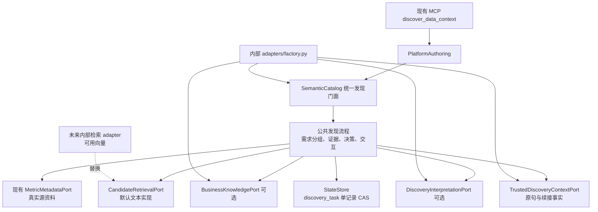
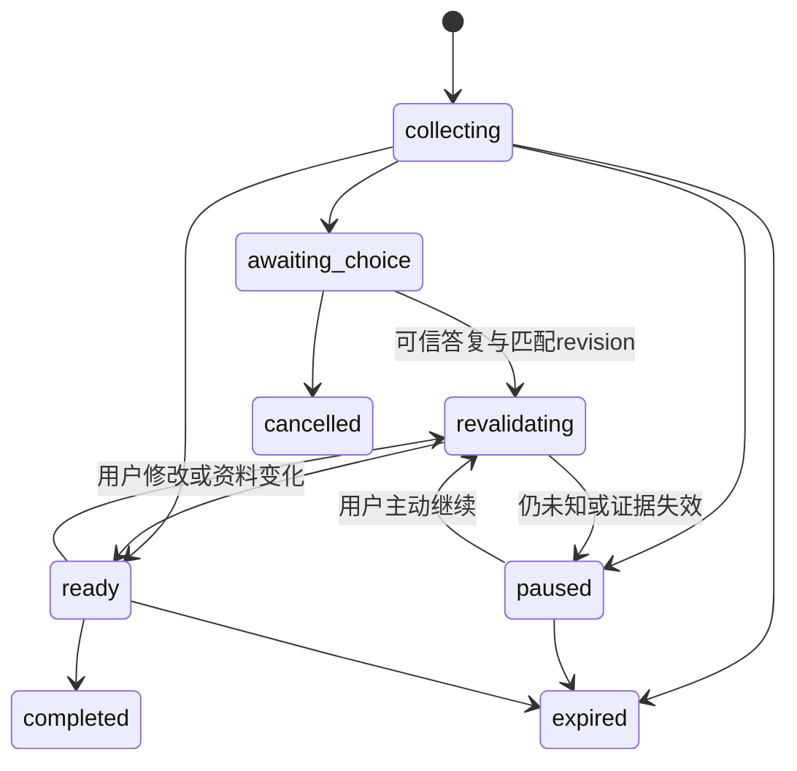

# 语义发现方案与架构影响

日期：2026-09-26。状态：首期公共实现已落地，产品约束以 [SPEC](SPEC.md) 为准；实际契约及设计偏差见 [实施记录](IMPLEMENTATION.md)。所有源路径相对 `metriccanvas-authoring/`。

## 1. 当前基线与并行改动

核查时 HEAD 为 `3260725df3b28d1082fee4f69f5564fe1296e353`。工作区另有尚未提交的查询策略、公共 Lab 投影、发现维度/覆盖率、Skill 与契约修复；本设计以这些可见行为为集成前提，不能把 HEAD 当作完整当前基线。进入编码前先固定这批改动的来源和合入点，不覆盖或打包提交别人的改动。

| 现有文件 | 实际能力/缺口 | 本设计处理 |
|---|---|---|
| `data/semantic_catalog.py`（位于 tool 包） | 指标/维度条目、完整 query 子串筛选、按 binding/version 缓存；query_issues 再次调用 discover | 保留外部接口，替换检索实现，分离无交互的查询冲突检查 |
| `data/catalog_ports.py` | MetricMetadataPort.search/detail 返回模型列表；无候选排序与覆盖语义契约 | 保留 Java 来源端口，增可选候选检索端口 |
| `data/business_interpretation.py` | 有界提案、来源/版本/目标验证；仅基础发现可选调用 | 提取可复用验证规则，不把旧 propose 原样当新协议，也不保留两套互相矛盾的决策器 |
| `data/business_terms.py` | 名称/别名在句中匹配、确定性业务词与时间规则 | 复用短语和时间逻辑，修整词关系与否定限定覆盖 |
| `data/lab_projection.py` | 工作区已提取公共投影 | 使用公共转换，不再复制进内部 adapter |
| `data/results.py` | 批内固定上下文、逐项授权、策略版本与结果身份 | 将发现建议映射到明确请求后仍走原授权，不让状态记录成为授权 |
| `work/state.py` | 按完整 binding 的轮次状态，read/CAS | 新命名空间存跨轮发现记录，不更改旧 work/budget key |
| `work/authoring_turns.py` / authored turn schema | 可信当前轮次，禁止额外字段 | 新的可信发现上下文端口，不偷塞字段到原 schema |
| `entrypoints/mcp/platform_mcp.py` | 普通结果整体进入 modelSummary | 增强响应必须先分离模型摘要与程序交互内容 |
| `bootstrap/adapter_contract.py` | semantic_catalog 可显式注入 | 首期通过现有 slot 装配增强 catalog，不强制增加全局适配器字段 |

表中短路径 `data/`、`work/` 等完整前缀为 `tool/metriccanvas_authoring/`。

## 2. Module 与依赖方向



对外仍只有一个发现入口。SemanticCatalog 是小 Interface 后有完整发现行为的 Module；内部可拆检索、决策、记录管理。调用方不负责拆词、多候选裁决和手工拼历史。

现有 `SemanticCatalog(metadata, store)` 保持基础模式；增强模式在内部 factory 显式提供 `discovery=DiscoveryDependencies(...)`。能力探测读取公共声明，不按 Java 类名判断。已有自定义 SemanticCatalogPort 可继续提供旧结果；增强模式未声明时不能假定其支持续接。

候选检索能力缺省为公共本地实现。metadata adapter 负责源协议、认证和真实范围；检索 adapter 负责找到候选，二者不是新的两个顶级集成目录。内部新增文件仍归 `adapters/firstparty/` 或 `adapters/relay/`，不建立 company/local/integrations。

## 3. 接口与数据契约

下列保留设计签名；已实现 Protocol 位于 data/discovery/contracts.py，正式输入 Schema 位于 contracts/authored/discovery.schema.json。所有 size、enum、额外字段、来源与版本验证由公共代码完成。

### 3.1 BusinessKnowledgePort

```python
async def search(binding, query, business_domains, limit) -> KnowledgeSearchResult: ...
```

结果包含 formatVersion、status、source(namespace/version)、coverage、items、issues。每项包含 id/kind/businessDomains/reviewStatus/provenance 以及按 kind 定义的字段。

- `business_term`：canonicalTerm、aliases、definition、relatedTerms(relation=related/...)、metricHints。
- `business_note`：title、content、terms；原文片段不是执行指令。
- `analysis_topic`：name、items(concept + task-local requirementId)、relationships。
- provenance：documentId、sectionId、revision、excerpt；参考文档只作为数据读取。
- coverage：retrievalComplete、returnedTruncated、exhaustiveWithinScope；三者不等价，`status=ready` 不代表全部公司知识已穷尽。

生产 source 不得声称 mock 文档为公司事实。source.version 若是检索批次版本，项级 revision 仍必需。原知识库无快照版本时 adapter 可对本次标准化响应计算内容摘要，但不能声称它证明未返回资料没有变化；无法重新验证的旧证据不直接复用。

mock 设计数据见 [business-knowledge.mock.json](../../../examples/semantic-discovery/business-knowledge.mock.json)。没有向量依赖，可按固定测试场景过滤；已提供 examples/adapter_template/firstparty/discovery_knowledge.py 和针对性验收。

### 3.2 CandidateRetrievalPort

```python
async def retrieve(binding, request, metadata_source, budget) -> CandidateBatch: ...
```

request 含原句、需求表达、业务域和用户限定；返回每个需求项的标准化候选、真实 sourceIdentity、sourceVersion、matchEvidence、rank、coverage。默认实现读现有 metadata_source.search 并使用公共标准化资料做多字段匹配；未来外部实现可直接返回命中指标。

版本与来源需能经 metadata_source/detail 或提供方定义的可信源查询验证。外部返回“相关”不能被公共整句子串逻辑二次删除；来源非法仍拒绝。rank 只排序，不是自动选择依据。sourceComplete 由实际源协议提供，不能从返回数组长度猜测。

兼容现有 provider 的模型列表；不在首期直接破坏 MetricMetadataPort.search 返回。新增候选协议解决 metric 级身份/排序，公共默认实现充当过渡。全量资料太大时按源协议分页或明确截断；不要求 Java 为模型返回全公司目录。

### 3.3 DiscoveryInterpretationPort

```python
async def propose(context: BoundedDiscoveryInput) -> DiscoveryProposal: ...
```

输入：原句、原文位置、候选（身份、口径等安全字段）、检索到的知识项、允许任务、资料版本、剩余预算。不发送 auth token、源响应正文、物理 SQL、用户未授权的元数据或完整聊天。

输出只允许：需求项及关系提议、候选 ID、证据 ID、原文片段位置、未解决限定、一次补充检索建议。时间仅提取原文表达，交公共受控时间解析；不得由模型自写日期绕过词表。不得输出已批准授权、持久别名、未经来源支持的可加性/敏感性、任意 DQE 或执行指令。

公共验证分两层：引用/结构/版本确定性验证，以及自动选择规则。引用存在不证明模型推理正确，模型提议即使通过结构验证仍不能直接变成 rule-resolved。无模型/超时/非法提案时保留基础结果并附 interpretationStatus，不能隐式重试无限次。

### 3.4 TrustedDiscoveryContextPort

```python
async def current(binding) -> TrustedDiscoveryInvocation: ...
```

由内部 Relay adapter 从已认证程序上下文读取，不从模型参数构造。字段：formatVersion、actorId/workspaceId、sessionRef、requestEventId、messageRef、messageText（有界）、receivedAt/timezone、invocationKind(new/resume/modify/cancel)、可选 taskRef/expectedRevision/interactionId/answer。方法须验证本次调用对应现有 binding，并由公共 gate 再检查一致性。

answer 是真实用户交互事件，可为 choices 或 free_text；不接受模型宣称用户已确认。新消息与本地记录之间的链路由 Relay 证明。sessionRef 必须是稳定的会话身份，requestId/runId/turnId 不假设跨轮稳定。

缺少此端口：基础发现可用，原句仅视为搜索输入，不启用持久续接。增强部署的 readiness 明确显示 unavailable，不能用假上下文模拟生产就绪。

## 4. 响应与确认协议

现有 MCP 输入保持 `context_ref/query/limit/detail_refs`，续接答案由可信程序端口供给；不另加模型可提交的 `confirmed=true`。新响应声明 `discoveryProtocolVersion=1.0` 能力，保持有界 matches/details/businessDomains 供旧只读调用方使用，增加需求摘要。

增强返回内部拆为：

- `modelSummary`：需求状态、有限候选、差异、可解释理由、降级/覆盖率；不包含完整任务原文历史及底层记录。
- `interactionEnvelope`：taskRef、revision、interactionId、业务选项和确认范围，供 Relay 呈现。它是定位/交互资料，不是授权令牌；即使模型看见也不能借此提交确认。
- 存储中的原始证据与 receipt：仅程序访问。

必须修改当前通用 call 包装路径，不能让上述对象再被整体装入 modelSummary。Relay 与工具能力握手前保持 legacy 响应，不向未知客户端悄悄发送它不能呈现的阻塞交互。无卡片 UI 但支持可信消息回传时可呈现等价文本核对；其选择仍需 Relay 验证与归属。

取数核对的 selection receipt 记录 task revision、选项源身份/证据版本和用户事件。它只证明语义选择。形成实际查询后，AnalysisAuthorizationPort 仍须对精确请求摘要、当前 binding 和 dataContextVersion 授权。只有核对已包含该精确取数范围时可共用一次用户动作，不再额外弹框；否则需要明确的范围更新，不能拿泛化选择批准任意查询。

## 5. 持久化与跨轮状态

复用 StateStore，以 `discovery_task` 命名空间保存一条完整逻辑记录。key 为服务生成的不可猜 taskRef；访问仍验证 owner/session/目标和当前授权，不能靠 key 隐秘性授权。

记录字段：recordFormatVersion、revision、owner、sessionRef、targetIdentity、originalRequest、requestRevisions、requirements、relationships、constraints、candidateEvidence、selectedSources、evidenceVersions、pendingInteraction、processedEvents、analysisBudget、createdAt/expiresAt/status。

- originalRequest 保存首次可信原句/messageRef/时间；修改形成有界结构化修订，不悄悄覆盖原句。
- requirements 内的 ID 仅在本任务内稳定，不变成全局指标/取数资产。
- selectedSources 保存真实指标来源身份，不把旧轮次 metricRef 当新轮可用引用；新轮重验证后生成当前引用。
- constraints 保存原时间表达及首次确定性解析后的绝对区间和时区，跨月续接不自动漂移。
- 所有待确认选项、一次性 event receipt 和更新后的状态在同一 CAS 中落盘，不依赖当前 StateStore 未提供的跨记录事务。
- 外部模型/HTTP 操作在 CAS 前后进行，不能假设事务包住网络。先原子占用处理事件（带有界租约/版本），执行后按版本完成；进程崩溃时可恢复/失效租约，不可重复认可用户确认。仅只读提案可重算，绝不因此重放查询/保存。
- 同 eventId、相同 payloadDigest 返回已记录结果；同 eventId 不同内容拒绝；两个不同答案竞争同 revision，只允许一个成功。
- processedEvents/历史/候选有硬上限，达到上限终止或要求用户建立新需求，不能清掉旧 receipt 后允许重放。



状态名是发现任务处理状态；需求项仍使用 SPEC 的 resolved/needs_choice 等。轮次预算不替代任务预算。新 turn 重新获取权限、current baseline 和授权；不迁移旧 query/result/save 状态。

保留期由可信部署配置确定，示例可用 24 小时但不是已批准的公司保留策略。读取时检查 expiresAt；物理清理由内部 storage 生命周期作业负责。首期不为此给通用 StateStore 偷加 delete/scan 必需方法；部署就绪要求内部明确清理实现。到期可生成有限 tombstone 防重放，最终清理策略与 Relay 消息保留期协调。

## 6. 预算与缓存建议

以下是实施评估初始值，不是已生效运行默认：每个需求修订最多 6 个需求项（与当前查询批上限协调）、每项内部最多 20 个候选/界面最多 3 个，知识最多 20 条；模型最多 2 次（初次解释、补充资料后的比较），扩大业务域最多 1 次；可选解释总预算 10 秒，最终受本轮剩余预算约束。超限返回截断和未解决项，不静默丢需求。具体值通过无模型与真实模型用例测量后固化。

任务内重复调用复用同版本资料/提案，计入同一预算。跨任务缓存首期不要求；未来 cache key 至少含可信权限范围标识、元数据/知识版本与算法版本，权限变化仍须重新校验。内容 hash 不是权限证明。

## 7. 查询前检查必须拆开

当前 query_issues 逐指标再调用 discover。若 discover 增加模型、知识库、状态机，此路径会导致重复模型调用、不可预测交互、版本漂移，甚至授权后改选指标。

拟改为查询专用的确定性冲突检查：根据精确 businessDomain/metric identity 和查询批固定 snapshot 检查已知相关事实；不执行发现模型、不发核对卡、不重新选择指标。优先让 QueryResults 消费批内已有快照，避免额外读取产生不同版本；需要新增内部检查上下文时保持现有 SemanticCatalogPort 的兼容桥，禁止把策略模式重新解释成模型建议。

语义选择只约束已绑定的发现任务和请求，不把所有旧查询都强制经过 discover。未知组合能力由现有严格/宽松查询策略处理；身份、版本、请求确认和实际口径冲突不被放宽。

## 8. 架构影响登记

| ID / 严重度 | 影响 | 处理与发布门槛 |
|---|---|---|
| A01 高 | 新增跨轮可信输入，当前 authoring-turn schema 禁止新字段 | 独立 TrustedDiscoveryContextPort；旧 turn schema 不擅改；假身份/伪确认/新轮验收 |
| A02 高 | 原始需求存储与既有会话不保存完整聊天的约定 | 仅保存本次需求及结构化修订；不得称其为新页面资产；明确保留期与清理 |
| A03 高 | MCP 当前整体输出模型可见 | 明确双通道、客户端能力协商与无泄漏契约测试 |
| A04 高 | query_issues 复用 discover | 查询检查与增强发现拆开；查询前模型调用数必须为零 |
| A05 高 | 与工作区查询策略/公共投影改动重叠 | 固定前置提交；不退回旧全量治理阻断；宽松/严格双模式回归 |
| A06 高 | 用户选择被误当精确执行授权 | receipt 与 requestSha256 授权分离；取数范围变化重新校验 |
| A07 中 | 检索只有 models，无 metric 排名/coverage | 新候选协议与默认桥，保留 source port，非字面命中不得二次删除 |
| A08 中 | 多指标解析会悄悄扩大范围或发明计算 | 有出处主题、需求关系与明确未解析项；不新增计算执行能力 |
| A09 中 | 状态重启、并发、过期与重放 | 单记录CAS/事件幂等/租约恢复；清理与逻辑过期分别验收 |
| A10 中 | 旧 factory 与自定义 catalog | 构造参数可选，现有 slot 保留；新能力显式启用；协议包发布要有版本/兼容记录 |
| A11 中 | 公共更新不覆盖内部 adapters | 公共模板和迁移说明；内部手工采用，禁止自动改内部源码 |
| A12 中 | Skill 会照旧传关键词、重复澄清或漏呈现 partial | 更新数据分析工作流，保留原句可信入口，模型与确定性验收分离 |
| A13 中 | 现有领域文本提到混合向量检索/严格闭集等历史结论 | 本批采用无向量首期且遵循当前查询策略；ADR 协调事项见下文，不冒充现行实现 |

领域协调：根目录 CONTEXT 定义创作轮次、取数核对、分析会话/检查点、临时指标和受控时间词表；本设计沿用。需求记录是分析会话中的结构化续跑状态，不新造发布资产。根 ADR-0031 的向量检索目标应注明阶段化交付；ADR-0030/0058 的会话保留边界需核对单条原始需求持久化；当前工作区 ADR-0091 的可切换预检不得被重新阻断。本次修改范围限制在本目录，因此只记录协调事项，不修改根 ADR；正式发布前由仓库维护流程处理必要 ADR 更新，并把公司接手所需结论完整保留在本目录内。

## 9. 文件与所有权规划

拟公共新增：`data/discovery/` 下 contracts/requirements/retrieval/interpretation/decisions/service；`work/discovery_tasks.py` 及 trusted discovery port（位置随消费者）；authored 知识/提案/续接/交互 Schema；公共 adapter_template 的 mock/接入样例；focused tests。

拟公共修改：SemanticCatalog 门面、PlatformAuthoring、MCP 响应包装、query 检查接线、readiness/能力声明、Skill 数据分析说明、接入文档。避免一次新建大量一行转发文件；按实际变化分模块，业务决策集中在公共实现。

内部实现：knowledge adapter 和 model adapter 可放 `adapters/firstparty/`；可信消息/续接在 `adapters/relay/`；持久化和清理在 `adapters/storage/`；factory 注入。MC 交付公共模板，不自动编辑内部树。

首期不要求修改 AuthoringAdapters 必需字段和接口版本，不强制已有部署迁移。增强响应/存储记录各自有版本；若实现发现必须改变必需方法，须升级协议并补迁移，不以沿用 `1.0` 掩盖破坏性变更。旧记录不隐式解释成新记录，不支持时明确过期并重新发现。
