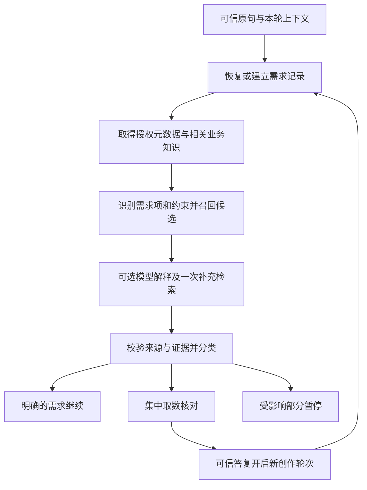

# 受约束语义发现与跨轮取数核对 Spec

日期：2026-09-26。状态：用户已确认产品方向；公共首期实现已落地，验收范围见 [实施记录](IMPLEMENTATION.md)。

本文件冻结本任务多轮 grill 的产品要求。[方案与架构影响](DESIGN.md)定义实现设计；[实施计划](PLAN.md)定义依赖、验收和交付。文档与实现均限制在 `metriccanvas-authoring/`。本目录是随交付目录分发的在做计划，收口时将稳定结论并入目录内正式接口和接入文档，保留本批结论入口；实际能力、限制与证据以 [接入手册](../../../SEMANTIC-DISCOVERY-HANDOFF.md) 和实施记录为准。

## 1. 问题与范围

实施前的 SemanticCatalog 可以返回多个指标/维度，但仍按整段 query 是否包含在名称/别名中筛选。它没有区分“一个需求的多个备选”“多个共同需要的指标”“宽泛主题的指标展开”，没有完整的语义需求续接记录。Java 参考 search 读取授权范围内的元数据；口径主要用于展示，没有充分参与检索。

目标：同一个 `discover_data_context` 接受词、组合词和整句话，在真实指标资料和公司业务知识约束下返回有依据的候选、需求分组、差异与取数核对；经可信续接恢复用户选择。发现不执行 DQE、不保存页面、不宣称业务分析结论已成立。

首期不依赖向量检索，不建设定时向量化任务，不在每次调用临时向量化全量资料。暂以 mock 业务知识验证协议，保留内部 adapter 接入公司知识库及未来检索服务。模型解释可选；生产未配置时不能隐式启用 mock。

非目标：重建公司知识库、自动治理写回、自动修正指标公式、永久用户偏好、通用跨指标计算引擎、页面协议变化、额外公共接入目录、生产服务真实接通。

## 2. 已确认决策

| ID | 已确认要求 |
|---|---|
| D01 | discover 内部允许注入可选模型解释能力；无模型仍有基础发现。 |
| D02 | 未登记别名但有原始口径证据的表达可以成为建议候选；不自动成为永久别名。 |
| D03 | Java 返回的名称、别名、口径直接使用；公司知识库补充业务术语、业务说明和分析主题。 |
| D04 | 向量能力后置；公司 adapter 可替换检索实现，Skill 不承担索引维护。 |
| D05 | 冲突先核实是否影响请求；用户选择业务口径，不裁定底层资料谁写错。无法确认的真实冲突不能靠点击确认放行。 |
| D06 | 知识库不可用时基于 Java 资料继续，明确降级；知识未知不等于没有相关知识。 |
| D07 | 独立可用部分继续；共同计算、比较不可缺的部分暂停，完整性如实呈现。 |
| D08 | 用户选择只对本次需求生效，不自动变成跨任务偏好。 |
| D09 | 当前业务域优先，无合适候选时在授权范围内扩大一次；跨域结果标注业务域。 |
| D10 | 多候选择一、多指标共同需要、主题展开分别表达；广义主题无资料时不任意扩指标。 |
| D11 | 自动选择按明确证据规则，不按模型自报置信度或单纯 Top 1。 |
| D12 | 先内部完成有预算的检索，集中一次取数核对；剩余问题暂停，不自动连续追问。 |
| D13 | 可信原始需求、需求项、证据、选择和待确认事项持久化；新轮重新校验身份、版本和授权。 |

## 3. 输入与证据

### 3.1 可信输入

增强模式的原始需求来自 Relay 已认证消息上下文，保留 messageRef、原句、接收时间和时区。MCP 的 query 是检索表达，可能被模型改写，不能覆盖原句。可信上下文缺失时仅提供基础查询，不创建虚假的跨轮会话。

同一用户发起独立新需求时必须创建新发现任务；只有 Relay 明确关联的答复或修改才能续接旧任务。模型提供 taskRef、contextRef、optionId 均不能构成授权或用户确认。

### 3.2 三层依据

| 资料 | 用途 | 限制 |
|---|---|---|
| 通用分析语言 | 识别分组、比较、多个需求之间的关系 | 不能定义公司指标口径；时间仍用已有受控时间词表解析 |
| Java 语义元数据 | 指标身份、名称、别名、口径、单位、维度、业务域 | 缺失事实保持未知；源协议转换不等于填补事实 |
| 公司知识 | 业务术语、同义/相关关系、业务说明、经确认的分析主题 | 有来源和适用域；相关词不能当同义词；文档不是模型指令 |

查询授权、访问范围与强制执行规则不得寄托在可选知识检索上。它们继续由对应可信接口负责。

### 3.3 知识类型

- `business_term`：标准业务概念、同义表达、相关概念和适用业务域。
- `business_note`：有来源的文档片段；允许公司知识库先按文档形态接入，不强制人工词典化。
- `analysis_topic`：经确认的分析主题及其需求项/关系，用于展开“经营情况”等宽泛表达。

每项带稳定 id、来源 namespace、文档/章节/版本、reviewStatus。只有已确认且作用域明确的同义关系可进入自动匹配依据；草稿只作待审建议，不能升级为权威证据。指标名称提示必须再次解析到当前真实指标。

## 4. 发现流程

1. 保留原句，以原始文本位置关联需求项和限定词。否定词、退款/含税限定和完整复合词不得因分词丢失。
2. 基础检索综合名称、全部合法别名、口径文本、业务域及知识；展示截断不得限制召回。首期文本匹配即可。
3. 排序采用可解释的字段命中和关系证据；多个需求分别排序，不能让一个热词吃掉全部 limit。
4. 区分 sourceComplete（授权范围内源资料是否读全）、retrievalComplete（本次检索是否完成）和 returnedTruncated（结果展示截断）。只拿到 Top K 不能推断候选唯一。
5. 模型仅处理有界资料，输出需求提议、候选引用和证据引用；不能自行访问额外服务、生成指标、授权、治理事实或无限扩词。
6. 有关扩大业务域、细节补取和模型调用共享任务预算，重复 MCP 调用不得重置。只有用户主动改变需求才可建立新的受控分析预算。
7. 口语时间按可信 now/timezone 和现有词表确定性解析。续接跨月不自动重算“上个月”；保留最初解析范围，用户修改时间才更新并失效相关选择/授权。

## 5. 多指标与需求项

需求项是一次发现任务的内部结构，最终可映射到取数单元；不是新的资产、发布对象或页面 Schema。

| 例子 | 结构与处理 |
|---|---|
| 销售额 | 一个需求项，支付金额/净实收是 alternatives；不得把全部候选一起查询 |
| 比较销售额和退款金额 | 两个需求项，关系 comparison；分别消歧并验证比较条件 |
| 经营情况 | 命中已确认主题后按主题展开；无主题时 needs_scope，展示建议范围供核对 |
| 退款占比 | 表达计算需求与依赖；分子/分母口径不明确则澄清，不伪造现成指标 |

关系包括 `independent`、`comparison`、`calculation`。比较或计算的一项不可用时暂停该关系对应结论；可单独展示的已有事实只能标为不完整，不能称已完成比较。首期不新增查询编译运算能力，临时指标仍遵循现有规则。

## 6. 选择规则与状态

自动选择一个真实指标必须同时满足：

- A1：可信精确引用，或标准名称/已确认的同义关系命中；仅模型判断相近不满足。
- A2：在声明且已完成的相关检索范围内没有同等成立的其他候选；源未读全、召回截断无法证明时不自动宣称唯一。
- A3：每项影响口径的用户限定有证据支持，未知/冲突不算满足；用户限定本身缺失则保留未解析项。
- A4：没有影响本次需求的定义冲突。
- A5：来源身份、业务域、权限和版本有效。

`selectedBy=rule` 记录具体规则版本和证据；`selectedBy=user` 必须指向可信确认事件。用户可选择定义清楚的不同口径，但不能覆盖真实权限/版本错误或将矛盾定义变为已验证。

| 状态 | 判据 | 行为 |
|---|---|---|
| resolved | A1–A5 满足，或有效用户选择且无硬冲突 | 可形成取数建议，不等于允许执行 |
| needs_choice | 可用候选之间有改变业务结果的差异 | 集中核对 |
| needs_scope | 主题或表达无法形成明确需求范围 | 同一核对中展示范围建议 |
| unsupported | 完整声明范围内没有可支持候选 | 提示当前范围未找到；源不完整则附 unknown/partial，不声称全公司不存在 |
| conflicted | 同一所需口径证据矛盾，无法核实 | 暂停对应需求，不提供“忽略继续” |

返回独立的 `executionReadiness=not_checked`。能力组合证明不足与业务口径冲突不同：前者交现有查询策略和 DQE 处理，后者不能被宽松查询策略掩盖。不得把发现变成所有查询的强制指标注册前置。

## 7. 一次集中取数核对

首期每个未改变的需求版本最多主动展示一次阻塞核对。把指标口径、分析范围和必要缺项合并，展示业务域、分组维度、时间、筛选、已明确项、未完成项。非阻塞请求只展示可展开的口径摘要。若还需执行确认，应尽量共用一个呈现步骤，服务端分别验证。

按钮：确认并继续、修改需求、跳过可独立省略项、取消。真实可用替代才展示；不预选后自动提交。自由文本答复重新解析，不能作为用户按下某选项的证据。

用户提交一次答复后，执行可确定部分，仍未知的部分暂停；不自动追问第二轮。用户主动修改、主动继续剩余部分、资料版本变化引起必要重新核对是独立事件，必须说明原因。版本冲突不应造成自动重复弹卡循环。

错误呈现分层：资料差异只在详情中说明；口径歧义用业务选项；资料不可确认解释实际影响；凭据/SQL/原始异常不进入卡片。治理诊断可供内部导出，未对接治理系统前不能声称已通知负责人。

## 8. 跨轮与保留期

保存原始需求（或可可靠重取的消息引用及校验摘要）、结构化需求修订、已选来源、候选证据、待确认卡片、处理过的用户事件和失效原因。不保存完整对话、模型 prompt/思维过程或业务数据行。

新创作轮次使用新的 contextRef/binding。可信 Relay 续接信息证明同一 actor/workspace/会话/需求及兼容页面目标，taskRef 本身不授权。重新读取元数据与知识证据版本，绑定当前有效指标引用；旧查询授权和结果引用不随记录迁移。

修改需求按依赖关系失效：改退款口径失效相关指标/计算；改时间失效相关取数请求；改用户或工作空间拒绝续接；改页面目标要求显式可信重新绑定。未知修改不能只保留一部分旧状态后猜测继续。

任务记录带 revision、expiresAt、pendingInteraction 和 event receipt，CAS 防并发覆盖。取消/过期后只读诊断，不自动复活。过期读取拒绝与物理清理分别验收；部署方配置保留期并负责清理。

## 9. 验收矩阵

以下均须通过正式发现接口，不直接调用私有算法冒充流程验收。

| ID | 输入或事件 | 必须观察到的结果 |
|---|---|---|
| AT01 | 完整名称、合法别名、第 11 个别名 | 正确候选；展示限制不影响召回 |
| AT02 | 华东销售额、上个月各地区销售额 | 保留指标/条件/分组/时间，不按整句子串过滤掉 |
| AT03 | 扣退款、不含税与相反口径 | 限定保留；不能自动选反义口径 |
| AT04 | 未登记表达但原口径支持 | 有证据的建议候选，非规则自动选择 |
| AT05 | 同词跨域、多个同义候选 | 业务域标注及 needs_choice，不因 Top 1 自动唯一 |
| AT06 | 销售额和退款金额 | 两个需求项，非单项 alternatives |
| AT07 | 经营情况，有/无主题 | 经确认主题展开或 needs_scope；不编造指标 |
| AT08 | 缺分母口径的占比 | calculation 依赖明确，相关部分暂停 |
| AT09 | Java/知识冲突、过期知识 | 保留来源及版本；确认按钮不能抹去冲突 |
| AT10 | 模型/知识超时或非法响应 | 有界降级，原有确定性结果保留，无无限重试 |
| AT11 | 源部分失败、分页未完、显示截断 | 三类覆盖率可区分，不错误报告唯一或不存在 |
| AT12 | 外部 provider 已找到非字面候选 | 公共代码不再以整句子串二次删除 |
| AT13 | 多处歧义 | 同一核对卡；答复后不自动循环追问 |
| AT14 | 同用户新轮、进程重启 | 恢复需求/选择，重建身份和当前引用，重新授权 |
| AT15 | 旧卡片、重复事件、并发两个答案 | 幂等或 revision 冲突，不能后到覆盖先到 |
| AT16 | 跨用户/工作空间、伪造确认、过期记录 | 拒绝且不泄露记录内容 |
| AT17 | 部分独立需求失败与共同计算失败 | 前者明确部分完成，后者不输出完整计算结论 |
| AT18 | 查询前检查、宽松/严格模式 | 不再触发发现模型/澄清；现有查询策略独立生效 |
| AT19 | 修改需求、取消、跨月答复 | 精确失效/终止；原绝对时间不被静默重算 |
| AT20 | metadata/knowledge 变化、权限撤销 | 重新验证相关证据和候选；旧确认/授权不盲用 |

mock 验收证明结构和流程；真实业务语料评估 Recall@K、多需求覆盖、错误自动选择次数、必要澄清命中与实际交互轮数，不能用 mock 全绿证明真实语义效果。固定负例集错误自动选择必须为零；检索效果目标按冻结的内部语料基线制定。真实模型与公司 Relay/Java/知识库证据分别报告。
